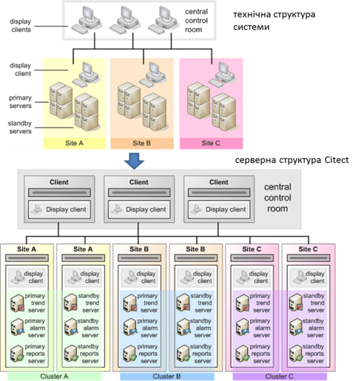

[<- До підрозділу](README.md)

# Мережні архітектури в Citect

Проект Citect може бути розроблений як для одного комп’ютера (одиночна структура, Standalone), так і для всього підприємства з мульти-серверною структурою. У Citect виділяються такі компоненти:

- Client (клієнт) – це середовище виконання, що реалізує товстого клієнта, тобто людино-машинний інтерфейс для оператора на комп’ютері; 

- I/O Server (сервер введення/виведення) – це середовище виконання, що реалізує функції керування базою даних реального часу;

- Trend Server (сервер трендів) – це середовище виконання, що реалізує функції збереження даних трендів та доступу до них клієнтів; 

- Alarm Server (сервер тривожної сигналізації) – це середовище виконання, що реалізує функції керування тривогами; 

- Report Server (сервер звітів) – це середовище виконання, що реалізує функції генерування звітів за вказаними шаблонами.

Усі наведені компоненти є однаковими середовищами виконання, але виконують різні функції (ролі) одного проекту. При одиночній структурі усі компоненти запускаються на одному ПК, при цьому можуть виконуватися як один процес, так і у вигляді окремих процесів, що конфігурується безпосередньо в файлі налаштувань Citect.ini або через майстер налаштувань. При розподіленій системі для кожного компонента задається IP адреса та, за необхідності, додаткові налаштування TCP-портів для доступу. У файлі Citect.ini активується мережна архітектура (TCP/IP=true), і при запуску середовища виконання його роль буде визначатися шляхом порівняння власної IP адреси та означеної в проекті. Так само сервери різного типу та клієнти можуть запускатися на різних ПК. Зрештою, клієнтському екземпляру середовища виконання треба знати, де знаходиться джерело даних. Враховуючи, що проект єдиний для всіх середовищ, IP-адреси та TCP-порти будуть відомі всім. У параграфі 2.5.4 наведено приклад використання сервера розгортання, який значно спрощує процес введення в дію. 

Розділення внутрішніх змінних на клієнтські і серверні відбувається на рівні розділення типів тегів:  Variable Tags та Local variables. Variable Tags за визначенням не є внутрішніми змінними і потребують вказівки джерела даних. Але якщо властивість "Memory" пристрою введення/виведення (I/O Devices) вказати рівним TRUE, усі теги, що до нього прив’язані, стануть внутрішніми серверними. Локальні клієнтські теги, які будуть унікальними для кожного клієнта, створюються через Local variables. Для цих змінних не потрібно вказувати джерело даних і вони не мають відношення до сервера введення/виведення.     

Для клієнта усі процеси сервера – це єдиний розподілений сервер, на якому знаходяться теги різного призначення (введення/виведення, трендові, тривогові). У Citect цей "розподілений сервер" зветься кластером (Cluster). До кластера входить набір усіх серверів та, за необхідності, їх резервні екземпляри. У проекті може бути кілька кластерів (рис. 9.6). Це потребується для великих систем, де є кілька відділень підприємства з виділеною підсистемою АСКТП (окремий технологічний процес, окремі ПЛК, окремі оператори). При конфігуруванні серверів вказується їхня приналежність до кластера. Якщо в проекті не потребується багатокластерної системи, назву кластера для серверів можна не вказувати, але створювати його все одно потрібно.     

<a href="media9/9_6.png" target="_blank"></a> 

*Рис.* *9.6.* Мережна архітектура Citect з кількома кластерами

Розділення на кластери при проектуванні можна організувати через механізм включення проектів (див. підрозділ 2.5). У цьому випадку кожен включений проект може бути розроблений для окремого кластера, а загальний – включати усі проекти виробництва. 

По суті, клієнт не належить кластеру. У багатокластерній системі для доступу до тегів перед їх ім'ям вказується ім’я кластера: 

```
ClusterName.TagName
```

Якщо кластер в імені тегу не вказаний, клієнт братиме назву кластера з кластерного контексту – умовна змінна, в якій зберігається назва кластера. Наприклад, при відкритті першої сторінки у функції виклику можна вказати ім’я кластера, інші сторінки після цього можуть відкриватися вже без його явної вказівки. Такий підхід дає можливість створювати гнучкі архітектури, де сторінки можуть "прив’язуватися" до необхідного кластера.

Citect підтримує архітектури з резервуванням. Для кожного Alarm, Trend і Report сервера можна створити по одному резервному екземпляру, для якого вказується властивість режиму рівною standby. Для I/O Server такого режиму немає, оскільки резервування проводиться через означення основних та резервних I/O Devices. Таким чином, в одному кластері може бути по одному екземпляру основного та резервного серверів Alarm, Trend і Report, а також кількох I/O Server, кожен з яких обов’язково має бути прив’язаний до різних адрес IP.

Кластерна архітектура надає широкі можливості щодо оптимізації навантаження на ПК. Так, можна зробити проект, в якому в двох підсистемах (див. "Site A" і "Site B" на рис. 9.7) буде знаходитися по одному ПК, але забезпечуватиметься взаємне резервування. Проект міститиме два кластери, в кожному з яких буде пара основних і резервних серверів. Мережна адреса основних серверів однієї підсистеми збігатиметься з мережною адресою резервних іншої. Таким чином, якщо вийде з ладу одна підсистема SCADA, інша тимчасово візьме на себе її функції.   

<a href="media9/9_7.png" target="_blank"></a> 

*Рис.* *9.7*. Мережна архітектура Citect з розподіленим резервуванням

Резервування серверів введення/виведення, по суті, зводиться до резервування I/O Devices. Це дещо незвичний підхід, але має більшу гнучкість, ніж резервування серверів. По суті, необхідно резервувати теги введення/виведення, а саме – забезпечити збирання даних для них та доступ до них клієнтів. Розглянемо це на прикладі резервування шляхів (рис. 9.8) до пристроїв введення/виведення. Три сервери введення/виведення зв’язані різними шляхами з трьома пристроями введення/виведення. Для кожного шляху кожного пристрою у проекті створено окремий I/O Device, в якому вказано весь набір властивостей для з’єднання. Для тих самих фізичних пристроїв вказуються однакові імена, але різні налаштування властивостей Startup mode (режим запуску) та Priority (пріоритет). Оскільки теги введення/виведення прив’язуються до I/O Device, з точки зору тегів їх буде всього три, але в проекті їх буде стільки, скільки шляхів, – 8. Кожен I/O Device, у свою чергу, прив’язується до сервера введення/виведення. Таким чином, при старті серверів введення/виведення, спочатку буде спроба з’єднатися з пристроями введення/виведення, що мають властивість Startup mode = Primary (на рис. 9.8 показані синім кольором). Якщо зв'язок з пристроєм недоступний, сервер, на якому є I/O Device з таким самим ім'ям але Startup mode = Standby, з найнижчим значенням пріоритету буде намагатися підключитися до нього. Так забезпечується резервування шляхів до пристроїв введення/виведення. Таке резервування доступне і для Standalone рішень, тобто з одним сервером введення/виведення.  

<a href="media9/9_8.png" target="_blank"></a> 

*Рис.* *9.8.* Резервування I/O devices в Citect

Для того самого прикладу (див. рис. 9.8) розглянемо ситуацію, коли клієнти для серверів введення/виведення (Client, Alarm Server, Trend Server, Report Server) не можуть отримати доступу до необхідних тегів введення/виведення, бо I/O Server з налаштованою властивістю для I/O Devices Startup mode = Primary відключився. У цьому випадку клієнти будуть отримувати дані з іншого сервера, де є однойменні I/O Devices. Таким чином, через механізм резервування I/O Devices реалізовано резервування шляхів (мереж до пристроїв введення/виведення), серверів введення/виведення, мереж доступу до серверів введення/виведення. У Citect також налаштовується кешування даних на серверах та обмін кешами для безударності переходу.   

Як уже зазначалося, товсті клієнти Citect – це те саме середовище виконання, що й інші компоненти. Тим не менше він може запускатися як в режимі повноцінного керування (Control Client) або тільки для перегляду (View-only Client). Крім товстих клієнтів, у Citect є можливість розгортати проект для WEB-доступу. Це потребує інсталяції WEB-сервера IIS від Microsoft, а клієнти реалізовані на базі технології ActiveX, яка на разі підтримується тільки в браузерах Internet Explorer. Крім того, на ПК клієнта необхідно інсталювати спеціальний ActiveX WebClient. Для можливості доступу до WEB-сервера з браузерів, що підтримують HTML5 (наприклад, з мобільних пристроїв), пропонується розширення – Citect Anywhere.

Для доступу до Citect сторонніх продуктів можна використовувати інтерфейси DDE, ODBC або OPC DA. Для забезпечення останнього Citect надає інтерфейс OPC DA Server (підтримує OPC DA v2.05 та OPC DA v3). Для цього в розділі проекту OPC DA Servers проекту створюються записи з зазначенням адреси, де буде розгорнутий OPC DA сервер, та налаштовуються його особливості. Зокрема, через властивість "Browsing Hierarchy" можна налаштувати вид простору ідентифікаторів ItemID: плаский (flat) – буде надавати доступ через список назв тегів, ієрархічний (Hierarchy) – через ієрархію устатковання (див. наступний підрозділ). OPC-клієнт зможе підключатися до сервера через ProgID  “SchneiderElectric.SCADA.OpcDaServer.1”.

SCADA Citect також може виступати в якості клієнта для ОП Magelis (Schneider Electric). Для цього в палітрі інструментів графічного редактора доступний компонент VijeoWEBGate. 

Теоретичне заняття розробив [Олександр Пупена](https://github.com/pupenasan). 