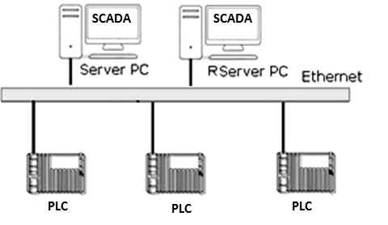

[<- До підрозділу](README.md)

# Мережні архітектури

## 1. Архітектура на базі одного ПК

У найбільш простому випадку системи на базі SCADA/HMI мають ***одиночну*** (***standalone***) архітектуру, де на одному комп’ютері суміщені усі підсистеми, включаючи АРМ оператора. У цей же час на інших ПК в системі, що об’єднуються однією мережею, можуть також функціонувати інші SCADA/HMI, однак вони не обмінюються даними між собою. Така архітектура передбачає наявність одного оператора в один момент часу та збирання усіх даних у тій самій точці (ПК), яка слугує і для інтерфейсу з оператором. 

Одиночна архітектура передбачає можливість кількох джерел даних (ПЛК або інших засобів) у тому числі може підтримуватися резервування каналів для зв’язку з ними. На рис. 9.1,1 показано архітектуру системи, в якій SCADA/HMI поєднані з ПЛК двома різними мережами. Такий спосіб резервування каналів повинен підтримуватися з боку підсистеми збирання даних. У випадку відсутності зв’язку по основному каналу (мережа М1) SCADA/HMI намагається налагодити зв'язок по іншому (мережа М2). Як правило, первинний канал має вищий пріоритет, тому при відновленні основного каналу збирання даних відбувається через нього. Деякі засоби SCADA/HMI надають можливість виділяти кілька резервних каналів.  

                               

*Рис.* *9.1.* Архітектура з резервуванням каналів зв’язку з ПЛК (1) 
 та з резервуванням ПЛК (2)

Схема, що показана на рис. 9.1,1, може використовуватися і в системах з резервуванням ПЛК. У цьому випадку основний канал буде зв’язаний з основним ПЛК, а резервний – з резервним. Тим не менше, у системах з резервуванням контролерів може бути використана інша схема, яка показана на рис. 9.1,2. Розгляд рішення з резервуванням ПЛК виходить за рамки цього посібника, тим не менше коротко його розглянемо. У цьому випадку, основний і резервний ПЛК забезпечують зв'язок із засобами віддаленого введення/виведення (Remote I/O) через одну й ту саму мережу (на рисунку – мережа М3). В один момент часу зв'язок із засобами введення/виведення та SCADA/HMI проводить тільки один з двох ПЛК, який відіграє роль основного. У випадку виходу його з ладу цю роль бере на себе інший ПЛК. Для контролю стану дубльованого ПЛК та обміну даними контексту процесорів використовується високошвидкісна мережа (на рис. 9.1,2 – М2). Для функціонування такої архітектури ПЛК повинні змінювати свою адресу залежно від їх ролі (основний або резервний). Тоді для SCADA/HMI переключення буде виливатися в тимчасову відсутність доступу, пов’язана, наприклад з відновленням буферів комунікаційного обладнання. 

Архітектура з одним ПК має ряд недоліків:

- передбачається тільки одне робоче місце оператора, тобто весь персонал, що бере участь у керуванні чи обслуговуванні, може працювати тільки через один термінал;

- відсутність резервування робить систему нестійкою до збоїв різного типу, тобто при неполадках у мережі чи в складових робочої станції втрачається зв’язок з процесом, але при цьому система керування на рівні контролерів може надалі функціонувати;

- значне навантаження на один комп’ютер не дає можливості побудувати великі системи;

- відсутність інтеграції з рівнем керування виробництвом не дає можливості повністю оцінити ефективність роботи процесу.

## 2. Архітектура клієнт-сервер 

Для можливості доступу до керування або тільки для контролю з декількох робочих місць багато засобів SCADA/HMI пропонують ***клієнт-серверну архітектуру*** (рис. 9.2), в якій на сервер покладається завдання збирання даних (а також архівування, контроль за тривогами та ін.), а клієнтська частина (тобто людино-машинний інтерфейс) реалізується на окремих комп’ютерах.

***Клієнт*** (***HMI клієнт, Client***) – це програма, яка реалізує людино-машинний інтерфейс доступу до даних на сервері (зокрема через мережу). ***Сервер*** (***SCADA сервер, Server***) – це програма, яка надає доступ до своїх даних клієнтам (зокрема через мережу) та реалізує одну або всі функції: збирання даних, їх оброблення, архівування, формування тривог та ін. Як правило, на комп’ютерах з програмою сервера виконуються і програми клієнтів. Слід розуміти, що клієнти і сервери у більшості випадків спілкуються між собою з використанням спеціалізованих протоколів, тобто поєднання складових від різних програм SCADA можливе тільки за певних обставин, наприклад, використовуючи технології ОРС. 

                               

*Рис.* *9.2.* Клієнт-серверна архітектура

Часто для опису роботи клієнт-серверних архітектур SCADA/HMI використовують поняття ***тонкий клієнт*** (thin client) та ***товстий клієнт*** (у різних джерелах можуть називатися як fat, thick, heavy або rich client). 

Під товстим клієнтом частіше всього розуміють ПК з установленим середовищем виконання SCADA/HMI, яке виконує роль клієнта при взаємодії з іншим середовищем виконання (сервером). У даному випадку велика частина роботи, зокрема стосовно функцій ЛМІ, покладена на клієнтський застосунок, а сервер у цей час може збирати дані, обробляти їх, зберігати і т.п. Обмін між клієнтом та сервером SCADA реалізується через пропрієтарні закриті протоколи. 

При побудові архітектури на базі товстого клієнта слід враховувати деякі особливості реалізації. Зокрема, внутрішні змінні можуть належати як клієнтській частині, так і серверній. У першому випадку кожен клієнт матиме свою копію внутрішніх змінних, у другому – один і той самий екземпляр внутрішніх змінних буде доступний усім клієнтам.  

Тонкий клієнт частіше всього має меншу функціональність і не потребує встановлення спеціалізованого ПЗ. В якості тонкого клієнта можуть виступати термінальні клієнти (RDP – Remote Desktop Protocol) або WEB-браузер, а обмін даними відбувається через класичні стеки протоколів, наприклад TCP/IP. Роботу WEB-клієнтів розглянемо в наступному в параграфі.

Ще один спосіб реалізації віддаленого підключення до засобу SCADA/HMI, що має популярну ОС, – це VNC (Virtual Network Computing). VNC дає можливість відображати екран засобу, на якому встановлено VNC Server, на іншому засобі, на якому встановлений VNC Client. Окрім відображення, доступні також функції керування, тобто пересилання натискань клавіатури та миші (або сенсора) на VNC Server. На сьогоднішній день є багато безкоштовних реалізацій VNC під різні платформи. Недоліком такого підходу є дублювання всього змісту на обох засобах, що не дає можливості повноцінно замінити клієнт-серверну архітектуру. 

## 3. WEB-клієнти та хмарні SCADA

   Сучасні SCADA/HMI надають можливість доступу до системи через Internet або локальну мережу, використовуючи WEB-браузер [[1](http://ua.automation.com/content/scada-udalennyy-dostup-vsegda-i-vezde)]. На відміну від товстих HMI клієнтів, які використовують для зв’язку із серверами SCADA спеціалізовані протоколи, ***WEB клієнти*** з’єднуються з технологічним процесом, використовуючи WEB-сервіси. Тобто вони використовують ті самі технології, що й при доступі звичайного браузера до якогось сайту в мережі Інтернет. Це має ряд переваг, зокрема:

- на відміну від протоколів обміну між HMI та SCADA, WEB-технології прозорі для комунікаційного обладнання (маршрутизатори, брандмауери, шлюзи та ін.), що дає змогу з’єднуватися через Інтернет;

- у багатьох випадках можуть використовуватися будь-які браузери, в тому числі на планшетах та мобільних телефонах;

- підвищена мобільність клієнтів, оскільки Інтернет доступний на великій території.

На рис. 9.3 показано приклад архітектури з доступом через WEB. Для роботи такої системи необхідний запуск служб WEB-сервера, які потребують окремого комп’ютера. WEB-сервер конвертує дані, які зчитує/записує зі SCADA-серверів та передає їх WEB-клієнтам через локальну мережу підприємства або через Інтернет.

 

*Рис.* *9.3*. Архітектура з доступом через WEB

Не дивлячись на привабливість WEB-доступу, слід розуміти деякі обмеження та передбачити потенційну небезпеку несанкціонованого доступу, зокрема:

- функція WEB-доступу, як правило, ліцензується окремо, тобто потребує додаткової оплати і часто – встановлення додаткового ПЗ для WEB-сервера; при необхідності доступу через Інтернет WEB-сервери розміщують на окремих ПК в зонах DMZ (див. підрозділ 9.5); 

- як правило, через WEB-клієнт доступні не всі функції, які доступні через HMI клієнт;

- ряд систем працюють тільки через обмежений перелік браузерів і потребують інсталювання додаткових програм на комп’ютер WEB клієнта;

- перед організацією доступу через Інтернет слід подбати про неможливість несанкціонованого доступу (кібербезпеку), щоб зловмисник не зміг втрутитися в процес керування.

Для багатьох засобів HMI (операторських панелей) також передбачається доступ через WEB. У цьому випадку, такий доступ надає можливість здійснювати керування не безпосередньо по місцю розташування устатковання, а віддалено від нього. 

   Деякі програми SCADA по своїй суті є WEB-орієнтованими, тобто передбачають наявність клієнтів HMI тільки з WEB-доступом. Такі SCADA легко інтегруються в хмарні рішення, оскільки дають можливість розміщувати середовища виконання на віддалених серверах в Інтернеті. У цьому випадку використовуються архітектурні рішення Промислового інтернету речей IIoT (Industrial Internet of Things). Прикладом WEB-орієнтованих SCADA є Overvis (Україна, https://www.overvis.com), WebHMI (Україна, http://webhmi.com.ua), WebAccess/SCADA (Advantech, https://www.advantech.com), Integraxor (Ecava, Малайзія https://www.ecava.com) та багато інших. Хмарні SCADA та IIoT надають можливість побудувати розподілену архітектуру без необхідності встановлення ПК та їх обслуговування безпосередньо на об’єкті. Також це значно спрощує віддалений доступ та дає можливість значно спростити використання багатьох Інтернет-сервісів, таких як електронна пошта, месенжери, хмарні сховища, звіти та багато інших. Тим не менше, вибираючи рішення з використанням хмарних SCADA, треба розуміти ризики, які супроводжують такі системи, зокрема можливості тимчасової відсутності комунікації з Інтернет, кібер-атак на мережну інфраструктуру та ін. Крім того, рішення на базі IIoT включають у себе частину сервісів SCADA (збирання даних, локальне архівування, аналіз) в так званих IIoT Edge шлюзах. Більше про IIoT-архітектури і рішення можна прочитати в матеріалах Industrial Internet Consortium [[2](https://www.iiconsortium.org/white-papers.htm)] та в підрозділі 9.4. 

## 4. Робота з мобільними застосунками та віддалений доступ

Останнім часом мобільні засоби, такі як смартфон, планшет, стали невід’ємною частиною існування будь-якої людини. Враховуючи їхню функціональну потужність, використання їх в якості мобільних терміналів було питанням часу. На сьогоднішній день більшість постачальників інструментів SCADA/HMI надають готове рішення для підключення мобільних пристроїв в якості віддалених засобів оповіщення, відображення та керування. Виділимо такі підходи до побудови таких рішень:

1) *Доступ до серверів через WEB-застосунки*. Цей підхід практично нічим не відрізняється від звичайного WEB-доступу, за винятком таких особливостей:

- необхідно врахувати діагональ екрана мобільного пристрою;

- необхідно передбачити використання платформо-сумісних технологій; наприклад, WEB-застосунки з використанням технології ActiveX працюватимуть тільки на деяких типах пристроїв;

2) *Доступ через відкриті технології, наприклад* *OPC UA**,* *HTTP API**,* *WEB SOCKET* *або протоколи* *IoT (MQTT**,* *AMQP)**.* У цьому випадку клієнтський застосунок на мобільному пристрої може бути стороннім по відношенню до серверного SCADA/HMI і розроблятися в окремому середовищі, можливо навіть на самому мобільному пристрої.  

3) *Доступ через спеціалізовані клієнтські застосунки, розроблені саме для конкретної* *SCADA**.* У цьому випадку для розробника потрібно тільки налаштувати з’єднання; все інше є прозорим і прихованим від розробника.    

На сьогоднішній день є багато застосунків, так званих APPів для Android та iOS, що по суті є повноцінними HMI, які самі вміють збирати дані (використовуючи протоколи поверх стеку TCP/IP, Bluetooth), та реалізовувати інші функції (ЛМІ, тривоги, тренди і т.п). При цьому середовище розроблення також є застосунком для цих мобільних пристроїв. По суті, за невеликий проміжок часу можна розробити людино-машинний інтерфейс для невеликих задач, як обслуговування обладнання чи контроль певних виробничих операцій. Ці ж самі застосунки можна використовувати в якості клієнтів до SCADA/HMI, використовуючи стандартні протоколи промислових мереж (наприклад Modbus TCP/IP) або доступу до даних (OPC UA, JDBC тощо).     

## 5. Мультисерверна архітектура та резервування.

При великій кількості джерел даних (наприклад контролерів) може використовуватись мультисерверна архітектура (рис. 9.4). У таких системах кожний сервер збирає дані з окремої групи пристроїв, а клієнт (клієнти) мають доступ до всіх даних серверів. У деяких програмах SCADA можна виділити окремі комп’ютери для виконання функцій серверів збирання даних, серверів трендів, серверів тривог, серверів звітів, що дає змогу розподіляти ресурси між декількома апаратними засобами.

Якщо технологічний процес є функціонально-небезпечним або втрата даних є недопустимою, то необхідно використовувати архітектури з резервуванням (рис. 9.5). У таких системах ***основний сервер*** (Server PC) дублюється ***резервним*** (RServer PC), який функціонує разом з ним, виконує всі ті самі функції, окрім записування даних на контролери. Резервний сервер контролює працездатність основного, і у випадку виходу його з ладу починає виконувати всі його функції, в тому числі й спілкування з клієнтами та записування даних на контролери.

 

*Рис.* *9.4.* Мультисерверна архітектура

 

*Рис.* *9.5.* Архітектура з резервуванням

Принципи роботи системи з розподіленими серверами та резервуванням можуть відрізнятися залежно від постачальника програмних засобів. 

Наведені вище приклади структур стосуються як системи керування одним відділенням, так і всього цеху чи навіть виробництва. Зрештою, автоматизація технологічних процесів для всього виробництва може бути однією великою розподіленою системою, в якій дані досить легко можуть бути надані в тій точці, де вони потребуються, незалежно від сервера, на якому вони збираються і оброблюються. У цьому випадку, якщо всі засоби SCADA/HMI постачаються від однієї фірми-виробника, таке рішення може бути реалізоване як один великий проект SCADA. Такі рішення для розподілених систем SCADA/HMI пропонують багато відомих брендів, деякі з них наведені в параграфах 9.1.6 та 9.1.7. Усі вони базуються на пропрієтарних, часто закритих протоколах, однак не потребують великих зусиль розробника для налаштування взаємодії між компонентами (клієнтами, серверами, додатковим ПЗ). У випадку реалізації подібних рішень від різних виробників завдання стає досить трудоємким, а в деяких випадках технічно нереалізованим без заміни компонентів. У наступному параграфі показані деякі варіанти реалізації такого обміну.      

## 6. Обмін між SCADA/HMI різних виробників

Об’єднання декількох SCADA/HMI в одну розподілену систему може знадобитися для вирішення таких завдань:

- контроль/керування станом процесу на ПК віддаленому від основних серверів, наприклад для центрального диспетчерського пункту;

- контроль за деякими параметрами суміжного відділення;  

- реалізація централізованого виробничого сервера реального часу для збирання виробничих даних, їх оброблення, уніфікації для надання верхнім рівням керування (MES/MOM);

- доступ до архівних даних трендів та тривог різних підсистем для формування централізованої звітності.  

Наведені завдання можна вирішувати різними способами, в тому числі шляхом реалізації обміну даними між контролерами. У попередньому параграфі наводиться приклад реалізації розподіленої системи з використанням рішення від одного виробника. Однак на українських підприємствах досить типовою є ситуація, в якій АСКТП для різних відділень реалізовані з використанням засобів автоматизації від різних постачальників. Це стосується й засобів SCADA/HMI. Тому при необхідності інтегрування таких підсистем розробник повинен у кожному конкретному випадку вибирати шляхи з кількох доступних. Інколи рішенням може бути заміна однієї або кількох підсистем. У цьому параграфі розглянемо способи інтеграції, які можуть бути використані при цьому.

Найбільш придатною для обміну даними реального часу є технологія OPC, яка розглянута в розділі 4. Зокрема, приклад використання у розподілених архітектурах наведений у параграфі 4.2.5. У цьому випадку SCADA може виступати як сервером OPC DA, так і сервером OPC UA. Доступ до SCADA через OPC, як правило, надається для читання/записування тегів (змінних), але може бути реалізований також інтерфейс AE (Alarm Event) та Trend. 

У ряді випадків SCADA може надавати доступ до своїх даних через стандартні інтерфейси доступу до баз даних ODBC, JDBC, OLE DB, ADO.NET та інших, які розглянуті в підрозділі 8.3. Тоді дана SCADA може виступати в ролі сервера, а інша, яка може користуватися цими інтерфейсами, – в ролі клієнта. У багатьох випадках це вирішується через написання додаткового коду. 

Можуть бути доступними старі технології Windows, як наприклад DDE/NetDDE. Наразі NetDDE не підтримується сучасними версіями Windows, тому в цьому посібнику не розглядається. Опис та приклади застосування можна прочитати в [3].

Можливо не дуже продуктивним, але інколи єдиним рішенням може бути використання протоколів промислових мереж, що призначені для обміну між ПЛК. Наприклад, при наявності в одній із SCADA/HMI драйвера Modbus Server обмін можна побудувати по протоколу Modbus [3].   

При використанні скриптів на обох SCADA способи інтегрування залежать від наявних обмежень середовища програмування та інтерфейсу з операційною системою. Це можуть бути різноманітні API, в тому числі HTTP API, WebSocket, або звичайний обмін на базі стеку TCP/IP і сокетів.

У ряді випадків є можливість побудувати обмін через файли. Популярним є формат "*.CSV", оскільки він є звичайною текстовою таблицею з розділювачем і має менше проблем із сумісністю.      

## Контрольні запитання

1.    На яких мережних архітектурах можуть базуватися системи SCADA/HMI?

2.    В якому випадку варто використовувати одиночну архітектуру SCADA/HMI? Які недоліки вона має? 

3.    Покажіть на прикладі однієї з SCADA/HMI, як відбувається резервування каналів введення/виведення.

4.    Розкажіть про принципи організації клієнт-серверної архітектури. Покажіть на прикладі однієї із SCADA. 

5.    Наведіть приклади тонких клієнтів.

6.    Розкажіть про реалізацію мережної архітектури SCADA/HMI з доступом через WEB. Які переваги та недоліки має така архітектура?

7.    Розкажіть про можливі принципи організації HMI-доступу через мобільні пристрої. Що необхідно враховувати при розробленні таких рішень?

8.    Розкажіть про необхідність і принципи побудови мультисерверних архітектур. Покажіть на прикладі однієї із SCADA. 

9.    Розкажіть про необхідність і принципи функціонування архітектур із резервуванням серверів. Покажіть на прикладі однієї із SCADA.

10.    Покажіть на прикладі однієї із SCADA принципи організації внутрішніх мережних змінних у розподілених архітектурах. 

11.    Наведіть приклади, в яких необхідно об’єднати кілька засобів SCADA/HMI різних виробників між собою.

12.    Поясніть, що таке горизонтальна інтеграція?

13.    Яке місце посідає SCADA/HMI ієрархії керування підприємством?

14.    Які функції входять до завдань рівня керування виробничими операціями? Навіщо SCADA інтегрується з застосунками рівня MOM? 

15.    Які системи керування підприємством типово відносять до ІТ, а які до ОТ?

16.    Які можете назвати стандарти інтегрування систем керування? Які основні ідеї закладені в стандартах? 

17.    Використовуючи рис. 9.16, поясніть функціональну ієрархію виробничого підприємства.

18.    Що являє собою устатковання відповідно до стандартів ДСТУ EN 62264 та ДСТУ EN 61512? 

19.    Розкажіть про рольову ієрархію устатковання відповідно до ДСТУ EN 62264 та ДСТУ EN 61512. 

20.    На прикладі однієї із SCADA/HMI покажіть використання ієрархії устатковання.

21.    Які обмеження на збирання та оброблення даних мають засоби SCADA/HMI?

22.    Поясніть необхідність організації єдиної інтеграційної платформи для керування виробництвом.

23.    Поясніть, чому не всі дані, які необхідні у функціях MOM, збираються в SCADA/HMI.

24.    Перерахуйте основні функції Historian.

25.    Які засоби є користувачами Historian? 

26.    Поясніть, яким чином Historian забезпечує єдиною інформаційною платформою засоби MOM. 

27.    Які завдання можна вирішувати з  Historian через спеціальні клієнтські застосунки?

28.    Яке призначення в Операційних та Корпоративних Historian?

29.    Поясніть призначення та особливості реалізації форматів даних часових рядів?

30.    Які показники використовують при виборі Historian за типом організації бази даних?

31.    Навіщо суміщати різні формати даних для  Historian?

32.    Що таке Інтернет речей (IoT)?

33.    Яка відмінність IoT від архітектури системи з розподіленими датчиками та виконавчими механізмами, що використовується в промисловій автоматизації?

34.    Які переваги надає IoT?

35.    Поясніть відмінності Інтернету речей (IoT) від промислового Інтернету Речей(IIoT).

36.    Використовуючи рис. 9.30 та рис. 9.32, прокоментуйте призначення компонентів в архітектурі IIoT.

37.    Поясніть призначення IoT Edge Gateway. Які функції він виконує?

38.    Поясніть що таке хмарні обчислення. Які можливості вони можуть надати для систем АСКТП?

39.    Наведіть та поясніть принципи функціонування хмар з точки зору моделей їх топології.

40.    Наведіть та поясніть принципи функціонування хмар з точки зору моделей надання послуг. Наведіть приклади.

41.    Використовуючи приклад з рис. 9.34, покажіть типовий шлях оброблення даних у хмарних середовищах.

42.    Назвіть приклади споживчих та спеціалізованих хмарних платформ, які можуть використовуватися для завдань АСКТП.

43.    Використовуючи рис. 9.35 та рис. 9.36, поясніть можливі структури інтегрування SCADA з хмарною платформою через OPC UA.

44.    Використовуючи рис. 9.37, поясніть структуру інтегрування SCADA з хмарною платформою через шлюзи OPC DA – OPC UA.

45.    Поясніть, яким чином, використовуючи відкриті технології доступу до БД, можна організувати доступ до хмарних сховищ.

46.    Наведіть кілька відомих випадків інцидентів кібератак на системи АСКТП.

47.    Спростуйте міф: "Кібератаки не сильно актуальні для промислових чи кіберфізичних систем"

48.    Спростуйте міф: " Система ізольована від Інтернету, тому вона безпечна"

49.    Спростуйте міф: " Рівень ймовірного пошкодження надто низький, щоб перейматися кіберзахистом"

50.    Спростуйте міф: "Робочі станції оснащені антивірусним програмним забезпеченням і брандмауером, тому система захищена"

51.    Спростуйте міф: "Використання віртуальної приватної мережі (VPN) убезпечує від несанкціонованого доступу"

52.    Спростуйте міф: "Система інформаційної безпеки (ISS Information System Security) є дорогою і створює багато обмежень для ефективного функціонування".

53.    Які основні відмінності між ІТ та ОТ з точки зору кібербезпеки?

54.    Які міжнародні стандарти кібербезпеки для АСКТП Вам відомі?

55.    Які стандарти кібербезпеки для АСКТП діють в Україні?

56.    Що таке кібератака?

57.    Наведіть приклади джерел атак.

58.    Покажіть приклад багатоетапного проведення атаки.

59.    Що таке компрометація та компрометований засіб?

60.    Що таке вірус?

61.    Що таке Троян?

62.    Що таке Бекдор?

63.    Що таке Ботнет?

64.    Поясніть відмінності між внутрішніми та зовнішніми кіберзагрозами.

65.    Перерахуйте можливі вектори атак на АСКТП.

66.    Які типи атак засобів Ви знаєте?

67.    Які типи атак WEB-серверів Ви знаєте?

68.    Які типи мережних атак Ви знаєте?

69.    Які типи фізичних атак Ви знаєте?

70.    Які типи атак з використанням людського фактора Ви знаєте?

71.    Використовуючи приклад поверхні атаки, показаної на рис. 9.39, прокоментуйте вразливі точки.

72.    У чому полягає метод захисту ідентифікації та контролю активів і персоналу?

73.    У чому полягають архітектурні підходи до захисту?

74.    Що таке зона безпеки і тракт?

75.    Що таке демілітаризована зона?

76.    У чому полягає захист фізичного доступу?

77.    Які мережні компоненти використовуються для захисту? У чому принцип їхньої дії?

78.    У чому полягає зміцнення конфігурацій?

79.    Розкажіть, в чому ідея організації кіберзахистів, що базується етапах динаміки ризиків.

80.    Назвіть етапи керування ризиками та заходи, які проводяться на цих етапах відповідно до пропозицій NIST.

81.    Розкажіть про стратегію захисту в глибину.

82.    Наведіть приклад заходів для кібербезпеки з переліку хороших практик, описаних у посібнику. 

83.    Розкажіть про принципи шифрування та дешифрування з використанням симетричних та асиметричних ключів.

84.    Що таке хешування та хеш-сума?

85.    Розкажіть про призначення та принципи використання електронних цифрових підписів.

86.    Розкажіть про призначення та принципи використання цифрових сертифікатів.

87.    Розкажіть про призначення та принципи використання інфраструктури відкритих ключів.

88.    Розкажіть про використання SSH.

89.    Розкажіть про використання SSL/TLS.

90.    Розкажіть про використання IPsec.

91.    Розкажіть про принципи організації VPN-тунелів. 

92.    Наведіть приклади використання VPN-тунелів в АСКТП та SCADA/HMI зокрема.

 

## Список використаних джерел

1. Ф. Терезиньо. SCADA: удаленный доступ всегда и везде. [Електронний ресурс]. Доступно: http://ua.automation.com/content/scada-udalennyy-dostup-vsegda-i-vezde 
2. Industrial Internet Consortium. Technical papers, publications and white pepers [Електронний ресурс]. Доступно: https://www.iiconsortium.org/white-papers.htm 
3. О.М. Пупена, І.В. Ельперін, Н.М. Луцька та А.П. Ладанюк. Промислові мережі та інтеграційні технології в автоматизованих системах. Київ, Україна. Ліра-К, 2011.
4. Возможности взаимодействия SCADA системы zenon с внешним программным обеспечением. [Електронний ресурс]. Доступно: https://www.svaltera.ua/press-center/articles/8773.php 
5. Sm@rtServer Connection with an Industrial Thin Client SIMATIC ITC. [Електронний ресурс]. Доступно: https://www.youtube.com/watch?v=oIeaLk3jsDM 
6. TK 185 – Технічний комітет з питань промислової автоматизації. [Електронний ресурс] [www.tk185.appau.org.ua](http://www.tk185.appau.org.ua) 
7. PAC Framework V1.02. Функціональний каркас для розробки прикладного програмного забезпечення для промислових контролерів [Електронний ресурс]. Доступно: https://github.com/pupenasan/PACFramework
8. New Roles for Process Historians. [Електронний ресурс]. Доступно: https://www.yokogawa.com/library/resources/media-publications/new-roles-for-process-historians/
9. Operational historian. [Електронний ресурс]. Доступно: https://en.wikipedia.org/ wiki/Operational_historian 
10. Time series database. [Електронний ресурс]. Доступно: https://en.wikipedia.org/wiki/Time_series_database 
11. Plant Data Historian Software [Електронний ресурс]. Доступно: http://www.iconics-uk.com/solutions/data-historian 
12. Historian Overview. [Електронний ресурс]. Доступно:  https://www.ge.com/digital/documentation/historian/version80/c_hgs_historian_overview.html 
13. GE Historian. Архив производственных данных. [Електронний ресурс]. Доступно: https://www.indusoft.ru/products/ge_digital/ge-historian  
14. The Importance of the Edge for the Industrial Internet of Things in the Energy Industry. [Електронний ресурс]. Доступно: [https://www.manufacturingtomorrow.com /article/2017/07/the-importance-of-the-edge-for-the-industrial-internet-of-things-in-the-energy-industry/10056/](https://www.manufacturingtomorrow.com/article/2017/07/the-importance-of-the-edge-for-the-industrial-internet-of-things-in-the-energy-industry/10056/) 
15. Industrial IoT versus IoT – do you know the difference? [Електронний ресурс]. Доступно: https://strategyofthings.io/industrial-iot?utm_source=IIoT-World.com.com&utm_medium=iiot-world.com/news/ 
16. А. В. Шишак та О. М. Пупена. На шляху до Індустрії 4.0: Інтеграція існуючих АСУТП з хмарними сервісами. Automation of technological and business processes. №10, 2018. 
17. Industrial Internet Consortium. [Електронний ресурс]. Доступно: https://www.iiconsortium.org
18. Довідник Node-RED з елементами опису Java Script, JSON, JSONata. [Електронний ресурс]. Доступно: https://pupenasan.github.io/NodeREDGuidUKR/
19. Idaho National Laboratory – Operation Aurora. [Електронний ресурс]. Доступно:  https://youtu.be/bAWU5aMyAAo
20. Watch How Hackers Took Over a Ukrainian Power Station. [Електронний ресурс]. Доступно: https://youtu.be/8ThgK1WXUgk  
21. BlackEnergy. [Електронний ресурс]. Доступно: https://uk.wikipedia.org/wiki/BlackEnergy 
22. ТДА19-1: Кібербезпека АСУТП [Електронний ресурс]. Доступно: <https://www.tda.in.ua/19-1-кібербезпека-асутп-харків> 
23. J.M. Flaus. Cybersecurity of Industrial Systems. London, UK. ISTE Ltd, 2019. 
24. О. Ілляшенко, Є. Бабешко та В. Харченко. Кібербезпека індустріальних систем. [Електронний ресурс]. Доступно: https://tk185.appau.org.ua/cybersecurity/
25. Верховна Рада України. ( 2017, жов. 5). Закон № 2163-VIII, Про основні засади забезпечення кібербезпеки України. [Електронний ресурс]. Доступно: https://zakon.rada.gov.ua/laws/show/2163-19 
26. Industrial Cybersecurity for Small- and Medium-Sized Businesses A Practical Guide [Електронний ресурс]. Доступно: https://www.automation.com/en-us/assets/white-papers/industrial-cybersecurity-for-small-and-medium-size
27. Framework for Improving Critical Infrastructure Cybersecurity. [Електронний ресурс]. Доступно: https://nvlpubs.nist.gov/nistpubs/CSWP/NIST.CSWP.04162018.pdf 
28. K.A. Stouffer, V.Y. Pillitteri, S. Lightman, M.Abrams and A. Hahn. Guide to industrial control systems (ICS) security. National Institute of Standards and Technology. 2015 
29. О.М. Пупена та В.М. Сідлецький. Розробка систем віддаленої диспетчеризації з використанням мережі Internet. Наукові праці НУХТ. №3, с.24-33, 2014,

Теоретичне заняття розробив [Олександр Пупена](https://github.com/pupenasan). 
