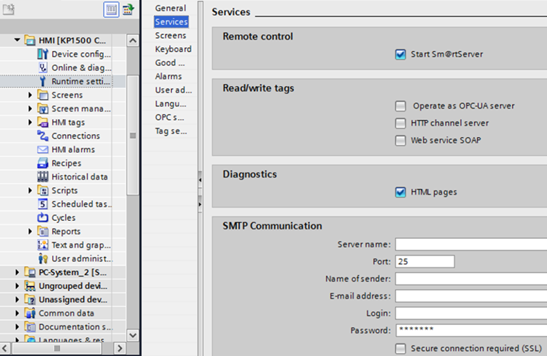
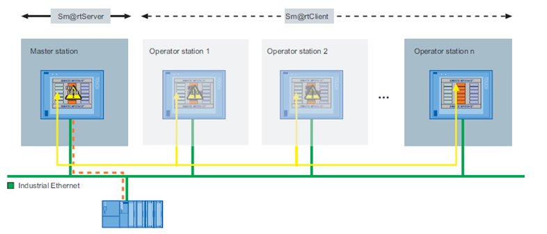
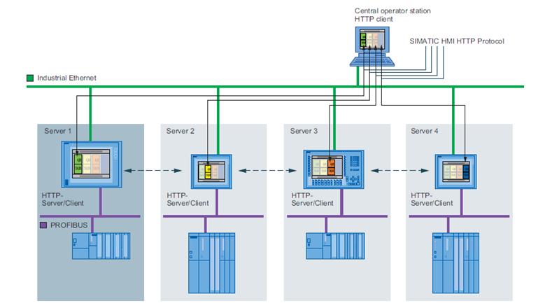

[<- До підрозділу](README.md)

# Мережні архітектури в операторських панелях SIMATIC Comfort

Операторські панелі не виконують функції SCADA, тому не передбачають розподілених систем збирання даних та мультисерверної підтримки. Тим не менше, у зв’язку з попитом та розвитком сучасних технологій, розробники засобів автоматизації все більше включають деякі функції щодо доступу до даних та функцій ЛМІ операторських панелей з інших пристроїв. Операторські панелі SIMATIC класу Comfort мають дуже широкий вибір способів інтегрування, зокрема мають функцій для виконання  таких завдань:

- доступ до даних процесу ОП, тривог, трендів, діагностичних даних;

- керування установкою з використанням готових екранів ЛМІ;

- завантаження проекту в ОП віддалено через Інтернет;

- копіювання даних з ОП.

Механізми віддаленої передачі проекту розглянуті в підрозділі 2.7. Тут зупинимося на функціях, пов’язаних з доступом до даних, функцій контролю та керування а також діагностики. Для цього в панелях Comfort можуть бути активовані сервіси:  

- Sm@rtServer – надає можливості застосункам Sm@rtClients доступатися до панелі; 

- Web server – надає WEB доступ до операторських панелей; 

- HTTP channels Server – надає доступ до даних поверх HTTP; 

- Web service SOAP – надає доступ до даних з використанням Microsoft SOAP (більше не підтримується Microsoft);

- OPC UA server – надає доступ до даних ОП через OPC UA.

Активація, потрібного сервісу, відбувається через налаштування проекту Runtime Settings (рис. 9.12). 

Сервіс Sm@rtServer по суті є VNC-сервером і надає доступ до панелі з застосунків Sm@rtClients, які необхідно попередньо встановити на віддаленому пристрої. Відповідно, застосунки Sm@rtClients є VNC-клієнтами і доступні для різних платформ, наприклад ПК з Windows (клієнт входить в дистрибутив WinCC TIA), а також для мобільних ОС – iOS та Android. Кількість одночасно підключених клієнтів обмежена, для панелей Comfort – до трьох (на момент написання посібника). На операторській панелі за необхідності можна відключити підключеного клієнта. При використанні цього сервісу усі дії оператора в Sm@rtClients будуть приводити до аналогічних на панелі, і навпаки. 

 

*Рис. 9.12.* Налаштування сервісів віддаленого доступу у WinCC Cofort

Окрім виставлення опції Start Sm@rtServer (див. рис. 9.12), необхідно також на панелі керування Windows CE налаштувати обмеження доступу та паролі. Детально інструкцію можна подивитися на відео за посиланням [[5](https://www.youtube.com/watch?v=oIeaLk3jsDM)]. На    пристрої віддаленого клієнта вказується адреса сервера, користувача та пароль, а також інші параметри зв’язку. 

Операторські панелі Comfort також можуть виступати в якості Sm@rtClients. На будь-якому екрані можна розмістити елемент Sm@rtClientView, доступний з вкладки Controls панелі інструментів. Це дає змогу будувати розподілені архітектури, в яких операторські панелі можуть виступати як у якості клієнтів, так і серверів, що дає змогу операторам контролювати та керувати не тільки ділянкою, що керується підключеним ПЛК до панелі, а й іншими ділянками (рис. 9.13). 

 

*Рис. 9.13.* Розподілена система керування з операторськими панелями Simatic Comfort 
 на базі Sm@rtClient та Sm@rtServer 

Для віддаленого доступу з точки зору кібербезпеки рекомендується використовувати VPN з’єднання (див. параграф 9.5.7). 

ОП Simatic Comfort надають також WEB-доступ до панелі. Для повноцінного використання усіх можливостей необхідно використовувати браузер Internet Explorer. Інтегрований WEB-сервер надає такі можливості:

- віддалене керування Sm@rtServer через вбудований у WEB-сторінку Sm@rtClient (без необхідності встановлення);

- запуск і зупинка середовища виконання;

- віддалений доступ (імпорт/експорт) до даних рецептів та списку й паролів користувачів;

- відображення системної та діагностичної інформації;

- доступ до файлів змінних носіїв (карти, USB-сховища, папка WEB);

- завантаження конфігураційних даних. 

Налаштування доступу та обмежень Web Server проводиться на панелі керування Windows CE. Також можна створювати власні HTML-сторінки. 

Операторські панелі Simatic Comfort підтримують обмін даними по протоколу SIMATIC HMI HTTP Protocol. При цьому вони можуть виступати як клієнтами, так і серверами. Серверна частина активується відповідною опцією HTTP channels Server (див. рис. 9.12), а дозволи – в налаштуваннях панелі керування Windows CE. Клієнт підключається аналогічно як до інших засобів введення/виведення (див. підрозділ 3.13), де в настройках connection вказується протокол "SIMATIC HMI HTTP", а в адресі тега – ім’я тега на сервері. Використання SIMATIC HMI HTTP Protocol дає можливість будувати з операторських панелей мульти-серверні та клієнт-серверні системи, як наприклад, показано на рис. 9.14.   

 

*Рис. 9.14.* Розподілена система керування з операторськими панелями Simatic Comfort на базі HTTP Protocol

Для інтегрування з іншими засобами Simatic або сторонніх виробників можна використовувати сервіси OPC UA. Операторські панелі Simatic Comfort підтримують як серверний інтерфейс, що активується відповідною опцією (див. рис. 9.12) та налаштовується у вкладці “OPC Settings”, так і клієнтські підключення – через налаштування connection. Детальний розгляд налаштування цих сервісів виходить за рамки посібника, хоч усі налаштування інтуїтивно зрозумілі користувачеві, знайомому з OPC UA. 

Теоретичне заняття розробив [Олександр Пупена](https://github.com/pupenasan). 