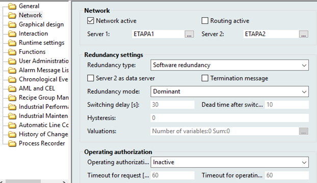
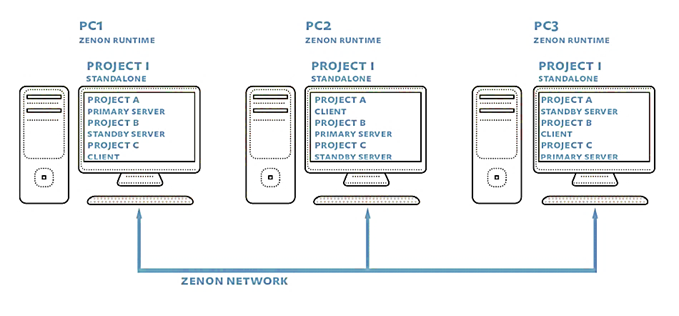

[<- До підрозділу](README.md)

# Мережні архітектури в SCADA zenon

Проект zenon може бути розроблений як для одного комп’ютера (одиночна структура, Standalone), так і для всього підприємства з мультисерверною структурою. На одному комп’ютері може бути виконано кілька середовищ виконання, кожне для свого проекту. Тому роль комп’ютера в обміні розглядається виключно з точки зору конкретного проекту. За необхідності мережної архітектури у властивостях проекту активується опція "Network active", задається адреса ПК для основного та, за необхідності, резервного сервера (рис. 9.9). При запуску середовища виконання автоматично буде запущена служба "zenNetSrv", яка реалізовуватиме обмін у мережі (вхідний TCP-порт = 1100). 

Таким чином, середовище виконання може виступати в ролі:

- основного сервера (Primary Server);  

- резервного сервера (Standby Server)

- товстого клієнта (Client) 

Сервери виконують усі функції проекту, а клієнти – тільки функції ЛМІ. На ПК з роллю сервера доступні і клієнтські функції ЛМІ.

 

*Рис.* *9.9.* Налаштування мережної архітектури в zenon 

На рис. 9.10 показано схему клієнт-серверної архітектури з резервуванням, налаштування якої зображені на рис. 9.9. На схемі показано чотири ПК, один з яких є станцією розробника (Development PC). Дані з пристрою введення/виведення (Process Data Flow PLC) зчитуються тільки основним сервером, а при його відмові – резервним. Клієнти, а також резервний сервер обмінюються даними з основним сервером (Process Data Flow PLC control system). Резервний сервер також відслідковує стан тривог та записує тренди. У випадку відмови основного сервера його функції бере на себе резервний. При відновленні функціональності основного сервера ролі будуть розподілятися залежно від налаштування Redundancy Mode (див. рис. 9.9).

Сервери можуть працювати в двох режимах резервування: програмному (Software) та апаратному (Hardware). При апаратному режимі резервування передбачається наявність двох комплектів ПЛК (або окремих комунікацій до одних і тих самих ПЛК), які резервують один одного. У цьому випадку обмін даними з ПЛК відбувається одночасно і основним, і резервним сервером.  

Сервери в zenon виступають не тільки як джерела процесних даних, вони також містять актуальні проекти середовища виконання. Клієнти та резервні сервери відслідковують наявність нової версії проекту на основному сервері, і у випадку її появи завантажують її собі (Dataflow project data на рис. 9.10). Таким чином, усі учасники мережної структури працюватимуть із останніми проектами, а завантаження зміненого проекту достатньо робити тільки на основний сервер.     

Внутрішні змінні в zenon реалізовані як "Internal Variable". Властивість цих змінних "Internal Variable -> Calculation" задає режим їх обчислення. При налаштуванні "Local" ці змінні є клієнтськими, а при "Network" – серверними. 

 

*Рис. 9.10.* Клієнт-серверна архітектура з резервуванням

Кожен проект розрахований тільки на одну пару серверів (основний та резервний). За необхідності розроблення мультисерверної архітектури, де клієнти можуть відображати змінні з різних серверів, у zenon використовується мультипроектний підхід, при якому кілька проектів включається в єдиний інтегрований проект. Таким чином, кожен проект матиме свій набір серверів, а їх включення в загальний проект дасть можливість, якщо потрібно вибрати елементи (наприклад змінні) з необхідного включеного проекту. 

Мультипроектність дає можливість у zenon реалізувати так зване кільцеве резервування (circular redundancy). У цьому випадку кілька проектів, що інтегровані в один загальний проект можуть бути налаштовані таким чином, що основні сервери одного проекту можуть мати адресу того самого ПК, що й резервні іншого. На рис. 9.11 показано приклад структури, в якому є три ПК, на кожному з яких виконується основний сервер з одного проекту, резервний – з другого і клієнт – з третього.   

 

*Рис. 9.11.* Клієнт-серверна архітектура з резервуванням 

Обов’язковою умовою функціонування мережної архітектури є синхронізація часу між ПК. За замовченням ця синхронізація робиться автоматично засобами zenon, де основний сервер виступає в якості сервера часу. Однак в архітектурах з кільцевим резервуванням часову синхронізацію рекомендується робити зовнішніми засобами, наприклад з використанням команди "NET TIME" з явним задаванням сервера часу, а в zenon її відключити (через параметри zenon6.ini). 

SCADA zenon підтримує два типи тонких клієнтів – термінальний клієнт ("Remote Desktop", див. параграф. 2.6.4), або через додатковий WEB SERVER. Враховуючи, що для людино-машинного інтерфейсу використовуються компоненти ActiveX, WEB-доступ забезпечується з використанням клієнтського ПЗ "Web Client", який попередньо необхідно встановити на ПК, перед запуском браузера. Такий клієнт може бути запущений тільки на ПК з ОС MS Windows. Тим не менше, в zenon є спеціальний серверний застосунок "HTML Web Engine", який забезпечує віддалений доступ з використанням сторінок HTML5, який підтримується усіма сучасними браузерами на сучасних ОС. Також доступні клієнти "Everywhere App" для доступу з пристроїв з операційними системами Android та iOS.

   Для доступу до SCADA zenon сторонніх програм можна використати спеціальний шлюз "Process Gateway". Він надає ряд інтерфейсів, у тому числі OPC DA Server, OPC UA Server, SNMP Server та SQL Online (OLE DB). Крім цього zenon має прямий інтерфейс для SAP/RP ERP та має інтерфейс DDE. Запуск OPC DA сервера проводиться через zenon Tools (перший раз необхідно запустити з опцією " /RegSrvD" для реєстрації сервера). Враховуючи що на одному ПК може бути запущено кілька проектів, змінні будуть видимі в просторі ItemID у фоматі "PROJECT_NAME.Variable_Name". Детальний розгляд налаштування цих сервісів виходить за рамки посібника. Деякі приклади можна почитати в статті [[4](https://www.svaltera.ua/press-center/articles/8773.php)]. 

Теоретичне заняття розробив [Олександр Пупена](https://github.com/pupenasan). 