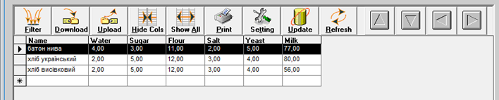
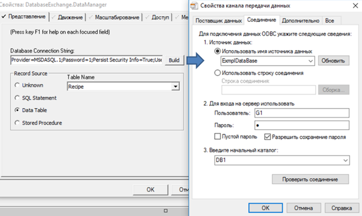
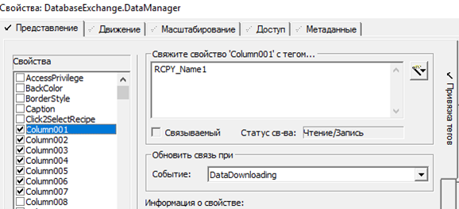

[<- До підрозділу](README.md)

# Підсистема рецептів у SCADA Citect 

У SCADA Citect явно виділеної підсистеми для керування рецептами немає. Найпростішим з точки зору реалізації способів є використання вбудованого в палітру ActiveX елемента компоненту "DataBase Exchange". До його функцій належать (рис. 8.24):

- відображати вибрані за певними критеріями (задається у Filter) дані із джерела у вигляді таблиці; 

- редагувати дані записів у табличному вигляді;

- завантажувати дані з вибраного запису у прив’язані теги (Download);

- вивантажувати дані з прив’язних тегів у записи (Upload);

- друкувати. 

 

*Рис .8.24.* Зовнішній вигляд ActiveX компоненту DataBase Exchange в режимі виконання

По суті, компонент є звичайним табличним редактором даних з БД, оформлений під керування рецептами. Ґрунтується він на технології ADO, тому при редагуванні вказується рядок підключення (рис. 8.25).

 

*Рис. 8.25.* Налаштування джерела даних для DataBase Exchange

Далі вказується прив’язка полів (колонок) до тегів (рис. 8.26) подібно до інших ActiveX в Citect.

 

*Рис. 8.26.* Налаштування зв’язку полів запису DataBase Exchange

Для реалізації інших функцій рецептів можна скористатися Cicode.

Теоретичне заняття розробив [Олександр Пупена](https://github.com/pupenasan). 