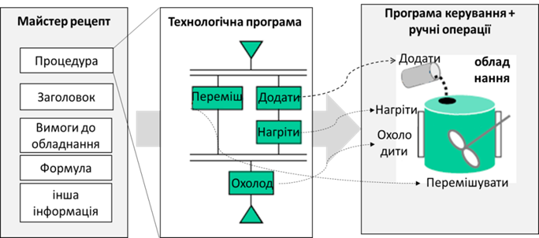
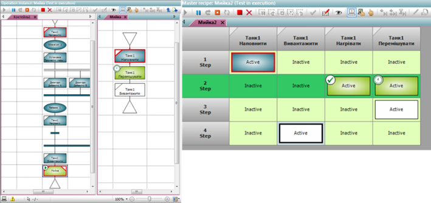
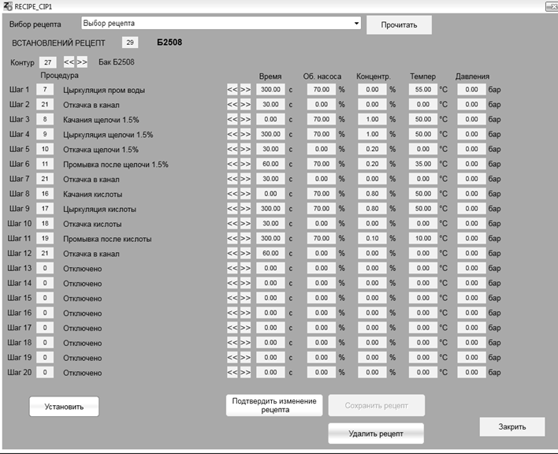

[<- До підрозділу](README.md)

# Підсистема роботи з рецептами

## 1. Загальні підходи

Як зазначено в розділі 1, ***рецепт*** (recipe) є сукупністю технологічних параметрів, які зчитуються, записуються, зберігаються як єдине ціле. Рецепти дають можливість операторові зберегти в системі задані значення певних технологічних параметрів для приготування конкретного продукту. Якщо SCADA/HMI підтримує функціональність рецептів, вона повинна надавати в середовищі виконання, як мінімум, такі функції:

- створювати нові рецепти та модифікувати існуючі;

- видаляти або позначати як застарілі існуючі рецепти;

- зберігати та зачитувати рецепти з носія;

- записувати дані рецепта в контролер (теги);

- зчитувати дані з контролера (тегів).

Інші можливості залежать від інструментів. У SCADA/HMI, які не підтримують функціональність рецептів, можуть надаватися можливості реалізувати їх самостійно через підсистему скриптів та/або роботу з базами даних. 

## 2. Керування рецептами згідно з IEC-61512 та ISA-88

 Виробництва, які виготовляють продукт невеликими порціями (партіями) за окремим рецептом, де порція речовини одночасно проходить певну послідовність оброблення називається порційним (Batch Production). Згідно зі стандартом керування процесами порційного виробництва IEC-61512 [[1](https://webstore.iec.ch/publication/5528)] та його аналога ISA-88, рецепт включає не тільки параметри процесу (так звану формулу), а й послідовність технологічних кроків (так звану процедуру). Одна із ідей стандарту полягає в тому, щоб у системі керування устаткуванням (наприклад в ПЛК) реалізовувати технологічні кроки, а не всю технологічну послідовність. Це дає змогу означувати технологічну програму в процедурі майстер-рецепта (прототип) для кожного типу продукту (рис. 1) 

 

*Рис. 1.* Взаємодія рецепта і керування устаткованням

   Весь стандарт не можна описати кількома реченнями. Детальніше про керування процесами порційного виробництва ви можете прочитати, наприклад, в [2] або з матеріалів ТДА [[3](http://www.tda.in.ua)]. Тут зупинимося на деяких особливостях, які стосуються означення рецептів.

Оскільки в рецепті означується технологічна програма (процедура), засоби SCADA/HMI повинні надавати можливість забезпечувати створення, редагування та контроль виконання процедури рецепта. Це може мати такий вигляд, як на рис. 2. Такі засоби надають можливість створювати процедуру з паралельно-послідовним виконанням, умовні переходи та ін. Тому, зазвичай для цього в програмному пакеті SCADA/HMI повинен бути присутній спеціалізований модуль, або ця функціональність реалізовується у вигляді окремого програмного пакету типу "Batch Control".

 

*Рис. 2.* Приклади процедури рецепта в режимі виконання, описані мовою PFC (ліворуч) та у вигляді таблиці (праворуч) 

Простіші варіанти потребують означення номера процедури етапу (найменшої технологічної діяльності) на кожному з кроків технологічної програми (рис. 3). Це дає змогу реалізувати керування згідно зі стандартами Batch Control без використання спеціалізованих модулів. 

 

*Рис.3.* Приклад варіанта налаштування рецепта означенням номера процедури на кожному кроці

У будь-якому випадку стандарт IEC-61512 потребує методики керування версіями рецепта. На початку майстер-рецепт знаходиться в режимі редагування, який можна перевірити шляхом тестових запусків, але не виробляти продукту. Після перевірки рецепт переходить у режим робочого аж до тих пір, поки його не виведуть із обслуговування. Робочий рецепт не можна змінювати, тому що на ньому зав’язана вся історія виготовлення партій продукції, що проводилася згідно цього рецепту. 

# Контрольні запитання

1.      Яку функціональність повинна надавати підсистема рецептів? Покажіть на прикладі однієї із SCADA/HMI, як вона реалізується. 
2.      Яка функціональність доступна в підсистемі рецептів, що базується на стандарті IEC-61512 або ISA-88?

 

Теоретичне заняття розробив [Олександр Пупена](https://github.com/pupenasan). 
