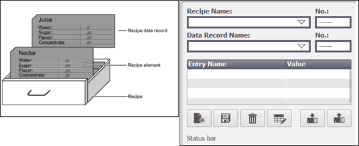
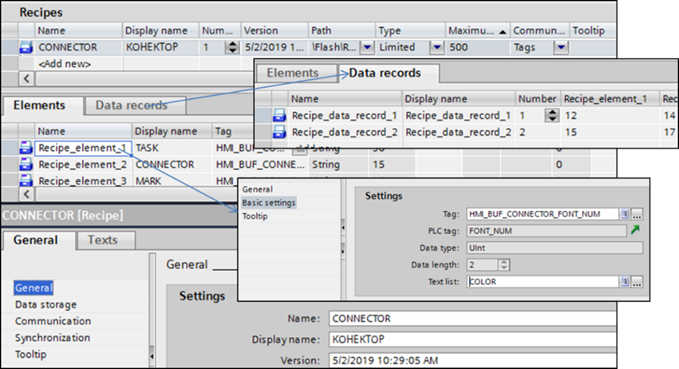
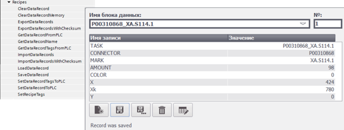

# Підсистема рецептів у WinCC Comfort

У WinCC Comfort рецепт (Recipe) більше нагадує групу рецептів. У довідниковій системі TiA Portal рецепти порівнюють із шухлядою з рецептурними карточками (рис. 8.32). Для рецепта означують набір рецептурних елементів, кожен з яких прив’язується до тегу і має налаштування значення за замовченням, мінімум та максимум. Конкретний рецепт, що належить до цієї групи з однаковим набором елементів, становить один ***рецептурний запис*** (***recipe data record***). При налаштуванні рецепта в середовищі виконання, спочатку вибирають рецепт (групу рецептів), а потім вибирають/створюють/видаляють рецептурний запис, в якому змінюють значення елементів. 

 

*Рис. 8.32.* Структура рецепта (ліворуч) та його налаштування (праворуч) у WinCC Comfort 

Рецепт створюється в середовищі розроблення через однойменний розділ проекту. У ньому означується місце зберігання рецептурних записів, максимальна їх кількість, рецептурні елементи з прив’язуванням до тегів (рис. 8.33). У середовищі розроблення також можна задати рецептурні записи, щоб використовувати їх після завантаження проекту в ОП.

Також є можливість задавати значення рецепта не звичайним уведенням значення, а вибором із випадаючого списку. Для цього при створенні рецепта для його елемента, для якого планується вибір значення з випадаючого списку, необхідно у властивостях Basic Settings підв’язати Text list (див. рис. 8.33). Тоді в середовищі виконання замість поля для введення буде поле з вибором значення. 

 

*Рис. 8.33*. Налаштування рецепта в середовищі розроблення WinCC Comfort 

У середовищі виконання рецепти можна відобразити й редагувати з використанням компонентів переглядача рецептів (Recipe view) або створювати власні рецептурні екрани (Recipe screen) з прив’язуванням до тегів, що пов’язані з рецептом та використанням функцій (рис. 8.34). Переглядачі рецептів дають можливість відкривати й редагувати (при виставленій опції "Edit Mode") рецепти у табличному вигляді. При редагуванні рецепта значення зберігаються в рецептурних записах ОП. Запис чи читання з ПЛК (тегів) відбувається через функції, наведені на рис. 8.34.

 

*Рис. 8.34.* Функції керування рецептом (ліворуч) та приклад переглядача рецептів (праворуч)