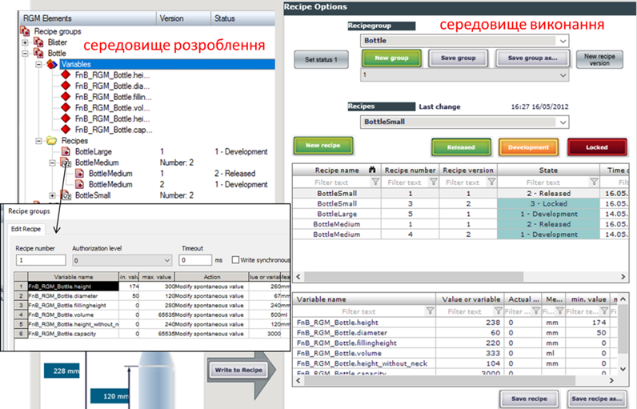
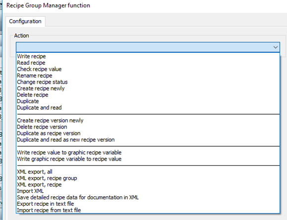

[<- До підрозділу](README.md)

# Підсистема рецептів у SCADA zenon 

У SCADA zenon рецепти реалізовані у вигляді двох модулів:

- стандартні рецепти (Standard Recipes) – входять в стандартну поставку;

- адміністратор груп рецептів (Recipegroup Manager) – додатковий модуль.

Окрім того, SCADA zenon має модуль керування порційним виробництвом згідно з IEC-61512. Розгляд цього модуля виходить за рамки посібника, детальніше з його роботою можна ознайомитися з лабораторного практикуму [4]. Тут зупинимося на функціях стандартних рецептів та груп рецептів. 

Рецепти в SCADA zenon можна створювати та модифікувати як у середовищі виконання, так і в середовищі розроблення. Для того, щоб при перенесенні проекту рецепти середовища розроблення не замінили рецептів, створених в середовищі виконання, за замовченням у налаштуваннях проекту "Runtime Changeable Date" для параметра "Standard Recipe" стоїть значення "Do not generate and transfer" (не генерувати і не переносити). SCADA zenon також дає змогу переносити рецепти із середовища виконання в середовище розроблення.

У середовищі розроблення стандартні рецепти створюються в однойменному розділі проекту (рис. 8.27). Для рецепта вибираються необхідні змінні та задаються задані значення. 

Записування значень рецепта в змінні, зчитування, імпорт і експорт можна виконати через відповідні функції zenon (рис. 8.28). 

Для створення, модифікації та видалення рецептів у середовищі виконання в SCADA zenon є спеціальний тип екрана "Standard Recipes" (рис. 8.29). Використовуючи дані екрани, оператор у змозі виконати усі операції з рецептами, включаючи добавлення нових змінних. SCADA zenon також підтримує імпорт і експорт рецептів, завдяки чому їх можна переносити на інші робочі станції. 

 

*Рис. 8.27.* Налаштування стандартних рецептів у середовищі розроблення

 

*Рис. 8.28.* Функції для керування рецептами 

 

*Рис. 8.29.* Наповнення екрана типу "Standard Recipes" 

Адміністратор груп рецептів (Recipegroup Manager) підтримує додаткові можливості по керуванню рецептами. Зокрема, він дає можливість групувати рецепти разом за певною ознакою. Стандартні рецепти надають операторові можливість вибрати рецепт серед усіх існуючих. У більшості випадків рецепти означуються для певної групи устатковання. Наприклад, якщо рецепти необхідно розподілити між трьома контурами CIP-мийки, то бажано створити окремі групи для кожного контуру, щоб операторові зручно було вибирати потрібний рецепт. Для кожної групи задається свій набір змінних (рис. 8.30).

Другою особливістю модуля Recipegroup Manager є можливість керувати версіями та статусом рецепту. Можна означувати свої статуси, наприклад "у розробці", "робочий" та "застарілий", які будуть надаватися рецепту на певному етапі. Цей статус рецепта можна використовувати як фільтра для відображення рецептів у переліках. Також виконання рецептів можна блокувати. 

 

*Рис. 8.30.* Налаштування групи рецептів модуля "Recipegroup Manager" у середовищі розроблення та середовищі виконання 

Групи рецептів також можна налаштовувати як у середовищі розроблення так, і в середовищі виконання. Доступні різноманітні дії з рецептами через налаштування єдиної функції Recipegroup Manager (рис. 8.31), а також через однойменний тип екрана. 

Крім цього, адміністратор груп рецептів дає можливість керувати рецептами опосередковано через змінні, імпортувати та експортувати рецепти через XML.

 

*Рис. 8.31.* Налаштування функції "Recipegroup Manager" 

Теоретичне заняття розробив [Олександр Пупена](https://github.com/pupenasan). 