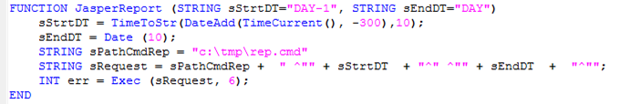

[<- До підрозділу](README.md)

# Підсистема звітів у Citect

Вбудована в Citect підсистема звітів дає змогу досить швидко розробити прості звіти за даними тегів, однак має обмежену функціональність. Проектування звітності проходить за класичним принципом:

- розроблення формату (шаблону) звіту;

- означення звіту, в якому вказується формат, пристрій, куди буде виводитися звіт, та умова, при якій буде відбуватися виведення;

- генерування звіту через виклик функції (опційно).

Формат звіту можна задавати у двох виглядах: текстовому (ASCII-файл) та RTF. Останній дає можливість зробити форматування кольору, шрифтів, вставляти рисунки і OLE-об’єкти. ASCII-файл, по суті, є звичайним текстовим файлом, який не вміщує форматування. Однак на його базі можна робити формати для виведення html-сторінок. Крім того, в ASCII-файлі формату підтримується додаткова можливість по оброблення Cicode.

Незалежно від того, який вибрано тип формату звіту, він включає звичайний текст та замінники, які виділяються фігурними дужками. Вміст фігурних дужок сприймається як Cicode-вираз. Наприклад, вираз {LOOP_1_PV:#-###.#EU} означає, що в цьому місці шаблону буде вставлене значення тегу LOOP_1_PV. У шаблон можна вставляти розділ з програмою Cicode, яка може попередньо оброблювати дані:

```
{CICODE}
Cicode_програма;
{END}
```

Для шаблону типу ASCII-файл дозволяється використовувати Cicode змінні, а для RTF – ні. 

<a href="media8/8_43.png" target="_blank"></a> 

*Рис. 8.43.* Приклад означення форматів звіту у вигляді rtf та html (ліворуч) та вигляд звіту (праворуч)

Звіт означується в однойменному розділі проекту. Для звіту вказується ім’я, формат, попередньо створений пристрій виведення (див. параграф 6.11.6) та час/період або/та подія для генерування (рис. 8.44). Звіт також можна генерувати з використанням Cicode функції "Report". 

<a href="media8/8_44.png" target="_blank"></a> 

*Рис. 8.44.* Означення звіту в Citect та пристрою виведення

Описаним вище способом досить просто робляться звіти для виведення тегів у вказаному форматі. Якщо необхідно виводити дані історії, звіти потребують написання Cicode з використанням функцій доступу до трендів, такі як TrnGetTable(). У будь-якому випадку для створення потужних звітів без програмування необхідно використовувати сторонні сервіси типу Jaspersoft або впроваджувати підсистему централізованого збору даних та звітності типу Historian (див. підрозділ 9.3). 

У випадку використання Jaspersoft через JasperStarter, як це описано в параграфі 8.5.2, можна скористатися Cicode функцією Exec, як це показано на рис. 8.45. 

<a href="media8/8_45.png" target="_blank"></a> 

*Рис. 8.45 .*Запуск звіту JasperStarter через командний файл з Cicode

Теоретичне заняття розробив [Олександр Пупена](https://github.com/pupenasan). 