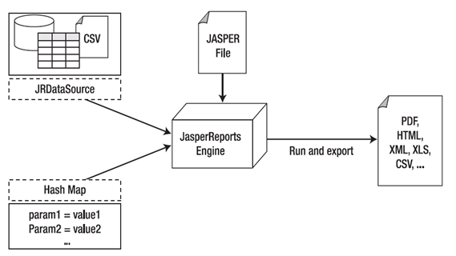
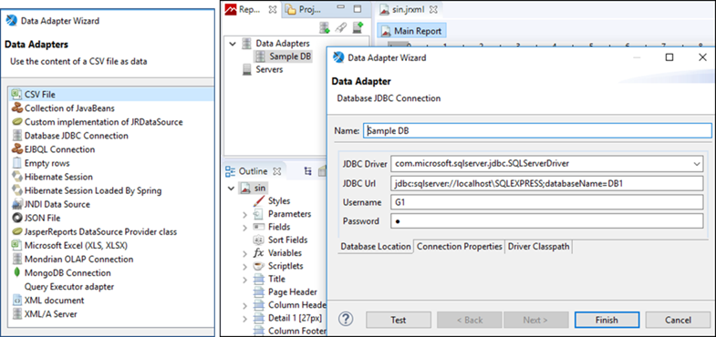
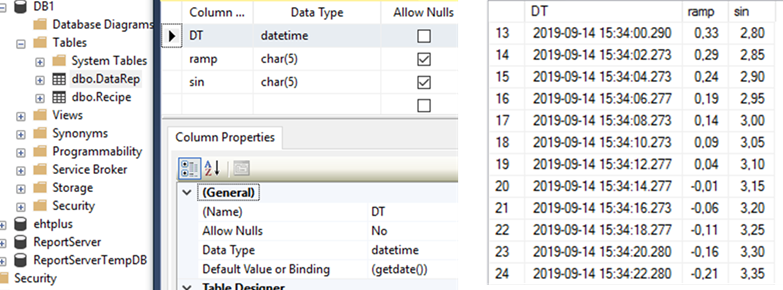
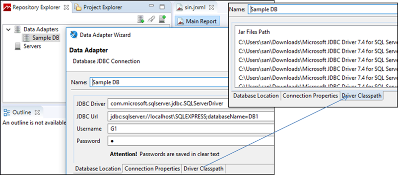
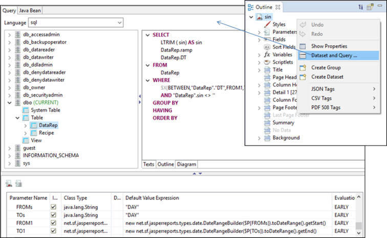
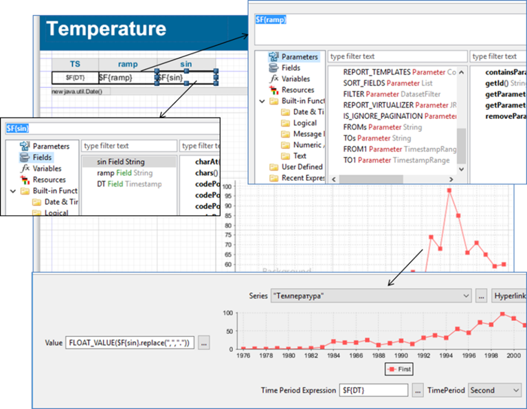
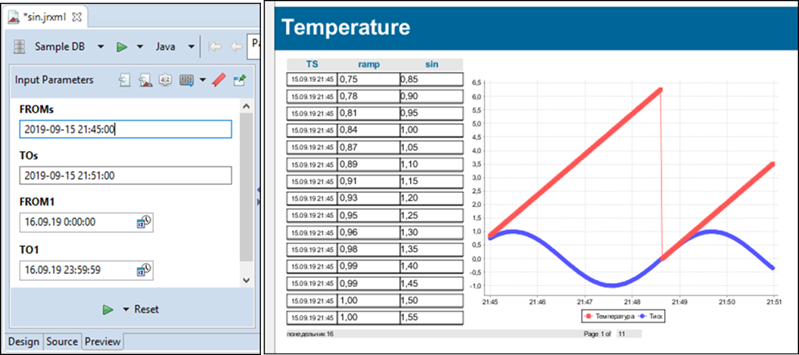
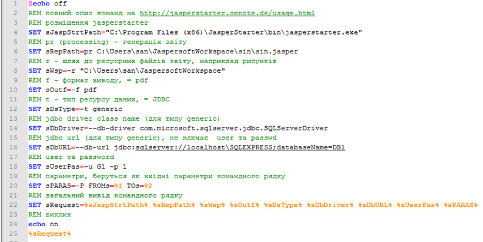

# Підсистема звітів з використанням Jaspersoft

Використання спеціалізованих застосунків для звітності розглянемо на прикладі програм Jaspersoft [[5](https://community.jaspersoft.com)]. На момент написання посібника до проектів Jaspersoft входить кілька застосунків:

- JasperReports Library – популярний рушій для звітів з відкритим кодом, написаний на Java, що вміє генерувати звіти в різних форматах, у тому числі HTML, PDF, Excel, OpenOffice та Word; 

- Jaspersoft Studio – редактор шаблонів звітів, що базується на eclipse; 

- JasperReports Server – сервер звітів;

- Jaspersoft ETL – рушій для інтеграції даних з різних джерел; вміє оброблювати дані відповідно до вказаних правил і завантажувати в єдину БД для звітності; 

- JasperReports IO – сервіси для формування звітів та візуалізації даних на базі хмарних обчислень; 

- VISUALIZE.JS – програмний каркас для javascript на базі бібліотек Jaspersoft, призначений для вбудовування звітів, візуалізації та аналітики в застосунок. 

Багато з наведених вище ресурсів мають дві редакції: Community Edition (безкоштовний) і Commercial Edition (платний з додатковими функціональними можливостями). Для формування звітів з використанням JasperReports Library необхідно розроблювати власний код на Java, що не входить в компетенцію спеціалістів з автоматизації. Те саме, очевидно, стосується JasperReports IO і VISUALIZE.JS. З наведених вище для формування звітів для SCADA може використовуватися тільки два застосунки – Jaspersoft Studio та JasperReports Server. 

Редактор Jaspersoft Studio призначений для розроблення формату (шаблону) звіту, в якому означується, що саме повинно виводитись у звіті (ресурси даних) і в якій формі. Цей редактор зберігає шаблон звіту у вигляді XML файлу з розширенням *.jrxml. Редактор дає змогу зробити повноцінне тестування роботи звіту, тому по суті має вбудовані засоби для генерування звіту. Однак останнє потрібно тільки з метою відлагодження формату звіту, а не для формування під час роботи.

Генерування звіту проводиться рушієм JasperReports Engine. Для цього попередньо файл проекту шаблону звіту (jrxml) компілюється у файл *.jasper. Цей файл, а також вказівка на джерело даних передається рушію, який формує звіт у вказаному форматі (рис. 8.35). Рушію також можна передати параметри, які можуть вказувати на додаткову інформацію, що потребується для формування звіту і змінюється (типу фактичних параметрів функції). 

<a href="media8/8_35.png" target="_blank"></a> 

*Рис. 8.35.* Принципи формування звітів з використанням застосунків Jaspersoft

JasperReports Server якраз і займається процесом генерування звітів. Він є WEB-застосунком, який вміщує шаблони звітів, має доступ до джерел даних та може формувати онлайн звіти. Також він має функції планувальника, дає змогу робити інтерактивні звіти тощо. Доступ до даних може проводитись через різноманітні адаптери даних (рис. 8.36, ліворуч), розроблені під Java, зокрема через JDBC. 

Отже, якщо необхідно побудувати підсистему звітності з використанням Jaspersoft, необхідно:

1) забезпечити збереження необхідних даних в БД, що підтримується адаптерами, наприклад одним із драйверів JDBC; налаштувати джерело даних для доступу;

<a href="media8/8_36.png" target="_blank"></a> 

*Рис. 8.36.* Налаштування адаптера JDBC (праворуч) 
 та перелік доступних адаптерів даних (ліворуч) 

2. розробити шаблон звіту з використанням JasperReports Engine; скомпілювати шаблон звіту;

3. інсталювати та налаштувати JasperReports Server, попередньо помістивши туди скомпільований шаблон звіту та всі необхідні додаткові ресурси (наприклад рисунки);

4. ініціювати генерування звіту через візуальний ВЕБ-інтерфейс серверу або API. 

   Якщо звіти необхідно формувати локально на одному ПК зі SCADA/HMI замість JasperReports Server, то можна використати програму JasperStarter [[6](http://jasperstarter.cenote.de)], яка реалізує команди генерування звіту через командний рядок. Це не альтернатива сервера і не підтримує його функції, а є, радше, локальним замінником генератора звіту. 

Далі розглянемо приклад формування шаблону звіту в Jaspersoft Studio та використання JasperStarter для генерування звіту. Для прикладу вважатимемо, що SCADA записує дані змінних "sin" та "ramp" у таблицю DataRep бази даних DB1 (див. параграф 8.3.3) на MS SQL Server Express. Звіт повинен генеруватися за запитом і вміщувати таблицю та тренд за вказаним діапазоном часу.

Формат таблиці показано на рис. 8.37. Він включає в себе одне поле DT, в якому пишеться дата та час записування (означено в полі Default Value or Binding), і два поля для змінних "ramp" та "sin", в які записуються значення змінних. Зверніть увагу, що значення з плаваючою комою для цих змінних пишеться як текст з 5-ма символами (DataType = char(5)), з яких два символи йдуть після коми. Це пов’язано з тим, що вибрана для прикладу SCADA (у даному випадку Citect) не вміє писати в SQL в іншому форматі. Тому надалі доведеться враховувати два аспекти:

- текстовий формат поля;

- використання "." або "," як роздільників цілої і дробової частин залежно від налаштувань операційної системи.

<a href="media8/8_37.png" target="_blank"></a> 

*Рис. 8.37.* Поля таблиці DataRep 

Для формування шаблону звіту у Jaspersoft Studio створюється проект, в якому означується шаблон звіту. Для перевірки працездатності шаблону необхідно до Jaspersoft Studio підключити драйвери, означити адаптери, через які в проектах будуть підключатися джерела даних. Це робиться в закладці репозитарію (рис. 8.38). У нашому випадку використовується JDBC драйвер для MS SQL Server. Попередньо драйвери JDBC для MS SQL Server необхідно завантажити з сайту Microsoft у довільну директорію, яку вказати в налаштуваннях адаптера Driver Classpath (див. рис. 8.38). У налаштуваннях адаптера вказується JDBC Url, де зазначається адреса й назва екземпляра СКБД та ім’я бази даних. Тут же вказується ім’я користувача та пароль. Слід розуміти, що для застосунку, який генеруватиме звіт на основі розробленого шаблону, також доведеться конфігурувати адаптер. У репозитарію, окрім адаптера, можна вказати розміщення JasperReports Server, в який з цього редакторові можна буде пересилати шаблони й додаткові ресурси.

<a href="media8/8_38.png" target="_blank"></a> 

*Рис. 8.38.* Налаштування адаптера БД та розміщення драйверів 

Для створеного проекту необхідно налаштувати джерела даних, що робиться через "Dataset and Query" (рис. 8.39). У цьому прикладі вибирається потрібна таблиця (DataRep) з підключеного адаптера. Необхідні дані (вибірка) вказуються через SQL-запит. Враховуючи що необхідно формувати звіт за вказаним діапазоном часу, в проекті попередньо в розділі Parameters створюються та налаштовуються параметри звіту. 

Нагадаємо, що параметри звіту дають можливість при генеруванні звіту передати в рушій додаткові необхідні дані. У цьому прикладі створено чотири параметри "FROMs", "TOs", "FROM1" та "TO1". Причиною 4-х параметрів замість 2-х (початкова і кінцева дата) є неможливість передачі параметрів рушію JasperStarter з типом, відмінним від STRING. Параметри "FROM1" та "TO1" мають спеціальний тип “net.sf.jasperreports.types.date.TimestampRange” який можна використовувати у функції BETWEEN. У запиті спеціальні виклики $X (див. рис. 8.39), дає можливість викликати функцію BETWEEN, яка повертає істину, якщо значення поля DT (дата та час) входить у діапазон FROM1 та TO1. Таким чином, вибірка буде проводитися тільки для записів із зазначеним діапазоном. Якщо параметри не передаються, вони будуть розраховуватися за замовченням відповідно до властивості "Default Value Expression". У цьому прикладі значення цих параметрів за замовченням розраховується на основі "FROMs" та "TOs" (див. рис. 8.39), де $P{параметер} – це звернення до вказаного параметру. Слід також звернути увагу, що параметри мають властивість "Evaluation Time" = EARLY, що вказує на необхідність їх розрахунку до використання в запиті. 

<a href="media8/8_39.png" target="_blank"></a> 

*Рис. 8.39.* Налаштування джерел даних

Також в запиті необхідно видалити усі пробіли (LTRIM) та вилучити з результату записи з пустими полями. На рис. 8.39 це зроблено тільки для поля "sin", але бажано це зробити і для інших полів.

Шаблон звіту означується набором різних елементів. Для прикладу на рис. 8.40 показано, як налаштовуються деякі з елементів. Для звернення до конкретних полів з означених джерел даних використовується синтаксис $F{поле}, для параметрів – $P{параметр}, для змінних – $V{}. Для трендів у полі Value треба задати поле зі значенням, однак, як сказано вище, поля мають текстовий формат, крім цього вони можуть вміщувати в якості розділювача як крапку, так і кому. Тому для поля Value використовується вираз, який спочатку замінює усі коми на крапки, а потім робить перетворення в FLOAT (див. рис. 8.40). 

<a href="media8/8_40.png" target="_blank"></a> 

*Рис. 8.40.* Налаштування елементів шаблону звіту

Після означення шаблону звіту його можна перевірити через вкладку Preview, де перед генеруванням треба задати поля (рис. 8.41). 

Після створення і перевірки шаблону звіту його необхідно скомпілювати (Build Project), в результаті чого в папці проекту з’явиться файл з розширенням *.jasper. Тепер цей файл можна використовувати для генерування звітів в JasperReports Server або в JasperStarter. Останній керується з командного рядка. Для простоти його використання в цьому прикладі створено файл *.cmd, який генерує командний рядок на основі  2-х вхідних параметрів, що вказують на діапазон часу, для якого треба згенерувати звіт. Для зручності коментування рядок розбито на частини, до кожної з яких наводиться коментар (рис. 8.42).

<a href="media8/8_41.png" target="_blank"></a> 

*Рис. 8.41.* Перевірка роботи звіту

<a href="media8/8_42.png" target="_blank"></a> 

*Рис. 8.42.* Командний файл для виклику JasperStarter

Приклад виклику звіту через командний рядок:

```
C:\tmp\rep.cmd "2019-09-15 21:45:00" "2019-09-15 21:51:00"
```

