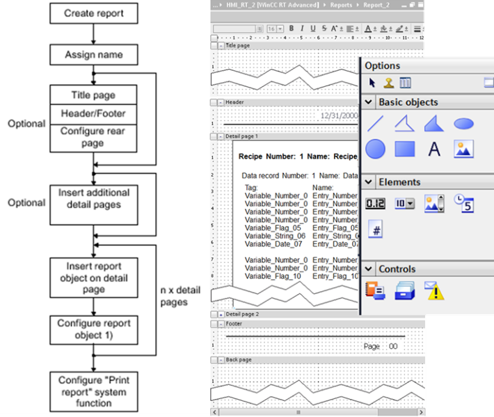

# Підсистема звітів у WinCC Comfort

У WinCC Comfort формат звітів створюються у однойменному розділі проекту. Він включає кілька секцій:

- титульний аркуш (title page), з якого починається звіт;

- заключна сторінка (back page);

- деталізовані сторінки (Detail pages);

- верхні колонтитули (Headers) та нижні колонтитули (footers) для деталізованих сторінок.

На сторінках можна виводити різні анімовані об’єкти, а також деякі спеціальні елементи та компоненти: 

- номер сторінки;

- audit trail – попередньо сконфігурований журнал, який записує дії оператора зі змінними та рецептами, а також логування/розлогування;

- recipe report – записи рецептів;

- alarm report – записи журналу тривог (за вказаний діапазон часу) або буфер активних тривог; час початку і кінця для виведення журналу задається змінними. 

Звіт можна вивести тільки на принтер, використовуючи функцію PrintReport, куди передається формат звіту. 

 

*Рис. 8.51.* Означення звіту у WinCC Comfort