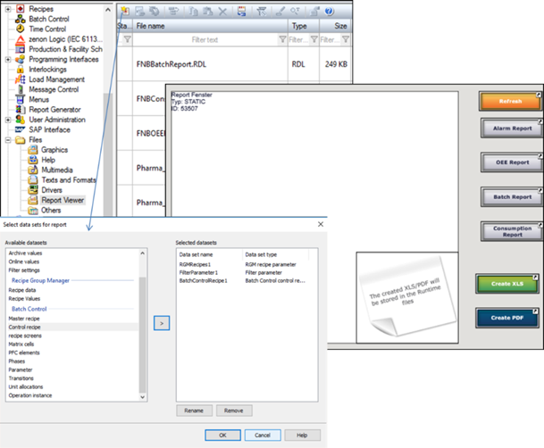
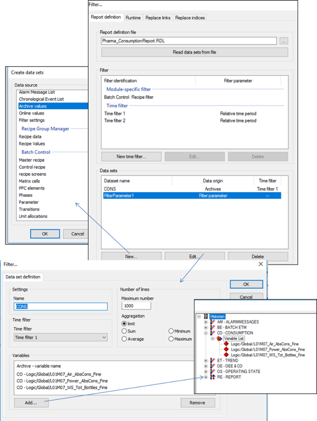

[<- До підрозділу](README.md)

# Підсистема звітів у zenon

SCADA zenon підтримує два типи звітів: 

- Report Generator;

- Report Viewer.

**Report Generator** 

Генератор звітів (Report Generator) розраховує дані та виводить на звіт інформацію за даними процесу та архівними даними. Конфігурування звітів відбувається в кілька етапів:

- означення формату (шаблону) звіту в розділі Report Generator; 

- створення функції для генерування звіту або/та створення спеціального для виведення звіту.

Формат звіту ґрунтується на основі комірок, у кожній з яких можна задати певну функцію та формат. У режимі виведення звіту інформацію можна не тільки виводити, а й змінювати. Серед функцій комірок є загальні (подібні до функцій Excel) та спеціалізовані, які належать до однієї з груп: функції роботи з базами даних; функції дати й часу; логічні; доступу до архіву і журналів; статистичні; математичні та тригонометричні; текстові; функції керування групами рецептів та ін.

На рис. 8.46 показано приклад налаштування формату звіту. Для комірок з виведенням даних з архівів вказуються:

- функція archive, яка вибирає дані з означеного архіву з відповідним номером;

- властивість запису архіву, наприклад, “time” для виведення часу або “value” для виведення збереженого значення;

- куди будуть записуватися вилучені з архіву значення (bottom – вниз); кількість виведених даних залежатимуть від параметрів дати та часу, що задаються при виконанні звіту. 

 

*Рис. 8.46.* Налаштування формату (шаблону) звіту 

Для генерування звіту можна викликати функцію "Report Generator: execute", в якій задати формат звіту, діапазон часу і за необхідності – додаткові параметри (див. рис. 8.47).

 

*Рис. 8.47.* Налаштування функцій Report Generator 

Можна також створити екран з типом "Report Generator", в якому доступні аналогічні функції. 

**Report Viewer**

Переглядач звітів (Report Viewer) призначений для генерування та відображення звітів у SCADA zenon у форматі RDL. Report Definition Language (***RDL***) (мова означення звітів) — стандарт, що пропонує Microsoft для означення звітів. Аналогічно, як звіти Jasper використовують формат jrxml, служби звітів Microsoft використовують файли RDL. RDL – це XML файл, який, як правило, використовується сервісами генерування звітів – Microsoft SQL Server Reporting Services (SSRS). Цей формат можна створювати та редагувати MS Visual Studio або іншими редакторами, наприклад, безкоштовним MS Report Builder.

RDL вміщує:

- поля, які відображають дані з джерела даних, формул, змінних;

- розмітку сторінки;

- параметри. 

Спочатку у відповідному розділі проекту zenon створюється файл RDL (див.рис. 8.48). При створенні вказуються необхідні набори даних (Data Sets) та параметри. SCADA zenon за замовчуванням означує формат звіту самостійно. Після створення файл RDL редагується стороннім реактором (наприклад, MS Report Builder). Також можна підключити створений до цього файл. Далі для формування та відображення звіту використовується спеціальний тип екрана Report Viewer (див. рис. 8.48). На екрані можна розмістити спеціальні кнопки, наприклад, для виведення звіту на друк, PDF або Excel файл. 

 

*Рис. 8.48.* Створення файлів RDL (ліворуч) та зовнішній вигляд екрана типу Report Viewer (праворуч) 

Далі створюють функцію виклику екрана, в яку передають назву файлу звіту, переозначують за необхідності набори даних, параметри фільтрів та інші параметри. Report Viewer може використовуватися для відображення архівних даних, тривог AML, журналів CEL, плинних змінних та інших даних. Для цього ці дані передаються через набори Data Sets (рис. 8.49), які вибираються через модулі zenon. Для кожного набору вказуються додаткові налаштування, наприклад, для архівів – змінні, які необхідно передати у звіт. Після вибору набору даних означуються фільтри: часові та залежні від модуля набору даних. 

 

*Рис. 8.49.* Означення наборів даних та фільтрів для Report Viewer

Редагування RDL файлу у MS Report Builder схоже на аналогічні дії в Jasper Studio (рис. 8.50). Означені набори даних передаються у форматі XML, з яких вибираються необхідні поля і використовуються при відображенні даних. 

 

*Рис. 8.50.* Означення формату для RDL у MS Report Builder

Теоретичне заняття розробив [Олександр Пупена](https://github.com/pupenasan). 