[<- До підрозділу](README.md)

# Практичне заняття Citect: створення змінних тегів Citect 

**Тривалість**: 4 акад. годин (2 пари).

**Мета:** опанування роботи зі змінними.  

**Завдання для виконання роботи**

**Цілі.** 

1. Навчитися створювати та редагувати змінні теги Citect використовуючи вбудовані редактори.

5. Створити частину проекту зі змінними тегів.   

**Лабораторна установка**

- Апаратне забезпечення: ПК. 

- Програмне забезпечення: UNITY PRO V>=7.0 або Control Expert,  Citect 2016 (або новіше)

**Примітки щодо відео: представлені в роботі відеоматеріали є студентською інтерпретацією лабораторної роботи, носять ознайомчий характер і можуть містити помилки!** 

## Порядок виконання роботи 

Дане практичне заняття потребує виконання попереднього [Практичне заняття SCADA zenon: проект, екрани, функції](../basedesign/labzenon.md)

Перед виконанням роботи ознайомтеся з усіма додатками до лабораторної роботи:

- [Додаток 1. Налаштування змінних тегів у Citect ](lab2a2.md)

## 1. Добавлення тегів скалярних типів

Відкрийте попередньо збережений проект.

Табличний редактор Citect дозволяє вставляти дані в табличному вигляді скопійовані з інших редакторів, наприклад Excel. Це зручно при підготовці даних і значно прискорює процес розроблення. 

- [ ] Завантажте та відкрийте [таблицю зі змінними](https://docs.google.com/spreadsheets/d/1PPKSlxMoOP-Fjb1KPU559eIJL7-qr5sb/edit?usp=sharing&ouid=111751208742846482260&rtpof=true&sd=true) , або відкрийте її на гугл диску
- [ ] Скопіюйте вміст таблиці в буфер обміну
- [ ] Вставте скопійовані дані в таблицю тегів. 
- [ ] Зверніть увагу щоб послідовність колонок співпадала з наведеним на рис.2.23. Якщо це не так, перед вставленням змініть послідовність, шляхом перетягування колонок.

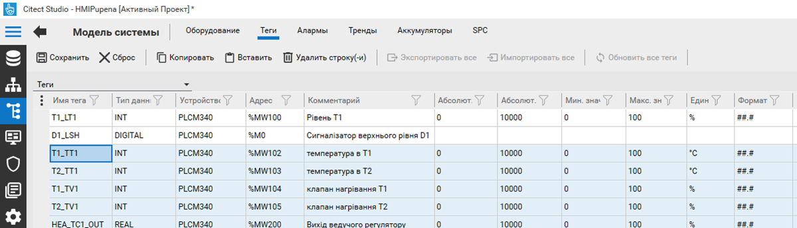

Рис.2.23 Вставлення даних в таблицю тегів

- [ ] Збережіть та скомпілюйте проект. Якщо компіляція пройшла успішно – перейдіть до наступного пункту. 

<iframe width="560" height="315" src="https://www.youtube.com/embed/00DkdcqXVZI" title="YouTube video player" frameborder="0" allow="accelerometer; autoplay; clipboard-write; encrypted-media; gyroscope; picture-in-picture" allowfullscreen></iframe>

## 12. Робота в середовищі виконання зі спеціальним вікном тегів

При створенні проекту автоматично створюються сторінки для перевірки та модифікації тегів. 

- [ ] Запустіть середовище виконання.
- [ ] Перейдіть на сторінку `Tags -> All Variable Tags`
- [ ] Подивіться які можливості для перегляду тегів доступні.

За замовченням сторінка не дає можливості змінювати значення змінної. Для того, щоб активувати таку можливість необхідно налаштувати для неї привілеї, якими повинен володіти користувач.

- [ ] У графічному редакторі відкрийте сторінку "Variable Tags" (рис.2.24)

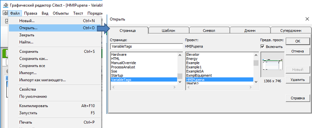

Рис.2.24 Відкриття сторінки з тегами

- [ ] Зробіть подвійний клік по сторінці і вкажіть привілею 1. Збережіть сторінку. 

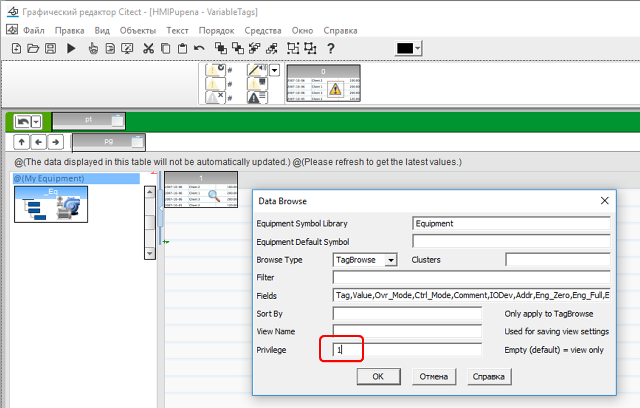

Рис.2.25 Зміна налаштувань сторінки з тегами

- [ ] Скомпілюйте проект. Його можна скомпілювати як з Citect Studio так і з графічного редактору (File -> Compile).
- [ ] Якщо Ви не зупиняли середовище виконання, то після компіляції нові сторінки можна просто відкрити повторно. Якщо середовище було зупинено - запустіть його заново.
- [ ] Зареєструйтеся в системі як користувач "admin".
- [ ] На сторінці "All Variable Tags" змініть значення змінної "T_SB1" 

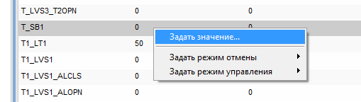

Рис.2.26 Зміна значення тегу

<iframe width="560" height="315" src="https://www.youtube.com/embed/xfoGXh98nFM" title="YouTube video player" frameborder="0" allow="accelerometer; autoplay; clipboard-write; encrypted-media; gyroscope; picture-in-picture" allowfullscreen></iframe>

## 13. Теги типу масив

- [ ] Уважно прочитайте [додаток](lab2a2.md). 
- [ ] Добавте змінну-масив HEA_TT1_SP відповідно до налаштувань таблиці 1 файлу [Завдання](../basedesign/task.md). Для створення такої змінної в полі адреси після означення початкової адреси в квадратних дужках пишеться кількість елементів. У завданні масив означений в проекті Unity PRO з діапазоном від 0 до 5, отже кількість елементів задається рівною 6. Загальний вигляд налаштувань масиву показаний на рис.2.27.   

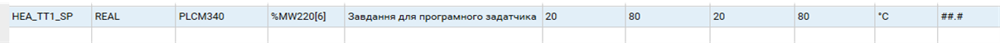

Рис.2.27. Налаштування змінної масиву

- [ ] Збережіть і скомпілюйте проект. При вдалому результаті компілювання переходьте далі. 
- [ ] Аналогічним чином добавте змінні `DIFRC` та `AIFRC` з таблиці 2 файлу [Завдання](../basedesign/task.md). Скомпілюйте проект. При вдалому результаті компілювання переходьте далі.

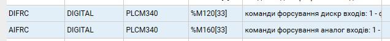

Рис.2.28. Налаштування дискретних змінних масиву

<iframe width="560" height="315" src="https://www.youtube.com/embed/BUX0CEjilL4" title="YouTube video player" frameborder="0" allow="accelerometer; autoplay; clipboard-write; encrypted-media; gyroscope; picture-in-picture" allowfullscreen></iframe>

## 14. Налаштування кодової сторінки  за замовченням

Цей пункт треба виконувати, якщо за замовченням в середовищі виконання не відображаються кириличні шрифти. 

- [ ] З провідника або з меню Пуск запустіть "Редактор настройки"

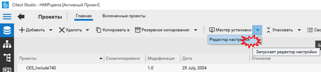

 Рис.2.29 Запуск редактора настройки

Редактор настройки дає можливість змінювати параметри в Citect.ini.

- [ ] У реакторі у полі для вводу задайте слово `Language` для пошуку параметрів пов'язаних з мовою. Натисніть значок Пошуку. У вікні результатів пошуку виберіть `Language Parameters`  

 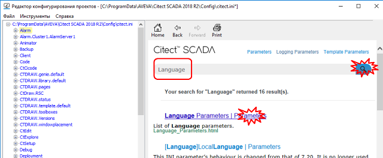

 Рис.2.30 Вікно пошуку параметрів

- [ ] Виберіть в списку [Language]CharSet, вкажіть в параметрах значення 204, натисніть "Добавить"  
- [ ] Збережіть налаштування через меню "Файл -> Сохранить"

 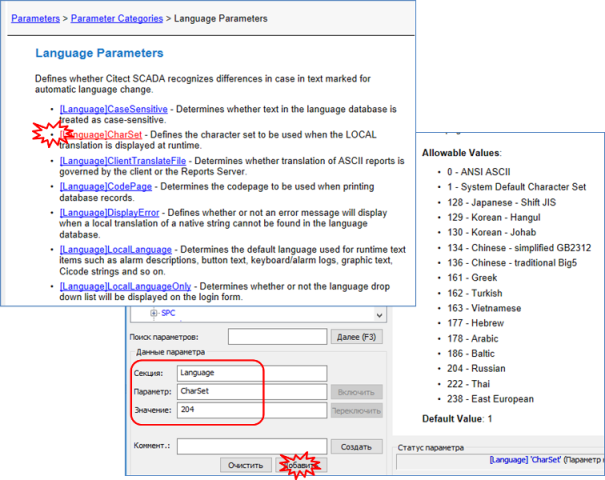

 Рис.2.31 Налаштування кодової сторінки 

- [ ] Запустіть або перезапустіть проект на виконання. Перевірте, що кириличний текст відображається вірно без реєстрації користувача.

<iframe width="560" height="315" src="https://www.youtube.com/embed/slydTi7lKwg" title="YouTube video player" frameborder="0" allow="accelerometer; autoplay; clipboard-write; encrypted-media; gyroscope; picture-in-picture" allowfullscreen></iframe>

## 15. Функція TagDebug

Для перевірки працездатності змінних тегів можна скористуватися спеціалізованою функцією Citect "TagDebug", яка викликає вікно перегляду та зміни значення вибраних змінних. 

- [ ] У графічному редакторі відкрийте сторінку "Startup". 
- [ ] У довільному місці розмістіть кнопку з написом "Перевірка змінних", який вказується у властивостях "Представление"->"Общие"->"Текст" (рис.2.32). 
- [ ] На вкладці "Ввод"->"Касание"->"Действие" активуйте опцію "Вверх", а в поле "Вверх команда" впишіть `TagDebug()`. 
- [ ] Збережіть сторінку, скомпілюйте проект, та у випадку вдалої компіляції перейдіть до наступного пункту.  

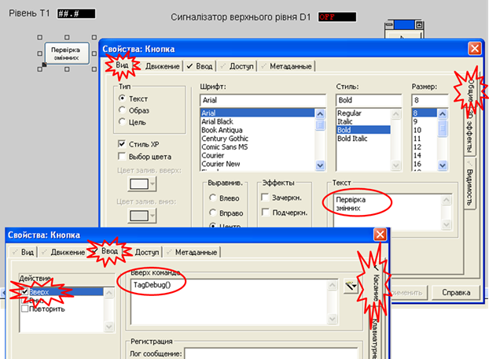

 Рис.2.32 Налаштування кнопки для виклику вікна перевірки змінних

- [ ] Запустіть або перезапустіть проект на виконання.

- [ ] У Unity PRO зніміть заздалегідь усі форсування. 
- [ ] Натиснувши на кнопку "Перевірка змінних" викличте вікно-форму читання/запису (рис.2.33). Прочитайте значення змінної T_SB1 ("Запуск процесу приготування"). Змініть значення на 1 та запишіть його в контролер. Подивіться чи запустилася програма приготування продукту в імітаторі контролера. Якщо так, перейдіть далі.

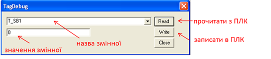

 Рис.2.33 Вікно читання/запису змінної, що викликається функцією `TagDebug()`

- [ ] За допомогою вікна TagDebug перевірте відповідність значення аналогових змінних в Citect до змінних в ПЛК з урахуванням масштабу. 
- [ ] Також вибірково перевірте 3 дискретних змінних. За необхідності, модифікуйте проект, щоб всі змінні були налаштовані згідно завдання.

<iframe width="560" height="315" src="https://www.youtube.com/embed/WoUSnp4qTS0" title="YouTube video player" frameborder="0" allow="accelerometer; autoplay; clipboard-write; encrypted-media; gyroscope; picture-in-picture" allowfullscreen></iframe>

## 16. Добавлення та перевірка роботи структурних змінних

У проект необхідно добавити структурні змінні що вказані в таблиці 3 з файлу [Завдання](../basedesign/task.md). Враховуючи, що назва змінних не може містити крапку ".", у якості розділового знаку варто використовувати символ нижнього підкреслення "_". Надалі назва тегів буде мати вирішальне значення для автоматизації розробки людино-машинного інтерфейсу, тому ми рекомендуємо Вам використовувати імена з таблиці 2.1  

Таблиця 2.1. Рекомендовані назви змінних тегів відповідно до полів структури

| **Назва змінної в ПЛК** | **Рекомендована назва в** SCADA Citect | **Призначення**                                              |
| ----------------------- | -------------------------------------- | ------------------------------------------------------------ |
| Dozator1.CV             | D1_LC_CV                               | плинна кількість доз  D1                                     |
| Dozator1.PV             | D1_LC_PV                               | задана кількість доз D1                                      |
| Dozator1.START          | D1_LC_START                            | запуск дозування D1                                          |
| Dozator2.CV             | D2_LC_CV                               | плинна кількість доз D2                                      |
| Dozator2.PV             | D2_LC_PV                               | задана кількість доз D2                                      |
| Dozator2.START          | D2_LC_START                            | запуск дозування D2                                          |
| TC1_PARA.pv_inf         | HEA_TC1_PVINF                          | обмеження по мінімуму  вхідної величини завдання TC1         |
| TC1_PARA.pv_sup         | HEA_TC1_PVSUP                          | обмеження по максимуму  вхідної величини завдання TC1        |
| TC1_PARA.out_inf        | HEA_TC1_OUTINF                         | обмеження по мінімуму  вихідної величини блоку TC1           |
| TC1_PARA.out_sup        | HEA_TC1_OUTSUP                         | обмеження по максимуму  вихідної величини блоку TC1          |
| TC1_PARA.kp             | HEA_TC1_KP                             | Коефіцієнт пропорційності TC1                                |
| TC1_PARA.ti             | HEA_TC1_TI                             | Час інтегрування TC1                                         |
| TC1_PARA.dband          | HEA_TC1_DBAND                          | Зона нечутливості TC1                                        |
| TC1_PARA.outbias        | HEA_TC1_OUTBIAS                        | зміщення виходу регулятора  в П-режимі функціонування (при ti=0s) TC1 |
| TC1s_PARA.pv_inf        | HEA_TC1s_PVINF                         | обмеження по мінімуму  вхідної величини завдання TC1s        |
| TC1s_PARA .pv_sup       | HEA_TC1s_PVSUP                         | обмеження по максимуму  вхідної величини завдання TC1s       |
| TC1s_PARA .out_inf      | HEA_TC1s_OUTINF                        | обмеження по мінімуму  вихідної величини блоку TC1s          |
| TC1s_PARA .out_sup      | HEA_TC1s_OUTSUP                        | обмеження по максимуму  вихідної величини блоку TC1s         |
| TC1s_PARA .kp           | HEA_TC1s_KP                            | Коефіцієнт пропорційності TC1s                               |
| TC1s_PARA .ti           | HEA_TC1s_TI                            | Час інтегрування TC1s                                        |
| TC1s_PARA .dband        | HEA_TC1s_DBAND                         | Зона нечутливості TC1s                                       |
| TC1s_PARA .outbias      | HEA_TC1s_OUTBIAS                       | зміщення виходу регулятора  в П-режимі функціонування (при ti=0s) TC1s |
| Recipe1.D1Count         | T1_KS_D1CNT_SP                         | рецепт Т1: кількість  доз з дозатору D1                      |
| Recipe1.D2Count         | T1_KS_D2CNT_SP                         | рецепт Т1: кількість  доз з дозатору D2                      |
| Recipe1.T_SP            | T1_KS_TT1_SP                           | рецепт Т1: значення  температури нагрівання                  |
| Recipe1.Delay           | T1_KS_DEL_SP                           | рецепт Т1: заданий час  витримки                             |
| Recipe2.D1Count         | T2_KS_D1CNT_SP                         | рецепт Т2: кількість доз з дозатору D1                       |
| Recipe2.D2Count         | T2_KS_D2CNT_SP                         | рецепт Т2: кількість доз з дозатору D2                       |
| Recipe2.T_SP            | T2_KS_TT1_SP                           | рецепт Т2: значення температури нагрівання                   |
| Recipe2.Delay           | T2_KS_DEL_SP                           | рецепт Т2: заданий час витримки                              |

Уважно прочитайте [додаток](lab2a2.md) щоб вірно налаштувати ці змінні. Необхідно врахувати:

- наявність типу BOOL в структурах, які в Citect мають тип Digital, та правильну їх адресацію 
- необхідність приведення типу TIME до формату Citect (LONG), та правильне їх масштабування (с -> мс) 

- [ ] Самостійно добавте усі структуровані змінні з таб.2.2 в проект. Для швидкості створення можна скористатися табличним редактором MS Excel або Google Sheet:
  - скопіювати змінні з таблиці 2.1 в табличний редактор а також з таблиць 3-8  з файлу [Завдання](../basedesign/task.md).
  - скопіювати колонку "рекомендована назва в SCADA Citect" в редактор тегів в колонку "Имя тега"
  - скопіювати колонку "Призначення" в редактор тегів в поле комментарий
  - скопіювати адреси з таблиць 3-8 з файлу [Завдання](../basedesign/task.md) або з табличного редактору
  - вірно вибрати потрібний тип змінних та налаштувати інші поля (масштабування, одиниці вимірювання)
- [ ] Збережіть та скомпілюйте проект. 
- [ ] При компіляції можуть виникнути помилки `Address on bad boundary` . Дізнайтеся що це за помилка та виправте її, як описано в [додатку](lab2a2.md) 
- [ ] Якщо з'являються інші помилки, подвійним кліком можна перейти до джрелеа помилки і виправити її.  

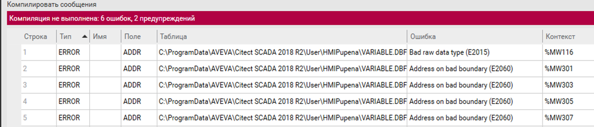

 Рис.2.34 Помилки компілювання

- [ ] Після виправлення усіх помилок запустіть на виконання проект. 
- [ ] За допомогою вікна TagDebug перевірте відповідність значень полів типу TIME структурних змінних ПЛК до змінних Citect (наприклад `HEA_TC1_TI`). 

- [ ] За необхідності модифікуйте проект так, щоб всі змінні були налаштовані згідно завдання.

- [ ] **Зробіть резервну копію проекту, скопіюйте її на змінний носій. У випадку роботи в лабораторії – покажіть викладачу, і з його відома видаліть свій проект з провідника проектів.**      

<iframe width="560" height="315" src="https://www.youtube.com/embed/jmCniCyEVD0" title="YouTube video player" frameborder="0" allow="accelerometer; autoplay; clipboard-write; encrypted-media; gyroscope; picture-in-picture" allowfullscreen></iframe>

## Питання до захисту 

1. Поясніть відмінність понять середовища розробки та середовища виконання SCADA/HMI. Яке саме середовище потрібне для роботи АРМу оператору на підприємстві?
2. Поясніть що таке проект SCADA/HMI? Чим відрізняється вихідний проект від скомпільованого і коли     підприємству необхідні обидва варіанти проектів?
3. Від чого залежить вартість середовища виконання SCADA/HMI?
4. Які типові функції надають програми SCADA/HMI?
5. Що таке база даних реального часу? 
6. Поясніть, що таке тег SCADA? Що може бути джерелом даних для тега?
7. Поясніть що таке відмітка часу і показник достовірності тегу?
8. Розкажіть про призначення основних редакторів  Citect.
9. Чому у включених проекту з'явився файл "Sxw_Style_Include"? Чи міг там з'явитися інший проект? На що це впливає? 
10. Що собою представляє проект Citect з точки зору файлової системи Windows?
11. Як середовище розробки Citect дізнається де знаходяться проекти на комп'ютері? 
12. Як середовище виконання Citect дізнається де знаходяться файли режиму виконання на комп'ютері? 
13. Як можна дізнатися про розміщення папки проекту середовища розробки?
14. Для чого потрібен Citect Studio? Розкажіть про можливості які Ви використовували в цій лабораторній роботі. 
15. Поясніть для чого потрібна компіляція проекту. Які ситуації можливі при компіляції проекту? Як дізнатися про помилки компіляції?
16. Яке призначення майстра налаштування комунікацій? Які зміни в проект вносить майстер? Чи можна створити ці записи в проекті самостійно? Обґрунтуйте необхідність використання цього майстра.
17. Що і де необхідно змінити в існуючому проекті, щоб вказати іншу IP адресу ПЛК?  
18. Навіщо потрібно створювати резервну копію проекту? Розкажіть основні процедури створення а     відновлення резервної копії проекту.
19. Яке призначення змінних тегів ("Переменные теги")? Розкажіть про призначення основних властивостей, які налаштовуються в Citect при створенні цих змінних.
20. Яке призначення локальних змінних ("Локальные переменные")? Чим локальні змінні принципово відрізняються від змінних тегів?
21. Які типи даних для змінних є у  Citect? Розкажіть про відповідність цих типів основним типам даних в IEC 61131, зокрема у Unity PRO. Як у  Citect налаштувати змінну яка буде відображати секунди зі змінної ПЛК типу TIME?
22. Розкажіть про означення адреси в  Citect для змінних з пристроїв, підключених через драйвер MODNET30. Які правила адресації BOOL/EBOOL що прив’язані до комірок %MW?
23. Розкажіть про означення адреси в  Citect для змінних з пристроїв, підключених через драйвер MODNET30. Які правила адресації DINT/UDINT що прив’язані до комірок %MW?
24. Як у Citect налаштовуються  масиви? Як звертатися в проекті до елементів масивів?
25. Які Ви знаєте засоби  Citect для читання та запису користувачем будь яких змінних в системі?   

Практичне заняття розробив [Олександр Пупена](https://github.com/pupenasan) 
