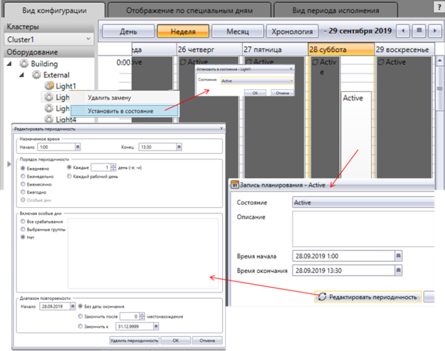

[<- До підрозділу](README.md)

# Підсистема календарного керування у Citect

У Citect підсистема календарного керування ґрунтується на механізмі ієрархії устатковання (Equipment), що описаний у параграфі 9.2.3. Для устатковання повинні бути зконфігуровані ***Стани*** (Equipment States), у властивостях яких вказано що саме необхідно робити при активації та активності цього Стану. Для устатковання, яке повинно керуватися з планувальника, має бути виставлена в TRUE властивість "Заплановано" (Scheduled). 

Для реалізації графічного інтерфейсу на одній із дисплейних сторінок необхідно розмістити ActiveX компонент "Scheduler" (рос. лок. "Планировщик"), який є на палітрі компонентів Citect. Він не потребує конфігурування в середовищі розроблення, це може знадобитися хіба що для прив’язки певних властивостей до змінних. Уся діяльність налаштовується у Планувальнику в режимі виконання (рис. 8.52). На ньому доступні кілька вкладок, які дають можливість налаштовувати календарний план (у вигляді дня, тижня, місяця, хронології), контролювати кінцевий стан планування. Можна також добавляти спеціальні дні в календарі, для яких можна окремо конфігурувати поведінку устатковання.

У дереві відображається все доступне для планування устаткування (що має властивість Scheduled=TRUE). При виділенні устатковання, у календарному плані можна подивитися, встановити та змінити дату й час переходу на конкретний стан. 

Устатковання може перебувати в різних режимах, які відображаються відповідним символом:

- автоматичний (automatic) – режим, в якому стан задається планувальником відповідно до означеного календарного плану;

- заміщення (Override), також називається ручним, – коли станом керує оператор через контекстне меню. 

У контекстному меню устатковання є відповідні команди переходу в режим та в стан (у режимі Override). Перехід у режим та стан доступний також через функцію Cicode "EquipSetProperty". Функція "EquipGetProperty" дає можливість отримати активний режим та стан.

У Citect стани та режими поширюються вниз за ієрархією. Це значить, що устатковання нижчого рівня переходить в той самий стан та режим, що й вищий. Поширення стану справедливе тільки у випадку, якщо устатковання, нижче за ієрархією, не вказане в календарному плані на цей час або пріоритет його стану нижче за пріоритет батьківського. Дочірні елементи можна переводити в режим незалежно.

 

*Рис. 8.52.* Зовнішній вигляд планувальника в Citect

Для устатковання, яке необхідно використовувати в підсистемі календарного планування, необхідно вказати перелік Станів, для кожного з яких треба зазначити (рис. 8.53):

- дію при вході в стан (Entry Action, рос.лок "Действие ввода") – дія, яка буде виконуватися в момент переходу в цей Стан; 

- затримку (Delay, рос. лок. "Задержка") – час, який повинен пройти після активації стану до виконання дії; це може знадобитися тоді, коли прийшов час на активацію кількох одиниць устатковання і треба уникнути одночасності, наприклад для зменшення сплесків струмів при вмиканні кількох двигунів;

- повторювана дія (Repeat Action, рос. лок. "Действие повтора") – дія, яка буде повторюватися з указаним періодом при активності стану; 

- період (Period) – час, через який буде виконуватися повторювана дія;

- пріоритет (Priority) – число, що вказує пріоритет стану, якщо кілька станів виникають одночасно (при поширенні станів);

- Режим DR (DR Mode) дає можливість задати кілька станів з різними діями на основі вибраного режиму споживання (Demand and Response); можна змінювати також через функцію EquipSetProperty.  

 

*Рис. 8.53.* Налаштування устатковання та Станів для нього. 

Теоретичне заняття розробив [Олександр Пупена](https://github.com/pupenasan). 