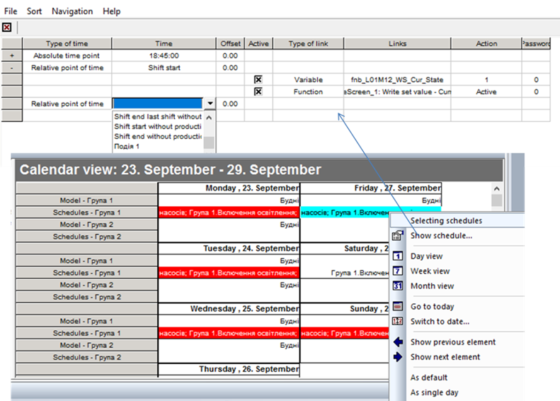

[<- До підрозділу](README.md)

# Підсистема календарного керування у zenon

У SCADA zenon підсистема календарного планування представлена двома модулями: 

- Scheduler – іде в стандартній редакції; 

- PFS (Production and Facility Scheduler) – є розширенням, замінює стандартний Scheduler, якщо наявна ліцензія. 

PFS є поліпшеною версією Scheduler. Тобто у нього наявні усі функції Scheduler та додаткові, зокрема:

- зазначення планових годин відносно початку та кінця змін, перерв та ін.;

- події, означені користувачем.

Тобто прив’язку дій (записування значення змінних або запуск функцій) можна робити не тільки до абсолютного часу, а й до вказаної події. Далі розглянемо основні функції PFS.

PFS можна конфігурувати як у середовищі розроблення, так і в середовищі виконання. Для того щоб при перенесенні налаштування PFS середовища розроблення не замінювали існуючі в середовищі виконання, необхідно в налаштуваннях проекту "Runtime Changeable Date" для параметра "Scheduler" поставити значення "Do not generate and transfer" (не генерувати і не переносити). SCADA zenon також дає змогу переносити налаштування PFS із середовища виконання в середовище розроблення.

Розглянемо, яким чином проводиться конфігурування в середовищі розроблення (рис. 8.54). У PFS календарні плани групуються за часовими інтервалами. Це дає можливість конфігурувати короткострокові плани (на добу) або відносно певної події, які пізніше можна добавляти до календаря. Кожна група часової моделі (time model group) включає календарні плани (Schedule) та часові моделі (Time models). 

Календарний план (Schedule) включає в себе перелік функцій та змінних, які в ньому використовуються, а також перелік дій, які відбуваються при активності плану. Наприклад, план "Включення насосів" включає три змінні та три функції, які можна використовувати в ньому. Дії задаються в часових точках (time), які можуть задаватися як в абсолютних одиницях часу (absolute point of time), так і відносно певної події (relative point of time). Подіями можуть бути:

- Start of cycle – щодня опівночі; Start of cycle without production – щодня опівночі, якщо не активна жодна зі змін або коли закінчуються усі зміни; Start of cycle with production - щодня опівночі, якщо активна хоча б одна зі змін;

- Begin of production – початок зміни, якщо до цього не було активної жодної зміни; End of production – кінець останньої зміни, якщо після цього не буде активною жодна зміна;

- Shift start – початок зміни; Shift end – кінець зміни;

- Start of break – початок перерви в зміні; End of break – кінець перерви в зміні;

- User-defined event – початок вказаної події користувача;

- інші. 

Параметр Offset задає зміщення в часі відносно події. Дії задаються точками перемикання (switching point). 

 

*Рис. 8.54.* Налаштування планувальника в PFS 

Об’єкт часової моделі (time model) включає означення змін (Shift) та перерв (Break), що потребуються для відповідних відносних подій у цій групі. Наприклад, на рис. 8.54 означено дві часові моделі: "Будні" та "Вихідні", для кожної з яких вказані зміни, а в межах змін є перерви. Початок та кінець змін та перерв можна використовувати в якості відносної точки події, як це описано раніше. 

Окрім стандартних подій, можна задавати користувацькі (User events), які можна викликати функцією "Execute PFS event". Користувацькі події задаються для всього планувальника.

Абсолютні та відносні часові точки, що означені в календарному плані, не мають фактичного відношення до конкретних днів календаря, оскільки для них означені лише часові налаштування. Календар дає змогу користувачам вказати, в які дні повинен бути виконаний певний календарний план. З цією метою користувачі можуть виділяти активну модель та активні календарні плани на кожен день, для кожної з перелічених груп моделей. Календар пропонує різні види, які можна вибрати відповідно до рівня деталізації, необхідної для інформації (рис. 8.55). Також zenon дає можливість налаштувати кольор залежно від стану та типу календарного плану. 

 

*Рис. 8.55.* Відображення календаря в PFS 

Для роботи з календарним планом у середовищі виконання, необхідно створити екран типу "Production & Facility Scheduler". Налаштування календарного плану проводиться так само як у середовищі розроблення. 

Теоретичне заняття розробив [Олександр Пупена](https://github.com/pupenasan). 