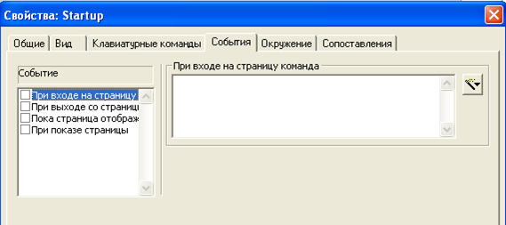
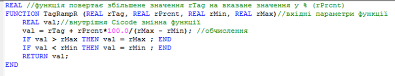

# Citect Cicode

У Citect левова частка анімації та деякі функції серверного оброблення для середовища виконання реалізовані через вирази та команди, написані в форматі вбудованої мови програмування Cicode. 

***Cicode*** – це повноцінна мова програмування, яка має можливості роботи з власними змінними, підтримує умовні оператори, оператори циклів, багатопоточність та багато чого іншого. Cicode надає прямий доступ до тегів (змінних тегів, трендів, тривог) через їх назву. 

***Cicode вирази*** (Cicode expressions) – це вирази, написані мовою Cicode, результатом виконання яких є певне значення, що може бути використане при анімації. Виразом може бути проста змінна чи константа або рядок з арифметичними, логічними операціями чи конкатенацією. 

***Cicode команди*** (Cicode commands) – це інструкція або набір інструкцій (операторів) для виконання, написаних мовою Cicode. Інструкції розділяються крапкою з комою і можуть викликати функції та змінювати значення змінних. Cicode команди можуть викликатися певними діями операторів (кліками миші чи натисканням клавіші при відкриванні/закриванні/відображенні сторінок (рис. 1), при спрацюванні/відключенні тривоги, при формуванні звіту, при реєстрації користувача в системі. Також Cicode команди можна запускати з кожним перерахунком сторінки, помістивши на неї елемент "Объект Cicode". 

                               

*Рис. 1* Налаштування команд на різні події на сторінці

У виразах та командах мови Cicode доступні операнди для таких операцій:

- арифметичні операції: "+" (додавання), "-" (віднімання), "/" (ділення), "*" (множення), "MOD" (остача від ділення);

- логічні операції: "AND", "OR", "NOT";

- побітові логічні операції: "BITAND", "BITOR", "BITXOR";

- операції порівняння: ">" , "<", "=", "<>", ">=", "<=";

- конкатенація: "+" (з'єднання двох рядків типу STRING).

У Cicode-виразах та командах доступний виклик функцій, які можуть бути вбудованими в систему, або написані власноруч за допомогою редактору Cicode. Власні функції Cicode потрібні у тому випадку, коли необхідно створити багаторазово викликуваний код з передачею параметрів, або коли необхідний набір інструкцій, що не може вміститися в полі введення команди Cicode. Вони створюються у файлах Cicode (приклад функції приведений на рис. 2).

 

*Рис. 2.* Приклад функції Cicode

Функціональність Citect багато в чому побудована на базі Cicode функцій, які надають гнучкості цій SCADA-програмі. Деяка частина функцій доступна у включених проектах та створена для реалізації вибраного стилю. Ці функції доступні для перегляду та зміни у відповідних файлах через редактор Cicode. Інші функції є системними (нативними) і є частиною API (програмного інтерфейсу). Усі системні функції поділені на категорії для зручності доступу до їх опису в довідковій системі. 

Починаючи з Citect 2016, з’явився новий тип драйвера з ім'ям Cicode, для тегів якого у полі адреси вказується вирази Cicode, що дає можливість створювати обраховувані змінні. 

Альтернативою мові Cicode в Citect є вбудована мова VBA (Visual Basic for Application).