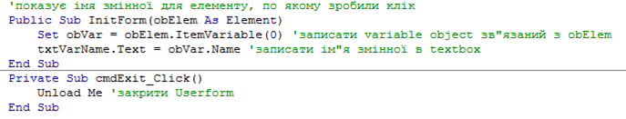

[<- До підрозділу](README.md)

# VBA у zenon

У SCADA zenon є кілька підтримуваних мов та редакторів: VBA та VSTA (C# або VB.NET). Вони можуть використовуватися як для середовища виконання, так і для середовища розроблення. Останні використовуються для автоматизації процесу створення проекту. Наприклад, майстри імпорту текстів перекладів реалізовані саме з використанням таких макросів.

Редактор VBA є повноцінним редактором від Microsoft, який нічим не відрізняється від того, який є частиною MS Office. Він інтегрується з SCADA zenon через інтерфейс OLE Automation. Для використання у своєму проекті люди, які мають навички роботи з VBA, повинні ознайомитися з бібліотекою zenon. Виклик процедур та функцій VBA можуть відбуватися за різними подіями елементів на екранах ЛМІ або інших об’єктів. На рис. 1 показано приклад процедур VBA для відображення прив’язаної до об’єкта змінної.

 

*Рис. 1.* Приклад коду в VBA

У SCADA zenon практично вся діяльність відбувається без використання мов програмування. Більшість проектів можна зробити, не написавши жодного рядка коду. Однак при необхідності інтегрування додаткових функцій, наприклад для складного оброблення даних та взаємодії з базами даних може знадобитися VBA або VSTA. 

Теоретичне заняття розробив [Олександр Пупена](https://github.com/pupenasan). 
