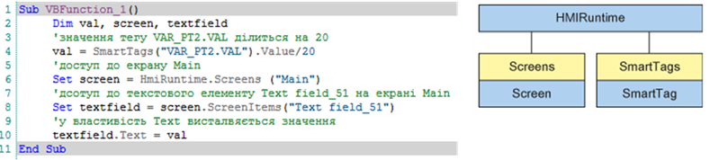

[<- До підрозділу](README.md)

# VBScript у WinCC Comfort

У WinCC Comfort у якості скриптової мови для середовища виконання використовується VBScript. Власні функції та процедури VBScript можуть викликатися через певні події об’єктів (Events). Це можуть бути події планувальника, елемента на екрані, тривоги тощо. Доступ до інших підсистем середовища виконання відбувається через спеціальні об’єкти. Наприклад, "HmiRuntime" надає доступ до екранів та тегів (рис.1). 

 

*Рис. 1* Приклад коду в VBScript (ліворуч) та об’єкт HMIRunntime (праворуч) у WinCC Comfort

VBScript підтримує функцію CreateObject, яка надає доступ через інтерфейс OLEAutomation до зареєстрованих у системі бібліотек. Це суттєво розширює можливості операторських панелей, оскільки дає можливість користуватися ресурсами Windows CE.

Теоретичне заняття розробив [Олександр Пупена](https://github.com/pupenasan). 