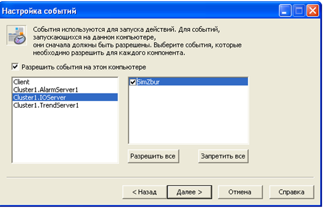

# 8.2.1. Підсистема генерування подій у Citect 

У Citect усі події означуються в однойменному розділі (Events, События). Дія означується Cicode командою за виконанням певної умови або періодичності виконання. Події створюються в редакторі проекту "Система->События". Для події вказується ім’я (рис. 1), періодичність та час, відносно якого проводиться синхронізація періодичності (рос. лок."Время"). Якщо період не вказаний, він приймається рівним 1 с. 

             

*Рис. 1* Налаштування властивостей події

Тригер вказує на умову, яка запускає виконання дії. Якщо тригер не вказаний, то дія буде виконуватися з періодичністю, означеною полями "Время" і "Перио­дичность". Якщо тригер вказаний, але не вказані поля "Время" і "Периодичность", то дія буде виконуватися по передньому фронту спрацювання тригера.

Події можуть виконуватися в контексті будь-якого процесу Citect, чи то сервері, чи клієнті або в усіх. Місце виконання подій налаштовуються в майстрі налаштування комп’ютера (рис. 2). Події з ім'ям "GLOBAL" виконуються на всіх комп’ютерах у системі Citect. 

 

*Рис. 2.* Налаштування виконання події на різних частинах системи Citect