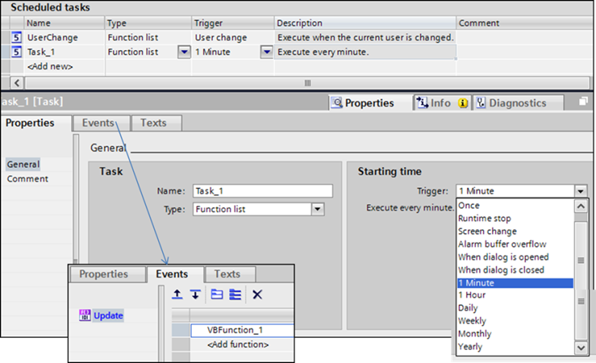
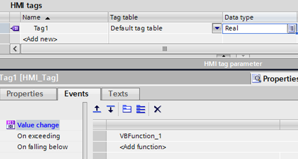

# Підсистема генерування подій у WinCC Comfort

У WinCC Comfort події можна генерувати використовуючи планувальник задач (Scheduled tasks) (рис. 1). Планувальник у цій редакції WinCC передбачає в якості тригеру вказівку (вибір) тільки системних подій. Функція, яка повинна виконуватися при спрацюванні тригера, вказується на вкладці Events.

Для генерування періодичних подій можна вибрати один із існуючих тригерів: 1 Minute, 1 Hour і т. д. Якщо необхідно генерувати події з іншою періодичністю можна використовувати теги з ПЛК, які будуть змінюватися із зазначеною періодичністю. Для цього для вказаного тегу у властивості Events->Value change необхідно вказати функцію, яка буде викликатися (рис. 2). Аналогічно можна викликати події, пов’язані з іншими тригерами, перевіряючи їх при зміні значення. 

 

*Рис.1* Налаштування подій через Scheduled tasks 

 

*Рис. 2.* Налаштування обробників подій для тегів 