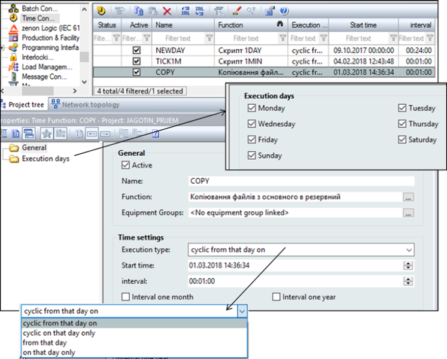

[<- До підрозділу](README.md)

# Підсистема генерування подій у SCADA zenon 

У SCADA zenon генерування подій за часом проводиться з використанням функцій Time Control. Для кожної часової функції задається час, відносно якого генерується виклик функції, періодичність (один раз, періодично з указаного часу, періодично в зазначений день), період, а також функція zenon, яка буде викликатися (рис. 1). Можна також задати дні тижня, в які виконуватиметься вказана функція. 

 

*Рис. 1.* Налаштування часових функцій у zenon

Генерування подій за тригером, що формується в результаті зміни, значення задається в налаштуваннях змінної через границі або матрицю реакцій, де в полі Function задається необхідна функція, яка буде викликатися при спрацюванні. 

Теоретичне заняття розробив [Олександр Пупена](https://github.com/pupenasan). 