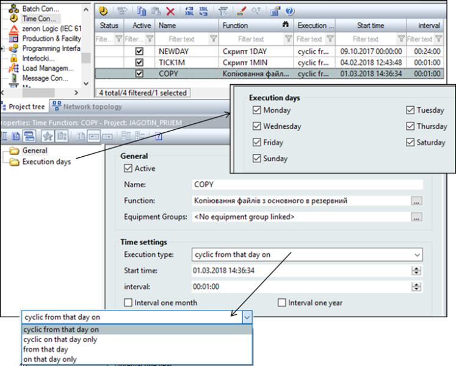

[<- До підрозділу](README.md)	[SCADA zenon](../zenon.md)		[Коментувати](#feedback)

# Підсистема генерування подій у SCADA zenon : теоретична частина 

У SCADA zenon генерування подій за часом проводиться з використанням функцій Time Control. Для кожної часової функції задається час, відносно якого генерується виклик функції, періодичність (один раз, періодично з указаного часу, періодично в зазначений день), період, а також функція zenon, яка буде викликатися (рис. 1). Можна також задати дні тижня, в які виконуватиметься вказана функція. 

 

*Рис. 1.* Налаштування часових функцій у zenon

Генерування подій за тригером, що формується в результаті зміни, значення задається в налаштуваннях змінної через границі або матрицю реакцій, де в полі Function задається необхідна функція, яка буде викликатися при спрацюванні. 

## Автори

Теоретичне заняття розробив [Олександр Пупена](https://github.com/pupenasan). 

## Feedback

Якщо Ви хочете залишити коментар у Вас є наступні варіанти:

- [Обговорення у WhatsApp](https://chat.whatsapp.com/BRbPAQrE1s7BwCLtNtMoqN)
- [Обговорення в Телеграм](https://t.me/+GA2smCKs5QU1MWMy)
- [Група у Фейсбуці](https://www.facebook.com/groups/asu.in.ua)

Про проект і можливість допомогти проекту написано [тут](https://asu-in-ua.github.io/atpv/)