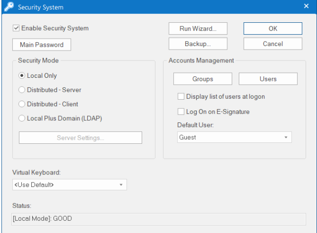
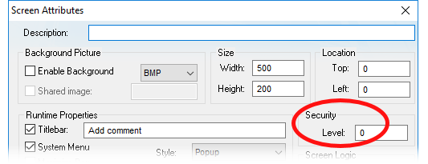
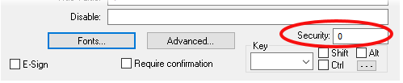
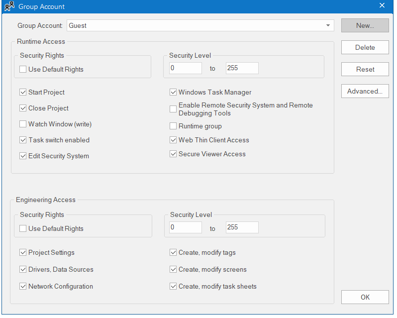
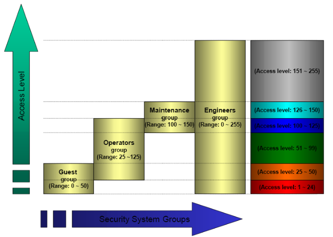
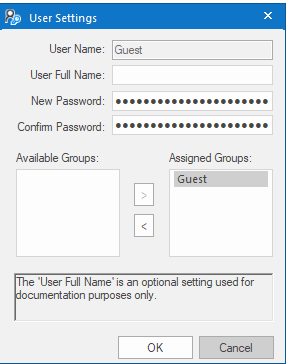
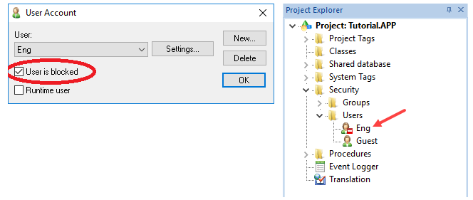
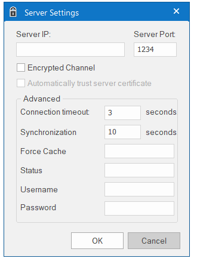

[<- До підрозділу](README.md)

# Підсистема керування доступом у Aveva Edge

## Організація контролю доступу

Контроль доступу базується на рівнях доступу, користувачах та групах. Активується система безпеки відповідною опцією в налаштуваннях (рис.1)

рис.1. Налаштування системи безпеки

Рівні доступу назначаються як в середовищі виконання так і розроблення.  Майже всім елементам проекту може бути присвоєно рівень доступу від 0 до 255. На рис.2 показане вікно налаштування рівня для екрану, а на рис.3 до елементу керування. Цей рівень доступу означає, що групи в яких означений цей рівень можуть редагувати елемент в середовищі розроблення та мати доступ до нього в середовищі виконання. 0-й рівень доступу вказує що будь хто має доступ до цього об'єкту.

рис.2. Налаштування рівня доступу до екрану

рис.3. Налаштування рівня доступу до елементів керування

Також виставивши опцію E-sign можна змусити користувача повторно ввести свої облікові дані при спробі керування. 

При створенні проекту автоматично створюється група Guest. Для кожної новостворюваної групи користувачів означується (рис.4):

- діапазони рівнів доступу для середовища виконання (Runime Access) та середовища розроблення (Engeenering Access)
- можливості в режимі виконання:
  - запуску та зупинки проекту в середовищі виконання
  - користуватися вікном Watch
  - переключатися на інші екрани в середовищі Windows
  - вносити зміни в систему захисту в режимі виконання
  - натискати Ctrl+Alt+Del на клавіатурі для доступу до диспетчера завдань (Windows Task Manager) та інших функцій; якщо цей параметр вимкнено тонкого клієнта при віддаленому доступі треба запускати від імені адміністратора (бажано щоб це був інший користувач відрізнявся від користувача що входить через тонкий клієнт) 
  - віддаленого налагодження та адміністрування (Enable Remote Security System and Remote Debugging Tools) 
    - налаштувати систему безпеки з іншого проекту (див. нижче)
    - конфігурувати налаштування TCP/IP в іншому проекті, щоб підключити його до поточного проекту; 
    - використовуйте інструменти Watch і LogWin для налагодження проекту під час його роботи на віддаленій станції
  - створення користувача в групі в режимі середовища виконання (Runtime Group)
  - використовувати Web Thin Client для підключення до сервера виконання проекту (Web Thin Client Access ), ця опція не впливає на можливість користувача використовувати Mobile Access. 
  - використовувати Secure Viewer для підключення до сервера виконання проекту, ця опція не впливає на можливість користувача використовувати Mobile Access. 
- можливості в середовищі розроблення:
  - налаштовувати проект (Project Settings) 
  - налаштовувати драйвери та зовнішні ресурси (Drivers, Data Sources)
  - налаштовувати TCP/IP Client (Network Configuration )
  - створювати та налаштовувати теги (Create, modify tags )
  - створювати та налаштовувати екрани (Create, modify screens)
  - створювати та налаштовувати задачі (Create, modify task  sheets) 

рис.4. Налаштування групи користувачів 

Визначивши діапазон рівнів доступу для конкретної групи можна налаштовувати права для користувачів в цих групах, як наприклад показано на рис.5

  

рис.5. Приклад назначення рівнів доступу різним групам користувачів 

У налаштуваннях Group Account Advanced можна вказати:

-  вимоги до паролів, період таймаутів для E-signature та ігнорування для даної групи вимоги електронного підпису для будь-яких об’єктів екрана (автопідпис), для яких вибрано параметр E-Sign, і для будь-яких сценаріїв, які викликають функцію CheckESign
- параметри автоматичного виходу користувача з сесії та тимчасового блокування можливості введення після кількох невдалих спроб

Після створення груп створюються користувачі (рис.6) для яких вказується пароль та необхідні групи, в яких вони знаходяться (можна декілька). Для ко 

рис.6. Створення нових користувачів

Користувача можна заблокувати/розблокувати за необхідності, вибравши його у відповідному розділі проекту (рис.7)  

рис.7. Блокування користувача

Використовуючи механізм імпорту та експорту (кнопка Backup у вікні керування системою безпеки рис.1) можна імпортувати чи експортувати конфігурацію безпеки.

## Режими роботи системи безпеки

Користувачі та групи зберігаються та поширюються в системі в залежності від означеного режиму системи безпеки. Можна налаштувати групи та користувачів локально в проекті або отримати попередньо означені групи та користувачів з іншого проекту чи сервера домену, в залежності від вибраного режиму: 

- Local Only: стандартний режим для більшості проектів, в якому групи та користувачі означені в проекті і дійсні лише в ньому 
- Distributed: коли користувачі, групи та їх налаштування єдині для усіх проектів в мережі, які зберігаються на серверному проекті. Для такої системи організації керування доступом в мережі є пристрій з проектом що має роль Distributed – Server та кілька що мають роль Distributed – Client. Клієнтські станції копіюють всю конфігурацію системи безпеки з серверного проекту. 
  - Distributed – Server. Конфігурування системи безпеки на сервері відбувається аналогічно, як для режиму Local Only за винятком виставленої опції Distributed – Server. Він видає налаштування системи безпеки усім клієнтам, що підключаються до нього з використанням логіна користувача, що має відповідні права (Enable Remote Security System and Remote Debugging  Tools).  Якщо серверний проект з якоїсь причини втрачає конфігурацію системи безпеки, він може повторно імпортувати цю конфігурацію з кеша одного зі своїх клієнтських проектів.
  - Distributed – Client.  Для клієнтського проекту необхідно вказати  звідки брати ці налаштування (рис.8), необхідність захищеного з'єднання, користувача та пароль з використанням якого буде відбуватися підключення (він має мати права Enable Remote Security System and Remote Debugging Tools). Клієнтський проект кешує отриману конфігурацію та може продовжувати працювати, навіть якщо він втрачає зв’язок із серверним проектом. Статус системи безпеки можна контролювати через вказану змінну.

рис.8. Налаштування режиму Distributed – Client.

- Local Plus Domain (LDAP). Цей режим поєднує можливість конфігурації Local Only з функціями Lightweight  Directory Access Protocol  (LDAP), який є визнаним стандартом для керування групами та користувачами в багатьох різних програмах у мережі типу домен. До LDAP-сумісних доменних серверів відносяться Microsoft Active Directory для Windows та OpenLDAP для Linux. У цьому режимі можна налаштувати систему безпеки проекту що поєднує як локально створені, так і керованих мережею груп і користувачів. Можна також зберегти цю конфігурацію на сервері домену, щоб поділитися нею з іншими проектами в тій же мережі.

## Керування в режимі виконання

У середовищі виконання доступні вбудовані функції, які дають можливість керувати системою доступу: 

- CheckESign - для виклику вікна електронного підпису, наприклад щоб підтвердити запуск скрипта тільки авторизованому користувачу  
- CheckSecurityLevel - перевірка рівня доступу для активного користувача
- BlockUser, UnblockUser - блокування та розблокування користувача
- CreateUser - створення користувача
- RemoveUser - видалення користувача
- SetPassword - встановлення паролю для користувача
- SetUserGroup - встановлення групи для користувача
- ExportSecuritySystem - експорт налаштувань системи доступу
- ImportSecuritySystem - імпорт налаштувань системи доступу
- GetLastESignUser - отримання імені останнього користувача, хто робив електронний підпис
- GetSecuritySystemStatus - отримання стану системи керування доступом
- GetUserFullName - отримання повного імені користувача 
- GetUserNames - отримання списку користувачів, що задовольняють вказаним правилам 
- GetUserPwdAging - отримання часу до закінчення часу дії паролю 
- GetUserState - отримання стану користувача

Теоретичне заняття розробив [Олександр Пупена](https://github.com/pupenasan). 