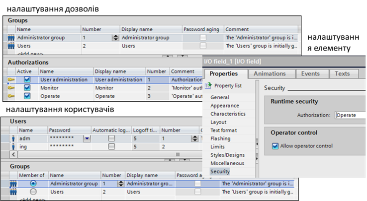
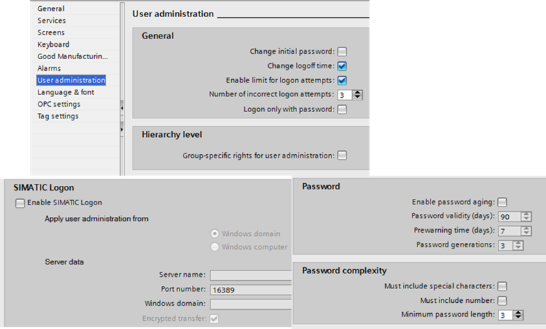
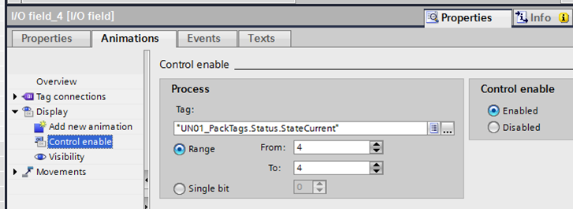

[<- До підрозділу](README.md)

# Підсистема керування доступом у WinCC Comfort

У WinCC Comfort обмеження доступу реалізовані через авторизацію (дозволи, Authorization), які створюються в середовищі розроблення і надаються групам користувачів. Так, наприклад у "Administrator group" є усі три означені в проекті дозволи (рис. 8.66). Користувач назначається в групі і відповідно отримує ці дозволи. Для зручності дозволи, окрім номера, мають ім’я, через яке для елемента назначаються права, якими повинен володіти користувач, щоб змінювати значення. Якщо в користувача не буде такого дозволу, автоматично з’явиться вікно входу в систему. 

 

*Рис. 8.66.* Налаштування користувачів

Користувач може бути створений не тільки в середовищі розроблення, а й у середовищі виконання (через компонент User View). Три дозволи та дві групи в проекті є наперед сконфігурованими і не можуть бути видалені. Користувачі з групи "Administrator group" мають права на редагування інших користувачів у середовищі виконання.

У налаштуваннях проекту "Runtime Settings" є загальні налаштування адміністрування "User Administration" (рис. 8.67). Зокрема, там можна задати: необхідність змінювати пароль при першому вході в систему (Change initial password); можливість змінювати звичайним користувачам час, після якого відбувається автоматичний вихід їх із системи (Change logoff time); максимальна кількість спроб невдалого введення паролю, після якого користувач переходить у "неавторизовані"; введення тільки за паролем (Logon only with password), коли ім’я користувача вказувати не потрібно (усі паролі мають бути унікальні); налаштування ієрархічності груп (Group-specific rights for user administration), коли адміністратор може керувати користувачами тільки тих груп, в яких номер менший за їх групу; налаштування "старіння" паролю (Enable password aging); налаштування складності паролю (Password complexity). 

 

*Рис. 8.67.* Загальні налаштування адміністрування користувачів 

Альтернативою реєстрації користувачів у самій виконавчій системі WinCC RT є використання сервісів SIMATIC Logon (окреме ПЗ, що потребує додаткового ліцензування). При цьому дозволи та групи користувачів налаштовуються в проекті, але адміністрування та реєстрація самих користувачів відбувається через сервіси SIMATIC Logon. Користувачі, що входять до певної SIMATIC Logon групи, будуть мати такі права, які означені в однойменній групі користувачів WinCC. Для детального ознайомлення з налаштуванням SIMATIC Logon зверніться до технічної документації. 

Блокування доступу у WinCC Comfort реалізовується через спеціальну анімацію “Control Enable” (рис. 8.68). 

 

*Рис. 8.68.* Налаштування блокування доступу у WinCC Comfort

Теоретичне заняття розробив [Олександр Пупена](https://github.com/pupenasan). 