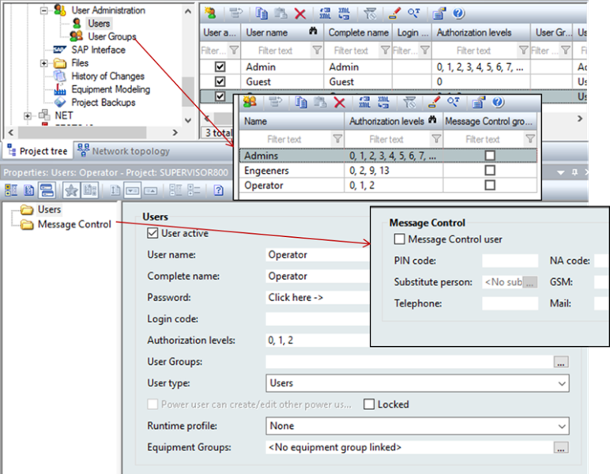
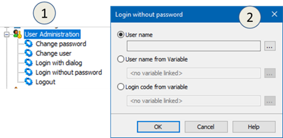
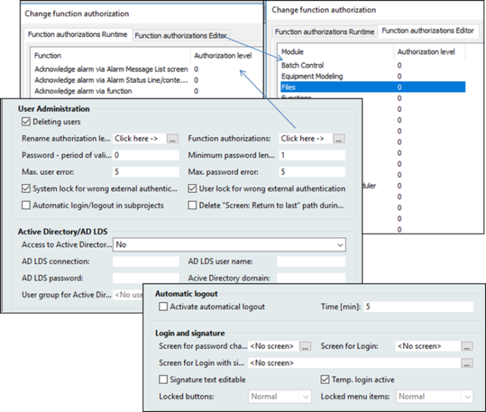
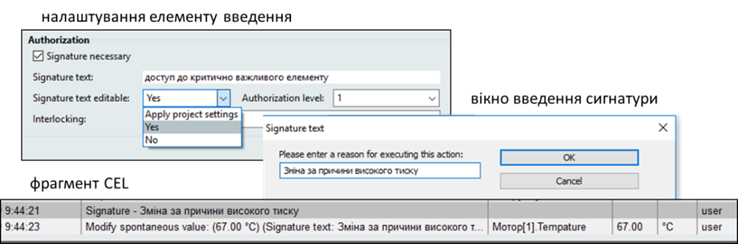
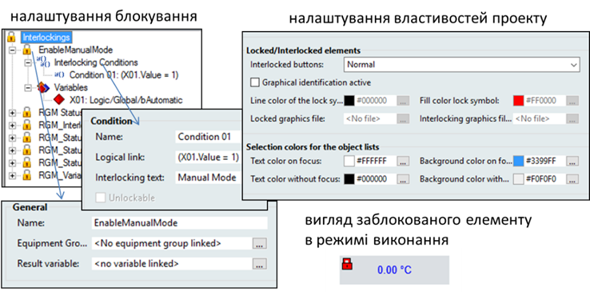

# Підсистема керування доступом у SCADA zenon

У SCADA zenon керування доступом реалізоване як для об’єктів середовища виконання, так і для функцій середовища розроблення. Права доступу останніх конфігуруються в середовищі розроблення, а адміністрування користувачів можна робити як у середовищі розроблення, так і в середовищі виконання. У SCADA zenon використовується поняття "користувач". 

Для того щоб при перенесенні налаштування користувачів середовища розроблення не замінювали існуючі в середовищі виконання, необхідно в налаштуваннях проекту "Runtime Changeable Date" для параметра "User Administration" поставити значення "Do not generate and transfer" (не генерувати і не переносити). SCADA zenon дає змогу переносити налаштування "User Administration" із середовища виконання в середовище розроблення. 

Користувач може входити через zenon або через Windows Active Directory (***AD***). 

Концепція адміністрування передбачає, що різні користувачі мають різні операційні права (рівні дозволів та функційні дозволи). Кожному користувачеві може бути призначено кілька різних рівнів дозволів (авторизаційних рівнів, authorization level), що мають значення від 0 до 127 (рис. 8.61). Незареєстрований у системі користувач має 0-й рівень дозволів. Користувачам можна присвоїти кілька рівнів дозволів, видавати їх можуть тільки адміністратори, які також мають доступ до цих рівнів. 

Крім рівнів дозволів, користувачам надається один із трьох типів (User Type на рис. 8.61):

- User (користувач): можуть здійснювати дії відповідно до рівнів дозволів, які йому призначені; 

- Power user (досвідчений користувач): може також створювати та редагувати користувачів; 

- Administrator (адміністратор): може також проводити інші адміністративні задачі, такі як відміна блокування користувача, скидування паролю, і т.ін. 

Код входу (Login code) дозволяє входити користувачеві через функцію “Login without password” (описано нижче). Налаштування рівнів дозволів можна проводити через групи (Users Group), куди потім можна добавляти користувачів, які будуть отримувати ті самі дозволи. Користувачі Windows, що входять до груп Windows AD з тією самою назвою, що й Users Group zenon, матимуть такі права, як у групи. 

 

*Рис. 8.61.* Налаштування користувачів в zenon

Для адміністрування користувачів у середовищі виконання можна скористатися функціями та екранами. Доступні такі спеціальні типи екранів: 

- User list: надає функції редагування, як у середовищі розроблення з розділу Users;

- User group list: надає функції редагування, як у середовищі розроблення з розділу User groups;

- Edit user: дозволяє редагувати користувачів zenon; 

- Active Directory user administration: дозволяє редагувати користувачів Windows Active Directory .

SCADA zenon, підтримує ряд функцій роботи з користувачами (рис. 8.62,1):

- Login with dialog: відкриває діалог для реєстрації;

- Login without password: дозволяє зареєструвати користувача без діалогу; 

- Logout: вихід активного користувача, надається рівень дозволів 0; 

- Change user: відкриває діалог редагування користувачів та груп;

- Change password: відкриває діалог зміни пароля.

Використовуючи функцію “Login without password”, можна під час виконання увійти в систему користувачу без введення паролю у форму. Це необхідно в тому випадку, якщо ідентифікація відбувається через якісь спеціальні засоби, наприклад, чіп, сканер, пристрій зчитування карт і т.п, або за виконанням якоїсь події. Вхід через автоматичні засоби реєстрації у zenon може проводитися через передачу коду входу змінною "Login code from variable" або імені користувача через змінну "User name from Variable" (рис. 8.62,2). У першому випадку (ця версія доступна лише для користувачів zenon) реєстрація відбувається шляхом передачі змінною коду користувача "Login code" (див. рис. 8.61). Код користувача повинен бути унікальним у проекті, так як по ньому йде його ідентифікація. У другому випадку (доступно для користувачів zenon та Active Directory) реєстрація відбувається через систему ідентифікації чіпу (типу Eucher або Keba), в якій ім'я користувача передається змінною. Слід зазначити, що ці змінні, які містять ім’я користувача можуть зчитуватися через вбудовані драйвери zenon (Eucher, Keba). У цьому випадку можна налаштувати матрицю реакції, яка при зміні змінної викличе функцію “Login without password” 

 

*Рис. 8.62.* Перелік функцій (1) та налаштування функції входу без пароля (2) 

Користувачі реєструються в системі (автентифікація) з використанням функцій та екранів реєстрації. Якщо необхідно входити автоматично на основі подій, використовується функція "Login without password". Якщо в користувача немає прав для доступу до захищеного елемента і активна опція "Temp. login active" (рис. 8.63), дозволяється тимчасова, на час введення, реєстрація (через вікно). 

Може бути налаштована опція, при якій відсутність активності протягом визначеного періоду часу приведе до автоматичного виходу користувача ("Automatic Logout"; див. рис. 8.63). Для виходу можна також скористатися функцією logout. 

У властивостях проекту "User Administration" задаються додаткові параметри (див. рис. 8.63). Зокрема, там налаштовується доступ до функцій середовища виконання (Function authorizations Runtime) та середовища розроблення (Function authorizations Editor). 0-й рівень дозволів означає, що доступ не обмежений. При налаштуванні обмежень для функцій середовища розроблення, при повторній активації проекту для редагування він буде вимагати авторизації. Якщо користувач не матиме необхідних прав, меню керування модуля будуть недоступні. 

 

*Рис. 8.63.* Властивості проекту "User Administration" 

Окрім означення рівнів дозволів користувача для виконання певних функцій середовища виконання, zenon можна означити права на зміну значення або введення команд у графічних елементах, а також у меню. Для елементів, що мають обмеження на доступ, є група властивостей “Authorization” (рис. 8.64). Окрім необхідного рівня дозволів, можна означити обов’язковість сигнатури (Signature necessary) – необхідність повторного введення паролю, навіть якщо користувач зареєстрований у системі. При цьому в журналі CEL з’явиться запис із "Signature – signature text", де "signature text" – текст, який введений у однойменну властивість, яку можна змінювати також у режимі виконання (задається властивістю “Signature text editable”). 

 

*Рис. 8.64.* Група властивостей елементу "Authorization" 

Для елементів можна налаштувати блокування (Interlocking) на введення значення. Самі умови блокування налаштовуються в однойменному розділі проекту (рис. 8.65) через формули, в які входять змінні. Якщо умова виконується, блокування стає активним, тобто усі елементи, в яких властивість Interlocking (див. рис. 8.64) прив’язана до цього блокування, не будуть приймати значення чи команди. Крім того, значення блокування можна записати в Result Variable. Зовнішній вигляд заблокованих елементів налаштовується у властивостях проекту (див. рис. 8.63), можна вказати кольори та графічний файл із символом блокування. 

 

*Рис. 8.65.* Налаштування блокування (Interlocking)

Для того щоб користувач не міг перейти на робочий стіл у повноекранному режимі або зробити інші недозволені операції, SCADA zenon дозволяє блокувати системні клавіші. Це робиться у властивостях проекту "Interaction"->"Lock System Keys". Блокуються усі гарячі комбінації клавіш Windows, наведені в параграфі 8.7.2, окрім "Ctrl+Alt+Del" та "Windows key + L". Також можна зборонити усі системні клавіші, використовуючи утиліту, яка поставляється із zenon “Keyblock Runtime Start”. На момент виконання вона блокує ці клавіші в усіх застосунках Winodws. Детальніше про це Ви можете прочитати в довідковій системі zenon. 