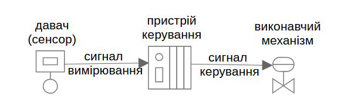
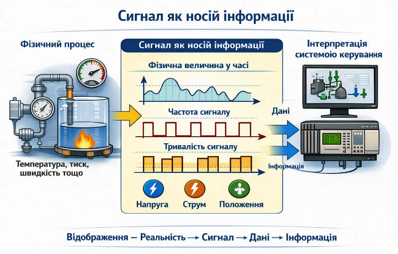
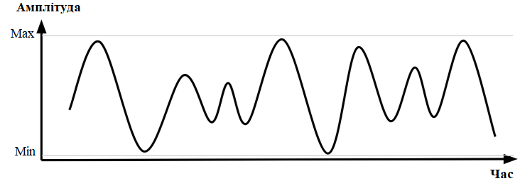
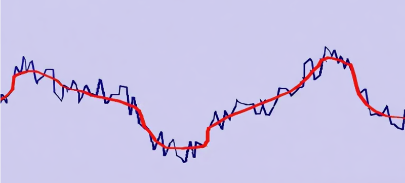
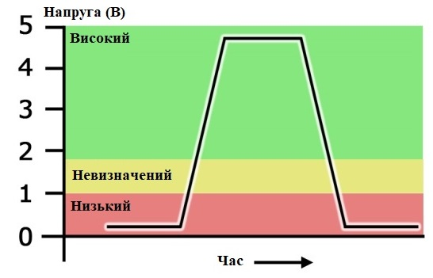
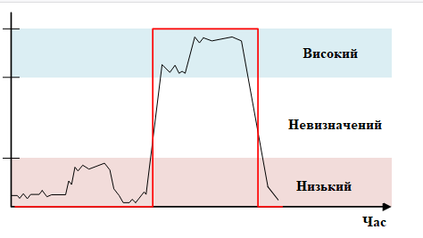
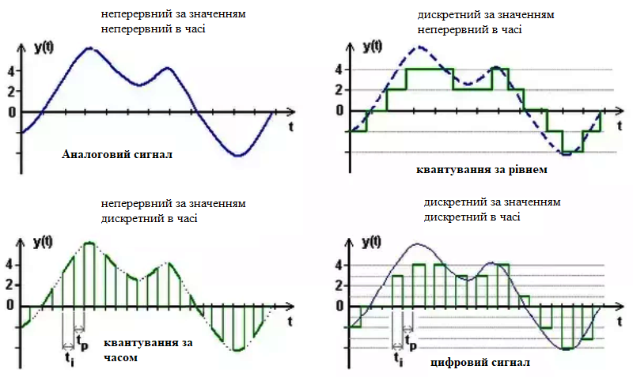
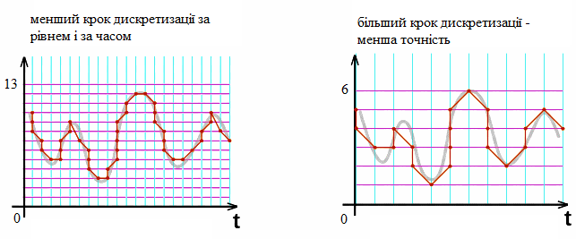
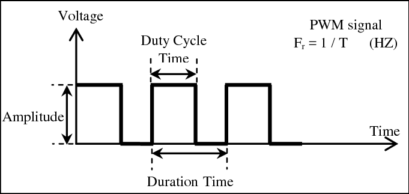
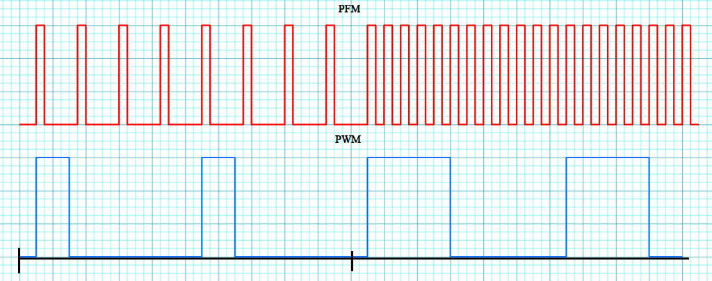

[<- До підрозділу](README.md)		[Коментувати](#feedback)

# Сигнали та їх типи в системах керування: теоретична частина

## 1. Сигнал як носій інформації

### Основні означення

**Сигнал** — це фізична величина, що означується в часі з метою передавання певної інформації. Наприклад, люди спілкуються аудіально, формуючи звукові коливання і передаючи таким чином аудіосигнали іншим людям. У технічних системах така величина формується одними технічними засобами для можливості її сприйняття іншими. Таким чином, сигнал забезпечує інформаційний обмін між частинами єдиної системи, тобто їх узгоджену взаємодію. 

На рис.1 показана типова структура системи керування у типових задачах регулювання, яка включає три компонента: 

- давач (сенсор), який забезпечує формування сигналу вимірювання на основі зміни фізичної змінної процесу, наприклад температури
- пристрій керування, який на основі отриманої інформації з давача про дійсне значення змінної процесу та бажаного значення формує сигнал керування
- виконавчий механізм (наприклад привод з електродвигуном), який впливає на регулювальний орган (наприклад кран) залежно від отриманого сигналу керування   

рис.1. Приклади сигналів в системі керування  

Сигнал передається через певне середовище. У випадку аудіального спілкування таким середовищем є повітря, яке приводиться в коливальний рух голосовими органами людини. У технічних системах, зокрема в системах керування, як середовище передавання найчастіше використовують металеві провідники, також можуть бути оптичні волокна та радіоканали, за допомогою яких з’єднуються різноманітні технічні засоби.

Коли говорять про змінювану фізичну величину, мають на увазі характеристику середовища передавання, за допомогою якої формується сигнал. Так, під час аудіального спілкування між людьми змінюються параметри звукових коливань, зокрема амплітуда та частотний склад. У технічних системах, де середовищем передавання є провідник, найпоширенішими фізичними величинами є напруга, струм, опір тощо. Вибір конкретної фізичної величини визначається застосуванням. Прикладами сигналів у технічних системах є зміна опору провідника, яка спостерігається через вимірювальне коло, залежно від температури або зміна напруги в провіднику залежно від тиску.

**Інформація** — це смисловий зміст, який виникає в результаті інтерпретації сигналу в певному контексті. Один і той самий сигнал може нести різну інформацію залежно від того, що саме він описує, у якому контексті використовується та з якою метою інтерпретується. Наприклад, значення опору провідника може бути інтерпретоване як температура гарячої води 73.2 °C лише за умови, що відома характеристика цього провідника та місце його розташування. За відсутності такого контексту це буде лише значення опору, а не інформація про температуру. 

Якщо звернутися до прикладу аудіального передавання інформації, то людина не може зрозуміти іншу людину, якщо не володіє мовою, якою та говорить, навіть за умови коректного сприйняття всіх звуків. У цьому випадку сигнал сприймається фізично, але інформація не виникає через відсутність правил інтерпретації.

Сьогодні в технічних системах широко застосовуються обчислювальні засоби. Так, наприклад, пристрої керування, що показані на рис. 1, як правило, є спеціалізованими комп’ютерами, які називають програмованими контролерами. Вони працюють на цифровій логіці. У зв’язку з цим доцільно ввести та розглянути ще одне базове поняття – дані. **Дані** – це формалізоване подання результатів спостереження або вимірювання у вигляді, придатному для передавання, зберігання та оброблення обчислювальними засобами. Самі по собі дані не містять смислу і набувають його лише в результаті подальшої інтерпретації в певному контексті. У системах керування дані зазвичай існують у вигляді чисел, кодів або символів, незалежно від фізичної природи сигналу, з якого вони отримані. Таке подання дає змогу виконувати оброблення, порівняння та збереження результатів вимірювань. Прикладами даних є числове значення 73.2, код стану 0 або 1, послідовність бітів у пам’яті комп’ютера.

Якщо в системі керування використовуються обчислювальні засоби, то фізичні сигнали у цифрових пристроях керування не можуть бути безпосередньо використані для формування керувальних рішень. Спочатку ці сигнали мають бути подані у формі, придатній для оброблення обчислювальними засобами. На цьому етапі сигнал перетворюється у дані. Лише після цього, в межах алгоритмів керування, ці дані інтерпретуються в певному контексті і набувають смислу, тобто стають інформацією, на основі якої приймаються рішення. Тому для систем керування з обчислювальними засобами справедливий такий ланцюжок:

фізичний сигнал → дані → інформація

Важливо підкреслити, що це не універсальний закон для всіх можливих систем, а характеристика саме тих систем керування, де застосовується цифрова обробка та програмна логіка. У системах без обчислювальних засобів (наприклад, суто аналогових або механічних) інформація може виникати без проміжного подання у вигляді даних.

### Вхідні та вихідні сигнали

До того як розглядати фізичну природу сигналів та їхні типи, доцільно ввести базовий поділ сигналів за напрямком передавання відносно пристроїв і елементів системи керування.

**Вхідний сигнал** – це сигнал, що надходить до пристрою ззовні і використовується для формування його внутрішнього стану або для прийняття керувальних рішень. Джерелом вхідного сигналу пристроїв керування (див. рис. 1) можуть бути давачі, кнопки, кінцеві вимикачі, інші пристрої автоматизації або зовнішні системи. Для виконавчих механізмів вхідний сигнал, як правило, є сигналом, що задає положення або режим роботи регулювального органу.

**Вихідний сигнал** – це сигнал, що формується пристроєм і передається назовні для впливу на інші елементи системи. Приймачами вихідних сигналів пристроїв керування (див. рис. 1) можуть бути виконавчі механізми, індикатори, реле, частотні перетворювачі або інші керовані пристрої. Давачі за своєю природою формують лише вихідні сигнали, тоді як перетворювачі та пристрої керування зазвичай мають як вхідні, так і вихідні сигнали.

Ключовим є те, що поняття «вхід» і «вихід» є відносними. Один і той самий фізичний сигнал є вихідним для пристрою, який його формує, і вхідним для пристрою, який цей сигнал сприймає. Тому коректніше говорити не про «вхідний» чи «вихідний» сигнал як абсолютну властивість, а про напрямок передавання сигналу між конкретними елементами системи.

### Приклад перетворення при вимірюванні

З точки зору абстракції між фізичним процесом і пристроєм керування або контролю завжди існує послідовність перетворень:

- фізичний процес;
- сигнал як його фізичне відображення;
- дані, отримані в результаті вимірювання (якщо це обчислювальний пристрій);
- інформація, сформована в системі керування або контролю.

Таким чином, сигнал виступає проміжною ланкою між реальним фізичним світом і пристроєм керування.

рис.2. Сигнал як носій інформації (згенеровано ШІ)

Розглянемо послідовність перетворень сигнал → дані → інформація на прикладі. Припустимо виникає потреба вимірювати температуру гарячої води контурі опалення. Для визначення температури можна використати  резистор, електричний опір якого змінюється залежно від температури. Наприклад, при температурі 20 °C його опір становить близько 120 Ω, при 50 °C — близько 135 Ω. У промисловості такі резистори називаються термометрами опору. У процесі роботи температура об’єкта змінюється, і разом із нею змінюється електричний опір термометра відповідно до цієї залежності. Зміна величини опору в часі є фізичною величиною і становить сигнал, який безпосередньо відображає зміну температури об’єкта. 

Цей сигнал фіксується засобами вимірювання, у результаті чого зміна опору подається у формалізованому вигляді. Коли значення опору фіксується у вигляді числового запису, наприклад як `120` або `135`, воно перетворюється на дані. Такі дані можуть бути збережені, передані або оброблені, але без контексту вони ще не дають уявлення про температуру об’єкта. 

Коли ж відомо, що ці числові значення відповідають певній температурі гарячої води в контурі, наприклад 50 °C, і нормальний діапазон температури від 40 °C до 80 °C,  дані набувають смислу і стають інформацією. У цьому випадку стає можливим зробити висновок про поточну температуру об’єкта та оцінити його стан.

### Приклад перетворення при керуванні

У задачах керування послідовність перетворень є зворотною порівняно з вимірюванням: спочатку формується мета, задання або команда про потрібний стан або вплив, далі вона подається у вигляді даних, після чого реалізується фізичний сигнал керування. Тобто у задачах керування послідовність перетворень має вигляд: мета/задання/команда → дані → сигнал. Розглянемо це на прикладі.

- Припустимо, потрібно задати ступінь відкриття крана подачі газу, який визначається в діапазоні від 0 % (газ не подається) до 100 % (максимальна витрата газу). Ця вимога є заданням про необхідний керуючий вплив.

- Для реалізації цього завдання воно подається у формалізованому вигляді, наприклад як числове значення, що задає ступінь відкриття, наприклад 0, 20 або 100. У такому вигляді вона існує як дані, придатні для подальшого використання.

- На основі цих даних формується сигнал керування у вигляді фізичної величини, наприклад електричної напруги в діапазоні від 2 В (що відповідає значенню 0) до 10 В (що відповідає значенню 100). Зміна цієї напруги в часі безпосередньо впливає на виконавчий механізм і реалізує керуючий вплив на об’єкт.

### Завади

Завадами називають небажані впливи, які змінюють властивості сигналу та призводять до його спотворення. Завади не несуть корисної інформації про фізичний процес або керуючий вплив, але можуть впливати на значення сигналу і, відповідно, на якість даних та інформації, отриманих на його основі. Вплив завад проявляється у зміні миттєвого значення сигналу, порушенні його форми в часі або нестабільності рівнів. 

Завади можуть виникати з різних причин. До них належать зовнішні фізичні впливи, взаємний вплив сигналів один на одного, а також обмеження та недосконалості засобів формування, передавання та оброблення сигналів. У реальних системах повністю усунути завади неможливо, тому завжди розглядають сигнал разом із певним рівнем спотворень.

Розглянемо завади на прикладі аудіальної розмови. Під час спілкування між людьми сигналом є звукові коливання, що поширюються в повітрі від мовця до слухача. Завадами у цьому випадку є будь-які сторонні впливи, які спотворюють або ускладнюють сприйняття цих коливань. Це можуть бути фонові шуми, розмови інших людей, робота механізмів, вітер або акустичні відбиття в приміщенні. Важливо, що завади не обов’язково повністю знищують сигнал. Часто вони лише зменшують його розбірливість. Людина може фізично чути звук, але через завади не розрізняти окремі слова або зміст сказаного. У такому випадку сигнал присутній, але інформація передається частково або взагалі не формується. Цей приклад показує принципову річ: завади впливають не на сам факт існування сигналу, а на можливість його коректної інтерпретації. Саме в цьому сенсі завади є критичним чинником і для технічних систем, зокрема систем керування, де вони можуть призводити до спотворення даних і, як наслідок, до хибних рішень.

Рівень завад визначає якість сигналу. Якщо завади є незначними, корисний сигнал може бути відновлений або коректно інтерпретований. За високого рівня завад відновлення сигналу ускладнюється або стає неможливим, що призводить до втрати достовірності даних та інформації.

У цій лекції не розглядаються причини виникнення завад та підходи до зменшення їх впливу. Нижче наведено лише короткий перелік типових джерел завад і типових груп заходів до їх зменшення без детального пояснення.

Типові джерела завад в технічних системах:

- електромагнітні впливи від силових ліній, двигунів та інших джерел випромінювання;
- взаємний вплив сигналів при спільному передаванні або прокладанні;
- нестабільність фізичних умов, у яких формується або передається сигнал;
- обмеження та недосконалості засобів формування, передавання і приймання сигналів.

Типові групи заходів до зменшення впливу завад:

- зменшення впливу зовнішніх фізичних чинників на сигнал;
- відокремлення каналів передавання сигналів;
- обмеження смуги пропускання сигналу;
- використання властивостей сигналів, менш чутливих до завад;
- використання іншого середовища передавання сигналу

### Типи сигналів

Сигнал подається через властивості певної фізичної величини, що змінюється в часі. До таких властивостей належать:

- миттєве значення фізичної величини, наприклад значення опору провідника, яке відповідає певному значенню температури в точці його розташування;
- характер зміни величини в часі, наприклад різка зміна значення напруги може відповідати події, такій як один повний оберт вала;
- тривалість стану, наприклад наявність напруги протягом 5 секунд у 10-секундному інтервалі або протягом 1 секунди в тому ж інтервалі;
- частота або інші часові характеристики зміни сигналу.

Саме ці властивості сигналу використовуються для подальшого формування інформації. Залежно від того, які саме властивості сигналу використовуються та яким чином вони змінюються в часі й за значенням, виділяють різні типи сигналів.

У класичній теорії сигналів і систем (як це подається в базових курсах з теорії сигналів) не використовується єдина лінійна класифікація сигналів у вигляді переліку. Натомість сигнали класифікують за незалежними ознаками, зокрема за характером зміни в часі та за характером зміни за значенням фізичної величини. З цієї точки зору фундаментальними є дві базові категорії сигналів: аналогові та дискретні. Аналогові сигнали характеризуються безперервною зміною фізичної величини за значенням, тоді як дискретні сигнали можуть набувати лише обмеженої кількості визначених значень.

Окрім цього, в теорії сигналів окремо розглядають способи подання інформації через часові властивості сигналу. У таких випадках інформація пов’язується не лише з миттєвим значенням фізичної величини, а з характером її зміни в часі, тривалістю станів або частотою повторення. Такі підходи не утворюють нових типів сигналів, а описують різні способи використання властивостей уже наявних аналогових або дискретних сигналів.

Саме в цьому контексті далі будуть розглянуті основні типи сигналів, а також поширені способи подання інформації через їх часові характеристики, починаючи з аналогових і дискретних сигналів як базових. 

Базові за означенням сигнали:

- Аналогові сигнали - сигнали, у яких фізична величина змінюється безперервно за значенням у часі. Інформація подається миттєвим значенням величини або її безперервною зміною.
- Дискретні сигнали - сигнали, у яких фізична величина може набувати лише обмеженої кількості означених значень. Найчастіше використовуються два стани, але кількість можливих станів може бути більшою.

Способи подання через час: 

- Імпульсні сигнали - сигнали, у яких інформація подається наявністю або відсутністю імпульсів, а також їх часовими параметрами. Значення фізичної величини змінюється стрибкоподібно і має чітко виражені моменти переходу.
- Частотні сигнали - сигнали, у яких інформація подається частотою повторення змін або імпульсів фізичної величини. Амплітуда при цьому може залишатися сталою або другорядною.
- Сигнали з часовим поданням інформації - сигнали, у яких інформація кодується тривалістю стану або співвідношенням тривалостей у межах певного часового інтервалу.

## 2. Аналогові сигнали

**Аналоговими (analog)** називають сигнали, у яких фізична величина змінюється безперервно за значенням у часі в певному діапазоні.

Аудіальне спілкування між людьми є наочним прикладом аналогового сигналу. Звукові коливання, що формуються голосовими органами людини, поширюються в повітрі у вигляді безперервних змін тиску. У кожний момент часу тиск повітря може набувати будь-якого значення в певному діапазоні, і саме миттєве значення цього тиску визначає форму звукового сигналу. Гучність, тембр і висота звуку змінюються плавно, без стрибків між фіксованими рівнями. Якщо дві людини розмовляють, то між будь-якими двома рівнями гучності або висоти тону існує нескінченно багато проміжних значень. Людина не вимовляє звук з «рівнем 3» або «рівнем 4» — голос змінюється безперервно, і слуховий апарат іншої людини сприймає ці зміни як аналоговий сигнал. 

Аналогічний принцип використовується і в технічних системах.  На рис. 3 показано аналоговий сигнал, у якому фізичною величиною є напруга. У кожний момент часу її значення може набувати будь-якого значення в заданому діапазоні між `Min` та `Max`, наприклад між `0` та `10 В`.  Саме миттєвим значенням цієї напруги визначається значення, яке передається сигналом. Якщо такий сигнал формується давачем тиску, він може передавати значення тиску в діапазоні від `0` до `100 кПа`, де `0 кПа` відповідає `0 В`, `50 кПа` — `5 В`, а `100 кПа` — `10 В`. Між будь-якими двома значеннями напруги існує нескінченно багато проміжних значень. Тому, коли говорять, що передається сигнал `5 В`, на практиці його значення може становити, наприклад, `5.1234 В`. Це означає, що аналоговий сигнал може бути інтерпретований з певною точністю, яка визначається властивостями засобів передавання, вимірювання та перетворення сигналу.

рис.3. Аналоговий сигнал

У системах керування аналогові сигнали використовуються там, де важливо відображати або формувати значення фізичних величин у широкому діапазоні та з плавною зміною. Подальше опрацювання таких сигналів часто потребує перетворення їх у формалізоване подання, придатне для зберігання або оброблення.

Характерною особливістю аналогових сигналів є їхня чутливість до завад і спотворень. Будь-який зовнішній вплив, що змінює фізичну величину, може впливати на значення сигналу і, відповідно, на точність подання фізичного процесу. Наприклад, електромагнітні завади, що наводяться в кабелях живлення двигунів, можуть впливати на сигнал напруги в кабелі вимірювання певного параметра. На рис. 4 показано зміну корисного сигналу в часі та сигналу, спотвореного завадами. Гладка крива відповідає корисному сигналу, тоді як накладені коливання відображають шум, унаслідок якого сигнал стає зашумленим.  

рис.4. Зашумлений сигнал (синій), корисна складова сигналу (червоний)

Тому в контурах вимірювання аналогових сигналів особливу увагу приділяють зменшенню впливу завад, оскільки навіть незначні спотворення фізичної величини безпосередньо впливають на точність отриманих даних і, відповідно, на коректність подальшої інтерпретації інформації. Окрім того, при відтворенні аналогового сигналу неминуче виникають похибки, пов’язані з обмеженнями технічних засобів, унаслідок чого відновлений сигнал може лише наближено відповідати початковому фізичному процесу. У той же час можуть використовуватися засоби для відтворення корисного сигналу, які дозволяють зменшити вплив завад і частково відновити форму сигналу, наближаючи його до початкового фізичного процесу.

Рівень спотворення аналогового сигналу безпосередньо впливає на якість даних, отриманих у результаті його оброблення. За значних завад відновлені дані можуть суттєво відрізнятися від значень, що відповідають реальному фізичному процесу. У таких випадках говорять про низьку якість сигналу, маючи на увазі недостатню точність або надійність подання інформації.

Детально про роботу з аналоговими електричними сигналами можна прочитати в іншому розділі посібника в статті [Аналогові електричні сигнали: теоретична частина](../../electricsignals/analogsig/teor.md) 

## 3. Дискретні сигнали

**Дискретними (discrete)** називають сигнали, у яких фізична величина може набувати лише обмеженої кількості означених значень. На відміну від аналогових сигналів, де значення (амплітуда) змінюються безперервно, у дискретних сигналах між допустимими значеннями відсутні проміжні стани. При цьому дискретність стосується саме значень фізичної величини, тоді як існування сигналу в часі може залишатися неперервним. Переходи між допустимими значеннями відбуваються у певні моменти часу і можуть бути як дуже стрімкими, так і більш плавними залежно від фізичної природи сигналу та умов його формування.

Хоча дискретність передбачає наявність кількох рівнів, найпоширенішим випадком дискретних сигналів є двостанові сигнали, у яких фізична величина має лише два можливі значення. Такі сигнали використовуються для подання подій, станів або фактів настання певної умови. Саме поширеність двостанових сигналів призвела до того, що в промисловій автоматиці поняття «дискретний» часто ототожнюють із «двостановим», хоча з формальної точки зору це не є тотожними поняттями.

Двостанові дискретні сигнали використовуються для подання інформації у вигляді двох можливих станів, яким можуть відповідати різні смислові інтерпретації, наприклад `увімкнено/вимкнено` (`On/Off`), `так/ні`, `є/немає` тощо. Інтерпретація сигналу полягає у віднесенні його поточного фізичного стану до одного з допустимих логічних станів.

На відміну від аналогових сигналів, для яких при інтерпретації розглядають числові значення з певною точністю, у випадку дискретних сигналів допустимими є лише значення, що належать до означеної множини станів. Значення сигналу, які не належать жодному з допустимих діапазонів, розглядаються як невизначені з точки зору інтерпретації. Наприклад, на рис. 5 показано двостановий дискретний сигнал з двома допустимими станами: `Високий` та `Низький`. Високий стан у даному прикладі відповідає напрузі в діапазоні від `2` до `5 В`, тоді як низький — від `0` до `1 В`. Діапазон напруг від `1` до `2 В` є областю невизначеності, у якій сигнал не може бути однозначно віднесений до жодного з допустимих станів. Для дискретних сигналів, які є неперервними в часі та реалізуються фізичними засобами, наявність області невизначеності є типовою. У таких випадках ця область зазвичай відповідає перехідним процесам або впливу завад і не розглядається як окремий стан сигналу.  

рис.5. Дискретний двостановий сигнал

Характерною особливістю дискретних сигналів є їхня менша чутливість до завад порівняно з аналоговими. Невеликі спотворення фізичної величини зазвичай не призводять до зміни інтерпретованого стану сигналу, якщо вони не виходять за межі допустимих діапазонів. Завдяки цьому дискретні сигнали забезпечують більш надійне подання станів у середовищах з підвищеним рівнем завад. На рис. 6 наведено приклад дискретного сигналу під дією завад. Як видно, стан сигналу не змінюється доти, доки значення фізичної величини залишається в межах того самого допустимого діапазону, який відповідає передаваному стану.

рис.6. Характер зміни дискретного сигналу з завадами. 

Якщо повернутися до прикладу аудіального діалогу, в зашумленому середовищі набагато простіше відрізнити слова з множини "так" і "ні", ніж серед усієї множини можливих слів.   

У системах керування дискретні сигнали застосовуються для подання логічних станів, фіксації подій та формування команд керування, де важливим є не точне значення фізичної величини, а належність сигналу до одного з означених станів. На практиці такі сигнали часто використовуються у вигляді двостанових або багатостанових рівнів, які зручно подаються, передаються та обробляються у формалізованому вигляді. 

## 4. Цифрові сигнали

### Цифрові сигнали як синонім дискретним

Ми вже розглянули дискретний сигнал як сигнал з обмеженою кількістю значень і окремо зупинилися на двостановому дискретному сигналі, який є неперервним у часі. Тобто сигнал у будь-який момент часу має одне з двох допустимих значень, але сам час не дискретизується. Саме така модель відповідає більшості реальних вхідних і вихідних сигналів у системах керування. У таких випадках часто дискретні сигнали називають цифровими. У контексті систем керування **цифровий** (**digital**) сигнал використовується як синонім двостанового дискретного сигналу тоді, коли наголос робиться не на формі сигналу, а на способі його інтерпретації та оброблення всередині керувальної системи.

Інакше кажучи, той самий двостановий дискретний сигнал, неперервний у часі, на рівні апаратури та програмного забезпечення обчислювальної техніки розглядається як цифровий: його стани зіставляються з логічними значеннями `0` і `1`, над ними виконуються логічні операції, і вони зберігаються у вигляді цифрових змінних. Саме в цьому сенсі в інженерній практиці говорять про «цифрові входи» і «цифрові виходи», маючи на увазі фізично дискретні двостанові сигнали.

### Цифровий сигнал у загальному розумінні

Не зважаючи на поширену в інженерній практиці синонімію термінів «цифровий» та «дискретний», у подальшому викладі доцільно використовувати більш загальний термін.

**Цифровий (digital)** сигнал – це сигнал, у якому інформація подається та обробляється у вигляді числових значень. Такі значення формуються за наперед означеними правилами кодування і призначені для безпосереднього використання цифровими обчислювальними пристроями. Ключовою ознакою цифрового сигналу є те, що він несе числове подання, яке інтерпретується як дані. 

На практиці в більшості обчислювальних засобів числові значення цифрових сигналів подаються у двійковій формі, тобто у вигляді послідовностей нулів (`0`) і одиниць (`1`). Це пов’язано не з природою інформації, а з особливостями фізичної реалізації цифрової логіки. Двійкове кодування дає змогу надійно відрізняти логічні стани навіть за наявності завад, оскільки кожному логічному значенню відповідає певний допустимий діапазон фізичних параметрів, наприклад рівнів напруги.

На цьому етапі означення цифрового сигналу не накладає обмежень на кількість можливих значень, часову організацію або спосіб фізичного передавання. Усі ці властивості вводяться окремо під час подальшої класифікації сигналів.

### Цифрові сигнали всередині обчислювальних засобів

Усередині обчислювальної системи обмін також відбувається за рахунок фізичних сигналів, зокрема змін напруги або струму між електронними схемами. Логічні значення `0` і `1` реалізуються саме через різні допустимі рівні напруги або струму, які сприймаються електронними елементами як логічні стани.

У той час як на входах і виходах пристрою фізичний сигнал є засобом взаємодії з зовнішнім середовищем, всередині обчислювального засобу фізичні сигнали використовуються для реалізації операцій над даними відповідно до заданої логіки. Тобто фізичні зміни напруги всередині схем інтерпретуються не як окремі сигнали керування об’єктом, а як носії логічних станів і числових значень.

### Цифрові інтерфейси та мережі

Окрім використання цифрових сигналів у вигляді окремих двостанових входів і виходів, які кодують значення `0` та `1`, у сучасних системах керування широко застосовуються цифрові інтерфейси та мережі. У цьому випадку цифрові сигнали використовуються не для передавання окремих логічних станів між обчислювальними засобами, а для передавання даних у вигляді впорядкованих наборів бітів і байтів.

**Цифровий інтерфейс** означує правила обміну даними між пристроями. Ці правила задають, якими фізичними рівнями сигналів кодуються логічні стани, у якій послідовності передаються біти, яким чином здійснюється синхронізація та як пристрої взаємодіють у процесі обміну. На фізичному рівні такий обмін реалізується через зміну фізичних параметрів середовища передавання, наприклад електричних, оптичних або електромагнітних, однак ці зміни інтерпретуються не як окремі сигнали `0` або `1`, а як елементи потоку бітів даних.

У межах цифрових інтерфейсів цифровий сигнал розглядається як частина часової послідовності, у якій значення логічних рівнів набувають смислу лише в поєднанні з часовими інтервалами, сигналами синхронізації або протокольними правилами. Саме ці правила дозволяють приймальній стороні відновити передані дані, відокремити корисну інформацію від службової та перевірити коректність обміну. Прикладами цифрових інтерфейсів є, зокрема, USB.

На базі цифрових інтерфейсів будуються **цифрові мережі**. У таких мережах окремі обчислювальні пристрої обмінюються даними через спільне середовище передавання. Цифрові сигнали при цьому використовуються для реалізації мережевих протоколів, адресації, синхронізації та керування доступом до середовища. У системах керування це дає змогу передавати не лише окремі стани, а цілі набори даних, параметри, результати вимірювань і команди керування. Прикладами цифрових мереж є Bluetooth, Wi-Fi та Ethernet.

У посібнику є окремі розділи про [комп'ютерні мережі](../../nets/README.md) та [промислові мережі](../../filedbus/README.md).  

## 5. Уніфікація сигналів

У реальних системах керування фізичні процеси характеризуються великою різноманітністю сигналів. Температура, тиск, витрата, положення або швидкість можуть вимірюватися різними давачами, мати різні діапазони значень і фізичну природу. Без додаткових узгоджень така різноманітність ускладнювала б побудову та масштабування систем керування.

Для спрощення проєктування, монтажу та експлуатації застосовується уніфікація сигналів. Під **уніфікацією сигналів** розуміють приведення різнорідних фізичних величин до обмеженого набору стандартних форм подання, придатних для передавання та оброблення в технічних системах. Уніфікація не змінює фізичний зміст вимірюваної величини, а лише спосіб її подання. Наприклад, температура, тиск і рівень можуть бути перетворені у сигнали одного типу і діапазону, що дозволяє використовувати однакові вхідні модулі, кабелі та алгоритми оброблення незалежно від природи вимірюваного процесу. У системах керування уніфікація сигналів забезпечує:

- взаємозамінність давачів і модулів;
- зменшення кількості типів апаратних засобів;
- спрощення налаштування та обслуговування;
- підвищення надійності та відтворюваності рішень.

Особливо важливою є уніфікація на межі між фізичним світом і обчислювальними засобами. Саме тут різноманітні фізичні сигнали зводяться до стандартних електричних форм, які можуть бути коректно сприйняті вхідними модулями пристроїв керування, а згодом перетворені у дані.

Аналогію уніфікації сигналів можна побачити на прикладі аудіального спілкування між людьми. Людина сприймає звуки в обмеженому діапазоні частот і гучностей. Якщо звукові коливання виходять за межі цього діапазону, наприклад є занадто тихими, занадто гучними або мають частоти поза межами слуху, то для людини така інформація фактично втрачається, навіть якщо фізично звук існує. Різні живі істоти мають різні «вхідні діапазони» сприйняття звуку. Те, що є чутним і зрозумілим для людини, може бути не сприйняте іншими видами, і навпаки. Наприклад, ультразвукові коливання, які людина не чує, можуть нести інформацію для інших істот. Це означає, що для успішного обміну інформацією звук має бути приведений до такого вигляду, який здатен сприйняти конкретний приймач.

Подібна ситуація має місце і в технічних системах. Різні давачі формують сигнали з різною фізичною природою, діапазонами та характеристиками. Проте вхідні пристрої систем керування, так само як і органи слуху людини, здатні коректно сприймати лише обмежений набір сигналів. Тому сигнали від об’єкта керування попередньо перетворюються і уніфікуються, тобто приводяться до стандартних форм і діапазонів, які гарантовано сприймаються пристроями керування.

Уніфіковані сигнали формують спільну «мову» взаємодії між давачами, пристроями керування та виконавчими механізмами. Набір таких сигналів залежить від класу системи, умов експлуатації та вимог до надійності.

У промислових системах застосовуються сигнали, орієнтовані на завадостійкість, роботу на великих відстанях і у важких умовах. Аналогові уніфіковані сигнали:

- 4–20 мА (тобто від 4 до 20 мА)
- 0–20 мА
- 0–10 В
- ±10 В (тобто від -10 В до +10 В)
- 1–5 В

Дискретні (двостанові) сигнали (через `/` вказується два різні рівні сигналів):

- 0/24 В постійного струму (найпоширеніший стандарт)
- 110/230 В змінного струму (рідше, для спеціальних застосувань)

Ці сигнали безпосередньо підтримуються стандартними вхідними та вихідними модулями промислових контролерів і дозволяють підключати давачі та виконавчі пристрої незалежно від виробника.

У вбудованих системах і одноплатних комп’ютерах використовуються сигнали, орієнтовані на роботу всередині пристрою або на коротких відстанях. Цифрові (логічні) сигнали:

- 0/3.3 В   
- 0/5 В 

Аналогові сигнали:

- 0–3.3 В
- 0–5 В

## 6. Перетворення сигналів

### Загальні положення

У системах керування сигнали рідко використовуються у первинному вигляді. Фізичні процеси, виконавчі механізми та обчислювальні засоби мають різну природу, тому між ними необхідні перетворення сигналів. Перетворення забезпечують узгодження фізичних величин, діапазонів значень і форм подання сигналів між різними елементами системи.

Перетворення сигналу полягає у зміні способу його подання без втрати інформації, яка ним передається. При цьому змінюється фізична величина, масштаб, форма або спосіб кодування сигналу, але зберігається смисл, який він несе у відповідному контексті.

У найзагальнішому вигляді перетворення сигналів у системах керування можна розглядати як послідовність переходів між фізичним рівнем і рівнем даних. Сигнали від об’єкта керування, наприклад тиск, температура або положення, спочатку існують як фізичні величини. Далі вони перетворюються у сигнали, придатні для передавання, наприклад у зміну напруги або струму. Після цього ці сигнали можуть бути перетворені у числові значення для використання в обчислювальних засобах.

Зворотний процес також є типовим. Результати обчислень усередині пристрою керування існують у вигляді даних, але для впливу на об’єкт керування вони мають бути перетворені у фізичні сигнали, здатні керувати виконавчими механізмами. Таким чином, перетворення сигналів відбуваються як на входах, так і на виходах системи керування.

Важливо підкреслити, що перетворення сигналів не створюють інформацію і не змінюють її зміст. Вони лише забезпечують можливість коректного передавання та оброблення цієї інформації між елементами системи з різною фізичною та функціональною природою. Саме завдяки перетворенням стає можливим зв’язок між реальним фізичним процесом і алгоритмічним керуванням, реалізованим у програмованих контролерах.

### Перетворення між аналоговими та цифровими поданнями

Вище ми зазначали, що сьогодні більшість пристроїв керування (і не тільки) є обчислювальними тобто цифровими засобами, які працюють на основі цифрових сигналів. Проте, сигнали від зовнішніх засобів, таких як давачі або перетворювачі а також до засобів реалізації керуючого впливу (виконавчі механізми) у багатьох випадках є дискретними чи аналоговими. Тут варто зауважити, що тенденція полягає у переході на цифрові інтерфейси. Щоб перетворити аналогові та дискретні вхідні сигнали цифрових пристроїв в цифрову форму, а вихідні - з цифрової в аналогову чи дискретну, на межі цих пристроїв використовуються відповідні перетворювачі.    

Для опису перетворень використовуються усталені терміни, що відображають напрямок і характер перетворення.

Аналого-цифрове перетворення (**АЦП**, analog-to-digital conversion, **ADC**) полягає у перетворенні аналогового сигналу, значення якого змінюється безперервно, у цифрове подання у вигляді числових значень. У результаті роботи АЦП безперервний за значенням та в часі сигнал представляється дискретним набором чисел (по одному на кожен момент дискретизації), придатних для оброблення в обчислювальних засобах. Саме через АЦП фізичні вимірювані величини стають даними, тобто числами.

Цифро-аналогове перетворення (**ЦАП**, digital-to-analog conversion, **DAC**) є зворотним процесом. Воно полягає у перетворенні цифрових даних, сформованих у процесі обчислень, в аналоговий сигнал, здатний безпосередньо впливати на об’єкт керування або виконавчий механізм. У цьому випадку числове значення перетворюється у фізичну величину, наприклад напругу або струм.

Окрім перетворень між аналоговими і цифровими сигналами, у системах керування застосовуються перетворення між дискретними фізичними сигналами та цифровими поданнями. Такі перетворення часто називають дискретно-цифровими (**ДЦП**, discrete-to-digital conversion) та цифро-дискретними (**ЦДП**, digital-to-discrete conversion). У цьому випадку мова йде не про квантування безперервної величини, а про інтерпретацію двостанових сигналів як логічних значень і навпаки.

Саме ці перетворення реалізуються вхідними та вихідними модулями пристроїв керування і визначають спосіб взаємодії обчислювальної логіки з фізичним світом.

### Точність АЦП 

На рис.7 показано принцип аналого-цифрового перетворення як послідовність двох незалежних операцій: квантування за часом і квантування за рівнем. Для наочності наведено чотири типи сигналів, які відрізняються безперервністю або дискретністю за часом і за значенням. 

- У верхньому лівому куті зображено аналоговий сигнал. Він є неперервним як за значенням, так і в часі. У будь-який момент часу сигнал може набувати довільного значення в певному діапазоні (наприклад від -4 до +4); 
- У верхньому правому куті показано сигнал, дискретний за значенням, але неперервний у часі. Тут виконується квантування за рівнем, тобто безперервний за значенням сигнал замінюється сходинковою функцією, де кожному діапазону значень відповідає фіксований рівень (-4, -2, 0, 2, 4). Час при цьому не дискретизується, сигнал існує безперервно, але може набувати лише обмеженої кількості рівнів;

- У нижньому лівому куті показано сигнал, неперервний за значенням, але дискретний у часі. Це результат квантування за часом, або іншими словами - дискретизації. Значення сигналу знімаються лише в окремі моменти часу з періодом дискретизації ($t_1+t_p$). Між цими моментами значення не визначається. За значенням сигнал залишається неперервним, але час стає дискретним.

- У нижньому правому куті зображено цифровий сигнал. Він є дискретним і за часом, і за значенням. Такий сигнал утворюється тоді, коли до аналогового сигналу послідовно застосовуються квантування за часом і квантування за рівнем. У результаті отримується послідовність числових значень, кожне з яких відповідає певному моменту часу і певному рівню квантування.

Таким чином, аналого-цифрове перетворення можна розглядати як двоетапний процес. Спочатку виконується дискретизація за часом, тобто вибір моментів, у які знімаються значення сигналу. Потім виконується квантування за рівнем, тобто заміна безперервних значень сигналу на найближчі допустимі рівні. Саме поєднання цих двох операцій дозволяє представити аналоговий сигнал у вигляді цифрових даних, придатних для оброблення обчислювальними засобами.

рис.7. Принцип аналогово-цифрового перетворення, як квантування за рівнем та за часом 

Неважко зрозуміти, що аналого-цифрове перетворення зрештою погіршує точність подання сигналу, оскільки безперервний за значенням і часом аналоговий сигнал замінюється дискретним поданням. Квантування за часом призводить до того, що значення сигналу враховуються лише в окремі моменти часу, а квантування за рівнем обмежує кількість можливих значень сигналу. У результаті між реальним аналоговим сигналом і його цифровим поданням виникає похибка, яка залежить від частоти дискретизації та розрядності перетворення. Це погіршення не є недоліком реалізації, а принциповою властивістю аналого-цифрового перетворення. Підвищення точності можливе лише за рахунок збільшення частоти дискретизації (зменшення кроку), кількості рівнів квантування або застосування додаткових методів оброблення сигналу.

Розглянемо вплив параметрів дискретизації на точність аналого-цифрового перетворення на прикладі, наведеному на рис.8. На рисунку показано два випадки перетворення одного й того самого аналогового сигналу, але з різними кроками дискретизації за часом і за рівнем. 

- У лівій частині рисунка використано менший крок дискретизації як за часом, так і за рівнем. Це означає, що значення сигналу знімаються частіше, а кількість доступних рівнів квантування є більшою. У результаті цифрове подання сигналу більш точно відтворює форму аналогового сигналу: похибка між реальним сигналом і його цифровим представленням є відносно малою.
- У правій частині рисунка показано випадок з більшим кроком дискретизації. Значення сигналу знімаються рідше, а кількість рівнів квантування є меншою. Через це цифрове подання сигналу є грубішим: форма сигналу спрощується, а відхилення від аналогового оригіналу зростає. Це безпосередньо проявляється у меншій точності перетворення.

Таким чином, точність аналого-цифрового перетворення визначається двома основними чинниками: частотою дискретизації за часом і кроком квантування за рівнем. Зменшення цих кроків підвищує точність подання сигналу, але водночас збільшує обсяг даних і вимоги до обчислювальних ресурсів. Саме тому в реальних системах керування завжди існує компроміс між точністю, швидкодією та складністю реалізації.

рис.8. До точності аналогово-цифрового перетворення

А тепер давайте спробуємо оцінити це в числовому еквіваленті. На лівому рисунку показано випадок з меншим кроком квантування за рівнем, тобто з більшою кількістю доступних рівнів. Зверніть увагу, що після квантування, значення може бути тільки цілим числом, наприклад 10 або 11, але ніяк не 10.5.  Якщо припустити, що весь робочий діапазон сигналу по осі y поділено на 13 піддіапазонів, то крок квантування за рівнем становить

$Δy = \frac {(y_{max} − y_{min})} {13}$.

Це означає, що будь-яке миттєве значення аналогового сигналу після перетворення буде округлене до найближчого рівня, а максимальна похибка квантування за рівнем у цьому випадку не перевищуватиме половини кроку:

$ε_{max} ≈ Δy / 2$.

Аналогічно, по осі часу видно, що відліки знімаються з малим інтервалом, тобто період дискретизації Δt є малим. Чим менший Δt, тим точніше відтворюється форма сигналу в часі, і тим менша похибка, пов’язана з пропуском швидких змін сигналу.

Тепер припустимо, що вимірюється аналоговий сигнал у діапазоні 0–10 В. Для першого випадку (лівий рисунок), з 13 кроками (14 рівнів) для квантування:

$ΔU_1 = 10\ В / 13 ≈ 0.769 В$

Максимальна похибка квантування (половина кроку):

$ε_{1,max} = ΔU_1 / 2 ≈ 0.385 В$

Отже, у першому випадку оцифроване значення напруги має точність приблизно ±0.38 В.

У другому випадку (правий рисунок), маємо 7 рівнів квантування, кількість інтервалів = 6, крок квантування за рівнем:

$ΔU_2 = 10\ В / 6 ≈ 1.67 В$

Максимальна похибка квантування:

$ε_{2,max} = ΔU_2 / 2 ≈ 0.83 В$

Отже, у другому випадку оцифроване значення має точність приблизно ±0.83 В.

На практиці точність квантування за рівнем АЦП виражають через кількість бітів. Давайте оцінимо точність вимірювання температури в діапазоні аналогового сигналу від 0 до 100 °С для 8 бітного АЦП, та 9 бітного АЦП. Для АЦП з n бітами кількість рівнів квантування дорівнює (2^n). Якщо діапазон температури 0…100 °C лінійно відображається на весь діапазон АЦП, тоді:

- кількість інтервалів = ($2^n - 1$) (бо 0 також рівень)
- крок квантування (ціна молодшого біта, LSB)
  $(\Delta T = \dfrac{100}{2^n - 1})$
- максимальна похибка квантування (ідеально)
  $(\varepsilon_{max} \approx \dfrac{\Delta T}{2})$

**8-бітний АЦП** (`n = 8`):

($2^8 = 256$) рівнів, інтервалів ($256 - 1 = 255$)
$$
\Delta T_8 = \frac{100}{255} \approx 0.39216\ ^\circ C \\
\varepsilon_{max,8} \approx \frac{0.39216}{2} \approx 0.19608\ ^\circ C
$$
**9-бітний АЦП** ($n = 9$)

($2^9 = 512$) рівнів, інтервалів ($512 - 1 = 511$)
$$
\Delta T_9 = \frac{100}{511} \approx 0.19569\ ^\circ C\\
\varepsilon_{max,9} \approx \frac{0.19569}{2} \approx 0.09785\ ^\circ C
$$
Підсумок: перехід з 8 біт до 9 біт майже вдвічі зменшує крок квантування і, відповідно, максимальну похибку квантування. Можна сказати, що кожне збільшення розрядності АЦП на 1 біт у ідеальному випадку зменшує похибку квантування вдвічі. При цьому слід зауважити, що в наведеній оцінці не враховуються похибки реальної схемотехнічної реалізації, оскільки на загальну похибку вимірювання впливають також похибки опорної напруги, нелінійність АЦП, шум, температурний дрейф, похибки аналогового тракту та інші неідеальності апаратури.

Аналогічне твердження ми можемо говорити і про ЦАП, тільки у зворотній бік.

## 7. Модуляція як спосіб кодування інформації

### Загальні принципи модуляції

До цього моменту сигнали розглядалися переважно як носії значень фізичних величин або числових даних. Проте в багатьох випадках інформація передається не безпосередньо значенням сигналу, а шляхом керованої зміни певного параметра сигналу. Такий підхід називається модуляцією.

**Модуляція (Modulation)** — це спосіб кодування інформації, за якого інформаційний сигнал впливає на параметри іншого, зазвичай більш зручного для передавання сигналу, який називають несучим. У результаті параметри несучого сигналу змінюються відповідно до інформації, яку необхідно передати. У загальному випадку розрізняють три основні параметри сигналу, які можуть використовуватися для модуляції:

- амплітуда;
- частота;
- фаза.

В аналогових системах модуляція полягає у безперервній зміні одного з цих параметрів пропорційно до миттєвого значення інформаційного сигналу. Наприклад, при амплітудній модуляції амплітуда несучого сигналу змінюється відповідно до передаваного значення, тоді як частота і фаза залишаються сталими.

У цифрових системах модуляція використовується для передавання цифрових даних через фізичне середовище. У цьому випадку параметри сигналу змінюються дискретно, відповідно до логічних станів або кодів. Наприклад, логічні значення `0` і `1` можуть передаватися шляхом перемикання між двома допустимими рівнями амплітуди, частоти або фази.

Нижче розглядаються лише окремі види модуляції дискретних сигналів, що безпосередньо застосовуються в системах керування. Модуляція, яка використовується для передавання цифрових даних у модемах і мережевих пристроях, розглядається в розділі промислових мереж, зокрема у підрозділі [Фізичний рівень функціонування мережі: основні поняття](../../filedbus/phbasic/teor.md)

### Імпульс та імпульсні модуляції

**Імпульс** — це короткочасна зміна сигналу, яка відрізняється від його базового (початкового) стану і має обмежену тривалість у часі. Імпульс характеризується появою активного стану сигналу протягом певного інтервалу часу та поверненням до початкового стану після його завершення. З формальної точки зору імпульс описується такими параметрами:

- амплітудою — рівнем сигналу в активному стані;
- тривалістю — часом, протягом якого сигнал перебуває в активному стані;
- моментом появи — часовим положенням імпульсу;
- періодом повторення — у разі періодичної імпульсної послідовності.

У системах керування імпульси зазвичай мають двостанову форму, тобто сигнал перебуває або в неактивному, або в активному стані. Такі імпульси легко формуються цифровими засобами та надійно передаються у зашумленому середовищі.

Важливо підкреслити, що роль імпульсу в системі може бути різною. В одних випадках імпульс є лише частиною послідовності і не має самостійного смислу, а інформація визначається сукупністю імпульсів у часі. В інших випадках кожен окремий імпульс є носієм елементарної події, наприклад одного кроку переміщення або одиничної дії. Саме ця відмінність у ролі імпульсу лежить в основі різних імпульсних модуляцій, які розглядаються далі.

**Імпульсні модуляції** — це група способів кодування інформації, у яких сигнал передається у вигляді послідовності імпульсів, а інформація закладається в їхніх часових параметрах. Амплітуда імпульсів при цьому, як правило, є сталою, а зміст інформації визначається не рівнем сигналу, а його часовою структурою.

Залежно від того, який часовий параметр імпульсної послідовності використовується для кодування інформації, розрізняють різні види імпульсних модуляцій. Зокрема:

- при широтно-імпульсній модуляції (ШІМ, PWM) інформація кодується тривалістю імпульсу в межах періоду;
- при частотно-імпульсній модуляції (ЧІМ, PFM — Pulse Frequency Modulation) — частотою появи імпульсів;
- у сигналах типу PTO інформація передається кількістю імпульсів і їх часовим розташуванням.

Важливою особливістю імпульсних модуляцій є те, що в одних випадках імпульси використовуються для формування середнього керувального впливу, а в інших — кожен імпульс має самостійне фізичне значення. Це визначає сферу застосування конкретного виду модуляції.

При роботі з імпульсними сигналами важливо враховувати спосіб їх сприйняття та формування в пристрої керування. Для імпульсів з відносно низькою частотою можливе використання звичайних дискретних входів і виходів, оскільки зміна стану сигналу встигає бути зафіксованою під час циклічного опитування. Однак зі зростанням частоти імпульсів виникає обмеження, пов’язане з періодом опитування входів або оновлення виходів. Якщо тривалість імпульсу або інтервал між імпульсами стає меншим за період опитування, окремі імпульси можуть бути пропущені або спотворені. У такому випадку звичайні дискретні входи і виходи вже не забезпечують коректного сприйняття імпульсної інформації. У цьому випадку для роботи з імпульсами підвищеної частоти застосовуються спеціалізовані засоби, орієнтовані на апаратну обробку часових параметрів сигналу, зокрема лічильники або високошвидкісні входи. Саме вони дозволяють коректно обробляти імпульсні модуляції незалежно від циклу виконання керувального алгоритму.

### Широтно-імпульсна модуляція ШІМ (PWM)

Широтно-імпульсна модуляція (**ШІМ**, **PWM** – Pulse Width Modulation) є способом кодування інформації, за якого значення передаваного сигналу визначається не амплітудою імпульсів, а їхньою тривалістю у межах фіксованого періоду. Для цифрових засобів керування ШІМ є одним із поширених способів формування керувального впливу.

Розглянемо принцип роботи ШІМ на основі одного з практичних застосувань. Припустимо, що є електричний нагрівний елемент (ТЕН – трубчастий електронагрівник), подібний до того, який використовується в електроплитах. Такий елемент можна лише вмикати або вимикати. Після вмикання він поступово нагрівається, і час досягнення робочої температури є досить великим, наприклад близько однієї хвилини. За рахунок теплової інерції нагрівного елемента ступінь нагрівання можна регулювати, вмикаючи його не постійно, а лише на певний відрізок часу в межах фіксованого інтервалу. Наприклад, максимальному нагріванню відповідатиме безперервне вмикання протягом усіх 60 секунд кожної хвилини, тоді як рівень 50 % можна реалізувати вмиканням на 30 секунд у межах тих самих 60 секунд. Це спрощений, але інтуїтивно зрозумілий приклад принципу ШІМ.

Роботу широтно-імпульсної модуляції ілюструє діаграма, наведена на рис. 9. При ШІМ сигнал має двостанову природу: у кожен момент часу він перебуває або в активному, або в неактивному стані. Амплітуда імпульсів при цьому є сталою, а інформація кодується зміною відношення часу активного стану $t_{on}$ (`Duty Cycle Time`) до повного періоду повторення імпульсу $T$ (`Duration Time`). Період сигналу, а отже і обернена до нього величина – частота $F_r = 1/T$, залишаються сталими. Це відношення називають коефіцієнтом заповнення. Коефіцієнт заповнення визначається як

$$
D = \frac{t_{on}}{T},
$$

де $t_{on}$ — тривалість активного стану імпульсу,
$T$ — період ШІМ-сигналу.

Зі збільшенням коефіцієнта заповнення середнє значення сигналу зростає, зі зменшенням — зменшується. Таким чином, безперервну за значенням величину можна подати за допомогою двостанових імпульсів, змінюючи лише їхню ширину.

рис. 9. Діаграма роботи ШІМ

З точки зору систем керування широтно-імпульсна модуляція є зручним способом формування керувальних впливів, оскільки:

- сигнал має лише два рівні, що підвищує завадостійкість;
- легко реалізується цифровими обчислювальними засобами;
- не потребує повноцінного цифро-аналогового перетворювача;
- дозволяє керувати потужністю, швидкістю або положенням виконавчих механізмів.

Типовим прикладом використання ШІМ є керування швидкістю обертання двигуна постійного струму або безколекторного двигуна з електронним керуванням. У таких системах двигун отримує імпульсну напругу сталої амплітуди, але через інерційні властивості механічної системи та електричні параметри обмоток реагує на середнє значення напруги, яке визначається коефіцієнтом заповнення ШІМ-сигналу.

Аналогічно широтно-імпульсна модуляція застосовується для керування яскравістю світлодіодів і нагрівальними елементами. У випадку світлодіодів ШІМ дозволяє змінювати середній струм без зміни амплітуди напруги або струму, завдяки чому яскравість сприймається як безперервно змінювана. Це пов’язано з інерційністю зорового сприйняття людини, яка інтегрує імпульсні зміни світлового потоку у середнє значення.

Для нагрівальних елементів ШІМ використовується для регулювання потужності, що підводиться до навантаження (приклад наведено вище). Через теплову інерцію нагрівного елемента імпульсне подавання енергії з різним коефіцієнтом заповнення призводить до зміни середньої температури, навіть за умови, що миттєва потужність у кожному імпульсі залишається сталою.

Ще одним прикладом застосування широтно-імпульсної модуляції є керування соленоїдними клапанами, зокрема в газових пальниках. У таких системах ШІМ використовується для формування керувального струму котушки соленоїда. Завдяки індуктивному характеру котушки струм визначається середнім значенням напруги, яке залежить від коефіцієнта заповнення ШІМ-сигналу. У результаті змінюється електромагнітна сила, що діє на рухомі елементи клапана, і відповідно регулюється ступінь його відкриття та витрата газу.

З формальної точки зору ШІМ можна розглядати як окремий випадок модуляції, у якій інформація кодується часовим параметром сигналу. Це відрізняє її від аналогових методів модуляції, де інформація передається безпосередньо зміною амплітуди, частоти або фази сигналу.

### Частотно-імпульсна модуляція (ЧІМ, PFM)

**Частотно-імпульсна модуляція** (**ЧІМ**, **PFM – Pulse Frequency Modulation**) — це спосіб кодування інформації, за якого значення передаваного сигналу визначається **частотою появи імпульсів**, тоді як їх амплітуда і тривалість залишаються сталими.

У випадку ЧІМ інформаційний параметр не впливає на форму окремого імпульсу, а означує щільність імпульсів у часі. Чим більше значення передаваного параметра, тим частіше з’являються імпульси; зі зменшенням значення частота імпульсів відповідно зменшується. На відміну від широтно-імпульсної модуляції, де інформація кодується відношенням часу активного стану до періоду, при ЧІМ період сигналу не є сталим. Саме зміна періоду або частоти є носієм інформації. Таким чином, у кожному окремому імпульсі не міститься значення сигналу; воно відновлюється шляхом аналізу інтервалів між імпульсами або підрахунку їх кількості за певний проміжок часу.

рис.10. Порівняння PWM та PFM 

Типовими прикладами застосування частотно-імпульсної модуляції є давачі з частотним виходом, у яких фізична величина перетворюється у частоту імпульсного сигналу. Наприклад, витратоміри-лічильники видають імпульси при проходженні певної кількості речовини. Таким чином, швидкість появи імпульсів безпосередньо пов’язана з величиною витрати.

Іншим прикладом є тахометри, у яких швидкість обертання двигуна визначається частотою імпульсного сигналу. Ще одним прикладом є інкрементальні енкодери, які формують імпульс при кожному повороті вала на певний кут.

Хоч усі наведені давачі можуть використовуватися для підрахунку імпульсів, саме їх відношення до певного інтервалу часу дозволяє отримати швидкісні характеристики, такі як витрата або швидкість обертання.

### Pulse Train Output (PTO)

**PTO (Pulse Train Output)** —  це спосіб формування керувального сигналу у вигляді послідовності імпульсів з фіксованою амплітудою та керованими часовими параметрами. У такому сигналі інформація передається не рівнем сигналу, а кількістю імпульсів, їх частотою та часовим розташуванням.

Сигнал PTO є двостановим і складається з окремих імпульсів, кожен з яких має означений фізичний сенс. Залежно від застосування:

- частота імпульсів означує швидкість процесу;
- кількість імпульсів означує сумарну зміну керованої величини, наприклад положення або кута.

Такий спосіб подання сигналу широко використовується в системах керування рухом, зокрема для керування кроковими двигунами та приводами з імпульсним керуванням. У цих системах кожен імпульс відповідає одному кроку або фіксованому приросту положення, а безперервний рух формується як послідовність дискретних переміщень у часі.

З точки зору модуляції PTO можна розглядати як різновид імпульсної модуляції, близький до частотно-імпульсної. Інформація кодується не шириною імпульсу, як у ШІМ, а частотою та кількістю імпульсів. На відміну від широтно-імпульсної модуляції, де формується середнє значення керувального впливу, PTO використовується у задачах, де кожен імпульс має самостійне значення і безпосередньо впливає на результат керування.

Важливо враховувати, що імпульсні сигнали типу PTO мають фізичні обмеження. Існує максимальна допустима частота імпульсів, а також обмеження на швидкість зміни цієї частоти в часі. Тому на практиці керування рухом реалізується не миттєвою зміною частоти, а через плавні часові профілі.

У практичних системах керування рухом сигнал PTO зазвичай використовується разом з окремим двостановим сигналом напряму, який означує напрямок руху, тоді як PTO задає швидкість і величину переміщення.

Таким чином, імпульсні модуляції є способом кодування інформації у часовій структурі сигналу. На відміну від аналогових методів, вони спираються на двостанові сигнали та добре узгоджуються з цифровими засобами керування. Залежно від застосування імпульси можуть використовуватися як елементи формування середнього керувального впливу або як носії окремих подій. Саме ці властивості зумовлюють широке використання імпульсних модуляцій у системах керування.

## Джерела

1. 

## Автори

Теоретичне заняття розробив [Олександр Пупена](https://github.com/pupenasan). 

## Feedback

Якщо Ви хочете залишити коментар у Вас є наступні варіанти:

- [Обговорення у WhatsApp](https://chat.whatsapp.com/BRbPAQrE1s7BwCLtNtMoqN)
- [Обговорення в Телеграм](https://t.me/+GA2smCKs5QU1MWMy)
- [Група у Фейсбуці](https://www.facebook.com/groups/asu.in.ua)

Про проект і можливість допомогти проекту написано [тут](https://asu-in-ua.github.io/atpv/)
