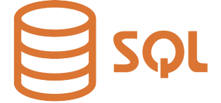

[< -- До розділу](../README.md)         [Зміст](../../contents.md)

# Основи SQL

**Про що:**

- про призначення та основні команди мови SQL  

**Що отримаєте:**

- знання про призначення та основні команди мови SQL, запити для означення схеми даних, основні запити для створення та модифікації даних   
- вміння працювати з запитами SQL для створення БД, створення та означення таблиць БД, створення, модифікації, видалення записів та вибірки даних
- навики роботи з мовою SQL

**Що потрібно знати вже:**

- основні поняття про реляційні бази даних, доступно в [Вступ до баз даних та систем керування базами даних](../../dbbasic/intro/README.md) 

**Необхідні інструменти:**

- посилання на усі необхідні програмні засоби надаються в практичному завданні

**Джерела:** 

- Матеріали курсу [Програмна інженерія в системах управління](https://pupenasan.github.io/ProgIngContrSystems)

## Теоретична частина

- [Основи SQL: теоретична частина](teor.md)

## Практична частина

- [Прототип: практична частина](lab.md)

## Теоретико-практичні посібники

- [Знайомство з SQL: онлайн посібник від SQLBolt](sqlbolt.md)

## Перевірка знань

todo

