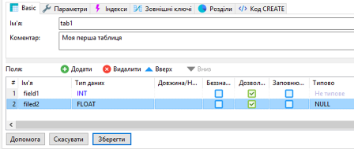
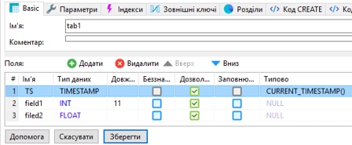
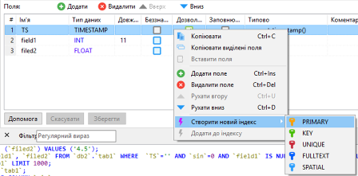
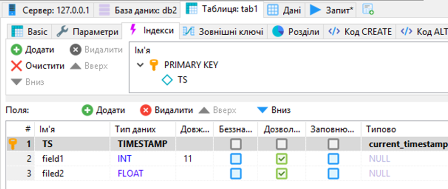

[<- До підрозділу](README.md)		[Коментувати](#feedback)

# Основи SQL: практична частина

**Тривалість**: 1 год

**Мета:** Навчитися створювати та модифікувати структуру баз даних і таблиць, добавляти, змінювати, вибирати та видаляти записи за допомогою SQL-запитів у СКБД MariaDB.

## Порядок виконання роботи

- [ ] Ознайомтеся з теоретичними відомостями з [Основи SQL: теоретична частина](teor.md)

### 1. Встановлення СКБД MariaDB 

- [ ] Встановіть на ПК СКБД "MariaDB". Інструкція зі встановлення доступна [у довіднику](../Довідники/windows_install.md). Зверніть увагу, що з довідника треба брати інструкцію тільки по встановленню "MariaDB", інші СКБД ставити не потрібно.

- [ ] зробіть пробне підключення до локального СКБД  відповідно до описаної у інструкції встановлення.

### 2. Створення БД 

- [ ] ознайомтеся з довідником по роботі з клієнтською утилітою "HeidiSQL" за [посиланням](../Довідники/dbviz.md) 

- [ ] за допомогою редактору "Notepad++" або аналогічного створіть текстовий файл і виберіть мову відображення SQL 

- [ ] створіть нову базу даних з іменем "DB1"

- [ ] знайдіть відповідний SQL запит на створення у нижньому вікні журналу запитів, скопіюйте його в створений текстовий файл; **надалі усі запити, які буде вказано в роботі скопіювати, будете добавляти в цей файл в нижній рядок**.    

### 3. Створення таблиці та полів таблиці за допомогою клієнтської утиліти

- [ ] натисніть один раз по базі даних, вона активується, про що буде вказувати відповідний запис в журналі запитів (`USE`); скопіюйте запит `USE` в текстовий файл;  

- [ ] створіть у базі даних таблицю з іменем `tab1_lastname`, де `lastanme` - ваше прізвище латинськими літерами, з двома записами `filed1` та `field2` 



рис.1. Створення таблиці.

- [ ] натисніть зберегти; буде створена нова таблиця;

- [ ] знайдіть відповідний запис `CREATE TABLE`, та скопіюйте його в текстовий файл;


### 4. Ручне заповнення записів за допомогою клієнтської утиліти

- [ ] перейдіть на закладку "Дані"

- [ ] добавте 3 записи

- [ ] усі SQL запити `INSERT INTO` скопіюйте у файл;


### 5. Добавлення поля та запису з `Timestamp`

- [ ] перейдіть на поле `Таблиця`, в якій конфігуруються поля;

- [ ] добавте нове поле `TS` типу `TIMESTAMP`, куди за замовчуванням буде записуватися плинний дата та час виражений в секундах з 1970 року (функція `CURRENT_TIMESTAMP()`), перемістіть поле, щоб воно було першим і натисніть "зберегти";  



рис.2. Добавлення поля та запису з `Timestamp`.

- [ ] знайдіть відповідний запис в журналі (`ALTER TABLE`) та скопіюйте його в текстовий файл;

- [ ] перейдіть на закладку `дані`, добавте ще один запис, але в поле `TS` не вписуйте жодного значення; 

- [ ] після добавлення натисніть `оновити`, буде видно що в поле `TS` записалося автоматично значення;


### 6. Створення індексного поля

- [ ] Створіть первинний індекс для поля `TS`. 



рис.3. Створення індексного поля

- [ ] натисніть кнопку "Зберегти";

- [ ] у результаті може вийти помилка, що дані в полі не є унікальними, перейдіть на вкладку "Дані" та виправіть дату та час, щоб дані були унікальними, після чого знову перейдіть на вкладу "Таблиця" і натисніть зберегти



рис.4. Перегляд індексів

- [ ] скопіюйте запит `ALTER TABLE` зі зміною поля на індексне в текстовий файл 

### 7. Створення БД, таблиці та полів таблиці за допомогою запита SQL

- [ ] уважно передивіться текстовий файл з записами та проаналізуйте кожен SQL-запит;

- [ ] змініть цей файл таким чином, щоб він:

- створював базу даних `DB3`;

- вибирав створену БД командою `USE`;

- створював таблицю `tab3` з полями:

  - `TS` - типу `TIMESTAMP`, з автоматичним записом поточного часу;

  - `devname` - назва пристрою;

  - `cpuavg` - середнє завантаження CPU;

  - `memory` - використання пам’яті;

  - `status` - текстовий стан пристрою;

- створював первинний індекс для поля `TS`;

- створював один запис у таблиці;

- [ ] В утиліті `HeidiSQL` перейдіть на вкладку `Запит` і перенесіть туди зміст файлу;
- [ ] Натисніть `Виконати SQL`; якщо виникає повідомлення про помилку, проаналізуйте і виправіть код та повторіть виконання; за необхідності видаліть базу даних `DB3` і створіть її повторно.

### 8. Створення кількох записів за допомогою SQL

У цьому пункті за допомогою SQL-запиту `INSERT INTO` необхідно створити декілька записів.

- [ ] Виконайте запит у HeidiSQL.

```sql
INSERT INTO tab3 (TS, devname, cpuavg, memory, status)
VALUES 
('2026-05-21 09:00:01', 'PLC1', 25.4, 48.2, 'RUN'),
('2026-05-21 09:00:02', 'PLC2', 67.8, 71.5, 'STOP'),
('2026-05-21 09:00:03', 'HMI1', 12.1, 35.0, 'RUN'),
('2026-05-21 09:00:04', 'SCADA1', 54.3, 62.8, 'ALARM'),
('2026-05-21 09:00:05', 'DB1', 81.7, 90.4, 'RUN');
```

- [ ] Подивіться актуальний стан таблиці

### 9. Модифікація записів за допомогою SQL

У цьому пункті за допомогою SQL-запиту `UPDATE` необхідно змінити усі записи, в яких поле `status` має значення `'STOP'`, таким чином щоб значення полів `cpuavg` та `memory` стали рівними `0`.

- [ ] Виконайте запит у HeidiSQL.

```sql
UPDATE tab3
SET 
    cpuavg = 0,
    memory = 0
WHERE status = 'STOP';
```

- [ ] Перевірте, що для записів зі статусом `STOP` значення `cpuavg` та `memory` змінилися на `0`.

### 10. Використання SELECT для вибірки даних

У цьому пункті необхідно виконати декілька SQL-запитів `SELECT` для вибірки та фільтрації даних таблиці `tab3`. Після виконання кожного запиту проаналізуйте результати їх виконання.

- [ ] Виконайте запит, який виведе усі записи таблиці.

```sql
SELECT * FROM tab3;
```

- [ ] Виконайте запит, який виведе тільки поля `devname` та `status`.

```sql
SELECT devname, status
FROM tab3;
```

- [ ] Виконайте запит, який виведе тільки записи зі статусом `RUN`.

```sql
SELECT *
FROM tab3
WHERE status = 'RUN';
```

- [ ] Виконайте запит, який виведе записи, де назва пристрою починається з `PLC`.

```sql
SELECT *
FROM tab3
WHERE devname LIKE 'PLC%';
```

- [ ] Виконайте запит, який виведе записи впорядковані за значенням `cpuavg` по спаданню.

```sql
SELECT *
FROM tab3
ORDER BY cpuavg DESC;
```

### 11. Агрегація, групування та псевдоніми

У цьому пункті необхідно виконати декілька SQL-запитів з використанням агрегатних функцій, групування та псевдонімів полів. Після виконання кожного запиту проаналізуйте результати їх виконання.

- [ ] Виконайте запит, який підраховує загальну кількість записів у таблиці.

```sql
SELECT COUNT(*) AS 'Кількість записів'
FROM tab3;
```

- [ ] Виконайте запит, який визначає середнє, мінімальне та максимальне значення завантаження CPU.

```sql
SELECT 
    AVG(cpuavg) AS 'Середнє CPU',
    MIN(cpuavg) AS 'Мінімальне CPU',
    MAX(cpuavg) AS 'Максимальне CPU'
FROM tab3;
```

- [ ] Виконайте запит, який підраховує кількість записів для кожного статусу.

```sql
SELECT 
    status AS 'Статус',
    COUNT(*) AS 'Кількість'
FROM tab3
GROUP BY status;
```

- [ ] Виконайте запит, який показує середнє використання пам’яті для кожного статусу.

```sql
SELECT 
    status AS 'Статус',
    AVG(memory) AS 'Середня пам’ять'
FROM tab3
GROUP BY status;
```

- [ ] Виконайте запит, який групує записи за статусом і впорядковує результат за кількістю записів по спаданню.

```sql
SELECT 
    status AS 'Статус',
    COUNT(*) AS 'Кількість'
FROM tab3
GROUP BY status
ORDER BY COUNT(*) DESC;
```

### 12. Модифікація структури таблиці

У цьому пункті необхідно виконати декілька SQL-запитів для зміни структури таблиці `tab3`. Після виконання кожного запиту проаналізуйте результати їх виконання.

- [ ] Виконайте запит, який добавляє нове поле `location`.

```sql
ALTER TABLE tab3
ADD location VARCHAR(50);
```

- [ ] Перевірте, що нове поле з’явилося в структурі таблиці.

- [ ] Виконайте запит, який змінює тип поля `status`.

```sql
ALTER TABLE tab3
MODIFY status VARCHAR(30);
```

- [ ] Перевірте, що тип поля `status` змінився.

### 13. Видалення записів

У цьому пункті необхідно виконати SQL-запити для видалення записів з таблиці. Після виконання кожного запиту проаналізуйте результати їх виконання.

- [ ] Виконайте запит, який видаляє усі записи зі статусом `STOP`.

```sql
DELETE FROM tab3
WHERE status = 'STOP';
```

- [ ] Перевірте, що відповідні записи були видалені.

### 14. Очищення таблиці

У цьому пункті необхідно виконати SQL-запит для повного очищення таблиці `tab3`.

- [ ] Виконайте запит очищення таблиці.

```sql
TRUNCATE tab3;
```

- [ ] Перевірте, що усі записи таблиці були видалені, але сама таблиця залишилася.

### 15. Видалення таблиці

У цьому пункті необхідно виконати SQL-запит для повного видалення таблиці `tab3`.

- [ ] Виконайте запит видалення таблиці.

```sql
DROP TABLE tab3;
```

- [ ] Перевірте, що таблиця `tab3` більше не існує в базі даних.

### 16. Створення копій екранів та  видалення баз даних

- [ ] створіть копії екранів даних таблиць для звіту;

- [ ] видаліть бази даних, які Ви до цього створили.


## Автори


Практичне заняття розробив  [Олександр Пупена](https://github.com/pupenasan). 

## Feedback

Якщо Ви хочете залишити коментар у Вас є наступні варіанти:

- [Обговорення у WhatsApp](https://chat.whatsapp.com/BRbPAQrE1s7BwCLtNtMoqN)
- [Обговорення в Телеграм](https://t.me/+GA2smCKs5QU1MWMy)
- [Група у Фейсбуці](https://www.facebook.com/groups/asu.in.ua)

Про проект і можливість допомогти проекту написано [тут](https://asu-in-ua.github.io/atpv/)
