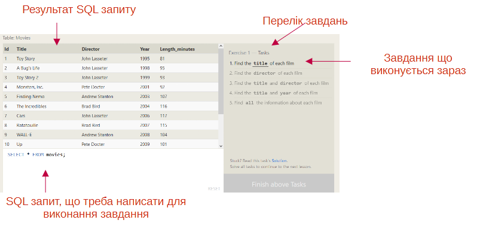

[<- До підрозділу](README.md)

# Знайомство з SQL: онлайн посібник від SQLBolt

Даний посібник є перекладом та адаптацією [Introduction to SQL від SQLBolt](https://sqlbolt.com/)

## Вступ

Ласкаво просимо до SQLBolt, серії інтерактивних уроків і вправ, які допоможуть вам швидко вивчити SQL прямо у вашому браузері.

### Що таке SQL?

SQL, або мова структурованих запитів (Structured Query Language), — це мова, розроблена для того, щоб як технічні, так і нетехнічні користувачі могли запитувати, маніпулювати та перетворювати дані з реляційної бази даних. А завдяки своїй простоті бази даних SQL забезпечують безпечне та масштабоване сховище для мільйонів веб-сайтів і мобільних програм.

> Ви знали?
>
> Існує багато популярних баз даних SQL, включаючи SQLite, MySQL, Postgres, Oracle і Microsoft SQL Server. Усі вони підтримують загальний стандарт мови SQL, якій ви навчатиметеся у цьому посібнику, але кожна реалізація може відрізнятися додатковими функціями та типами зберігання, які вона підтримує.
>

### Реляційні бази даних

Перш ніж вивчати синтаксис SQL, важливо розуміти модель реляційної бази даних. Реляційна база даних представляє набір пов’язаних (двовимірних) таблиць. Кожна таблиця схожа на електронну таблицю Excel із фіксованою кількістю іменованих стовпців (атрибутів або властивостей таблиці) та будь-якою кількістю рядків даних.

Наприклад, якби Департамент автомобільних транспортних засобів мав базу даних, ви могли б знайти таблицю з усіма відомими транспортними засобами, якими керують жителі штату. У цій таблиці може знадобитися, наприклад, назва моделі (Make/Model), тип (Type), кількість коліс (Wheels) і кількість дверей (Doors) кожного автомобіля.

Table: Vehicles

| Id   | Make/Model        | # Wheels | # Doors | Type       |
| ---- | ----------------- | -------- | ------- | ---------- |
| 1    | Ford Focus        | 4        | 4       | Sedan      |
| 2    | Tesla Roadster    | 4        | 2       | Sports     |
| 3    | Kawakasi Ninja    | 2        | 0       | Motorcycle |
| 4    | McLaren Formula 1 | 4        | 0       | Race       |
| 5    | Tesla S           | 4        | 4       | Sedan      |

У такій базі даних ви можете знайти додаткові пов’язані таблиці, які містять таку інформацію, як список усіх зареєстрованих водіїв у штаті, типи водійських прав, які можна надати, або навіть порушення водіння для кожного водія.

Метою вивчення SQL є навчитися відповідати на конкретні запитання щодо цих даних, щоб допомогти нам приймати кращі рішення в майбутньому, наприклад *"Які транспортні засоби на дорозі мають менше чотирьох коліс?"* або *"Скільки моделей автомобілів виробляє Tesla?"*.

### Про уроки

Оскільки більшість користувачів вивчатимуть SQL для взаємодії з існуючою базою даних, уроки починаються з ознайомлення з різними частинами запиту SQL. Наступні уроки покажуть вам, як змінити таблицю (або схему) і створити нові таблиці з нуля.

Кожен урок представлятиме іншу концепцію та завершуватиметься інтерактивною вправою. Дійте у своєму темпі та не бійтеся витрачати час на експерименти з вправами, перш ніж продовжити! Якщо ви вже знайомі з SQL, ви можете пропустити якісь уроки і піти вперед, але ми рекомендуємо вам все одно опрацювати уроки!

Зрештою, ми сподіваємося, що ви зможете мати міцну основу для використання SQL у своїх власних проектах і не тільки.

### Примітки від перекладача

Початок кожного перекладу уроку починається з посилання на оригінальну англомовну версію. Якщо Вам комфортніше працювати в оригінальному англомовному контексті, раджу Вам одразу перейти на основну сторінку [Introduction to SQL від SQLBolt](https://sqlbolt.com/) і проходити уроки саме там. Якщо ж Вам простіше працювати з українським текстом, ознайомтеся з особливостями роботи з практичними заняттями, які Ви будете проходити на оригінальному сайті.

Кожен урок буде завершуватися вправою, яка містиме перелік завдань (див. рис. нижче), переклад яких буде даватися в цьому посібнику. Для виконання завдання необхідно буде сформувати відповідний SQL-запит в полі запиту. Результат буде відображатися в таблиці над ним. Якщо результат буде вірним, завдання буде позначено як виконаним, і автоматично активується інше завдання зі списку. 



Якщо є проблема з виконанням завдання, можна натиснути посилання `Solution`, яке автоматично виведе правильний запит у поле запиту.

## Урок 1: запити SELECT

[Оригінал](https://sqlbolt.com/lesson/select_queries_introduction)

Щоб отримати дані з бази даних SQL, нам потрібно написати оператори **`SELECT`**, які в просторіччі часто називають *запитами* (queries). Запит сам по собі є просто оператором, який оголошує, які дані ми шукаємо, де їх знайти в базі даних і, за бажанням, як їх перетворити, перш ніж вони будуть повернуті у відповіді. Однак у нього є специфічний синтаксис, який ми вивчатимемо в наступних вправах.

Як ми згадували у вступі, ви можете розглядати таблицю в SQL як тип сутності (наприклад, собак), а кожен рядок у цій таблиці — як конкретний *екземпляр* цього типу (наприклад, мопса, бігля , мопс іншого кольору тощо). Це означає, що стовпці відображатимуть загальні властивості, спільні для всіх екземплярів цієї сутності (наприклад, колір хутра, довжина хвоста тощо).

І маючи таблицю даних, найпростішим запитом, який ми могли б написати, був би запит, який вибирає пару стовпців (властивостей) таблиці з усіма рядками (екземплярами).

Запит вибірки для певних стовпців

```sql
SELECT column, another_column, … 
FROM mytable;      
```

Результатом цього запиту буде двовимірний набір рядків і стовпців, фактично копія таблиці, однак лише з тими стовпцями, які ми запитували.

Якщо ми хочемо отримати абсолютно всі стовпці даних із таблиці, замість переліку всіх імен стовпців окремо ми можемо використовувати символ зірочки (`*`) .

Запит вибірки для всіх стовпців

```sql
SELECT *  FROM mytable;
```

Цей запит, зокрема, дуже корисний, оскільки це простий спосіб перевірити таблицю, вивівши всі дані одночасно.

### Вправа 1

Для більшості наших вправ ми будемо використовувати базу даних з даними про деякі класичні фільми Pixar. Ця перша вправа включатиме лише таблицю **Movies** (фільми), а запит за замовчуванням нижче наразі показує всі властивості кожного фільму. Щоб перейти до наступного уроку, змініть запит [тут](https://sqlbolt.com/lesson/select_queries_introduction), який би знаходив точну інформацію, яка нам потрібна для кожного завдання.

> Завдання
>
> 1.  Знайдіть назву (поле `title` ) для кожного фільму
> 2.  Знайдіть режисера (`director`) для кожного фільму
> 3.  Знайдіть назву (`title` ) та режисера (`director`) для кожного фільму
> 4.  Знайдіть назву (`title` ) та рік (`year`) кожного фільму
> 5.  Знайдіть усю (`all`) інформацію про кожен фільм         

## Урок 2: Запити з обмеженнями (частина 1)

[Оригінал](https://sqlbolt.com/lesson/select_queries_with_constraints)

Тепер ми знаємо, як вибирати конкретні стовпці даних із таблиці, але якби у вас була таблиця із сотнею мільйонів рядків даних, читання всіх рядків було б неефективним і, можливо, навіть неможливим.

Щоб відфільтрувати певні результати в повернену таблицю, нам потрібно у запиті використовувати  існтрукція **`WHERE`**. Цей оператор застосовується до кожного рядка даних, перевіряючи значення конкретних стовпців, щоб визначити, чи слід включити його до результатів чи ні.

```sql
SELECT column, another_column, …
FROM mytable
WHERE condition
    AND/OR another_condition
    AND/OR …;
```

Більш складні речення можна побудувати, об’єднавши численні логічні ключові слова AND або OR (наприклад, num_wheels >= 4 AND doors <= 2). Нижче наведено кілька корисних операторів, які можна використовувати для числових даних (тобто цілих чи з плаваючою комою):

Більш складні умови можуть бути побудовані шляхом з'єднання численних логічних ключових слів **`AND`** або **`OR`** (наприклад, `num_wheels >= 4 AND doors <= 2`). Нижче наведені деякі корисні оператори, які можна використовувати для числових даних (наприклад, цілих чисел або чисел з плаваючою комою):

| Оператор            | Умова                                              | Приклад SQL                     |
| ------------------- | -------------------------------------------------- | ------------------------------- |
| =, !=, < <=, >, >=  | Стандартні числові оператори                       | `col_name != 4`                 |
| BETWEEN … AND …     | Число в діапазоні двох значень (включно)           | `col_name BETWEEN 1.5 AND 10.5` |
| NOT BETWEEN … AND … | Число не входить у діапазон двох значень (включно) | `col_name NOT BETWEEN 1 AND 10` |
| IN (…)              | Число існує в списку                               | `col_name IN (2, 4, 6)`         |
| NOT IN (…)          | Число не існує в списку                            | `col_name NOT IN (1, 3, 5)`     |

Окрім того, що результати легші для розуміння, написання операторів для обмеження набору рядків, що повертаються, також дозволяє виконувати запит швидше, завдяки зменшенню непотрібних даних, що повертаються.

> Ви знали?
>
> Як ви вже могли помітити, SQL не вимагає від вас писати ключові слова з великої літери, але за домовленістю це допомагає людям відрізняти ключові слова SQL від імен стовпців і таблиць і полегшує читання запиту.

### Вправа 2

Використовуючи правильні обмеження, знайдіть потрібну інформацію в таблиці `Movies` для кожного завдання нижче, використовуючи SQL запит [тут](https://sqlbolt.com/lesson/select_queries_with_constraints).

> Завдання	
>
> 1. Знайдіть фільм із рядком `id` рівним 6
> 2.  Знайдіть фільми, випущені протягом 2000–2010 років (`year`)
> 3.  Знайдіть фільми, **не** випущені в період між 2000 і 2010 роками
> 4.  Знайдіть перші 5 фільмів              


## Урок 3: Запити з обмеженнями (частина 2)

[Оригінал](https://sqlbolt.com/lesson/select_queries_with_constraints_pt_2)

При написанні умов `WHERE` для стовпців, що містять текстові дані, SQL підтримує низку корисних операторів для виконання таких дій, як нечутливе до регістру порівняння рядків і зіставлення шаблонів підстановк. Нижче ми покажемо кілька поширених операторів, специфічних для текстових даних:

| Operator   | Умова                                                        | Приклад                                                      |
| ---------- | ------------------------------------------------------------ | ------------------------------------------------------------ |
| =          | Порівняння точного рядка з урахуванням регістру (*зверніть увагу, що одинарне дорівнює*) | `col_name = "abc"`                                           |
| != or <>   | Порівняння точної нерівності рядка з урахуванням регістру    | `col_name != "abcd"`                                         |
| LIKE       | Точне порівняння рядків без урахування регістру              | `col_name LIKE "ABC"`                                        |
| NOT LIKE   | Точне порівняння нерівності рядка без урахування регістру    | `col_name NOT LIKE "ABCD"`                                   |
| %          | Використовується будь-де в рядку для відповідності послідовності з нуля або більше символів (тільки з `LIKE` або `NOT LIKE`) | `col_name LIKE "%AT%"` (відповідність `"AT"`, `"ATTIC"`, `"CAT"` або навіть `"BATS"`) |
| _          | Використовується будь-де в рядку для відповідності одному символу (тільки з `LIKE` або `NOT LIKE`) | `col_name LIKE "AN_"`  (відповідність `"AND"`,  але не `"AN"`) |
| IN (…)     | Рядок існує в списку                                         | `col_name IN ("A", "B", "C")`                                |
| NOT IN (…) | Рядок не існує в списку                                      | `col_name NOT IN ("D", "E", "F")`                            |

> Ви знали?
>
> Усі рядки мають бути взяті в лапки, щоб аналізатор запиту міг відрізнити слова в рядку від ключових слів SQL.

Слід зазначити, що хоча більшість реалізацій баз даних досить ефективні при використанні цих операторів, повнотекстовий пошук найкраще залишити спеціальним бібліотекам, таким як [Apache Lucene](http://lucene.apache.org/)  або [Sphinx](http://sphinxsearch.com/). Ці бібліотеки розроблено спеціально для виконання повнотекстового пошуку, тому є більш ефективними та можуть підтримувати широкий спектр функцій пошуку, включаючи інтернаціоналізацію та розширені запити.

### Вправа 3

Ось ще раз визначення запиту з умовами `WHERE`. Спробуйте написати декілька запитів із зазначеними вище операторами, щоб обмежити результати інформацією, яка потрібна нам у завданнях нижче ([тут](https://sqlbolt.com/lesson/select_queries_with_constraints_pt_2)).

```sql
SELECT column, another_column, …
FROM mytable
WHERE condition
    AND/OR another_condition
    AND/OR …;
```

> 1. Знайдіть усі фільми з назвою (`title`) `Toy Story`
> 2.  Знайдіть усі фільми режисера (`directed`) John Lasseter
> 3.  Знайдіть усі фільми (і режисера), зняті не John Lasseter
> 4.  Знайдіть усі фільми що починаються з `WALL-`  

## Урок 4: Фільтрування та сортування результатів запиту

[Оригінал](https://sqlbolt.com/lesson/filtering_sorting_query_results)

Незважаючи на те, що дані в базі даних можуть бути унікальними, результати будь-якого окремого запиту можуть бути не такими. Візьмемо, наприклад, нашу таблицю `Movies`, у тому самому році може вийти багато різних фільмів. У таких випадках SQL надає зручний спосіб відхилити рядки, які мають повторювані значення стовпця, використовуючи ключове слово  **`DISTINCT`**.

```sql
SELECT DISTINCT column, another_column, …
FROM mytable
WHERE condition(s);
```

Оскільки ключове слово DISTINCT сліпо видаляє повторювані рядки, у майбутньому уроці ми дізнаємося, як відкидати дублікати на основі певних стовпців за допомогою групування та інструкції **`GROUP BY`**.

### Сортування результатів

На відміну від нашої акуратно впорядкованої таблиці в останніх кількох уроках, більшість даних у реальних базах даних додаються без певного порядку рядків. У результаті може бути важко прочитати та зрозуміти результати запиту, оскільки розмір таблиці збільшується до тисяч або навіть мільйонів рядків.

Щоб допомогти з цим, SQL надає спосіб сортування результатів за заданим стовпцем у порядку зростання або спадання за допомогою інструкції  **`ORDER BY`**.

```sql
SELECT column, another_column, …
FROM mytable
WHERE condition(s)
ORDER BY column ASC/DESC;
```

Якщо вказано інструкцію `ORDER BY`, кожен рядок сортується алфавітно-цифровим способом на основі значення вказаного стовпця. У деяких базах даних ви також можете вказати правила зіставлення (collation), щоб краще сортувати дані, що містять міжнародний текст. 

### Обмеження результатів підмножиною

Інше інструкції, які зазвичай використовуються з `ORDER BY`, це інструкції `LIMIT` і `OFFSET`, які є корисною оптимізацією для вказівки в базі даних підмножини результатів, які вас цікавлять. **`LIMIT`** зменшить кількість рядків, які потрібно повернути, а необов’язковий **`OFFSET`** вкаже, звідки почати підрахунок кількості рядків.

```sql
SELECT column, another_column, …
FROM mytable
WHERE condition(s)
ORDER BY column ASC/DESC
LIMIT num_limit OFFSET num_offset;
```

На таких веб-сайтах, як Reddit або Pinterest, головна сторінка – це список посилань, відсортованих за популярністю та часом, а кожна наступна сторінка може бути представлена наборами посилань з різними зсувами у базі даних. Використовуючи ці положення, база даних може виконувати запити швидше та ефективніше, обробляючи та повертаючи лише запитуваний вміст.

> Ви знали?
>
> Дії інструкцій `LIMIT` і `OFFSET` зазвичай виконуються в останню чергу після застосування інших інструкцій запиту. Ми докладніше торкнемося цього в Уроці 12: Порядок виконання запиту.

### Вправа 4

У цьому уроці є кілька концепцій, але всі вони досить прості для застосування. Спробуйте використовувати у своїх запитах необхідні ключові слова та пропозиції, наведені вище, для виконання завдань з таблицею `Movies`.

> 1. Перелічіть усіх режисерів (`director`) фільмів за алфавітом, без дублікатів
> 2. Перелічіть останні чотири випущені фільми у порядку від останнього до найменшого
> 3. Перелічіть **перші** п’ять фільмів, відсортованих за алфавітом
> 4. Перелічіть **наступні** п’ять фільмів (починаючи з 6-го), відсортованих за алфавітом


## Урок 5 Закріплення знань: прості запити SELECT

[Оригінал](https://sqlbolt.com/lesson/select_queries_review)

Ви добре попрацювали, дійшовши до цього моменту! Тепер, коли ви відчули смак того, як писати базовий запит, вам потрібно попрактикуватися у написанні запитів, які вирішують реальні задачі.

```sql
SELECT column, another_column, …
FROM mytable
WHERE condition(s)
ORDER BY column ASC/DESC
LIMIT num_limit OFFSET num_offset;
```

### Вправа 5 на закріплення знань

У вправі [за посиланням](https://sqlbolt.com/lesson/select_queries_review) ви працюватимете з іншою таблицею. Натомість ця таблиця містить інформацію про кілька найбільш густонаселених міст Північної Америки [1](https://en.wikipedia.org/wiki/List_of_North_American_cities_by_population), включаючи їхнє населення та геопросторове розташування у світі.         

> 1. Перелічіть усі міста (`city`) Канади (поле `country`) та їх населення (`population`)
> 2. Розташуйте всі міста (`city`) Сполучених Штатів (поле `country`) за широтою (`latitude`) з півночі на південь
> 3. Перелічіть усі міста (`city`) на захід від Чикаго в порядку із заходу на схід 
> 4. Перелічіть два найбільших міста Мексики (за населенням)
> 5. Перелічіть третє та четверте за чисельністю міст Сполучених Штатів Америки та їх населення


## Урок 6: Багатотабличні запити з JOIN

[Оригінал](https://sqlbolt.com/lesson/select_queries_with_joins)

Досі ми працювали з однією таблицею, але дані об’єктів у реальному світі часто розбиваються на частини та зберігаються в кількох ортогональних таблицях за допомогою процесу, відомого як нормалізація [1](https://uk.wikipedia.org/wiki/Нормалізація_баз_даних ).

### Нормалізація бази даних

Нормалізація бази даних є корисною, оскільки вона зводить до мінімуму повторювані дані в будь-якій окремій таблиці та дозволяє даним у базі даних доповнюватися незалежно один від одного (тобто типи автомобільних двигунів можуть доповнюватися незалежно від кожного типу автомобіля). Як компроміс, запити стають дещо складнішими, оскільки вони повинні мати можливість знаходити дані з різних частинах баз даних, і під час роботи з багатьма великими таблицями можуть виникнути проблеми з продуктивністю.

Щоб відповісти на запитання про сутність, яка має дані, що охоплюють кілька таблиць у нормалізованій базі даних, нам потрібно навчитися писати запит, який може об’єднати всі ці дані та отримати саме ту інформацію, яка нам потрібна.

### Багатотабличні запити з JOIN

Таблиці, які спільно використовують інформацію про одну сутність, повинні мати *первинний ключ*, який *унікально* ідентифікує цю сутність у *базі даних*. Одним із поширених типів первинного ключа є ціле число з автоматичним збільшенням (оскільки вони економлять простір), але це також може бути рядок, хешоване значення, якщо воно унікальне.

Використовуючи речення **`JOIN`** у запиті, ми можемо об’єднати дані рядків у двох окремих таблицях за допомогою цього унікального ключа. Перше з об'єднань, яке ми представимо, це **`INNER JOIN`**. Наступний запит робить вибірку з кількох таблиць

```sql
SELECT column, another_table_column, …
FROM mytable
INNER JOIN another_table 
    ON mytable.id = another_table.id
WHERE condition(s)
ORDER BY column, … ASC/DESC
LIMIT num_limit OFFSET num_offset;
```

`INNER JOIN` — це процес, який зіставляє рядки з однаковими ключами (це означено інструкцією **`ON`**) з першої та другої таблиць з метою створення рядку результату, що об'єднує стовпці з обох таблиць. Після об’єднання таблиць застосовуються інші інструкції, які ми вивчали раніше.

> Ви знали?
>
> Ви можете побачити запити, де `INNER JOIN` записується просто як `JOIN`. Ці два записи еквівалентні, але ми продовжуватимемо свідомо вказувати ці об’єднання як внутрішні об’єднання (добавляючи `INNER`), тому що це полегшує читання запиту, особливо коли ви почнете використовувати інші типи об’єднань, які буде представлено в наступному уроці.

### Вправа 6

Ми додали нову таблицю до бази даних Pixar, щоб ви могли попрактикуватися в об’єднанні. У таблиці `BoxOffice` зберігається інформація про рейтинги та продажі кожного конкретного фільму Pixar, а стовпець `Movie_id` у цій таблиці відповідає стовпцю `Id` у таблиці `Movies` один до одного. Спробуйте розв’язати завдання ([тут](https://sqlbolt.com/lesson/select_queries_with_joins)), наведені нижче, за допомогою описаного вище `INNER JOIN`.

> 1. Вивести всю інформацію про фільми та їх продажі 
> 2.  Покажіть інформацію по кожному фільму, який досяг кращих результатів на міжнародному ринку (`international_sales`) порівняно з внутрішнім (`domestic_sales`)
> 3. Перерахуйте всі фільми за їх рейтингами (`rating`) в порядку спадання

## Урок 7: Зовнішні з'єднання 

[Оригінал](https://sqlbolt.com/lesson/select_queries_with_outer_joins)

Залежно від того, як ви хочете проаналізувати дані, `INNER JOIN`, який ми використовували на минулому уроці, може бути недостатнім, оскільки отримана таблиця містить лише дані, які належать до обох таблиць.

Якщо дві таблиці містять асиметричні дані, що може легко статися, коли дані вводяться на різних етапах, щоб гарантувати, що потрібні дані не будуть випущені з результатів замість цього нам доведеться використовувати `LEFT JOIN`, `RIGHT JOIN` або `FULL JOIN` .

```sql
SELECT column, another_column, …
FROM mytable
INNER/LEFT/RIGHT/FULL JOIN another_table 
    ON mytable.id = another_table.matching_id
WHERE condition(s)
ORDER BY column, … ASC/DESC
LIMIT num_limit OFFSET num_offset;
```

Подібно до `INNER JOIN`, ці три нові об’єднання повинні вказувати, у якому стовпці об’єднувати дані. Під час приєднання таблиці `A` до таблиці `B` **`LEFT JOIN`** просто включає рядки з `A` незалежно від того, чи знайдено відповідний рядок у `B`. **`RIGHT JOIN`** робить те саме тільки з іншого боку, зберігаючи рядки в `B` незалежно від того, чи знайдено збіг у `A`. Нарешті, `FULL JOIN` просто означає, що рядки з обох таблиць зберігаються, незалежно від того, чи існує відповідний рядок в іншій таблиці.

Використовуючи будь-яке з цих нових об’єднань, вам, ймовірно, доведеться написати додаткову логіку для роботи з `NULL` у результатах і обмеженнях (докладніше про це в наступному уроці).

> Ви знали?
>
> Ви можете побачити запити з цими об’єднаннями, написаними як `LEFT OUTER JOIN`, `RIGHT OUTER JOIN` або `FULL OUTER JOIN`. Ці запити еквівалентні `LEFT JOIN`, `RIGHT JOIN` і `FULL JOIN` відповідно, а ключове слово `OUTER` зберігається для сумісності з SQL-92.

### Вправа 7

У цій вправі ви працюватимете з новою таблицею ([тут](https://sqlbolt.com/lesson/select_queries_with_nulls)), яка зберігає вигадані дані про працівників кіностудії та призначені їм офісні будівлі. Деякі з будівель нові, тому в них ще немає працівників, але все одно нам потрібно знайти певну інформацію про них.

Оскільки наша база даних SQL браузера дещо обмежена, у наведеній нижче вправі підтримується лише `LEFT JOIN`.

> 1. Знайдіть список усіх будівель (`building`), у яких є працівники (`name`)
> 2. Знайдіть список усіх будівель та їх місткість (`capacity`)
> 3. Перерахуйте всі будівлі та окремі посади (`role`) працівників у кожній будівлі (включаючи порожні будівлі)                


## Урок 8: Коротка примітка про NULL

[Оригінал](https://sqlbolt.com/lesson/select_queries_with_nulls)

Як і було обіцяно в минулому уроці, коротко поговоримо про значення `NULL` у базі даних SQL. Завжди корисно зменшити ймовірність `NULL`-значень у базах даних, оскільки вони вимагають особливої уваги під час побудови запитів, обмежень (деякі функції поводяться по-різному з `null`-значеннями) і під час обробки результатів.

Альтернативою значенням `NULL` у вашій базі даних є відповідні значення типу даних за замовчуванням, наприклад `0` для числових даних, порожні рядки (`""`) для текстових даних тощо.  Але якщо ваша база даних повинна зберігати неповні дані, то значення `NULL` можуть бути доречними, якщо значення за замовчуванням можуть спотворити подальший аналіз (наприклад, при обчисленні середнього для числових даних).

Іноді також неможливо уникнути значень `NULL`, як ми бачили в минулому уроці під час зовнішнього об’єднання двох таблиць з асиметричними даними. У цих випадках ви можете перевірити стовпець на значення `NULL` у реченні `WHERE`, використовуючи обмеження **`IS NULL`** або **`IS NOT NULL`**.

```sql
SELECT column, another_column, …
FROM mytable
WHERE column IS/IS NOT NULL
AND/OR another_condition
AND/OR …;
```

### Вправа 8

Ця вправа ([тут](https://sqlbolt.com/lesson/select_queries_with_nulls)) буде свого роду повторенням кількох останніх уроків. Ми використовуємо ту саму таблицю `Employees` і `Buildings` з минулого уроку, але ми найняли ще кількох людей, яким ще не призначено будівлю.

> 1. Знайдіть імена та посади всіх співробітників, які не були призначені до будівлі
> 2. Знайдіть назви будівель, у яких немає працівників

## Урок 9: Запити з виразами

[Оригінал](https://sqlbolt.com/lesson/select_queries_with_expressions)

Окрім запитів і посилань на необроблені дані стовпців за допомогою SQL, ви також можете використовувати вирази, щоб написати складнішу логіку значень стовпців у запиті. Ці вирази можуть використовувати математичні та рядкові функції разом із базовою арифметикою для перетворення значень під час виконання запиту, як показано в цьому прикладі.

```sql
SELECT particle_speed / 2.0 AS half_particle_speed
FROM physics_data
WHERE ABS(particle_position) * 10.0 > 500;
```

Кожна база даних має власний підтримуваний набір математичних, рядкових функцій а також функцій дати та часу, які можна використовувати в запиті. Їх можна знайти у відповідних документах.

Використання виразів може заощадити час на додатковій постобробці даних результату, але також може ускладнити читання запиту. Тому ми рекомендуємо, щоб вирази, які використовуються в частині запиту `SELECT`, також мали описовий псевдонім за допомогою ключового слова **`AS`**.

```sql
SELECT col_expression AS expr_description, …
FROM mytable;
```

Окрім виразів, звичайні стовпці та навіть таблиці також можуть мати псевдоніми, щоб полегшити посилання на них у виводі та спростити складніші запити.

```sql
SELECT column AS better_column_name, …
FROM a_long_widgets_table_name AS mywidgets
INNER JOIN widget_sales
  ON mywidgets.id = widget_sales.widget_id;
```

### Вправа 9

Вам доведеться використовувати вирази ([тут](https://sqlbolt.com/lesson/select_queries_with_expressions)), щоб перетворити дані `BoxOffice` у щось легше для розуміння для завдань, наведених нижче.     

> 1. Перелічіть всі фільми та розрахуйте їх сукупний обсяг продажів у **мільйонах** доларів
> 2.  Перелічіть усі фільми та їхні рейтинги **у відсотках**
> 3.  Перелічіть усі фільми, які вийшли в парні роки


## Урок 10: Запити з агрегатами (частина 1)

[Оригінал](https://sqlbolt.com/lesson/select_queries_with_aggregates)

На додаток до простих виразів, які ми представили на минулому уроці, SQL також підтримує використання агрегатних виразів (або функцій), які дозволяють узагальнювати інформацію про групу рядків даних. Так, наприклад, використовуючи агрегатні функції, з вже згаданої бази даних Pixar можна отримати додаткову інформацію, відповідаючи на такі запитання, як «Скільки фільмів випустила Pixar?» або «Який фільм Pixar щороку приносить найвищі прибутки?».

Запит із агрегатними функціями по всіх рядках виглядатиме наступним чином

```sql
SELECT AGG_FUNC(column_or_expression) AS aggregate_description, …
FROM mytable
WHERE constraint_expression;
```

Без указаного групування кожна агрегатна функція запускатиметься для всього набору рядків результатів і повертатиме одне значення. Подібно до звичайних виразів, надання вашим агрегатним функціям псевдоніма гарантує, що результати будуть легшими для читання та обробки.

### Загальні агрегатні функції

Ось кілька поширених агрегатних функцій, які ми збираємося використовувати в наших прикладах:

| Функція                         | Опис                                                         |
| ------------------------------- | ------------------------------------------------------------ |
| `COUNT()`, <br/>`COUNT(column)` | Загальна функція, яка використовується для підрахунку кількості рядків у групі, якщо ім’я стовпця не вказано. <br/>У випадку вказівки стовпця підраховує кількість рядків у групі зі значеннями, відмінними від `NULL`, у вказаному стовпці. |
| `MIN(column)`                   | Знаходить найменше числове значення у вказаному стовпці для всіх рядків у групі. |
| `MAX(column)`                   | Знаходить найбільше числове значення у вказаному стовпці для всіх рядків у групі. |
| `AVG(column)`                   | Знаходить середнє числове значення у вказаному стовпці для всіх рядків у групі. |
| `SUM(column)`                   | Знаходить суму всіх числових значень у вказаному стовпці для рядків у групі. |

### Grouped aggregate functions

На додаток до агрегування по всім рядкам, ви можете натомість застосувати агрегатні функції до окремих груп і даних у цій групі (наприклад касові продажі окремо для комедій і бойовиків). Тоді буде створено стільки результатів, скільки унікальних груп, визначених пунктом **`GROUP BY`**.

Запит на вибірку із агрегатними функціями над групами матиме вигляд:

```sql
SELECT AGG_FUNC(column_or_expression) AS aggregate_description, …
FROM mytable
WHERE constraint_expression
GROUP BY column;
```

Інструкція `GROUP BY` працює шляхом групування рядків, які мають однакові значення у вказаному стовпці.

### Вправа 10

Для цієї вправи ми працюватимемо з нашою таблицею `Employees` ([тут](https://sqlbolt.com/lesson/select_queries_with_aggregates)). Зверніть увагу на те, як рядки в цій таблиці мають спільні дані, що дасть нам можливість використовувати агрегатні функції для підсумовування деяких показників високого рівня про команди працівників.          

> 1. Знайдіть найдовший час (`years_employed`), який працівник пропрацював у студії
> 2. Для кожної посади (`role`) знайдіть середню кількість років роботи працівників на цій посаді (вивести посаду та середнє значення)
> 3. Знайдіть загальну кількість років роботи працівників у кожній будівлі (вивести будівлі і роки)


## Урок 11: Запити з агрегатами (частина 2)

[Оригінал](https://sqlbolt.com/lesson/select_queries_with_aggregates_pt_2)

Наші запити стають досить складними, але ми майже представили всі важливі частини запиту `SELECT`. Одна річ, яку ви могли помітити: якщо інструкція `GROUP BY` виконується після інструкції `WHERE` (яке фільтрує рядки, які потрібно згрупувати), то як саме ми можемо фільтрувати вже згруповані рядки?

На щастя, SQL дозволяє нам це зробити, додавши додаткове речення `HAVING`, яке використовується спеціально з інструкцією `GROUP BY`, щоб дозволити нам фільтрувати згруповані рядки з набору результатів.

```sql
SELECT group_by_column, AGG_FUNC(column_expression) AS aggregate_result_alias, …
FROM mytable
WHERE condition
GROUP BY column
HAVING group_condition;
```

Умови інструкції **`HAVING`** записуються так само, як і умови інструкції `WHERE`, і застосовуються до згрупованих рядків. З нашими прикладами це може здатися не дуже корисною конструкцією, але якщо ви уявляєте дані з мільйонами рядків з різними властивостями, можливість застосувати додаткові обмеження часто потрібна, щоб швидко зрозуміти дані.

> Ви знали?
>
> Якщо ви не використовуєте інструкцію `GROUP BY`, достатньо простої інструкції `WHERE`.

### Вправа 11

Для [цієї](https://sqlbolt.com/lesson/select_queries_with_aggregates_pt_2) вправи ви будете глибше занурюватися в дані про співробітників кіностудії. Подумайте про різні інструкції, які ви хочете застосувати для кожного завдання.

> 1. Знайдіть кількість художників (`Artists`) у студії (без використання `HAVING`)
> 2. Знайдіть кількість співробітників (`Employees`) для кожної посади в студії (вивести посаду та кількість)
> 3. Знайдіть загальну кількість років роботи всіх інженерів (`Engineer`)

## Урок 12: Порядок виконання запиту

[Оригінал](https://sqlbolt.com/lesson/select_queries_order_of_execution)

Тепер, коли ми маємо уявлення про всі частини запиту, ми можемо поговорити про те, як усі вони поєднуються в контексті повного запиту.

```sql
SELECT DISTINCT column, AGG_FUNC(column_or_expression), …
FROM mytable
    JOIN another_table
      ON mytable.column = another_table.column
    WHERE constraint_expression
    GROUP BY column
    HAVING constraint_expression
    ORDER BY column ASC/DESC
    LIMIT count OFFSET COUNT;
```

Кожен запит починається з пошуку потрібних нам даних у базі даних, а потім фільтрування цих даних у щось, що можна обробити та зрозуміти якомога швидше. Оскільки кожна частина запиту виконується послідовно, важливо розуміти порядок виконання, щоб знати, де які результати доступні.

### Порядок виконання запиту

#### 1. `FROM` та`JOIN`s

Cпочатку виконується Інструкція `FROM` а наступні `JOIN` . Це дозволяє визначити загальний робочий набір даних, які запитуються. Це включає підзапити що може призвести до створення на задньому плані тимчасових таблиць, які містять усі стовпці та рядки таблиць, які треб об’єднати.

#### 2. `WHERE`

Коли ми вже маємо загальний робочий набір даних, обмеження першого проходу `WHERE` застосовуються до окремих рядків, а рядки, які не задовольняють обмеженню, відкидаються. Кожне з обмежень може мати доступ лише до стовпців безпосередньо з таблиць, запитуваних інструкцією `FROM`. У більшості баз даних псевдоніми в частині запиту `SELECT` недоступні, оскільки вони можуть містити вирази, що залежать від частин запиту, які ще не виконано.

#### 3. `GROUP BY`

Потім рядки, що залишилися після застосування обмежень `WHERE`, на основі загальних значень групуються у стовпці, указаному в пункті `GROUP BY`. У результаті групування буде стільки рядків, скільки унікальних значень у цьому стовпці. Неявно це означає, що вам слід використовувати це лише тоді, коли у вашому запиті є агрегатні функції.

#### 4. `HAVING`

Якщо запит має інструкцію `GROUP BY`, тоді до згрупованих рядків застосовуються обмеження інструкції `HAVING` . Це відкидає згруповані рядки, які не задовольняють обмеженню. Так само як і для інструкції `WHERE` псевдоніми на цьому кроці недоступні в обмеженнях для більшості баз даних.

#### 5. `SELECT`

У частині запиту `SELECT` остаточно обчислюються усі вирази.

#### 6. `DISTINCT`

З решти рядків буде відкинуто рядки з повторюваними значеннями в стовпці, позначеному як `DISTINCT`.

#### 7. `ORDER BY`

Якщо порядок означено реченням `ORDER BY`, рядки сортуються за вказаними даними в порядку зростання або спадання. У цьому пункті ви також можете посилатися на псевдоніми, оскільки всі вирази  були обчислені в частині `SELECT` запиту.

#### 8. `LIMIT` / `OFFSET`

Нарешті, рядки, які виходять за межі діапазону, визначеного `LIMIT` і `OFFSET`, відкидаються, залишаючи остаточний набір рядків, які повертаються із запиту.

Не кожен запит повинен містити всі частини, які ми перерахували вище, але частина SQL настільки гнучка в тому, що вона дозволяє розробникам і аналітикам даних швидко маніпулювати даними без необхідності писати додатковий код, і все це просто за допомогою наведених вище інтсрукцій.

### Вправа 12

Ось і закінчуються наші уроки щодо запитів `SELECT`, вітаємо, що досягли такого успіху! Ця [вправа](https://sqlbolt.com/lesson/select_queries_order_of_execution) спробує перевірити ваше розуміння запитів, тож не засмучуйтеся, якщо ви вважаєте їх складними. Просто старайтеся з усіх сил.

> 1. Знайдіть кількість фільмів, знятих кожним режисером (`director`)
> 2. Знайдіть суму внутрішнього і міжнародного обсягу продажів фільмів по відношенню до кожного режисера

## Урок 13: Вставлення рядків

[Оригінал](https://sqlbolt.com/lesson/inserting_rows)

Ми провели чимало уроків запитуючи дані з бази даних. Тепер настав час вчитися схемам SQL і як додавати нові дані.

### Що таке схема?

Раніше ми описали таблицю в базі даних як двовимірний набір рядків і стовпців, де стовпці є властивостями, а рядки — екземплярами сутності в таблиці. У SQL *схема бази даних* – це те, що описує структуру кожної таблиці та типи даних, які може містити кожен стовпець таблиці.

Наприклад, у нашій таблиці `Movies` значення в стовпці `Year` мають бути цілим числом (Integer), а значення в стовпці `Title` мають бути рядком (String).

Ця фіксована структура дозволяє базі даних бути ефективною та узгодженою, незважаючи на зберігання мільйонів або навіть мільярдів рядків.

### Вставлення нових даних

Вставляючи дані в базу даних, нам потрібно використовувати оператор **`INSERT`**, який оголошує, у яку таблицю слід писати, стовпці даних, які ми заповнюємо, і один або кілька рядків даних, які потрібно вставити. Загалом, кожен рядок даних, який ви вставляєте, має містити значення для кожного відповідного стовпця в таблиці. Ви можете вставити кілька рядків одночасно, просто перерахувавши їх послідовно.

```sql
INSERT INTO mytable
VALUES (value_or_expr, another_value_or_expr, …),
       (value_or_expr_2, another_value_or_expr_2, …),
       …;
```

У деяких випадках, якщо у вас є неповні дані, а таблиця містить стовпці, які підтримують значення за замовчуванням, ви можете вставити рядки лише зі стовпцями даних, які у вас є, явно вказавши їх.

```sql
INSERT INTO mytable
(column, another_column, …)
VALUES (value_or_expr, another_value_or_expr, …),
      (value_or_expr_2, another_value_or_expr_2, …),
      …;
```

У цих випадках кількість значень має відповідати кількості вказаних стовпців. Незважаючи на те, що це більш деталізований оператор, вставка значень таким чином має перевагу сумісності вперед. Наприклад, якщо ви до існуючої таблиці додаєте новий стовпець зі значенням за замовчуванням, щоб врахувати цю зміну, жорстко закодовані оператори `INSERT` можуть не змінюватися.

Крім того, ви можете використовувати математичні та рядкові вирази зі значеннями, які ви вставляєте. Це може бути корисним, щоб переконатися, що всі вставлені дані відформатовано певним чином.

```sql
INSERT INTO boxoffice
(movie_id, rating, sales_in_millions)
VALUES (1, 9.9, 283742034 / 1000000);
```

### Вправа 13

У [цій вправі](https://sqlbolt.com/lesson/inserting_rows) ми гратимемо роль керівника студії та додамо кілька фільмів до фільмів нашого портфоліо. У цій таблиці ідентифікатор (`Id` ) є цілим числом, що автоматично збільшується, тому ви можете спробувати вставити рядок лише з означеними іншими стовпцями.

Оскільки наступні уроки змінюватимуть базу даних, вам доведеться вручну запускати кожен запит, використовуючи відповідну кнопку. Зверніть увагу що запит після цього буде автоматично видалятися.

> 1. Додайте до списку фільмів  `Toy Story 4`  (ви можете використовувати будь-якого режисера)
> 2. `Toy Story 4` була випущена і отримала схвальні відгуки критиків! Він мав рейтинг `8,7` і склав `340` мільйонів усередині країни та `270` мільйонів за кордоном. Додайте запис до таблиці `BoxOffice`.

## Урок 14: Оновлення рядків

[Оригінал](https://sqlbolt.com/lesson/updating_rows)

Окрім додавання нових даних, типовим завданням є оновлення наявних даних, що можна виконати за допомогою оператора **`UPDATE`**. Подібно до оператора `INSERT`, ви повинні точно вказати, яку таблицю, стовпці та рядки потрібно оновити. Крім того, дані, які ви оновлюєте, мають відповідати типу даних стовпців у схемі таблиці.

```sql
UPDATE mytable
SET column = value_or_expr, 
    other_column = another_value_or_expr, 
    …
WHERE condition;
```

Інструкція працює, беручи кілька пар стовпець/значення та застосовуючи ці зміни до кожного рядка, який задовольняє обмеження в інструкції `WHERE`.

### Будьте обачливими

Більшість людей, які працюють із SQL, у той чи інший момент допускатимуть помилки, оновлюючи дані. Незалежно від того, оновлюється неправильний набір рядків у робочій базі даних, чи випадково пропускається речення `WHERE` (що спричиняє застосування оновлення до всіх рядків), вам потрібно бути дуже обережними під час створення операторів `UPDATE`.

Одна корисна порада: завжди спочатку записуйте обмеження та перевіряйте його в запиті `SELECT`, щоб переконатися, що ви оновлюєте правильні рядки, а лише потім записуйте пари стовпець/значення для оновлення.

### Вправа 14

Схоже, що деяка інформація в нашій базі даних фільмів може бути неправильною.Тож виправте ці записи, виконавши вправи [тут](https://sqlbolt.com/lesson/updating_rows).

> 1. Режисера фільму `A Bug's Life` («Життя жука») вказано неправильно, насправді режисером фільму є `John Lasseter`
> 2. Рік виходу `Toy Story 2` ( «Історії іграшок 2») вказано неправильно, насправді фільм вийшов в `1999` році
> 3. Назву і режисеру `Toy Story 8` вказано неправильно! Назва має бути `Toy Story 3`, а режисером є `Lee Unkrich`

## Урок 15: Видалення рядків

[Оригінал](https://sqlbolt.com/lesson/deleting_rows)

Коли вам потрібно в базі даних видалити з таблиці дані, ви можете використовувати оператор **`DELETE`**, який вказує на таблицю та рядки в ній, які потрібно видалити, фільтруючи їх за допомогою інструкції `WHERE`.

```sql
DELETE FROM mytable
WHERE condition;
```

Якщо ви вирішите виключити обмеження `WHERE`, то буде видалено усі рядки, що є швидким і простим способом повністю очистити таблицю (якщо так і передбачалося).

### Будьте обачливими

Аналогічно як і з оператором `UPDATE`, рекомендується спочатку перевірити роботу фільтрів через запит `SELECT`, щоб переконатися, що будуть видалятися правильні рядки. Без резервної копії чи тестової бази даних можна безповоротно видалити дані, тому завжди двічі перевіряйте оператори `DELETE` і виконуйте один раз.

### Вправа 15

Базу даних потрібно трохи очистити, тому спробуйте видалити кілька рядків у завданнях [тут](https://sqlbolt.com/lesson/deleting_rows).

> 1. Ця база даних стає занадто великою, необхідно видалити всі фільми, випущені до 2005 року.
> 2. `Andrew Stanton` залишив студію, тому, будь ласка, видаліть усі фільми, зняті ним.

## Урок 16: Створення таблиць

[Оригінал](https://sqlbolt.com/lesson/creating_tables)

Якщо у вашій базі даних є нові сутності та зв’язки, ви можете створити нову таблицю бази даних за допомогою оператора **`CREATE TABLE`**.

```sql
CREATE TABLE IF NOT EXISTS mytable (
    column DataType TableConstraint DEFAULT default_value,
    another_column DataType TableConstraint DEFAULT default_value,
    …
);
```

Структура нової таблиці означається її схемою, яка у свою чергу означує послідовність стовпців. Кожен стовпець має ім’я, тип даних, дозволений у цьому стовпці, необов’язкове обмеження таблиці щодо вставлених значень і необов’язкове значення за умовчанням.

Якщо вже існує таблиця з таким іменем, реалізація SQL зазвичай видасть помилку. Тому, щоб система керування базою даних не видавала помилку а натомість пропустила створення таблиці, якщо вона вже існує, ви можете використати інструкцію **`IF NOT EXISTS`**.

### Типи даних таблиці

Різні бази даних підтримують різні типи даних, але в загальному це числові та рядкові типи, дати, логічні значення або навіть двійкові дані. Ось кілька прикладів, які можна використовувати в реальному коді.

| Тип даних                                            | Опис                                                         |
| ---------------------------------------------------- | ------------------------------------------------------------ |
| `INTEGER`, `BOOLEAN`                                 | Цілочисельні типи даних можуть зберігати цілі значення, такі як кількість або вік. У деяких реалізаціях логічне значення просто представлено як ціле число, що дорівнює лише 0 або 1. |
| `FLOAT`, `DOUBLE`, `REAL`                            | Типи даних із плаваючою комою можуть зберігати більш точні числові дані, такі як вимірювання або дробові значення. Залежно від точності числа з плаваючою комою, необхідної для цього значення, можна використовувати різні типи. |
| `CHARACTER(num_chars)`, `VARCHAR(num_chars)`, `TEXT` | Текстові типи даних можуть зберігати рядки та текст у будь-яких локалях (мовах). Різниця між різними типами зазвичай зводиться до основної ефективності бази даних під час роботи з цими стовпцями. Обидва типи `CHARACTER` і `VARCHAR` (змінний символ) вказують максимальну кількість символів, які вони можуть зберігати (довші значення можуть бути скорочені), тому їх зберігання та запити з великими таблицями можуть бути ефективнішими. |
| `DATE`, `DATETIME`                                   | SQL також може зберігати позначки дати та часу, щоб відстежувати часові ряди та дані подій. З ними може бути складно працювати, особливо під час маніпулювання даними в різних часових поясах. |
| `BLOB`                                               | Нарешті, SQL може зберігати двійкові дані у блобах прямо в базі даних. Ці значення часто є непрозорими для бази даних, тому ви зазвичай повинні зберігати їх із правильними метаданими для повторного запиту. |

### Табличні обмеження

У цьому уроці ми не будемо глибоко занурюватися в табличні обмеження, але наразі варто знати, що кожен стовпець може мати додаткові  обмеження на значення, які можна вставити в цей стовпець. Це не повний список, але він покаже кілька загальних обмежень, які можуть бути корисними.

| Обмеження            | Опис                                                         |
| -------------------- | ------------------------------------------------------------ |
| `PRIMARY KEY`        | Це означає, що значення в цьому стовпці є унікальними, і кожне значення можна використовувати для означення окремого рядка в цій таблиці. |
| `AUTOINCREMENT`      | Для цілих значень це означає, що значення автоматично заповнюється та збільшується з кожною вставкою рядка. Підтримується не у всіх базах даних. |
| `UNIQUE`             | Це означає, що значення в цьому стовпці мають бути унікальними, тому ви не можете вставити інший рядок із таким самим значенням, яке має цей стовпець у іншому рядку таблиці. Відрізняється від `PRIMARY KEY` тим, що він не обов’язково має бути ключем для рядка в таблиці. |
| `NOT NULL`           | Це означає, що вставлене значення не може бути `NULL`.       |
| `CHECK (expression)` | Це дозволяє запустити більш складний вираз, щоб перевірити, чи вставлені значення дійсні. Наприклад, ви можете перевірити, чи значення додатні, чи перевищують певний розмір, чи починаються з певного префікса тощо. |
| `FOREIGN KEY`        | Це перевірка узгодженості, яка гарантує, що кожне значення в цьому стовпці відповідає іншому значенню в стовпці іншої таблиці. Наприклад, якщо є дві таблиці: одна містить список усіх співробітників за ідентифікаторами, а інша містить інформацію про їхні заробітні плати, `FOREIGN KEY`(«ЗОВНІШНИЙ КЛЮЧ») може гарантувати, що кожен рядок у таблиці заробітної плати відповідає дійсному працівнику в головному списку працівників. |

### Приклад

Ось приклад схеми для таблиці `Movies`, яку ми використовували на уроках досі.

```sql
CREATE TABLE movies (
    id INTEGER PRIMARY KEY,
    title TEXT,
    director TEXT,
    year INTEGER, 
    length_minutes INTEGER
);
```

### Вправа 16

У цій вправі ([тут](https://sqlbolt.com/lesson/creating_tables)) вам потрібно буде створити нову таблицю, щоб ми могли вставити в неї нові рядки.

> Створіть нову таблицю під назвою `Database` із такими стовпцями:
>
> – `Name` рядкового типу (текст), що описує назву бази даних
> – `Version` числового типу (з плаваючою комою) останньої версії цієї бази даних
> – `Download_count`  ціла кількість разів, коли ця база даних була завантажена
> Ця таблиця не має обмежень.               

## Урок 17: Зміна таблиць

[Оригінал](https://sqlbolt.com/lesson/altering_tables)

Оскільки ваші дані змінюються з часом, SQL надає можливість оновлювати відповідні таблиці та схеми бази даних за допомогою оператора `ALTER TABLE` для додавання, видалення або зміни стовпців і обмежень таблиць.

### Добавлення стовпців

Синтаксис додавання нового стовпця подібний до синтаксису створення нових рядків у операторі `CREATE TABLE`. Потрібно вказати тип даних стовпця разом із будь-якими потенційними обмеженнями таблиці та значеннями за замовчуванням, які будуть застосовані до наявних і нових рядків. У деяких базах даних, таких як MySQL, ви навіть можете вказати, куди вставити новий стовпець, використовуючи пропозиції `FIRST` або `AFTER`, хоча це не є стандартною функцією.

```sql
ALTER TABLE mytable
ADD column DataType OptionalTableConstraint 
    DEFAULT default_value;
```

### Видалення стовпців

Видалити стовпці (**`DROP`**) так само просто, як і вказати стовпець, який потрібно видалити, однак деякі бази даних (включаючи SQLite) не підтримують цю функцію. Натомість вам, можливо, доведеться створити нову таблицю та перенести дані.

```sql
ALTER TABLE mytable
DROP column_to_be_deleted;
```

### Перейменування таблиці

Якщо вам потрібно перейменувати саму таблицю, це також можна зробити за допомогою інструкції  **`RENAME TO`** .

```sql
ALTER TABLE mytable
RENAME TO new_table_name;
```

### Інші зміни

Кожна реалізація бази даних підтримує різні методи зміни своїх таблиць, тому завжди краще проконсультуватися з документацією до бази даних, перш ніж продовжити:  [MySQL](https://dev.mysql.com/doc/refman/5.6/en/alter-table.html), [Postgres](http://www.postgresql.org/docs/9.4/static/sql-altertable.html), [SQLite](https://www.sqlite.org/lang_altertable.html), [Microsoft SQL Server](https://msdn.microsoft.com/en-us/library/ms190273.aspx).

### Вправа 17

У наших вправах використовується реалізація, яка підтримує лише додавання нових стовпців, тож спробуйте це [тут](https://sqlbolt.com/lesson/altering_tables).

> 1. Додайте стовпець під назвою `Aspect_ratio` з типом даних `FLOAT`, щоб зберігати співвідношення сторін, у якому було випущено кожен фільм.
> 2. Додайте ще один стовпець під назвою `Language` з типом даних `TEXT`, щоб зберегти мову, на якій було випущено фільм. Переконайтеся, що за умовчанням для цієї мови встановлено `English`.

## Урок 18: Видалення таблиць

[Оригінал](https://sqlbolt.com/lesson/dropping_tables)

У деяких рідкісних випадках вам може знадобитися видалити всю таблицю, включаючи всі її дані та метадані, і для цього ви можете скористатися оператором `DROP TABLE`, який відрізняється від оператора `DELETE` тим, що він також цілком видаляє схему таблиці з бази даних.

```sql
DROP TABLE IF EXISTS mytable;
```

Подібно до оператора `CREATE TABLE`, база даних може видати помилку, якщо вказана таблиця не існує, і щоб запобігти цій помилці, ви можете використати пропозицію `IF EXISTS`.

Крім того, якщо у вас є інша таблиця, яка залежить від стовпців у таблиці, яку ви видаляєте (наприклад, із залежністю `FOREIGN KEY`), вам доведеться або спочатку оновити всі залежні таблиці, щоб видалити залежні рядки, або повністю видалити ці таблиці .

### Вправа 18

Ми підійшли до кінця наших вправ, тому давайте приберемо [тут](https://sqlbolt.com/lesson/dropping_tables), видаливши всі таблиці, з якими ми працювали.

> 1. Ми, на жаль, підійшли до кінця наших уроків, давайте приберемо, видаливши таблицю `Movies`
> 2.  А також видаліть таблицю `BoxOffice`    

## Урок X: до безкінечності та далі!

[Оригінал](https://sqlbolt.com/lesson/end)

Ви закінчили підручник!

Ми сподіваємося, що ці уроки дали вам трохи більше досвіду роботи з SQL і трохи більше впевненості у використанні SQL з вашими власними даними.

Ми щойно пояснили, на що здатний SQL, тож, щоб краще зрозуміти, як SQL можна використовувати в реальному світі, ми додамо більше статей у розділ [Інші теми](https://sqlbolt.com/topics) на сайті. Якщо у вас є час, радимо продовжити занурюватися в SQL!

Якщо вам потрібні додаткові відомості, також рекомендуємо прочитати документацію конкретної бази даних, яку ви використовуєте, особливо тому, що кожна база даних має власний набір функцій і оптимізацій.

Якщо у вас є пропозиції щодо покращення сайту, ви можете зв’язатися з нами за одним із посилань у нижньому колонтитулі нижче.

І якщо ви знайшли уроки корисними, зробіть пожертву ($4) через Paypal на підтримку [нашого сайту](https://sqlbolt.com/lesson/end). Ваш внесок допоможе підтримувати роботу серверів і дозволить нам покращувати та додавати ще більше матеріалів у майбутньому.    


Посібник переклав та адаптував [Олександр Пупена](https://github.com/pupenasan). Переклад має незначні правки для полегшення сприймання інформації.