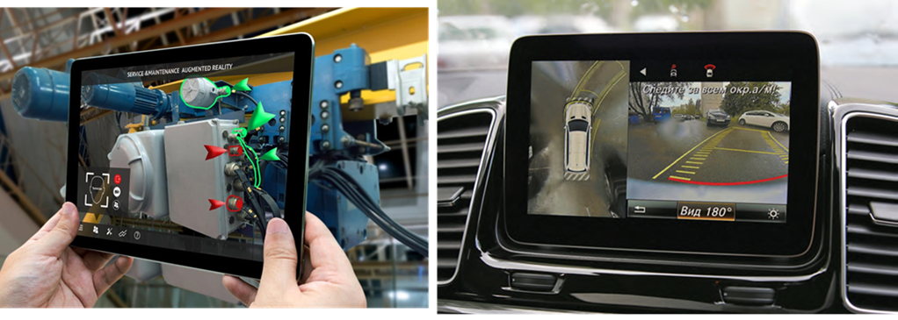
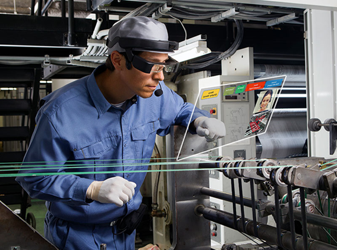
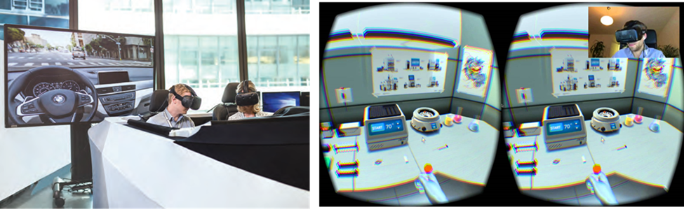

[<- До підрозділу](README.md)

# Доповнена та віртуальна реальність 

Термін **Людино-машинний інтерфейс** (**HMI**) описує методи взаємодії людей з комп’ютерами. Наряду з звичайними кнопками та індикаторами, наразі найбільш популярними засобами є операторські панелі з сенсорним екраном або автоматизовані робочі місця оператора на базі комп'ютера з клавіатурою та мишою. Однак з використанням нових технологій, вже сьогодні кардинально змінюються способи взаємодії з комп’ютерами та машинами. 

**Доповнена реальність (AR, Augmented Reality)** - це використання інформації в реальному часі у вигляді тексту, графіки, аудіо та інших віртуальних покращень, інтегрованих з об’єктами реального світу. Створення змішаних реальностей у режимі реального часу, які поєднують реальний світ із віртуальними елементами, пропонує надзвичайні застосування в промисловому середовищі. Це полегшує роботу та продуктивність працівників, надаючи їм можливість взаємодіяти та отримувати доступ до цікавої інформації на місці та систематично, пов’язаної з будь-яким реальним об’єктом. AR є одним із HMI з найбільшим потенціалом для розвитку та забезпечує високий вплив на ефективність виробництва. Слід звернути увагу, що AR розглядає людину як рушія операції, таким чином збільшуючи її потенціал. 

Застосувань для AR багато. Вони включають: покрокові інструкції зі збирання продукту, експертну допомогу для польового персоналу у віддалених місцях, навчання, контроль якості, контроль ефективності та продуктивності, інвентаризацію, пришвидшення логістики тощо. Технологія AR навіть дозволяє новачкам виявляти проблеми та виконувати ремонт, дотримуючись покрокових інструкцій. Один із прикладів використання доповненої реальності показаний на [цьому відео](https://youtu.be/ZWsBHISOqjA?si=7my-9D_eUO_CsI4v).

Іншим типом HMI є **Віртуальна реальність (VR)**. Доповнена реальність змінює постійне сприйняття середовища реального світу, тоді як віртуальна реальність повністю замінює реальне середовище користувача змодельованим. Віртуальна реальність в основному використовується для навчання та тренування (наприклад, для управління ризиковими ситуаціями) і для промислового прототипування. Віртуальна реальність зокрема дає можливість поринути у розроблювальний світ ще до того, як він буде створений фізично.   

