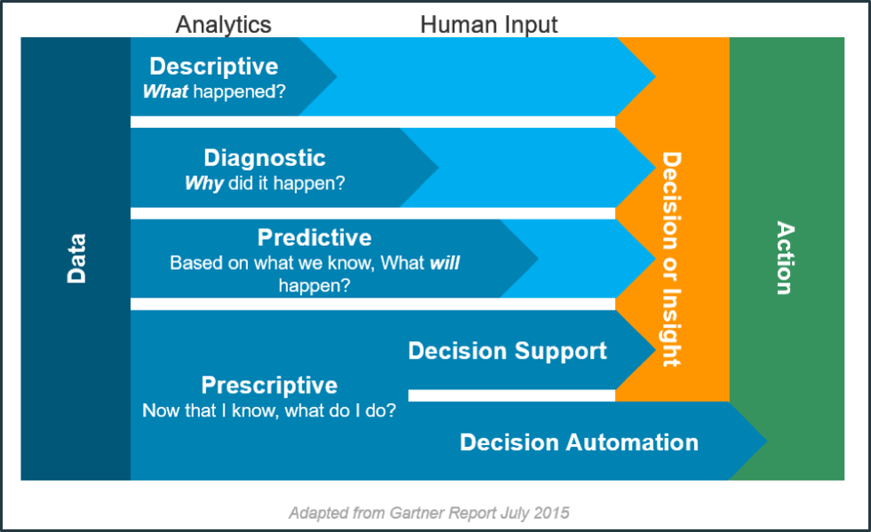

[<- До підрозділу](README.md)

# Великі дані та аналітика                                      

**Аналітика даних** – це наука про аналіз необроблених (сирих) даних з метою формування висновків щодо схованої в них інформації, що дозволяє підприємствам оптимізувати свою діяльність. Аналітика даних поділяється на чотири різні типи (див. рис. 1.5).

1. Описова аналітика (Descriptive analytics) визначає що саме сталося протягом певного періоду часу.
2. Діагностична аналітика (Diagnostic analytics) більше зосереджується на визначення причин того, що сталося в минулому.
3. Прогностична або предиктивна аналітика (Predictive analytics) зосереджена на тому, щоб вказати ймовірність того, що саме станеться в короткостроковій перспективі.
4. Наказова або прескриптивна аналітика (Prescriptive analytics) пропонує дії, які можуть запобігти тому, щоб щось сталося, або запропонувати оптимальні рішення.

Рис.1.5. Типи аналітики даних.

Перший тип, описова аналітика (Descriptive analytics), вказує на наявність проблеми, але не дає відповіді на причини їх виникнення. Це вимагає втручання людини, враховуючи, що особа, про яку йде мова, маючи доступ до інформації повинна зрозуміти цю проблему, прийняти рішення і, нарешті, діяти. На протилежному полюсі знаходиться наказова аналітика (Prescriptive analytics), в якій втручання людини є мінімальним, оскільки система здатна запропонувати курс дій або навіть прийняти рішення сама.

Останнім часом кількість та тип масивів даних які можна аналізувати значно збільшилася. Так з'явилися можливості оперувати з дуже великою кількістю даних, які часто неможливо зберігати та обробляти на одному комп'ютері. Такі дані прийнято відносити до **Великих даних (Big Data)**. У промисловому виробництві джерела інформації дуже численні та різноманітні: датчики, обладнання та установки, інтерфейси HMI, програми та інформаційні системи, оператори, Інтернет, соціальні мережі, електронні листи, відеокамери тощо. Тому Великі Дані — це величезна кількість різноманітної інформації, якою звичайні системи керування базами даних не можуть керувати та аналізувати за необхідний період часу, прийнятний для формування рішень. 

Аналіз Великих Даних зв'язаний з набором технологій, алгоритмів і систем, призначених для зіставлення великої кількості різних даних, з яких витягується цінна інформація за допомогою передових високошвидкісних аналітичних систем у режимі реального часу. 

Великі дані характеризуються так званою п'ятіркою V (див. рис. 1.6): 

- **volume** (обсяг) - кількість створених і збережених даних. Розмір даних визначає цінність і потенційне розуміння, а також те, чи можна їх вважати великими даними чи ні. Розмір великих даних зазвичай перевищує терабайти та петабайти.
- **velocity**(швидкість) - швидкість, з якою дані генеруються та обробляються, щоб відповідати вимогам і викликам, які стоять на шляху зростання та розвитку. Великі дані часто доступні в режимі реального часу. Порівняно з малими даними, великі дані створюються постійно. З великими даними пов’язані кілька типів швидкості - це частота генерації даних (frequency of generation) а також частота оброблення, запису та публікації (frequency of handling, recording, and publishing).
- **variety**(різноманітність) – тип і характер даних. Традиційні технології обробки системами керування реляційними базами даних ефективно обробляють структуровані дані. Однак зміна типу та характеру від структурованого (формат даних попередньо означеня) до напівструктурованого або неструктурованого (набір якихось текстів, чисел, фактів) кинула виклик існуючим інструментам і технологіям. Технології великих даних розвивалися з першочерговим наміром отримувати, зберігати та обробляти напівструктуровані та неструктуровані (різноманітні) дані, створені з високою швидкістю і величезними за розміром. Пізніше ці інструменти та технології були досліджені та використані також для оброблення та кращого зберігання структурованих даних. Зрештою, оброблення структурованих даних все ще залишалася необов’язковою, що може використовувати методи та інструменти великих даних, або традиційних систем керування базами даних. Це допомагає в аналізі даних для ефективного використання прихованої інформації, отриманої з даних, зібраних через соціальні мережі, файли журналів, датчиків тощо. Великі дані беруться з тексту, зображень, аудіо, відео; плюс він доповнює відсутні фрагменти шляхом об’єднання даних.
- **veracity** (правдивість) - правдивість та надійність даних, яка стосується якості та цінності даних. Великі дані мають бути не лише великими за розміром, але й надійними, щоб досягти цінності в їх аналізі. Якість отриманих даних може сильно відрізнятися, що впливає на точність аналізу.
- **value**(цінність) - здатність перетворюватися даним в цінність для бізнесу. Якщо з даних не можна отримати цінність, то їх аналіз зрештою не потрібен.

Рис.1.6. П'ять V великих даних.

Для аналізу Великих Даних часто застосовують алгоритми штучного інтелекту (ШІ, **AI** - Artificial Intelligence). Зокрема, використовуються техніки машинного навчання (**ML, machine learning**) — наукове дослідження алгоритмів і статистичних моделей, які комп’ютерні системи використовують для ефективного виконання конкретного завдання без використання явних інструкцій, покладаючись натомість на шаблони та висновки. У машинному навчанні правила генерування рішень формуються в моделі, яка навчається за наявними даними та очікуваним результатом.   

Великі дані та машинне навчання є ключовими інструментами та мають велике значення для різноманітного використання в промисловості та пропонують багато переваг, включаючи підтримку та автоматизацію прийняття рішень, інтелектуальне планування роботи на заводі, автоматичне налаштування машин відповідно до робочих нарядів, оптимізація контролю якості або прогнозне та приписне обслуговування.    