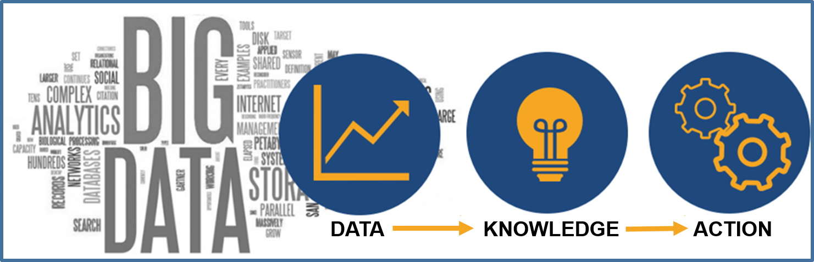
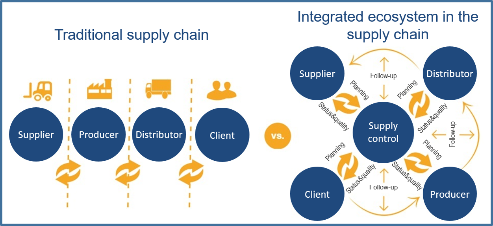

[<- До підрозділу](README.md)

### Виклики цифрового переходу

#### Чинники епохи

Як вже зазначено вище в епоху Індустрії 4.0 і відповідно цифрової трансформації підприємств і галузей правила гри змінюються. При цифровій трансформації необхідно врахувати наступні чинники, які характерні саме для теперішньої епохи:  

- **Взаємозв’язаність:** тепер як ніколи обладнання, персонал і промислові процеси взаємопов’язані. Дані збираються та аналізуються в глобальному масштабі, постійно оптимізуючи та полегшуючи процеси прийняття рішень. Фізичний світ сам стає інформаційною системою. Такі компанії, як FedEx, уже заявили, що «*інформація є ціннішою за будь-який транспортований товар*».

- **Висока швидкість змін та поява нових технологій:** технології і весь світ рухаються надзвичайно швидко. Раніше компанії перш ніж запроваджувати технології у власній компанії мали час відстежувати тенденції та чекати доказів успіху їх у подібних застосуваннях у різних умовах. Однак тепер нові можливості впроваджуються з кожним роком швидше, постійно з’являються революційні технологічні інновації, а користувачі освоюють нові технології з невпинною швидкістю.

- **Використання постійно змінних технологій:** здатність до адаптації є ключем до виживання в цю епоху, коли ринкові чинники та вимоги постійно змінюються. Довгостроковими переможцями будуть не ті, хто просто раз намагатиметься перейти на наступний рівень, а ті, хто постійно адаптується. Протягом наступних кількох років технології, які ще не повністю зрозумілі людям (наприклад, квантові обчислення), можуть надзвичайно вплинути на промислові системи. Компанії повинні підготувати свої команди, інфраструктуру та можливості для успішного використання потенціалу цих ще не зрілих технологій. Це також включає в себе навчання приймати керовані даними та швидкі рішення та прогресувати у дуже невизначених середовищах.

#### Завдання цифрового переходу

Трансформація в інноваційну компанію в контексті цифровізації не завжди може бути легким процесом. Серед багатьох факторів це вимагає часу, знань і відповідної екосистеми. Компанія яка планує зробити цифрову трансформацію повинна викоанати багато завдань, зокрема:

- По відношенню до ланцюжка створення вартості 
  - Інтегрування інформаційних систем
  - Створення належних мереж співпраці з усіма членами ланцюжка (OEM-виробники, рівні)
  - Зниження витрат на логістику
- По відношенню до виробництва 

  - Можливість гіперперсоналізації продуктів
  - Керування даними
  - Сумісність систем та інтеграція даних
  - Здатність монетизувати інформацію
  - Гарантія IT безпеки
  - Визначення нових бізнес-моделей
  - Забезпечення утримання талантів
- По відношенню до кінцевого користувача
  - Розуміння потреб клієнтів
  - Адаптація до нових цифрових каналів зв'язку
  - Подолання вищих труднощів для задоволення очікувань клієнтів

Ці завдання є викликами, через які більшість організацій повільно просуваються шляхом цифрової трансформації.  Щоб досягти успіху, управлінські команди повинні вийти за межі розпливчастих заяв про наміри та зосередитися на забезпеченні цифрового зв’язку в структурах, процесах і системах своєї організації, а також у її відносинах з іншими учасниками ланцюжка створення вартості, до якого вона входить як частина. Однак цифрова трансформація вимагає не лише впровадження технологій. Це вимагає, серед іншого, нових знань і нових професійних навичок, нової технологічної інфраструктури та активного керування виробничими даними як активом компанії, нової культури та організації праці. Цифрова трансформація гальмується не лише з точки зору обсягу необхідних інвестицій, але й труднощів у вимірюванні ефективності, обміну новими практиками в організації та впровадження змін у великому масштабі.  Відповідно до цих викликів, будь-яка компанія, яка прагне оцифрувати свої процеси та/або продукти та підвищити свої шанси на успіх трансформацій, повинна буде взяти до уваги та зіткнутися з наступними проблемами.

#### Керування активними даними

Для компаній у майбутньому дані стануть величезним надбанням, а навчання стане важливою здатністю. Керування активними даними стосується технічних інструментів, програмного забезпечення та процедур для організації (аналізу та застосування) активних даних. Йдеться про те, щоб зробити інформацію легкодоступною та доступною для користувачів з усіх частин організації, включаючи файли обробки текстів, електронні таблиці, дані баз даних, повідомлення електронної пошти, електронні календарі та менеджерів контактів.

Дані – це буквально «чуття» машин компанії та ШІ. Компанії повинні будуть інвестувати в збір даних (за допомогою датчиків, екосистем даних і партнерства, а також шляхом отримання дозволів клієнтів). Їм потрібно буде добре керувати своїми даними (інвестуючи в хмару та озера даних), щоб їх можна було використовувати, водночас належним чином захищаючи (з відповідними політиками конфіденційності та необхідною кібербезпекою). Дані є ключовим активом для цифрової трансформації компанії. Якщо фактичні (в реальному часі) дані процесу (а також продукти або послуги, що пропонуються клієнтам) доступні, можна ефективно здійснювати моніторинг, керування і приймати рішення на основі знань. Також стане можливим генерувати нові знання, які дозволять вдосконалювати та оптимізувати процеси одночасно, щоб надати їм більше «інтелекту» та автономії. 

Даними необхідно активно керувати на всіх етапах їхнього життєвого циклу: збирання, зберігання, аналіз, обмін та архівування за допомогою використання стандартів і визначення політики та належної практики.

Рис.1.10. Створення цінності завдяки активному управлінню даними 

Однак питання полягає не в тому, щоб мати дані заради них, а в тому, щоб вони були корисними відповідно до цінності, яку вони можуть створити. Компанії повинні будуть визначити власні *випадки використання* (конкретні ситуації, в яких потенційно можуть бути використані продукт або послуга), де дані можуть створити величезну цінність. Для цього їм потрібно буде оцінити дані за допомогою штучного інтелекту та розширеної аналітики, перетворити їх на бізнес-дії, відстежувати результати та створювати цикли навчання. Уже застосовані варіанти використання включають: прогнозне технічне обслуговування або керування машиною на виробництві; вдосконалене керування виробництвом або запасами або транспортуванням у ланцюзі поставок; підготовка кращих пропозицій або цін, або рекламних, або маркетингових повідомлень у комерційних функціях. Компанії, які успішно аналізують і використовують свої дані, прийматимуть кращі рішення, створюватимуть цінність і конкурентну перевагу.

#### Інтегрування даних і систем всередині компанії 

Згідно з попереднім пунктом і тим, як створити цінність за допомогою аналізу даних, іншим аспектом, який слід взяти до уваги та не менш важливим, є здатність інтегрувати різні інформаційні системи всередині організації (ERP, CRM, PLM, MES/MOM, SCADA, PLC тощо). Досягнення цієї інтеграції дозволить оптимізувати та зв’язати промислові процеси з рештою бізнес-процесів, таких як ті, що пов’язані з маркетингом і обслуговуванням клієнтів або послугами. 

Це великий виклик для компаній із різними наборами застарілих систем. Часто першим кроком є адаптація стеків даних і технологій для підтримки ключових випадків використання. Важлива частина виклику полягає в необхідності навести порядок і мати можливість інтегрувати різні стандарти та технології, що використовуються різними інформаційними системами, щоб можна було гарантувати зв’язок між ними та спільною платформою. 

Великою мірою це питання відноситься до однакового представлення ресурсів та діяльностей в цих інформаційних системах, тобто в спільних моделях даних. На сьогодні існують ряд стандартів та технології, які передбачають семантичну сумісність систем рівня керування підприємством (L4) та виробничими операціями (L3), зокрема ISA-95/IEC-62264 та B2MML, однак їх підтримка є далекою від повсякмісної. Крім того, велика частина процесів нерідко проводяться вручну, що також треба враховувати.   

#### Керування безпекою

Цифровізація приносить великі переваги, але вона також несе великі ризики, пов’язані з безпекою даних і залучених технологій. Необхідно передбачити та знати, як керувати створенням і впровадженням процесів, інструментів і конкретних рішень, щоб гарантувати безпеку інформаційних систем і всіх компонентів, а також «підключеного» обладнання та установок, які складають промислова мережа компанії.

У зв’язку з цим слід враховувати феномен кібератак як ризик, що зростає. Кібератаки є найшвидше зростаючим злочином у США, і вони зростають у розмірі, складності та вартості. Витрати, пов’язані з кіберзлочинністю, включають пошкодження та знищення даних, викрадені гроші, втрату продуктивності, крадіжку інтелектуальної власності, крадіжку особистих і фінансових даних, розкрадання, шахрайство, порушення нормального ходу діяльності після атаки, судове розслідування, відновлення та видалення зламаних даних і систем, а також шкоди репутації. Вплив атак на безпеку може бути дуже важливим і вплинути на продуктивність компанії, її репутацію перед клієнтами та її конкурентоспроможність загалом, і може завдати значної економічної шкоди, а в деяких випадках навіть поставити під загрозу його життєздатність. Кібератаки можуть також привести до шкоди навколишньому середовищу, здоров'ю та життю людей. 

Проте ряд досліджень щодо останніх великих витоків даних показало, що лише третина з них були спричинені неадекватними технологіями безпеки. У переважній більшості випадків порушення було результатом організаційного збою, збою процесу або недбалості співробітників. Таким чином, кібербезпека є проблемою не лише для ІТ-відділу компанії, але й для всіх співробітників компанії.

#### Керування та залучення талантів з потрібною кваліфікацією

Організації в майбутньому виглядатимуть зовсім інакше й працюватимуть зовсім інакше, ніж сьогодні. Роль талантів у компаніях у майбутньому передбачатиме вищий рівень взаємодії з інтелектуальними технологіями, а організаційна структура відіграватиме ключову роль у переосмисленні традиційних ролей. 

У майбутньому з’явиться ціла область нових ролей, які значно набудуть ваги протягом наступних років, тоді як інша область профілів роботи ставатиме все більш зайвою. Багато робочих місць можуть бути витіснені через цифровізацію промисловості та застосування нових технологій, але при цьому з'являться додаткові робочі місця. 

Компанії будуть боротися за талановитих співробітників, здатних використовувати існуючі цифрові технології та адаптуватися до нових методів і підходів. Компаніям знадобляться люди зі знаннями в області  моделе-орієнтованого і технічними навичками, включно з експертами з UX/UI, науковцями з даних та інженерами з обробки даних і технологій. Більшу цінність будуть мати співробітники, які є гнучкими, здатними (і бажаючими) навчатися та адаптуватися. Щоб залучати, розвивати й утримувати потрібних їм людей, лідери повинні адаптувати свої організації в багатьох сферах.

Людський потенціал дедалі більше потрібно буде використовувати для проектування, аудиту та інноваційних процесів, а не для їх експлуатації. Сучасну організаційну модель, яка базується на ієрархії, означенні ролей і каскадних моделях планування, необхідно буде адаптувати або замінити. Багатопрофільні «групи гнучких вдосконалень» працюватимуть з машинами, щоб покращити клієнтський досвід і операційні процеси бізнесу. Ці команди можна постійно оптимізувати за допомогою машинного навчання. Вони рухатимуться до цього стану за допомогою підходу тестування та навчання, який швидко покращує продуктивність. Зміни включатимуть руйнівне скорочення робочої сили та більшу потребу в адаптивних талантах у різних місцях. Компанії повинні будуть значно більше інвестувати в навчання та перепідготовку.

Таким чином, компанія, яка керує кадрами, повинна стикатися, серед іншого, з проблемами, як включити цифрову культуру суспільства в промислове середовище, як дозволити цифрову трансформацію різних робочих місць із запровадженням нових технологій, і як залучити та утримати таланти та досвід у нових навичках, таких як великі дані, кібербезпека чи використання нових бізнес-моделей, ключів до цифрової трансформації.

#### Співпраця та координація із зацікавленими сторонами та промисловою екосистемою 

Цифрова трансформація виходить за рамки внутрішнього процесу підприємства. Іншими словами, відбувається не лише автоматизація внутрішніх процесів, а й вплив на зовнішні процеси, які дозволяють компанії спілкуватися та координуватись із зовнішнім світом. У цьому сенсі цифрові технології дозволяють обмінюватися інформацією, оптимізуючи та полегшуючи відносини з усією екосистемою, від постачальників і партнерів до кінцевих клієнтів. Це може зробити можливим перейти до ефективності та переваг усього ланцюжка створення вартості на глобальному рівні, тим самим значно покращуючи ефективність усіх процесів ланцюжка створення вартості, наприклад, з маркетингом нових продуктів, мінімізацією інцидентів якості та відходів, усунення несправностей або відстеження всього ланцюга, серед іншого.

Тут інноватори зіткнуться з проблемою, як керувати взаємовідносинами з екосистемою як на рівні послуг, так і на рівні угод про якість, стандарти сумісності, інтеграції технологій та інформаційних систем, керування інтелектуальною власністю, отриманою з інформації та спільних знань, або від керування експлуатацією спільних бізнес-моделей. Треба також не забувати, що даними потрібно керувати стратегічно, знаходячи правильний баланс між їх обміном і захистом.

Рис.1.11. Традиційний ланцюг постачання у порівнянні з інтегрованою екосистемою 