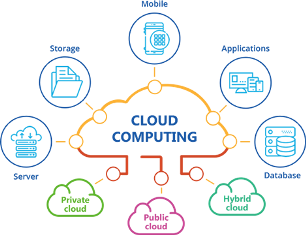

[<- До підрозділу](README.md)

# Хмарні обчислення                                        

***Хмарні обчислення*** (Cloud Computing) — модель забезпечення повсюдного та зручного доступу через мережу на вимогу до загальнодоступного набору обчислювальних ресурсів, що підлягають налаштуванню (наприклад, до комунікаційних мереж, серверів, засобів збереження даних, прикладних програм та сервісів), і які можуть бути оперативно надані та звільнені з мінімальними затратами на керування та зверненнями до провайдера.

Поняття «хмара» відноситься до інфраструктури обчислювальних служб (сервери, мережі, спеціалізоване ПЗ, обслуговуючі ресурси, тощо), які зазвичай надаються відповідно до запиту. Набір ресурсів (обчислень, мереж, сховищ і пов'язаних з ними програмних сервісів) може динамічно масштабуватися в бік збільшення або зменшення в залежності від середнього навантаження і якості обслуговування. 

Хмари, як правило, - це великі центри обробки даних, які надають клієнтам послуги, орієнтовані на зовнішнього споживача, і модель оплати за використання. Ці центри створюють ілюзію єдиного хмарного ресурсу, в той час як насправді може бути використано багато географічно розподілених ресурсів (наприклад серверів). 

Компанія може мати власну "приватну" хмару, що базується на власних обчислювальних ресурсах. У противагу "публічним" хмарам це потребує обслуговування однак все ще має переваги хмар, так як дає можливість оптимально використовувати обчсилювальні ресурси а також користуватися існуючими хмарними рішеннями.  

Хмарні обчислення передбачають зміну парадигми по відношенню до традиційної моделі, яка завжди базувалася на поступовому придбанні та встановленні нового апаратного забезпечення, і яка, як наслідок, є надзвичайно обмеженою через свою вартість (наприклад, придбання обладнання, ліцензії на програмне забезпечення, обслуговування тощо). На противагу цьому хмарні обчислення дозволяють використовувати обчислювальні послуги через мережу, як правило, Інтернет, таким чином, що компанія платить лише за ресурси, які вона використовує, що робить технічно та економічно життєздатним отримання доступу до великих обчислювальних ресурсів .

Модель пропонує важливі переваги для компанії, оскільки вона дозволяє їй отримувати доступ лише до тих ресурсів, які необхідні гнучким і економічно ефективним способом, але з додатковою перевагою можливості коригувати масштаб та/або збільшувати ресурси за необхідності у будь-який момент. Хмарна модель є ключовим елементом для отримання інших технологій, таких як великі дані, методи машинного навчання або моделювання, і тому незамінна для будь-якої галузі, яка бажає прийняти I4.0.

Хмара також надзвичайно корисна для полегшення обміну даними між виробничими майданчиками та між компаніями. Продуктивність хмарних технологій з кожним роком покращується, досягнувши часу реакції в мілісекунди. У результаті машинні дані та функціональні можливості все частіше розгортатимуться в хмарі, забезпечуючи більше послуг, керованих даними, для виробничих систем.

Як вже визначалося раніше, з розвитком обчислювальних можливостей невеликих комп'ютерів, хмарні технології можна використовувати на Edge Gateway, що робить системи гібридними, де частина сервісів запускається в обчислювальних центрах а інші - на Edge пристроях. Таку технологію прийнято називати "Туманними обчисленнями" ([Fog Computing](https://en.wikipedia.org/wiki/Fog_computing)).   

Хмарні обчислення базуються на наступних технологіях:

1. Віртуалізація. Віртуалізуватися можуть різні ресурси: Hardware virtualization, Server virtualization, Storage virtualization, Operating system virtualization, Data Virtualization і т.д..
2. Сервіс-орієнтована архітектура (плата проходить тільки за сервіс).

3. Розподілені обчислення (для роботи використовується декілька машин або програм).