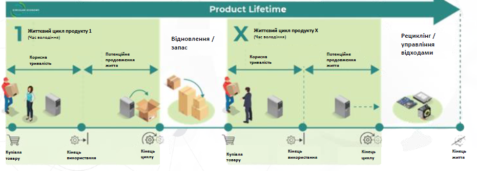
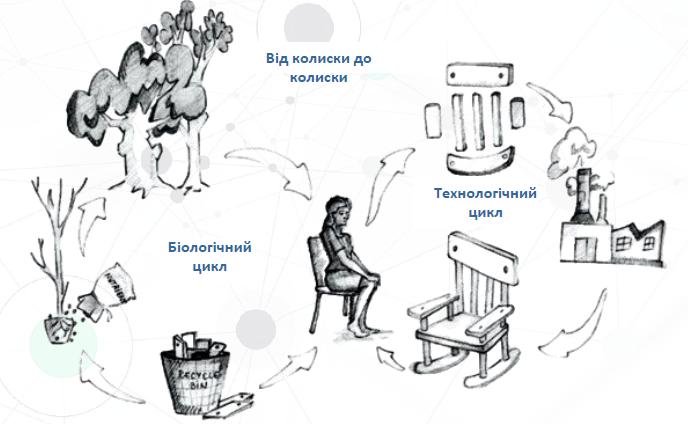
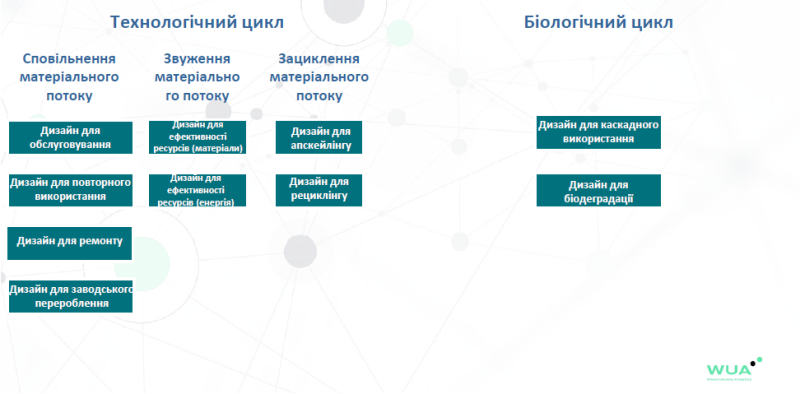
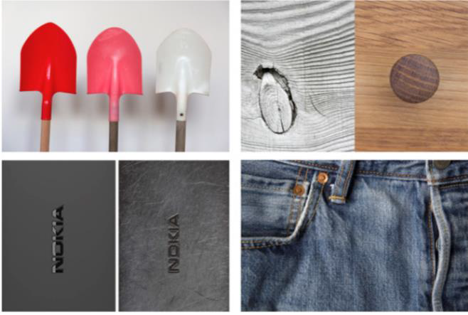
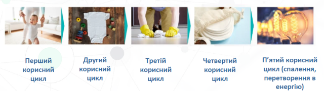

[<- До підрозділу](README.md)

# Циркулярний дизайн

### Ідея циркулярного дизайну 

Загалом дослідження показують, що 80% негативного впливу на навколишнє середовище закладене на стадії проектування, тобто в дизайні. Це значить, що вже на стадії проектування можна вплинути на те, як продукція буде використана, і, фактично, яка її доля буде після споживання і після використання. І саме на цю стадію життєвого циклу (проектування, дизайн), особливо варто звернути увагу. 

Всі активності та процеси, які намагаються закрити потік матеріалів в ідеальну петлю, можуть розглядатись підходами циркулярного проектування (в контексті процесів), або циркулярного дизайну (в контексті результату).

Є різниця між сталим дизайном і циркулярним дизайном, хоча ці терміни не взаємовиключні. Сталий дизайн - це більш широкий термін, циркулярний дизайн - це як підкатегорія сталого дизайну. Але загалом можна сказати, що якщо ви говорите про виробництво, де ваша продукція споживає менше енергії, води і ресурсів, то мова більш йде про сталий дизайн. Якщо ви говорите, що по вашому дизайну продукція знов повернеться на виробництво, або матеріали знов повернуться, або вона буде якимось чином відновлена, то це вже про стратегії, що пов'язані з циркулярним дизайном. 

Вплив циркулярного дизайну можна схематично показати на рис.5.7 в комнтексті життєвого циклу продукту, починаючи з етапу купівлі. У цьому підході можна вважати, що є кілька життєвих циклів продукту, кожен з яких можна вважати часом володіння цим продуктом. Тільки після n-го циклу продукт йде на переробку. 

рис.5.7. Розуміння циркулярного дизайну продукту через схему багатьох життєвих циклів 

Розглянемо приклад пральної машини, яку купила сім'я. У цієї машини є певний термін придатності, і фактично весь перший цикл говорить про те, що протягом якогось періоду часу, наприклад 3-5 років ця машина буде служити. Після цього вже там можуть виникати технічні проблеми, коли сім'я вирішує  чи потрібно ремонтувати чи позбутися, або сім'я хоче купити нову техніку. Так завершується перший цикл для цього продукту, і продукт може передатися на ремонт або відновлення, після чого може перейти до іншого власника, наступає 2-й цикл. Таких циклів для техніки (технічні цикли) може бути кілька, і з точки зору циркулярного дизайну, чим більше - тим краще. Для біологічних продуктів циклів також може бути декілька, але в цьому випадку продукти можуть бути утилізовані одразу після першого використання. На деяких циклах продукт може використовуватися по іншому. У кінці кожного циклу користувач вирішує чи досі корисний та/або придатний продукт і що з ним робити. Після всіх можливих циклів використання пральна машина розглядається як сукупність матеріалів, і її можна розібрати на частини, переробити і повторно використати при виробництві подібної або іншої техніки.    

Тобто з точки зору циркулярної економіки для бізнесу важливо проектувати продукти таким чином, щоб цих циклів використання, відновлення та ремонту було максимально багато і матеріали які є в цій машині  підлягали відновленню і могли бути використані десь в майбутньому. Тобто щоб час життєвого циклу був максимально довгий. 

Як вже було зазначено, важливо мати системне бачення і розуміти весь цей життєвий шлях, його стадії і етапи. Це у свою чергу дасть можливість визначити як на нього можна вплинути, які елементи дизайну і які інноваційні підходи можна привнести для того, щоб цих циклів було багато, щоб була можливість ремонту, обслуговування та відновлення матеріалів. 

Таким чином в лінійній економіці на стадію пост споживання, поствикористання фактично не звертається уваги, її там фактично не існує. Тобто в даній лінійній моделі більшості бізнесу байдуже яким чином його продукція буде використана, і що буде після цього. А в циркулярній економіці на це звертається особлива увага і цей процес є контрольованим і керованим. Коли це контрольований процес, це дає додаткові можливості для різних бізнес-моделей і для досягнення фактично всіх цілей, про які зазначалося в циркулярній економіці. 

### Особливості дизайну у біологічних та технологічних циклах

Зазвичай біологічні та технологічні цикли розділяють (рис.5.8).

рис.5.8. Технологічний та біологічні цикли.

**Біологічні цикли** розглядають в термінах використанням біологічних або біорозкладних первинних матеріалів, наприклад деревина. Вони можуть бути перероблені або використані в інших цілях. Необхідно обміркувати біологічний ресурс, його процес та тривалість росту, сегмент ринку, та тривалість життєвого циклу продукту. Життєві цикои повинні бути спроектовані таким чином, щоб біологічний матеріал встигав відновлюватися. Наприклад, щоб бути по справжньому сталим, виріб з деревини для масового ринку має мати термін служби таким же як час зростання 3-х таких дерев, з яких він зроблений.

**Технологічні цикли** розглядають з точки зору використання матеріалів, які не можуть бути повернуті в природу, бо вони синтезовані і не розпадаються (наприклад пластик). Тільки реінтеграція технічних матеріалів у матеріальний потік дозволить багаторазове використання матеріалів. При цьому використання небезпечних матеріалів, хімічних продуктів або рідкісних матеріалів має уникатись. Скорочення втрат матеріалів через покращення можливості розбирання є критичним для циркулярної економіки.

Бізнес має робити кроки щоб спростити користувачам можливість самостійного ремонту та продовження циклу використання. Ремонт не має бути дуже дорогим але і техніка не може бути дуже дешевою. Саме у проектуванні технологічного циклу обов'язково треба враховувати: 

- контекст, як ця продукція використоується
- який існує ринок
- як відноситься до цього замовник
- який це виробничий процес, на скільки роботизований
- зручність обслуговування
- на скільки дорого розробити інфраструктуру для відновлення.

Є багато простору для цифрових рішень, які дають розуміння для продовження циклу корисності та повторного використання:

- які продукти, компоненти та матеріали
- як реінтегрувати в систему
- пропонувати скоріше послугу користування, аніж продукт
- продуктовий дизайн та використання інших бізнес моделей впливає на потік матеріалів

### Стратегії циркулярного дизайну в технологічному циклі

Існують три стратегії щодо циркулярного дизайну в технологічному циклі:

- сповільнення матеріального потоку - використання матеріалів довше в часі
- звуження матеріально го потоку - зменшення кількості матеріалу
- зациклення матеріального потоку - повторне використання матеріалу

З точки зору організації цього процесу в циркулярному дизайні можна виділити виробничі системи закритого та відкритого циклу. 

Виробничі компанії закритого циклу виробляють свою продукцію і контролюють повністю те, як товар виходить на ринок, як відновлюється та повертається назад. У цих системах простіше контролювати усі процеси, бо вони виконуються тією ж компанією. Але такі виробничі системи притаманні лише для досить великих компаній, які вже давно працюють на ринку.  

Більшість компаній працюють у виробничих системах відкритого циклу, коли продукт створюється однією компанією, а відновленням, ремонтом та переробкою займаються інші компанії. Трансфер цінності продукту тут лежить на користувачеві, а виробники не мають ефективного контролю над якістю сервісу третіх сторін. У таких системах  потребується кооперація і координація між учасниками ринку і це фактично впливає на бізнесову компоненту. 

У циркулярних бізнес-моделях як для закритих так і для відкритих систем використовують кілька паттернів (підходів), зокрема:

- Нові моделі власності
- Пропозиції цінності
- Доступ перед прибутком (для бізнесу)
- Особи можуть мати доступ до товарів поза їх фінансовими можливостями

Для кожного технологічного біологічного циклу і для кожної дизайн стратегії є кілька можливих дизайнів(рис.5.9) 

рис.5.9. Різні підходи до дизайну 

#### Дизайн для обслуговування

Цей дизайн направлений на спрощення обслуговування, повернення до стану придатного до використання та зменшення часу ремонту. Тут можна робити кілька акцентів:

- Дизайн для ремонтопридатності націлені на спрощення ремонту. Це може передбачати використання стандартних компонентів, спрощення та модульності продукції, використання доступних запчастин (наприклад типових, стандартизованих). Також при розробці увагу варто приділити маркуванню та доступності документації по обслуговуванню та ремонту. 
- Дизайн для апгрейду (оновлення) направлений на можливість вдосконалення в майбутньому. Наприклад автомобіль тесла оновлюється через ПЗ. Продукт також може бути оновлений через заміну компонентів.     
- Дизайн для надійності. Це можливо за рахунок використання прогнозування можливих причин поломок через предикативні моделі та запобігання їм відповідними засобами, або використання дуже стійких до часу та зношення компонентів.

#### Дизайн для повторного використання

Цей дизайн передбачає що власник продукту може змінитися на початку кожного наступного життєвого циклу продукту. Як і в попередньому дизайні це потребує врахування необхідності обов'язкового обслуговування між циклами, апгрейду і надійності. Крім цього важливими аспектами є простота, зручність та доступність. Тут можна робити кілька акцентів:    

- Дизайн для автентичності поза часом, що передбачає таку форму продукту, яка буде мати стильний вигляд незалежно від часу та трендів. Продукт із збалансованим та «нейтральним» дизайном буде слугувати довше. 

- Дизайн для граційного старіння базується на іншій ідеології, коли при проектуванні продукту враховують що час впливатиме на зміну вигляду продукту, але старіший продукт при цьому матиме гарну форму (рис.5.10). 
- Дизайн для повернення передбачає що продукт буде повертатися виробнику кожного разу пере наступним циклом за рахунок винагороди або викуповування. Звісно повинні враховуватися матеріали та застосування продукту. 

рис.5.10. Приклади дизайнів продуктів граційного старіння.

#### Дизайн для ремонту

Цей дизайн передбачає що продукт може тестуватися і ремонтуватися третіми особами, а отже націлений на те, щоб перевірити правильність ремонту та працездатності продукту післямремонту. Зокрема цей дизайн передбачає можливість розбірки та збірки виробів, а саме:

- спрощення продукту
- зменшена кількості запчастин

Такий підхід дає можливість знизити витрати на процеси та накладні витрати, так як продукт є простішим, при цьому має вищу ефективність та коротший час виходу на ринок.

#### Дизайн для заводського перероблення

Деякі речі можна відновити тільки на заводському обладнанні тому цей дизайн передбачає один з 2-х варіантів:

- Відновлення використаних продуктів для нових цілей
- Відновлення цінності від продуктів на етапі «кінець циклу»

Як вказано в [[3](https://wedocs.unep.org/handle/20.500.11822/31614)], це "Стандартизований промисловий процес, що відбувається в промислових або заводських умовах, у якому товар відновлюються до початкового стану, як новий, з тією ж продуктивністю або краще. Процес відновлення відповідає конкретним технічним специфікаціям, включаючи стандарти інженерії, якості та випробувань, і зазвичай дає продукти з повною гарантією. Виробниками відновлених товарів вважаються фірми, які надають послуги з відновлення вживаних товарів до початкового робочого стану". 

Можна виділити наступні кроки до заводського перероблення:

- Товари відправляються до виробника повністю
- Виробник розбирає та очищує товар
- Дефективні, пошкодження чи зламані компоненти замінюються
- Компоненти збираються та перевіряються на якість
- Товар знову продається на ринок з гарантією

#### Дизайн для апсайклінгу

Є кілька трактувань поняттю **апсайклінг (Upcycling)**. 

- «… матеріал або продукт, який спроектований таким чином, щоб повернутись назад в технологічний цикл, в індустріальний метаболізм з якого він вийшов» Cradle to Cradle, Braungart and McDonough

- «… «Сила повного циклу» … лежить у факті, що незабруднені матеріальні потоки, збільшують збір та розподільчу ефективність, при цьому зберігаючи якість, особливо у технологічному циклі, який, в свою чергу, збільшує довговічність продукту і таким чином збільшує ефективність матеріалу.» Ellen MacArthur Foundation

Тобто це повторне використання матеріалу поверненого з продукту і при цьому цей матеріал не втрачає якості. 

Дизайн для апсайклінгу може передбачати що матеріал з продукту використається повторно для наступного продукту для тих же цілей. Наприклад банки для напоїв можна використовувати для створення нових банок для напоїв. Іншим прикладом є використання високоміцних матеріалів при виробництві меблів, щоб щоб повернутись в індустріальний потік.

#### Дизайн для рециклінгу

У противагу до апсайклінгу  **Даунсайклінг (Downcycling, cascading)** відноситься до переробки (рециклінг) відходів, матеріал яких є нижчої якості тому не може бути використаний в тому ж вигляді для того ж використання (див. таб.2.1). 

Таблиця 2.1. Порівняння апсайклінгу та даунсайклінгу

| апсайклінг                                                  | даунсайклінг                                                 |
| ----------------------------------------------------------- | ------------------------------------------------------------ |
| Відноситься до технологічного циклу                         | Відноситься практично до всіх існуючих активностей переробки |
| Використовується другий раз з тією самою метою, що і перший | Багато матеріалів не можуть бути використані з тією самою метою вдруге |
| Зберігає фізичні, механічні та косметичні властивості       | Багато матеріалів не зберігають фізичні, механічні та косметичні властивості |
| Зазвичай присутній в системах закритого циклу               | Не завжди працює в системах закритого циклу                  |

Дизайн для рециклінгу - це найбільш відома та широковживана стратегія дизайну. Вона знижує потребу в нових матеріалах, скорочує кількість відходів пов’язаних з видобуванням первинних матеріалів. Необхідно врахувати те, що різні матеріали мають різну ступінь переробки. Також треба враховувати де і як продукт буде використаний та його вміст, тобто з якими матеріалами разом, та як ці матеріалу будуть перероблені.

Стратегія приводить до мінімізації використання матеріалів, запчастин, матеріалів в кожній запчастині, кількість типів матеріалів. Дизайн також направлений на полегшення сортування відходів. Наприклад для правильної переробки пластику, на ньому відображають [код](https://uk.wikipedia.org/wiki/%D0%9A%D0%BE%D0%B4_%D0%BF%D0%B5%D1%80%D0%B5%D1%80%D0%BE%D0%B1%D0%BA%D0%B8).

#### Звуження матеріального потоку

Звуження матеріального потоку напряму не пов’язано з концепцією циркулярності продукту, бо не промотує повернення продуктів у систему. Натомість ця стратегія зменшує кількість матеріалів задіяних при виготовленні продукту. Серед можливих дизайнів можна виділити наступні:

- Дизайн для оптимізації направлений на використання мінімальної кількості матеріалів, проте на міцний та компактний дизайн. Зменшення кількості матеріалів напряму впливає на навколишнє середовище, так як менше відходів та впливу під час транспортування як матеріалів так і продукції до пунктів зберігання. Якість продукції залежить від кількості матеріалів.

- Дизайн для матеріалів з малим впливом направлений на використовування меншої кількості небезпечних матеріалів, більш екологічних замість синтетичних процесів, використання матеріалів та технік виробництва, які споживають менше енергії та води.
- Дизайн для мініатюризації. Мініатюризація заохочує використовувати менше матеріалів, враховує розбірку продукту, доступність компонентів.

- Дизайн для дематеріалізації передбачає цифровізацію товару. Прикладом є введення електронного документообігу, цифрові книги, тощо. Однак варто зауважити що оцифрування не завжди призводить до скорочення матеріалів (наприклад CD/DVD).

- Дизайн для використання місцевих ресурсів застосовується, як до продукту так і до упаковки. Це зменшує потребу в ресурсах з різних частин світу. Повітряний транспорт найменш дружній до довкілля, тому використання місцевих ресурсів зменшує викиди в атмосферу. Також цей дизайн направлений на ефективне планування логістики та дистрибуції.

#### Дизайн для ефективності ресурсів (енергія)

Цей дизайн направлений на зменшення інтенсивності використання матеріалів, що передбачає вибір матеріалів, які можуть каскадно впливати на всю систему. При цьому аналізується життєвий цикл продукту. 

До цієї стратегії відноситься дизайн для енергоефективності процесів. Наприклад, холодильник використає за час терміну служби більше енергії, ніж витрачено на його виробництво. Тому кількісний аналіз потенційної спожитої енергії протягом терміну служби буде критерієм, який треба мінімізувати.

#### Дизайн для каскадного використання

Під каскадним використання матеріалів розуміють використання в послідовних циклах з різною метою того самого продукту. Загальні методи в біологічних циклах також можуть бути використані в технологічних циклах. При першому використанні продукт є найвищим в цінні, а при останньому - найнижчим. Важливо розуміти пріоритетність використання ресурсів.

рис.5.11. Приклад дизайну для каскадного використання. 

#### Дизайн для біодеградації

Цей дизайн для продуктів з біологічним циклом. Коли не має альтернативи використанню продукту і матеріалу після застосування. Це продукти з короткою або дуже короткою тривалістю служби, наприклад біорозкладні замість пластикових пакетів в магазинах. 

Цей дизайн потребує дослідження на рахунок того, як продукт може бути розібраний та біоперероблений. Це потребує додаткових затрат на саму біопереробку, тому потребує спонукання користувача до цих дій.

### Вплив на поведінку користувачів

У дизайн продукту необхідно закласти механізми стимулювання користувачів до задіяння їх впливу на  циркулярність. 

Тут можна виділити кілька підходів:

- Дизайн для екологічного зворотного зв’язку, коли користувач може зв'язатися з виробником для покращення продукту.
- Дизайн на заохочення управління - керування користувачем енергоефективністю продуку та контролю за ним.
- Дизайн для переконливих технологій (обмеження використання) - по замовченню багато речей обмежується 

За матеріалами [Андрія Гнапа](https://www.facebook.com/andrey.gnap). 

[Гостьова лекція з дисципліни Стратегія цифровізації підприємств на тему "Перехід до циркулярної економіки". Андрій Гнап.](https://youtu.be/nOkJSJf4jKU)