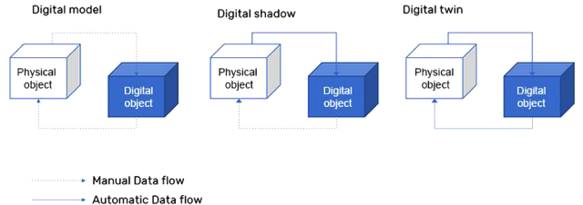

[<- До підрозділу](README.md)

# Імітаційне моделювання та цифрові двійники                                           

**Імітаційне моделювання** (**Simualtion**) не є якоюсь новою технологією і вже більш ніж півстоліття використовується при проектуванні. У основі стоїть комп'ютерна модель, яку використовують для перевірки її поведінки в часі за різних умов і різних діяльностях. Це дає можливість перевірити властивості та функції речі без її фізичного використання. 

Так, наприклад, імітаційне моделювання продуктів за допомогою віртуальних прототипів (імітаційних моделей) дозволяє оптимізувати етап проектування нових продуктів із мінімізацією витрат на розробку та скорочення тривалості маркетингового періоду. Це можливо за рахунок використання різноманітних експерементів на моделях, що робиться швидше, дешевше і у будь який момент часу. Технології 3D-моделювання продукції також дозволяють здійснювати високоточне керування якістю виробленої продукції. 

Віртуальне відтворення заводу (яке може включати машини, продукти та людей), за допомогою якого моделюється продуктивність відповідного заводу, дозволяє оцінити придатність різних альтернатив конфігурації на заводі та проаналізувати його поточну здатність реагувати, коли стикаються з різними прогнозованими сценаріями попиту. Без імітаційного моделювання це б було просто неможливим через потрібний час і витрати.

До недавнього часу імітаційне моделювання використовувалося здебільше на початкових стадіях життєвого циклу ще до відсутності реального обєкту, для якого робилася модель. Розвитком таких технологій сьогодні стали так званні **цифрові двійники** (**Digital Twin**) - імітаційна модель складної системи, яка на відміну від традиційного моделювання, підключається в режимі реального часу до фізичного об'єкту, для якого створено модель та збирає згенеровані дані. Це дозволяє цифровому двійнику підвищити свою точність на основі реальної системи, а також аналізувати систему або виконувати тести, які були б надто дорогими або трудомісткими для виконання на реальній системі. 

Через відсутність достатньої кількості стандартів концепція цифрового двійника все ще відрізняється у різних експертних колах. Одна з класифікацій базується на рівні способу обміну даними (ручний або автоматичний) між фізичним і цифровим аналогом (рис.1):

- **Цифрова модель (Digital Model)** використовує лише ручну передачу даних між реальним/фізичним активом і віртуальною моделлю. Більшість не вважали б це справжнім цифровим двійником, оскільки ручний обмін даними не дозволяє цифровому об’єкту мати доступ до даних у реальному часі.
- **Цифрова тінь (Digital Shadow)** включає односторонній автоматичний потік даних від фізичного активу до цифрового представлення.
- **Цифровий двійник (Digital Twin)** забезпечує автоматичний обмін даними в обох напрямках між фізичним активом і віртуальною моделлю. У цьому випадку цифровий двійник здатний контролювати фізичний об’єкт на основі рішень цифрового двійника.

рис.1. Різні типи зв'язку моделей з реальним об'єктом 

Усі ці приклади демонструють величезний потенціал, який можуть запропонувати технології віртуалізації та імітаційного моделювання, щоб стати більш ефективним і конкурентоспроможним.
