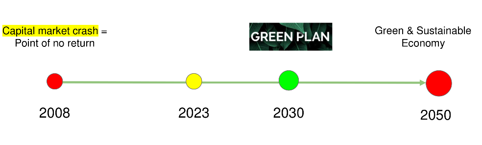
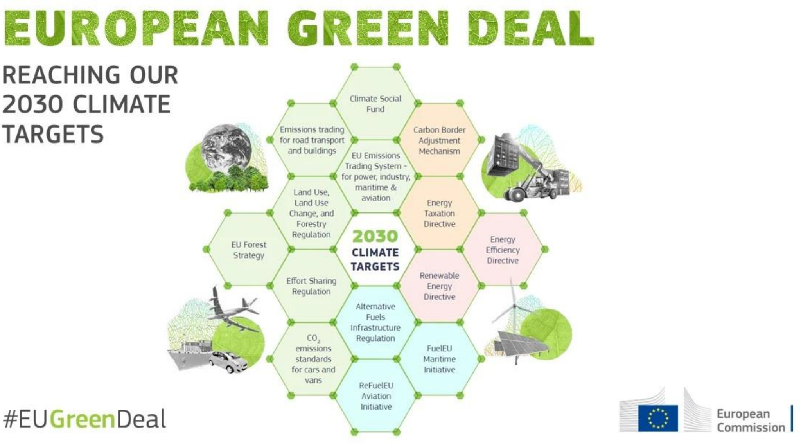
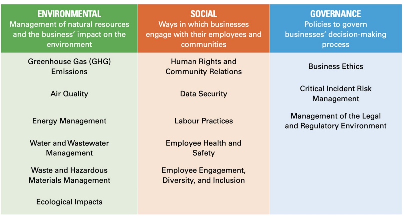
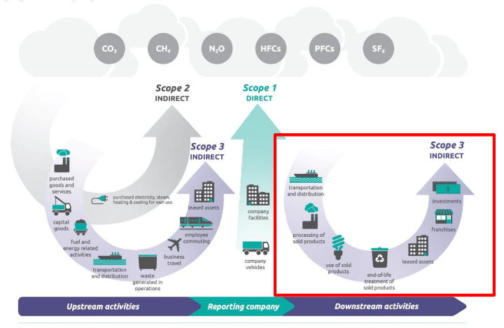
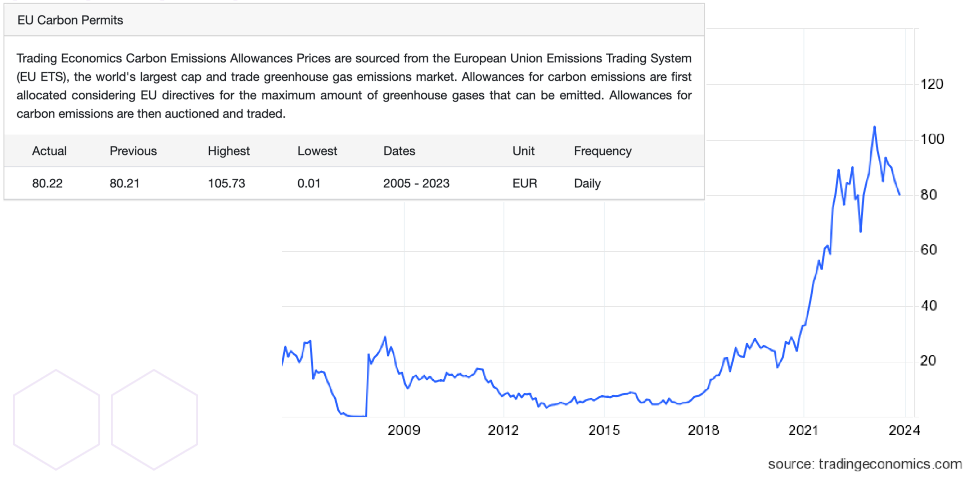
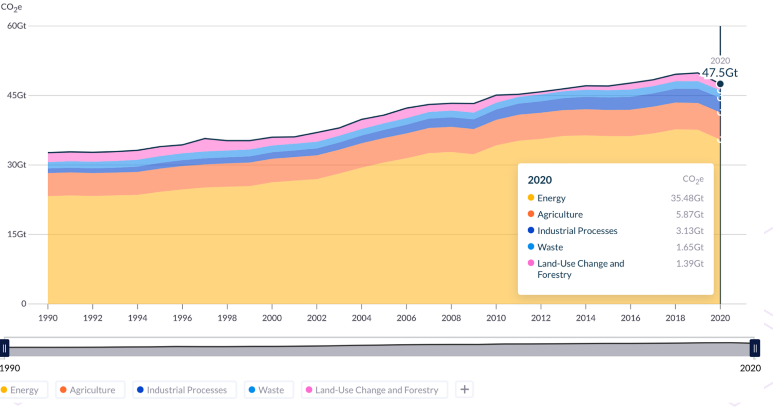
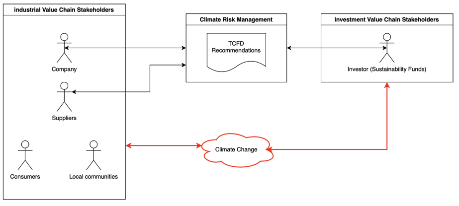
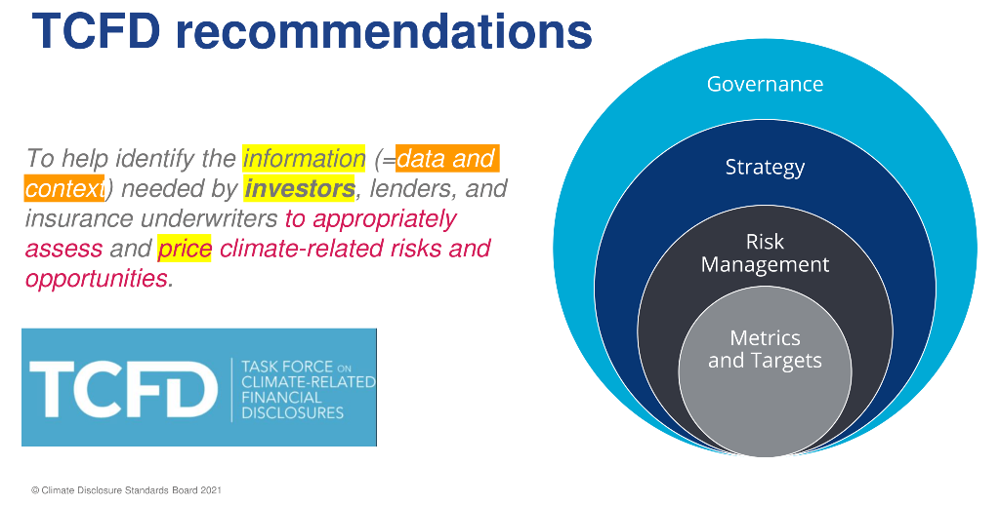

[<- До підрозділу](README.md)

# Принципи та стандарти ESG

## Концепції

### Кризові явища та необхідність зеленого переходу

Для початку варто розглянути які виклики зараз існують і які кризові явища спричинили розвиток нових моделей побудови економіки всієї промисловості, а не тільки на окреме підприємство. По-перше, це економічна криза, яка викликана тим, що система капіталізму досягла межі свого розвитку, спричиняючи системну кризу. Цей стан справ стимулює пошук нових економічних та бізнес-моделей, узгоджених з принципами ESG.  По-друге, це кліматичні зміни. Науковий консенсус визначає промислове виробництво як ключовий фактор зміни клімату. Підприємства повинні уважніше враховувати свій вплив на навколишнє середовище та приймати заходи для зменшення негативних наслідків. По-третє, це криза вичерпання енергетичних ресурсів. Росте потреба в енергії при обмежених можливостях її видобутку. Це у свою чергу вимагає розробки ефективних та стійких енергетичних моделей, з використанням відновлювальних джерел енергії. У зв'язку з цими викликами підприємства повинні адаптуватися до нових умов, розвиваючи підходи, які враховують принципи сталого розвитку та ESG, для збереження своєї конкурентоспроможності та стійкості в майбутньому.

рис.5.1. Ключові дати стосовно зеленого переходу.

Констатація цих трьох криз була зафіксована ще в кінці 60-х. А у 1972-му році вийшов звіт від Римського Клубу "The limits to Growth", про межі росту розвитку, в якому було промодельовано кілька сценаріїв, як можна будувати в наступних роках розвиток економіки, промисловості та суспільства. Так з'явилася певна дорожня карта, щодо зеленого переходу, згідно якої вказано кілька ключових дат. Національні Зелені плани присвячені 2030 року, і вони визначають шляхи  переходу країни до нових економічних моделей, де велика увага  приділяється розвитку промисловості. Глобальний дедлайн на вказаний у 2050 році, це дата коли необхідно досягти повного переходу до зеленої або сталої економіки. Корінням цього переходу є події 2008 року - дата великої кризи капіталу, яка показала потребу у змінах у фінансовій системі. Капітал виступає фінансовою підтримкою розв'язання глобальних проблем, таких як голод, освіта та промисловий розвиток. Тому кризи на ринку капіталу впливають на всі підприємства та людей. Фундаментальна криза перешкоджає вирішенню проблем, таких як зміни клімату, засуха та підвищення рівня океану. З цього моменту почалася системна робота над тим, щоб перейти до інших принципів побудови індустрій. У 2015 році це було сформульовано як глобальна повістка Організації Об'єднаних Націй, яка включає в себе 17 цілей, які об'єднуються в три компоненти:  Environmental, Social і Governance (ESG), про які буде сказано пізніше. 

Як вже зазначалося в попередніх лекціях, ключовим моментом в сталому розвитку є потреби, які ми задовольняємо завдяки створенню вартості або цінностей в різних формах, таких як товари та послуги, які є результатом виробничих процесів підприємств. А ключовою метою сталого розвитку є довгострокова стабільність, а не зріст. Нова концепція в противагу попередній має назву економіка нульового зростання, тобто це побудова промисловості та економічних систем, які будуть стабільно працювати та задовольняти саме ті потреби, які є необхідними. Також можна вести критерії сталої індустрії як вуглецево-нейтральної економіки, як нульові викиди парникових газів.

Наприкінці 2019-го року на World economic Forum, яка є найбільш поважною комунікаційною платформою, на якій відбувається в тому числі формування стратегій та політик розвитку, був опублікований Давоський маніфест, в якому сформульовані цілі та мета існування компанії у новій четвертій промисловій революції. Концепція маніфесту звучить так: мета компанії і сутність компанії - це збирати усіх стейкхолдерів компанії та працювати з ними задля створення так званої суспільної та сталої вартості. Під стейкхолдерами тут розуміють працівників компанії клієнтів, компанії постачальників, та так званих локальні спільноти, або частина суспільства на які впливає компанія. 

На рис.5.2 показана європейська повістка зеленого переходу, так званий Gгeen Deal, яка для України є більш близькою. Ця стратегія також стосується зміни параметрів та ландшафту економіки та промисловості. Мета Європи - до 2050 року стати першим вуглецево-нейтральним континентом, а до 2040-го року знизити викиди парникових газів. 

рис.5.2. Європейський Grean Deal.

Окремий розділ Gгeen Deal - це так звана Стала Індустрія. Ця концепція означується як перехід до нової промислової політики, що базується на циркулярній економіці і була розглянута на попередніх лекціях.  Попередня лекція від Андрія гнапа вона стосувалася саме циркулярної економіки і це ключовий принцип за яким буде будуватися ця стала індустрія.

### Перехід до нової економічної моделі

Сьогодні можна констатувати, що багаторічна концепція масового виробництва завершилася. Тобто неможливо досягти отих цілей які поставлені як глобально, так і на рівні європейського континенту та окремих країн, не змінюючи при цьому ландшафт. Крім того, ця криза на ринку капіталів по суті не дає можливості надалі розвивати масове виробництво, бо масове виробництво - це такий механізм, який стимулювався з двох боків. З одного боку виробникам видавилися дешеві гроші у вигляді кредитів і ті виробляли продукцію 24х7. З іншого боку такими ж кредитами стимулювалися споживачі. І така система працювала довгі роки, але ця система перестала працювати вже десь в 70-х роках. Це дуже змінює ландшафт і принципи побудови виробництва у майбутньому. 

Тому ті знання, які ми маємо сьогодні в багатьох випадках неадекватні тим проблемам і завданням, які постають. Тому є така проблема, що багато років ми вивчали одні принципи, за яким буде будуватися промисловість і готувалися до роботи за цими принципами, а в дуже короткій період часу ці принципи змінюються.  Якщо раніше підприємство фокусувалося на одному параметрі - це отримання прибутку та підвищення ефективності виробництва, то сьогодні підприємство повинно дбати вже про людей а також про планету. Це корелює з тією концепцією від маніфесту, який визначив що компанії вже недостатньо задовольняти потреби акціонерів а потрібно вже дбати про великі екосистеми. 

Варто розглянути поняття **value**. З одного боку, це економічна категорія. Value більш коректна перекладати як вартість, під якою можна розуміти продукти, сервіси або активи, які є результатом роботи промисловості, або окремої компанії. Більш точно термін вартості можна сформулювати як поєднання продукту та так званих екстерналів.  Тут **продукт** - це товари та послуги, а **екстерналі** - це такий зовнішній ефект, який виникає в процесі виробництва або постачання продукції  на всіх етапах створення оцієї вартості. Тобто екстерналі - це позитивний або негативний ефект впливу на інші економічні агенти, тобто на компанії, які знаходяться поряд з цим підприємством, або на частину суспільства та навколишнє середовище. Наприклад, якщо компанія побудувала завод і при цьому робить викиди шкідливих речовин - це негативна екстерналі. У цьому прикладі компанія заробляє гроші, негативно впливаючи на людей, які живуть поруч з підприємством. Приклад позитивних екстерналій - коли компанія побудувала дитячий садок поруч з підприємством для стимулювання того, щоб працівники могли розвивати там сім'ї. Тут важливо також розуміти що вартість не є аналогом ціни, це різні категорії, ціна - це вимір для вартості, яка створюється.  

Є так звані **ланцюги створення вартості** - це всі процеси (транзакції) зі створення продуктів, сервісів або активів. Тобто це така модель, яка описує всі процеси створення та впливу вартості. 

У новій економіці ключову роль будуть відігравати так звані нематеріальні активи тобто intangible. Це як приклад різні елементи інтелектуальної власності (типу знання, досвід) тобто те, що не можна матеріально побачити. Іноді цю економіку нову економіку сталого розвитку також називають економікою знань.

## Методології

У даному розділі розглянемо методологію керування так званими кліматичними ризиками на підприємстві, та в компанії і чому це важливо. Адже сьогодні  неможливо жодному підприємству чи компанії рухатися іншим шляхом, тому треба визначити як на кожному підприємстві будувати стратегію переходу.

### ESG

**ESG** - це абревіатура, яка включає три компоненти: Environmental (довкілля), Social (соціальна сфера), Governance (корпоративне керування). Тобто діяльність бізнесу розглядається у трьох компонентах: екологічний, соціальній та керівний. Екологічні принципи означують, наскільки компанія  дбає про навколишнє середовище і як намагається скоротити збитки, які  завдаються екології. Соціальні принципи показують ставлення компанії до  персоналу, постачальників, клієнтів, партнерів та споживачів. Це в тому числі стосується якості умов праці,  гендерного балансу в компанії та інвестування у соціальні проєкти. Керівні принципи стосуються якості керування: прозорість звітності, зарплати менеджменту, здорова  обстановка в офісах, відносини з акціонерами, антикорупційні заходи, тощо.

Нижче більше зосередимося на перших принципах, які  по суті в якомусь сенсі формують інші. Якщо у підприємства все добре першими принципами, то і social і goverance там теж буде вирівнюватися. Тобто це абревіатура, яка включає так звані фактори, або параметри діяльності підприємства, в якому підприємство аналізує, як виробничі процеси впливають на ці складові. 

На рис.5.3 показані ключові елементи цих компонентів. Одним з них є парниковий газ (GHG). Хоч не можемо зосереджуватися виключно на ньому, він був вибраний як ключова метрика, яка вимірює практично все інше. Тобто це такий універсальний показник, який був обраний за різними критеріями, принципами і він є основним для сьогоднішнього виробничого підприємства. Тобто оцінювання роботи підприємства в контексті ESG починаються з вимірювання викидів парникових газів. Інший приклад - екологічний вплив (ecologocal impact) - це створення та виникнення екстерналів, наприклад як підприємство впливає на якість повітря при виробництві. Ще приклад, енергоменеджмент - які енергоресурси ми використовуємо, так званий енергетичний портфель підприємства. 

рис.5.3. Ключові елементи  компонентів ESG

Як приклад з соціальних елементів, тобто впливу на суспільство, це дотримування прав людини та побудова принципів роботи з працівниками. Це також політика підприємства щодо охорони здоров'я. Тобто оці функції, які багато років були функціями держави перекладаються в якомусь сенсі на плечі підприємств та компаній. Це відбувається тому, що глобалізована економічна та фінансова система вже не спроможна вирішувати ці питання. І тому за кожним підприємством буде закріплена така функція. До Governance (корпоративне керування) входять етичні принципи, за якими будується діяльність підприємства, як воно керує ризиками та інші аспекти. 

### Нова концепція ведення бізнесу

Таким чином можна виділити два підходи до ведення бізнесу:

- Business as usual - тобто звичний традиційний бізнес
- та сталі принципи до побудови бізнесу

Тут під терміном "бізнес" розуміється окреме підприємство, компанія, фірма, тому є більш загальним поняттям. Принципи, за якими будувалися компанії раніше - це тільки досягнення прибутку. Зараз це вже неможливо. Багато років тому вже почали говорити про те, що компанія не тільки повинна виробляти продукцію, але також задовольняти якісь потреби. Це вже була така м'яка форма нової концепції.  Поточну концепцію можна сформулювати так, що бізнес - це компанія, або фірма яка виробляє сталу вартість, яка складається з двох компонентів: 

1. процеси, які задіяні у виробленні продукту з одночасним досягненням цілей ESG 
2. генерація прибутку для власників та акціонерів 

Перший компонент передбачає, що виробничі процеси, процеси постачання та процеси, що пов'язані зі споживанням продукції повинні враховувати параметри ESG. У цьому формулюванні вже є перша відповідь на питання, як вимірювати вартість. Це та сама вартість, як і була раніше, тільки  з урахуванням ESG. Для розрахунку цієї вартості треба враховувати набагато більше показників, і це вимагає складнішого розрахунку та інформаційних систем. Тепер треба враховувати як саме виробництво продукції, та як ця продукція впливає на ESG. 

Тобто дуже важко на рівні окремого підприємства пояснити що потрібно робити для зменшення шкоди навколишньому середовищу.  Тому був вироблений такий універсальний показник - викиди парникових газів, який оцінюється як карбоновий еквівалент. Тобто це двуокис вуглецю, який був взятий як елемент, який ми повинні вимірювати в процесі виробництва продукції, товарів та послуг. 

Це закріплено в міжнародному промисловому стандарті Greenhouse Gas Protocol. Це найбільш універсальний та прийнятий стандарт щодо вимірювання викидів парникових газів на промислових підприємствах. Відповідно до нього є так звані три сфери охоплення (Scope) які показані на рис.5.4. Цей протокол розділяє викиди на три категорії :  

- Scope 1 - прямі викиди, 
- Scope2 - непрямі викиди, які відбуваються в процесі споживання енергетичних ресурсів, перш за все електроенергії.  
- Scope 3 - непрямі викиди, вплив яких відбувається як в процесі виробництва продукції так і споживання. 

До третьої категорії відносять впливи, які були сформовані постачальниками матеріалів підприємства, з яких виробляється продукція. Усі викиди при процесах, коли хтось виробляє певну кількість матеріалу яку використовує дане підприємство є цим непрямим викидом. У той же час після того як підприємство реалізовує продукцію, ці непрямі викиди продовжують свій рух по життєвому циклу. У той же час, коли необхідно транспортувати цю продукцію до споживача, в іншій країнї або навіть інший континент, то викиди при здійсненні транспортування якоюсь логістичною компанією також відносяться до категорії 3. Тому сьогодні в рамках цієї концепції усі підприємства вже пов'язані в цей ланцюг. Тому проблему обліку викидів не може вирішити одне підприємство самостійно, бо третя категорія викидів потрібує вимірювання, що у свою чергу приводить до необхідності отримання даних по всьому ланцюгу створення вартості задіяних в процесах виробництва продукції та процесів, які прямими або непрямим чином пов'язані з цим.

рис.5.4.  Категорії викидів згідно Green House Protocol

Таким чином сьогодні підприємству необхідно враховувати викиди CO2. На сьогоднішній день дозволи на викиди є ринковим активом, які торгуються на організованих ринках. Ще 2021 року за прогнозами щодо ціни за ці викиди була визначена планка в 100 $ за еквівалент тони CO2, і ця планка вже була подолана на Європейському ринку. Максимальний прогноз reuters прогнозує рівень 250 доларів за тону.  А це означає, що якщо при виробництві одиниці продукції або партії продукції був викид 100 тон СО2 то підприємству необхідно в якомусь сенсі компенсувати цей негативний вплив заплативши в розмірі цього еквіваленту за тону. При врахуванні цих компенсацій, їх закладають в собівартість продукції, що дуже змінює параметри цієї нової економічної моделі. І за цими принципами деяка продукція може стати нерентабельною.

На рис.5.5 показаний графік зміни вартості викидів CO2 на Європейському ринку за останні 15 років, на якому видно загальний тренд до зростання. Максимальна ціна в 100 доларів та вище, вже була досягнута в 2023 році. 

рис.5.5.  Графік зміни вартості викидів CO2 на Європейському ринку 

Зараз загальний вуглецевий слід промисловості становить десь на рівні 50 млрд тон, що приблизно коштує 5 трлн доларів в еквіваленті, який є негативним з точки зору впливу на навколишні екосистеми. У розрізі окремих секторів промисловості першою є енергетика, де більше 30-35 гтон викидів, та сільське господарство, а далі йдуть промислові виробництва (рис.5.6). Однак варто зауважити, що енергетика - це те що споживає промисловість, а отже її викиди є частиною, що входить до вуглецевого сліду продукції виробництва. Ось чому зелений перехід називають енергетичним переходом, і чому він неможливий без тотальної електрифікації сфери промисловості, транспорту та будівництва. За аналітичними моделями до 2050-го року максимальна електрифікація  може знизити викиди CO2 на 60%. Транспорт електрифікується саме тому, що потрібно також перейти до нових параметрів виробництва та економіки.  

 

рис.5.6. Рівні викидів по різним секторам промисловості

Електрифікація йде ще в розрізі того, які джерела енергії використовуються при споживанні. І  на зміну структури енергетичного портфелю виробництв також буде впливати цей параметр вартості викидів CO2. Тобто це сприяє появі більш чистих відновлюваних джерел.  При цьому ще до 2035-го року очікується постійне збільшення попиту на нафту та газ. Це пов'язано з перехідним періодом, який необхідній для перебудови промисловості. За кількома аналітичними моделями пік буде досягнуто у 2035 році, після чого буде поступове зниження попиту на споживання нафтогазових продуктів за секторами та регіонами.  

Хоч в Україні немає ринку карбонового еквіваленту українське підприємство повинно враховувати цей фактор. Один з аргументів -  це залучення зовнішніх потоків капіталу, зокрема кредитів, послуг страхових компаній, грантових коштів. Наразі кредитний механізм вже практично неможливий в тій формі, яка була раніше, бо інвестори розуміють що на результати роботи підприємства дуже впливають кліматичні зміни.

Підприємствам необхідно почати робити набори даних, які описують керування кліматичними ризиками за трьома параметрами ESG і рухатися до принципів сталого розвитку. Інакше із кожним роком для підприємства все більше будуть закриватися споживчі ринки. Адже продукція, яка не має відповідності цим стандартам не зможе бути реалізована на ринках Європи. В Азії та ж сама історія, бо там з'являються вимоги щодо параметрів стандартів екологічності продукції. Крім того, якщо не враховувати ESG, то підприємство втрачає можливість зовнішнього фінансування. Інвестор не інвестує, якщо компанія не показує як будується стратегія управління кліматичними ризиками.

Кліматичні ризики відносяться до категорії фінансових ризиків, вони напряму впливають на отримання потоків доходу від діяльності підприємства, на витрати підприємства а також, що головне, впливає на оцінку активів підприємства. І це говорить про те, що якщо не враховуються ці ризики, то загальна вартість підприємства, як інвестиційного активу, як економічного активу, є невідомою. Тобто для інвестора рішення щодо інвестування в таку компанію не може бути прийнято. Саме тому необхідно почати збирати ці дані та розкривати ці дані в тому чи іншому форматі. Також кліматичний ризик є недиверсифікованим. Тобто ми не можемо застрахуватися, тобто піти в страхову компанію та застрахувати ці ризики. Тобто підприємство повинно вибудовувати цю стратегію самотужки, змінюючи мабуть навіть організаційну структуру.

У деяких випадках щодо розміру цього впливу на глобальну економіку, кліматичні ризики вимірюються більше 50 триліонів доларів. Це величезна сума,  яка вказує на те, скільки складуть наші витрати, якщо нічого не робити і ми будемо рухатися так, як рухалися раніше. Це одна із категорії ризиків. Як приклад нещодавно в Турції був землетрус, який зупинив фінансові ринки і це вплинуло на економічні параметри окремих підприємств так і галузей та в цілому країни. 

рис.5.7. Ризики і можливості, пов'язані з кліматом

### Фреймворк TFCD

Вище було показано, які зараз відбуваються зміни, і як і чому вони впливають на окреме підприємство, зокрема через ринкову і інвестиційну складову. Навіть маленькі підприємства крок за кроком будуть відчувати вплив цих параметрів.  За таких обставин підприємству треба розуміти яку методологію треба використовувати, щоб побудувати оцю стратегію і з чого саме почати. 

Для цього зараз з'явився промисловий фреймворк **TFCD** (**Task Force Climat Related Financial**), який описує як саме компаніям будувати цю стратегію. Розробником цього фреймворку стали Міністерства фінансів від ключових 20 економік, такі як центрабанки та фінансові регулятори. Цей фреймворк - це така мова спілкування між підприємством, бізнесом та інвестором, коли інвестору надається інформація щодо управління кліматичними ризиками в процесі виробництва. По суті мова йде про розкриття інформації або публікація специфічних звітів, як для інвестора так і для споживачів, для яких це також сигнал для прийняття рішень щодо, наприклад закупівлі продукції у того чи іншого постачальника. Або якщо ми говоримо про кінцевого споживача це сигнал щодо того, чи буде він споживати таку продукцію. І вже зараз ви бачите такі тенденції щодо екологічності продукції різних компаній.

TCDF практично узагальнив близько 20 основних стандартів, з'єднавши їх в єдину універсальну систему, з якою синхронізуються усі інші стандарти. Європейська комісія на основі TCFD рекомендацій розробляє відповідні європейські директиви. Така ж історія у Північній Америці та Азії. У якомусь сенсі TFCD передає місію наступній організації - International Sustenability Standard Board ([ISSB](https://www.ifrs.org/groups/international-sustainability-standards-board/)), яка розроблювала і продовжує розроблювати промислові стандарти. 

Цей фреймворк систематизує роботу як з **ризиками** (негативний вплив) так і з **можливостями** (позитивним впливом). Перш за все необхідно на підприємстві побудувати стратегію управління кліматичними ризиками, які поділяються на дві ка категорії: 

- перехідні ризики transition risks 
- фізичні ризики 

Прикладами перехідних ризиків є зміна основних параметрів бізнес-моделей та моделей собівартості продукції, зміни в регуляції, поява нового податку на викид CO2 та ін. Зараз вже є реальною поява якихось нових технологій, які будуть впливати на продукцію - це зміна на ринках, наприклад зміна вартості викиду вуглецю, як один з параметрів, а також зміна в моделях споживачів. Споживачі будуть бажати споживати більш екологічну продукцію.  До фізичних ризиків відносяться такі кліматичні ризики, як наприклад збільшення частоти виникнення екстремальних погодних умов. Наприклад засухи, або велика кількість опадів сильно впливає на сільське господарство. Якщо виробничі потужності підприємства знаходяться в таких зонах ризику, це буде впливати на оцінку вартості підприємства, на оцінку вартості активів. Тому зрозуміло, що наприклад страхова компанія може не застрахувати якийсь проект, або виробництва продукції в даному випадку без управління цими ризиками. 

З іншого боку це можливості (opportunities). Тобто підприємство може, навіть виграти від цих змін. Можна підвищувати енергоефективність завдяки впровадженню нових практик та технологічних процесів, почати використовувати більш дешеві енергетичні ресурси, почати виробляти нову продукцію з новими параметрами. Це відкриває підприємству доступ до нових сегментів ринку, або до нових регіонів. По суті на підприємстві, балансуючи між стратегією управління ризиками та можливостями будується стратегія сталого розвитку, і це як результат впливає позитивним чином на дохід та прибуток підприємства, на витрати підприємства та приваблює підприємства з точки зору інвестицій. Це є можливість перейти до більш привабливих фінансових інвестиційних можливостей для підприємств.

Як і будь який фреймворк, який є набором інструментів, які дозволяють вирішувати якісь завдання, TCFD рекомендації призначений для спрощення ідентифікації інформації. Тут говориться про дані та контекст, які необхідні для інвесторів, страхових компаній для того, щоб вимірювати ціну ризику. Далі це стає вже в основі прийняття інвестиційних рішень, бо підприємство не може зараз працювати, не взаємодіючи зі страховими компаніями, з інвесторами, з фінансовими потоками. Всередині (рис.5.8) цей фреймворк складається з чотирьох елементів, це Governance (корпоративне керування), Strategy (стратегія), Risk Management (керування ризиками), Metric and targets (метрики та цілі).

рис.5.8. Рекомендації TFCD

Тобто рекомендації включають ці чотири розділи, які описують як підприємство вибудовує стратегію управління кліматичними ризиками. Рекомендовані розкриття - це специфічна інформація, дані які необхідно розкрити у звіті. Цей фреймворк є спільним для всіх секторів, але є специфічні вимоги щодо рекомендації з урахуванням конкретних секторів. Наприклад для сільського господарство та енергетики будуть різні метрики і цілі.

У першому розділі звітності відповідно до TCFD необхідно описати та розкрити інформацію яким чином корпоративне керівництво керує ризиками та можливостями. Наприклад описується організаційна структура того комітету, або робочої групи з розвитку, який буде формувати цю стратегію, потім описується яку роль виконує менеджмент. Тут є різниця між керівництвом та меджментом. Перше - це більш широке поняття, більш стратегічний рівень, менеджмент - це вже реалізація стратегії на рівні окремих підрозділів підприємства. 

Стратегія - це як підприємство бачить свою стратегію в короткостроковому, середньостроковому та довгостроковому горизонті. Як впливають ці ризики на організацію, на її стратегію та фінансове планування. Тобто необхідно підприємству провести аналіз, побудувати мапу кліматичних ризиків та включити цю компоненту в загальну стратегію управління ризиками. 

Третій розділ - це ризик менеджмент, там вже описуються конкретні підходи, як підприємство буде зменшувати вплив потенційних кліматичних ризиків, як буде використовувати ті можливості які відкриваються, завдяки тим напрямкам, які були розглянуті вище. 

У метриках і цілях вказуються окремі показники, щодо різних категорій. Тут вже йде описання структури викидів CO2 за трьома сферами охоплення sсope 1 - scope 3. У цьому розділі підприємство також формулює цілі щодо управління кліматичними змінами, ризиками, за якими, як правило, звітується кожен рік перед стейкхолдерами, на скільки успішно підприємство реалізує цю стратегію. А від цього залежить цей перший параметр. Отже підприємство повинно займатися цим для підвищення ефективності, також це відкриває доступ до нових інвестиційних можливостей. Це також означає, що через деякий час буде закритий доступ до фінансування тих підприємств, які не будуть здатні побудувати цю стратегію і її реалізовувати. Враховуючи що зміни відбувається дуже швидко, то необхідно вже сьогодні підприємству дбати про це.

### Нормативні акти Європейської комісії

До діяльностей Європейської комісії, які регулюють сталі ланцюги доданої вартості відносяться наступні.

- Green Deal,  який буде рухати промисловість у напрямку зниження викиді вуглецю. По суті Green deal складається з двох компонентів: це так звана концепція Індустрії 4.0 а сьогодні це вже 5.0 і так звані сталі фінанси. Це і є умовний Green Deal.

- Механізм регулювання карбону на кордоні (Carbon border adjustment mechanism, CBAM) - це виплати, які виробники будуть виплачувати з кожної тони викидів CO2, коли будуть перетинати кордон з країнами Європейського Союзу. Тобто це така форма податку, які же з'явилися майже в кожній країні. З жовтня 2023 року цей механізм вступив в так звану перехідну стадію, тобто він почав працювати. 

- Директива щодо корпоративної звітності пов'язаної з сталістю (Carbon sustainablity reporting directive, CSRD). Там є дорожня карта щодо реалізації цієї директиви. З 1 січня 2023 року більше 50 000 компаній повинні звітувати щодо того, як вони керують оцією сталістю. Ця директива розроблювалася з урахуванням рекомендацій TCFD. Сьогодні ця директива розповсюджується на великі компанії, а також на деякі МСП. Але як ми пам'ятаємо підприємствам необхідно звітувати про sсope 3, тобто усі підприємства незалежно від розміру, та входження в цей перелік, які приймають участь в створенні доданої вартості, по суті знаходяться в єдиній системі. А отже для того, щоб корпорація змогла звітувати про свої викиди вона повинна отримати дані у всіх задіяних підприємств в ланцюгу доданої вартості. А це значить, що ми знаходимося в такій ситуації, де кожний учасник виробничих процесів ланцюжка постачання або ланцюжка створення вартості повинен почати збирати ці дані. 

- Четвертий компонент - це ринковий механізм, який стимулюватиме перехід на низьковуглецевих моделей виробництва. Як вже зазначалося є рекомендована вартість викиду двоокису вуглецю на рівні 100$ за тонну, і вже сьогодні підприємство в собівартість повинно вкладати цей параметр. Як рекомендація, як гіпотетичну виплату нараховувати на так званий sustinability Fund. Підприємство із цього фонду інвестує в нові технології переходу до більш наприклад енергоефективного виробництва.

За матеріалами лекції ["Перехід до циркулярної економіки" від Романа Кравченко](https://youtu.be/NhZTisEwVlQ?si=M2mPvp1zC7Qd9-W4)