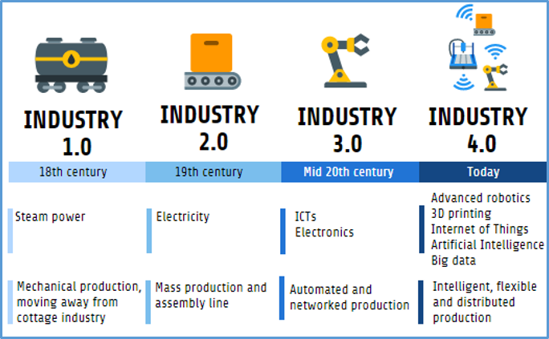

[<- До підрозділу](README.md)

## Вступ до Індустрії 4.0  

### Індустрія 4.0 - промислова революція

Четверта промислова революція (4IR або Industry 4.0) — це безперервна автоматизація традиційного виробництва та виробничої практики за допомогою сучасних розумних технологій (M2M, IoT та інших), що у свою чергу змінює побудову глобальної мережі виробництва та постачання у ланцюжках доданої вартості. 

Отже Індустрія 4.0 кардинально змінює правила, тепер це ключовий фактор, що дозволяє компаніям залишатися попереду в плані інновацій. Щоб досягти цього, Industry 4.0 базується на інтеграції ланцюжка створення вартості компанії а також постачальників, партнерів і клієнтів, бізнес-процесів і виробничих процесів, а також на застосуванні технологій ІТ (як апаратного, так і програмного забезпечення) до поточних систем промислового виробництва. Зерніть увагу що в традиційному контексті [ланцюжки](https://uk.wikipedia.org/wiki/Ланцюг_вартості) створення вартості (value chain) - це послідовність дій, які виконує **організація**, щоб постачати цінний продукт та/або послуги до кінцевого споживача (клієнта). У 4-й промисловій революції ці ланцюжки можуть виходити за рамки одного підприємства. 

Концепція Industry 4.0 є похідною від триваючої трансформації в промисловому секторі, якій передували три інші революції. 

- Перша революція (близько 1784 р.) відноситься до механізації праці: включення водяного/парового двигуна в механічні виробничі установки. Це полягало у використанні потужності пари для виконання завдань, які раніше виконувалися вручну. Це започаткувало перехід з домашнього на промислове виробництво. 

- Друга промислова революція (близько 1870 р.) послідувала за впровадженням масового виробництва з електричним приводом та на основі поділу праці. Впровадження електрики в різні виробничі процеси зробило можливим використання масового виробництва та використання складальних ліній. 

- Третя промислова революція (близько 1970 року) була заснована на впровадженні автоматизованих систем керування з використанням програмованих логічних контролерів (PLC), електроніки та різних технологій ІТ, що привело до можливості автоматизації виробництва та різноманітних бізнес процесів. У цю епоху для виконання завдань часто використовуються роботи і різноманітна програмована техніка.

Рис.1.1. Від Індустрії 1.0 до 4.0.

Сьогодні Індустрія 4.0 — це зміна парадигми: у якій велика кількість кіберфізичних технологій об’єднані для цифрової трансформації промислової діяльності. Кіберфізичні системи (CPS) складаються із систем зберігання, можливостей обробки даних, розумних машин і виробничих потужностей, здатних автономно обмінюватися інформацією, керувати діями та незалежно керувати один одним. Це не просто інвестиції в автоматизацію виробничої лінії, це трансформація її виробничих ліній через IIoT (промисловий Інтернет речей), використовуючи хмарні технології та застосовуючи передове програмне забезпечення та аналітику даних. Через IIoT велика кількість синхронізованих датчиків надає дані в реальному часі комп’ютерним серверам компанії (локальним або хмарним). Усі ці дані надають дуже цінну інформацію для процесів прийняття рішень і є ключовою основою для створення прогностичних моделей, які допомагають компаніям передбачати порушення у своїх системах, операціях і процесах, отже, належним чином можна вжити заходів до появи помилок або серйозних збоїв. Цей аналіз даних у величезних обсягах (відомий як "Великі дані") є ключем до підтримки та вдосконалення ланцюжка постачань, промислових процесів і керуванням життєвим циклом продукту. 

Таким чином, результатом Industry 4.0 є створення надзвичайно гнучкої, інтелектуальної, розподіленої виробничої та сервісної мережі. Кінцева мета: прокласти шлях до досягнення концепції розумної фабрики, яка характеризується адаптивністю, гнучкістю та ефективністю, одночасно підвищуючи цінність, що надається клієнтам.

### Порівняння традиційної промисловості та Індустрії 4.0

Індустрія 4.0 - це якісний стрибок в управлінні організацією, контролі всього ланцюжка створення вартості та моніторингу всього життєвого циклу продукту. Фактично, це зміна парадигми для галузей, що вимагає нових можливостей і відкриває нові вікна можливостей, деякі з яких описано в таблиці нижче.

Таб.1.1. Зміна парадигми в Індустрії 4.0

| Традиційна промисловість                                     | Індустрія 4.0                                                |
| ------------------------------------------------------------ | ------------------------------------------------------------ |
| Масове виробництво                                           | Гіперперсоналізація продуктів/сервісів на основі вимог клієнтів |
| Великі заводи для виробництва великих обсягів конкретного продукту | Розумні фабрики з гнучкими виробничими лініями для виробництва за конкурентоспроможними цінами |
| Жорстке планування виробництва на основі прогнозів запасів   | Динамічне виробництво продукції на основі ринкового попиту   |
| Доходи, отримані від реалізації продукції                    | Максимізація ROCE (рентабельності зайнятого капіталу): прибутковість/використаний капітал |
| Жорсткий розподіл праці                                      | Гнучкість в організації роботи                               |

Перехід в Industry 4.0 базується на таких принципах:

- Забезпечення сумісності: комунікаційна здатність усіх елементів виробничого підприємства. Необхідно створити загальні стандарти, які полегшать потік даних між кіберфізичними системами, роботами, корпоративними інформаційними системами, інтелектуальними продуктами та людьми, а також сторонніми системами.
- Децентралізація: акцентування на більшій автономії та розміщення інтелекту на найнижчому практичному рівні. Наприклад, впровадження кіберфізичних елементів зі здатністю приймати рішення автономно, щоб скоротити час виробництва та витрати. Повинна бути забезпечена координація, але жорстка організація згори донизу вважається небажаною.
- Аналітика в режимі реального часу: масивний збір і аналіз даних (Big Data) у режимі реального часу, що дозволяє здійснювати моніторинг, керування і оптимізацію процесів, сприяючи негайному прийняттю будь-яких рішень, що випливають із процесу.
- Віртуалізація: можливість створити віртуальну копію виробництва за допомогою зібраних даних; іншими словами, оцифрувати фізичні елементи. Віртуальні моделі заводу та моделювання промислових процесів дозволяють імітаційним моделям проводити експерименти та краще ідентифікувати та порівнювати альтернативи, які покращують поточні виробничі системи.
- Орієнтація на сервіси: можливість передати більшу цінність безпосередньо клієнту. Це значення означає кращий продукт, нові послуги або навіть покращені бізнес-моделі.
- Модульність і гнучкість: гнучкість і еластичність для постійної адаптації до потреб галузі.

### Рухи в економіці 

Перше офіційне використання терміну "Індустрії 4.0" було запроваджено в Німеччині приблизно в 2011 році як назва стратегічної ініціативи, що була запроваджена урядом Німеччини з наступними цілями: 

- виявлення різноманітних тенденцій, що відбуваються
- заохочення проектів цифрової трансформації та впровадження високих технології у виробництві

Десь після 2014 року в цей процес включилися компанії та уряди в інших країнах. У цьому процесі важливу роль також відіграло рішення Європейської комісії щодо збільшення промислового сектору європейської економіки до 2020 року до рівня 20% всього виробництва. Це привело до збільшення уваги інвестуванню ЄС в діяльності, що мають підвищити продуктивність, конкурентоспроможність та загальну додану вартість для підприємств. Для досягнення цієї мети було створено спеціальну фінансову політику та інструменти. Основним запровадженим інструментом стала програма досліджень та інновацій [Horizon 2020](https://eu-ua.org/horizon-2020/) (H2020), в якій однією з ключових цілей було просування та впровадження Індустрії 4.0. Паралельно кілька провідних країн ЄС та світу прийняли конкретні стратегії просування у себе Індустрії 4.0, які мали дещо відмінні цілі та різні назви.  Внаслідок вищезазначених стратегій промислового розвитку Європейський Союз позиціонує себе як провідний інноваційний регіон.

В Україні подібної національної програми наразі немає. Натомість є національний рух "Індустрія 4.0 в Україні" (<https://industry4-0-ukraine.com.ua> ), який об'єднує велику кількість національних компаній для інтенсифікації розвитку та впровадження високих технологій на виробництві.  