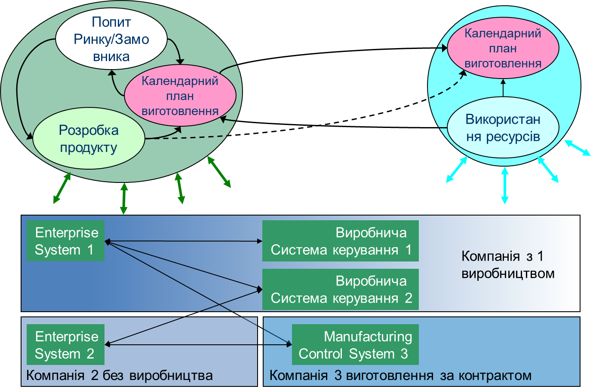
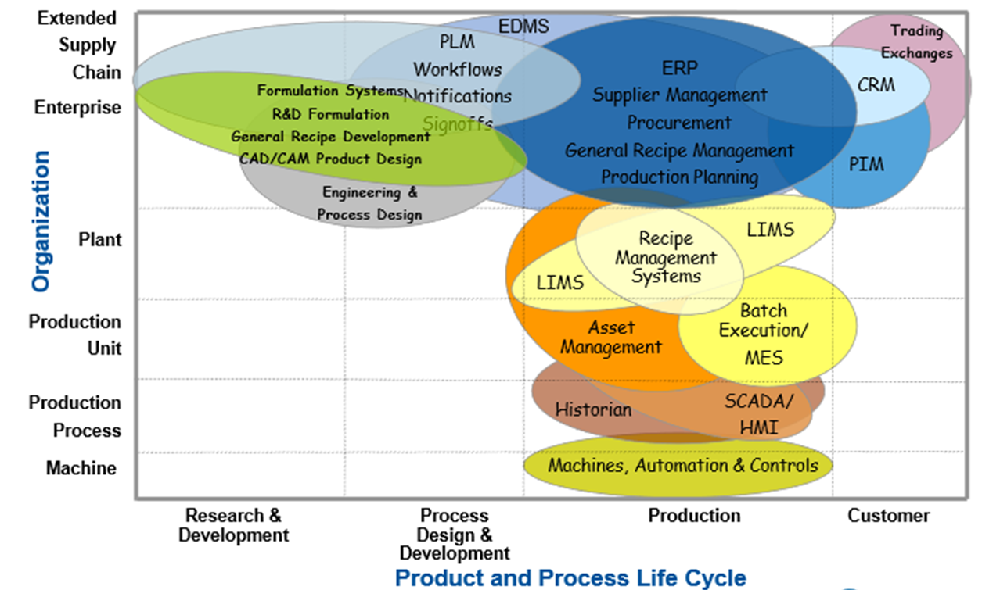
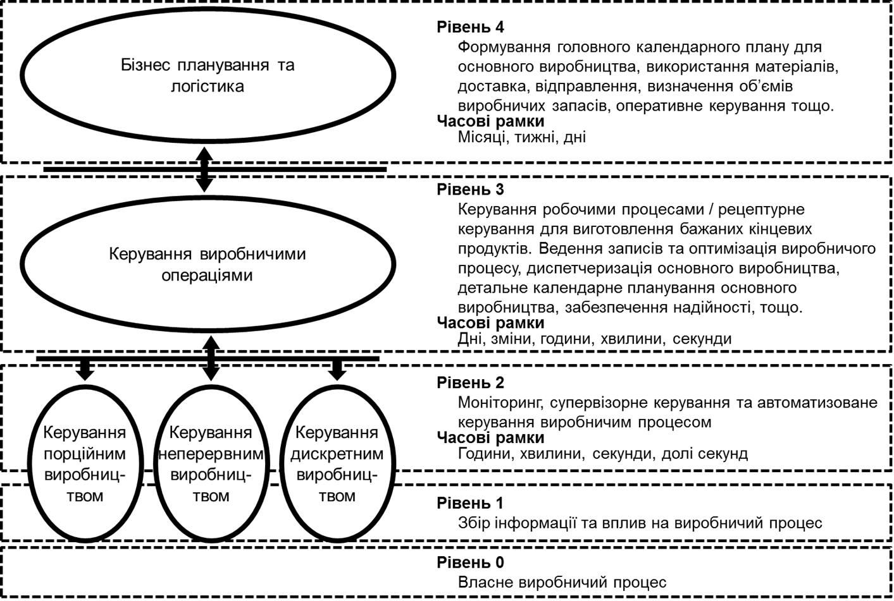

[<- До підрозділу](README.md)

# Горизонтальна та вертикальна інтеграція систем

## Необхідність інтегрування систем керування

Ряд досліджень, які проводилися у світі показали основні бізнес драйвери, які спонукають до сумісної роботи інформаційних систем, які автоматизують процеси в контексті різних життєвих циклів на різних рівнях керування. Інтегрування систем приводить створення єдиної інтегрованої системи керування (**ІАСК**) виробничим підприємством, яка передбачає виконання функцій через взаємодію між кількома інформаційними системами в їх складі. Це було характерно ще для підприємств зрілої Індустрії 3.0, для Індустрії 4.0 зявилася необхідність інтегрування систем різних підпримємств.

Основний спосіб заробітку виробничого підприємства є вироблення та продаж продукції, а саме перетворення сировини в продукти шляхом використання матеріалів, енергії, обладнання, персоналу/робочої сили. Ефективне керування ресурсами та процесами що забезпечують досягнення максимізації прибутку в постійно змінному середовищі є серйозним викликом для підприємств. У наш час Індустрії 4.0/5.0 ефективне підприємство має мати гнучкість та постійно змінюватися. Воно повинно надавати ринку максимально якісну і спеціалізовану під замовника продукцію в найменш короткий термін. При цьому кінцева вартість продукту для споживача може мати не саме визначальне значення, більш пріоритетними стають можливість підлаштування продукту під споживача та зменшення та гарантування часу випуску з моменту замовлення. За таких обставин, підприємства можуть об'єднуватися для формування мереж вартості, де кожне з підприємств вносить свою частину доданої вартості в кінцевий продукт. 

На рис.1 показаний приклад взаємодії кількох підприємств. Одне з них є виробничим, тобто має виробничі майданчики, інше має добре налагоджені процеси маркетингу та продажу та відділ R&D для розроблення нових продуктів. Взаємодіючи між собою, ці підприємства можуть налагодити випуск продукції та реалізувати її. Якщо ця взаємодія відбувається через ручні операції (приймання та оформлення замовлення, облік доступних ресурсів, планування і т.п.) затрачений час, точність розрахунків та прогнозування не дозволить це робити в короткі терміни та з необхідними гарантіями.           

рис.1. Гнучке промислове виробництво (I4.0) в мережі створення вартості кількох підприємств 

Наведена мережа вартості з 2-х підприємств стає ще більш складнішою, коли кількість підприємств в ній збільшується, і ланцюги повинні створюватися динамічно. З одного боку така мережа буде більш гнучкою, так як в ній з'являться альтернативні варіанти. Однак з кожним новим учасником (підприємство) ускладнюється і взаємодія. Ефективна робота в таких мережах підприємств можлива тільки за рахунок цифровізації цих підприємств та автоматизації всіх бізнес-процесів в ньому. 

Таким чином **Вертикальна інтеграція** передбачає інтегрування виробничих інформаційних систем з системами інших областей та відділів компанії (наприклад, менеджмент, продажі, фінанси, людські ресурси, основне виробництво тощо). Це значить що необхідно налагоджувати зв'язки між існуючими інформаційними системами на підприємстві.  **Горизонтальна інтеграція** полягає в інтегруванні всього ланцюжка створення вартості життєвого циклу продукту, включаючи взаємодію між кількома організаціями, зокрема постачальниками, партнерами та клієнтами. 

Хоч технології інтегрування не є новими і вже давно використовуються в системах Індустрії 3.0, це є важливим драйвером переходу на І4.0. Для інтегрування також можуть використовуватися нові технології, зокрема IIoT, хмарні та інші. Крім інформаційного обміну необхідно забезпечити семантичну сумісність, наразі для цього популярними є стандарти ISA-95/IEC-62264 та інші з групи стандартів та технологій інтегрування.  

Тобто, якщо до недавнього часу автоматизацію процесів керування можна було розглядати в контексті окремих підрозділів підприємств, то в сучасному світі питання цифровізації всього підприємства і узгоджена робота усіх його функцій є питанням економічного виживання. При цьому варто говорити про сумісну роботу всіх процесів, які пов'язані з підприємством, незалежно від домену та рівня керування. Так, наприклад, вихід з ладу якогось насосу, що потребує ремонту, повинно відразу проявитися в процесах планування виготовлення продукції а отже і у відповіді на запит клієнта щодо можливого виготовлення продукції та термінів. 

Ключові бізнес-драйвери – це найважливіші для успіху організації показники ефективності, що посилаються на основні вимоги на рівні організації, які випливають із коротко- та довгострокового стратегічного планування. Вони включають клієнто-орієнтовані вимоги до якості та операційні вимоги, такі як продуктивність, час циклу, швидкість та вартість впровадження нової технології, стратегічні альянси з іншими організаціями, розвиток взаємовідношень з постачальниками, а також дослідження та розробки. Простіше кажучи, ключовими бізнес-драйверами є ті речі, які організація повинна робити добре, щоб досягти своєї стратегічної мети. 

У додатку С до стандарту IEC 62264 (та ISA-95), про який буде описано нижче, наведені ключові бізнес-драйвери, які можуть бути покращені за рахунок інтегрування інформаційних систем різного рівня керування. Бізнес-драйвери на рівні засобів виробництва формують потребу в інформаційному обміні між адміністративними підрозділами та технологічними або виробничими ділянками. Підприємства зосереджуються на цих бізнес-драйверах для задоволення конкурентних ринкових вимог, далі вони впливають на формування інформації, що надсилається на виробничий рівень, та навпаки – вони залежать від інформації, отриманої з рівня виробництва.

Виробничі підприємства є, як правило, змінними об’єктами. Щоб відповідати мінливим бізнесовим та правовим середовищам бізнес-процеси підприємства постійно змінюються. Зазвичай, також відбуваються постійні зміни і у виробничих процесах, як-от поява нових технологій або збільшення продуктивності.  Для виробництва можуть виділятись наступні бізнес-драйвери.

### Можливість швидкого прогнозування

Це можливість швидкого доступу осіб, які приймають замовлення, до інформації про запаси та потужності, а в деяких випадках навіть про постачальника. Це дає їм можливість дізнатися та взяти на себе зобов’язання встановлення достовірних дат постачання продукції ще під час спілкування з замовником по телефону. Інформація, необхідна для автоматизованої доступності прогнозування:

- поточний запас готової продукції;
- поточний план виробництва цього продукту;
- реалістичні потужності засобів виробництва необхідні для виготовлення цього продукту;
- запаси сировини або можливість придбання сировини.

### Зменшення час циклу виготовлення

Час циклу означується як час, який необхідний для виготовлення продукту з моменту розміщення замовлення і залежить від швидкості реагування та часу виконання. Причина того, що підприємства зосереджуються на мінімізації загального часу циклу, як правило пов’язано зі збільшенням обігу запасів, що в свою чергу збільшує бізнесові ROA (рентабельність активів).

З метою скорочення часу циклу, бізнес визначає області, де відбуваються найбільші затримки та очікування, і намагається їх усунути. У більшості випадків час, необхідний для перепланування та реагування на зміни, значно довший, ніж час для побудови планів. Зменшення швидкості реагування можливе за рахунок врахування всіх аспектів об’ємного планування, календарного планування та виконання. Скорочення часу на планування дозволяє більш часто аналізувати прогнози та менше залежати від даних прогнозування. 

### Гнучкість у виробництві

Гнучке виробництво – це можливість змінювати налаштування виробничих активів для швидкого задоволення попиту на ринку. Для цього потрібна можливість змінити виробництво, використовуючи існуючі установки та устатковання.

Гнучкість у виробництві – це здатність ефективно функціонувати у виробничому середовищі безперервних і часто непередбачуваних змін та швидко реагувати на потреби ринку за допомогою кастомізованих (розроблених під вимоги користувача) продуктів. Гнучке виробництво використовує концепції швидкої зміни налаштувань за потребою.

Гнучке виробництво вимагає, щоб основне виробництво швидко реагувало на зміни в означенні продукту, а іноді навіть змінювало процеси виготовлення продукції в середині потоку. 

### Керування ланцюжками постачань

Метою керування ланцюжка постачань (SCM – supply chain management) є підвищення ефективності ведення бізнесу кожним учасником ланцюжка за рахунок використанням останньої і якісної інформації від інших учасників, щоб якнайкраще збалансувати попит і пропозицію. Результатом є переміщення продукту з точки походження до споживання за мінімальний час та з найменшими затратами.

Керування ланцюжками постачань допомагає менеджерам робити інтеграцію роздрібних каналів із виробництвом, притягнення попиту з точок продажу або усунення буферних запасів у ланцюжку збуту. За межами підприємства SCM поширюється на постачальників та дистриб’юторів.

Керування ланцюжками постачання призводить до їх оптимізації, коли ланцюжок постачань використовується для досягнення максимальної ефективності цілого, а також для досягнення максимальної ефективності окремих частин.

Оптимізація ланцюжків постачань передбачає здійснення складних вигідних заходів для задоволення цілей бізнесу щодо скорочення операційних витрат та виробничих запасів, підвищення надійності доставки, зменшення часу реагування та обслуговування клієнта. 

### Якість та простежуваність

Для деяких підприємств бізнес-драйверами можуть бути якість та простежуваність. Цього можуть вимагати такі фактори, як відповідність нормативним вимогам, визначення затрат на обслуговування для покращення продукту, безпечність для клієнтів та відстеження впливу небезпечних предметів на персонал.

Якість та простежуваність вимагають, щоб інформація, яка зазвичай зберігається у виробничій системі, була доступною для інших частин підприємства. Це часто потребує інтеграції системи керування виробництвом та забезпечення якості з корпоративною системою керування якістю. 

### Збільшення повноваження оператора

Конкурентну перевагу може дати надання операторам більшої можливості у прийнятті рішень для виконання операцій, якщо ці рішення будуть безпосередньо вимірюватися фінансовими результатами. У цьому випадку, область операційної діяльності вимагає значного збільшення інформації, яка в минулому була доступною лише на організаційно-економічному рівні підприємства.

Повноваження – умова, згідно з якою працівники мають можливість приймати рішення та здійснювати заходи у своїх робочих сферах без попереднього погодження зверху. Це акт надання відповідних повноважень в руки людей, найближчих до вирішення цих задач. 

### Вдосконалене планування

Вдосконалене планування є ключовим бізнес-драйвером для компаній з дорогою вартістю запасів, трудомістким виробництвом, але зі швидкими змінами клієнтів та змінним попитом. Удосконалене планування вимагає доступу та використання інформації з усієї корпорації для переміщення результатів об’ємного планування від виробничих замовлень та наближення їх до календарних планів виробництва.

Вдосконалене планування вимагає постійного зворотного зв’язку щодо фактичного стану виробництва та споживання матеріалів, а також попиту та запасів.

### Підсумок

Узгодження даних є серйозною проблемою для інтеграції систем керування підприємством та виробництвом.  Системи повинні бути налаштовані таким чином, щоб забезпечити надсилання точних даних на виробництво та з виробництва. Ненавмисні помилки оператора виробництва чи офісного співробітника можуть призвести до занадто великої або навпаки малої кількості виробленої продукції, неефективного основного виробництва та неефективного керування запасами.

## Проблеми інтегрування та необхідність стандартизації

Як було зазначено вище для ефективної роботи виробничого підприємства необхідно щоб всі процеси, задіяні в різних ЖЦ але в одному виробничому сегменті були синхронізовані. Але ці процеси автоматизуються різними інформаційними системами, функціонал яких нерідко перетинається. Це продемонстровано на рис.2. Тобто на рівні виробничого майданчику ми маємо принаймні кілька напрямків такої синхронізації, яка потребує інтеграції інформаційних систем і відповідно підсистем керування:

- між інформаційними системами різного рівня керування - вертикальна інтеграція 
- між інформаційними системами одного рівня керування але в контексті виконання різних функційних сфер - горизонтальна інтеграція

 

​                               

Рис 2. Різні системи керування на підприємстві

Проблема такої інтеграції має кілька причин. Інформаційні системи відповідають за різні аспекти виробництва, і відносяться до різних рівнів функціональної ієрархії, оперують різним понятійним апаратом і мають свою онтологію (представлення світу). Крім того, рівень керування бізнес-процесами та рівень керування виробництвом знаходяться в сфері відповідальності різних осіб, розробляються та розвиваються незалежно один від одного. Рівень керування бізнес-процесами, зазвичай, розробляється спеціалістами з ІТ сектора, які мало, або і взагалі нічого не розуміють в керуванні виробничими операціями. У свою чергу рівень керування виробництвом розробляється спеціалістами ОТ (операційні технології), що мислять виробничими а не бізнес-категоріями. 

Незважаючи на це, всі інформаційні системи повинні бути пов’язані між собою і обмінюватись інформацією у зручній та зрозумілій формі. Ця координація та керування часто підтримується системами керування виробництвом (MES, Manufacturing  Execution Systems) для керування виробничими операціями, системами керування інформацією в лабораторіях (LIMS,  Laboratory Information Management Systems) для перевірки якості та керування тестовими лабораторіями, системами керування складами (WMS, Warehouse Management Systems) або системами керування резервуарними фермами для керування запасами операцій, а також керування активами або комп’ютеризовані системи керування техобслуговуванням (CMMS, Computerized Maintenance Management Systems) для операцій технічного обслуговування. Ці системи разом називаються системами керування виробничими операціями (MOM, Manufacturing Operations Management). MOM означує різноманітний набір функцій, які працюють над системами автоматизованого керування, розташовані нижче рівня корпоративних бізнес-систем і є локальними для виробничого майданчику чи цеху. 

**Обмін інформацією про матеріали:** Для виробництва потрібні матеріали. Не дивно, що виробничі системи мають вимогу ідентифікувати та відстежувати матеріали, оскільки основна мета виробництва полягає в перетворенні матеріалів однієї форми в матеріали іншої форми. Важливою частиною інтеграції MOM є підтримка та обмін ідентифікацією матеріалу та інформацією про нього, зокрема.

1. MES ідентифікує матеріали та їх придатність до використання, системи керування партіями підтверджують, що використовуються правильні матеріали, як зазначено в рецептах,
2. Системи відстеження та простежування (сканери штрих-кодів та зчитувачі RFID),
3. LIMS підтверджує, що перевірено правильні матеріали та використано правильні матеріали під час тестування,
4. WMS визначає матеріали в місцях їх зберігання.

Спільну інформацію про матеріали можна розділити на три основні категорії:

- інформація про клас матеріалу ідентифікує матеріали без урахування джерела матеріалу,
- інформація про означення матеріалу означує матеріал від конкретних постачальників або джерел,
- інформація про партію матеріалу означує фактичний матеріал, його місцезнаходження та кількість.

**Обмін інформацією про устатковання (обладнання):** Одним із важливих елементів керованої інформації є правильна ідентифікація про стан устатковання, яке використовується для виробництва. Ідентифікація стану устатковання використовується для:

- планування,
- відстеження та простежування,
- обслуговування,
- вирішення проблем з обладнанням,
- візуалізації стану (HMI),
- відстеження потужності,
- розрахунку загальної ефективності обладнання (OEE).

На жаль, нерідкі випадки, коли виробнича компанія має декілька ідентифікацій стану для одного устатковання. Таким чином, критичним аспектом управління інформацією про устатковання є керування різними ідентифікаціями одного і того ж устатковання в системах і застосунках багатьох постачальників.

**Обмін інформацією про фізичний актив:** Ідентифікація унікального фізичного активу, незалежно від ролі, яку виконує устатковання, життєво важлива для:

- обслуговування,
- кваліфікації устатковання та відповідність нормативним вимогам,
- відстеження фінансових операцій з активами

У той час як устатковання зазвичай ідентифікується тегом, наприклад TT-101 для датчика температури, який визначає роль або поточну функцію інформації про фізичні активи конкретного активу, цього недостатньо для відстеження окремих активів для технічного обслуговування та фінансових цілей. Щоб керувати активами, компанія повинна мати унікальний ідентифікатор фізичного активу, який не залежить від ролі, яку він виконує в певний момент часу. Наприклад, датчик температури TT-101 може мати серійний номер X2 у певний день, наступного дня передавач може бути замінений на датчик із такими самими характеристиками, але з серійним номером X3. Тоді X3 буде налаштовано на тег TT-101, а X2 більше не буде відомий як TT-101. Для відстеження передавачів X2 і X3 буде використовуватися інформаційна модель фізичних активів, тоді як для операційних цілей важливо лише те, що TT-101 використовується та забезпечує зчитування температури. Операторам і системам керування зазвичай не потрібно знати ідентифікатор (серійний номер) активів.

Відстеження окремих фізичних активів дозволяє компаніям відстежувати записи про стан окремих активів, щоб пересвідчуватися, що вони придатні для виробництва, і відстежувати їх у фінансових системах.

**Обмін інформацією про персонал:** Численні нормативні правила, закони та внутрішні процедури вимагають, щоб персонал, який виконує цехові дії, був однозначно ідентифікований, уповноважений виконувати дії та мав дійсну підготовку або кваліфікацію для виконання дій. Оскільки інформація про персонал зазвичай зберігається в кількох ІТ-системах і системах керування, це ключова область обміну інформацією. Специфічні використання в різних системах, які потребують координації та спільного використання, включають:

- Кваліфікації персоналу MES має бути перевірена, перш ніж комусь дозволять вжити заходів
- LIMS Ідентифікація схваленого персоналу для проведення випробувань і роботи з матеріалами, часто на основі їх кваліфікації навчання,
- Інформація сертифікації AM (sset Management) про персонал, який виконує діяльність з технічного обслуговування, щоб переконатися, що вони мають відповідну підготовку, необхідну для діяльності,
- Сертифікація WMS про те, що персонал навчений і кваліфікований для роботи з системами переміщення матеріалів, такими як вантажівки або кранові системи.

Для узгодження зв’язку між функціями рівня керування підприємства та виробництва ще в 2000-у році вийшла перша версія стандарту інтегрування ANSI/ISA-95 (ANSI-національні стандарти США, ISA – галузеві стандарти по автоматизації для рядку країн), який сьогодні налічує вже 5 частин та кілька редакцій. Організація ISA заохочує використання та застосування своїх галузевих стандартів на глобальній основі, що відповідно сприяло прийняттю стандарту на міжнародному рівні - IEC 62264. 

До появи стандарту рішення з інтеграції систем керування бізнес-процесами та систем керування виробничими операціями були індивідуальними для кожного виробництва, з власною термінологією, підходами та реалізацією. Крім того, що такі рішення були досить дорогими, виникала складність розширення таких систем при необхідності. Також ускладнювалась оцінка ефективності систем через відсутність спільних означень, а отже й можливості їх порівняння. Відсутність стандартної термінології, різнорідна організаційна культура та інші фактори спричиняли низький відсоток успішних проектів з інтеграції, а їх розробка тривала протягом багатьох років.

## Про стандарти інтегрування IEC-62264/ISA-95

Для рішення цих проблем IEC 62264 (ISA 95) пропонує стандартну термінологію та узгоджений набір концепцій та моделей для інтеграції систем керування із системами підприємства, що покращить комунікацію між усіма зацікавленими сторонами, і зможе надати наступні переваги:

- скоротити час на створення нової системи;
- надавати можливість постачальникам надавати відповідні інструменти для впровадження інтеграції систем керування із системами підприємства;
- дозволяти користувачам краще означувати свої потреби;
- скоротити витрати на автоматизацію виробничих процесів;
- оптимізувати ланцюги постачань;
- зменшити трудовитрати на виконання інженерних робіт протягом життєвого циклу систем.

Стандарт дозволяє замінити специфічну термінологію постачальників на чіткі означення інформації для обміну між функціями організаційно-економічного рівня підприємства та керування виробничими операціями, дає чітке означення кожному елементу інформації за рахунок об'єктних моделей UML та таблиць атрибутів, дозволяє відокремити бізнес-процеси від виробничих. 

В Україні з 1-го вересня 2019-го року стандарт ДСТУ EN 62264-1:2019 діє на ряду з [іншими стандартами](http://online.budstandart.com/ua/catalog/doc-page?id_doc=84240&fbclid=IwAR07xUmganKTUUne1xPRWRSSbtNP4kbbMLenvvWHi1yJdGEFC_IgHfa1XXY), що просуваються в рамках Технічного Комітету 185 «Промислова автоматизація» (далі – ТК 185). Наразі він прийнятий методом підтвердження (в англомовному варіанті). Основний зміст першої частини перекладений українською і доступний за [посиланням](https://tk185.appau.org.ua/62264/standard-iec-62264/mek62264/). 

У світі стандарт IEC 62264 займає міцні позиції. За оцінками провідного американського експерта Dennis Brandl з BR&L Consulting його використання може привести до:

- зменшення затрат та зусиль для інтеграції ERP-MES/MOM на 90%;
- кількість вдалих реалізацій з менше 50% зростає до понад 90%;
- скорочення часу на ранніх етапах розробки MES/MOM на 75%;
- підвищення продуктивності виробництва;
- збільшення ринку MES/MOM та конкуренцію на ньому.

Як і будь-який стандарт, IEC 62264 має свою цільову аудиторію. В першу чергу він призначений для тих, хто:

- бере участь у проектуванні, будівництві чи експлуатації засобів виробництва (засобів і предметів праці, що їх використовують у процесі виготовлення продукції);
- відповідає за означення інтерфейсів між системами керування виробництвом та іншими бізнес-системами підприємства; 
- бере участь у проектуванні, створенні, збуті та інтеграції продуктів автоматизації, що використовуються для забезпечення інтерфейсу між системою керування виробничими операціями та бізнес-системою;
- бере участь у проектуванні або керуванні створенням, переміщенням та зберіганням продуктів на виробничих підприємствах.

Також стандарт IEC 62264 може застосовуватись в якості навчального матеріалу, в цьому курсі він є основою для розуміння тих процесів які відбуваються на рівні керування виробничими операціями.

## Ієрархія керування промисловим виробництвом

Згідно стандарту IEC 62264 функціональна модель керування промисловим виробничим підприємством має кілька рівнів (рис.3). 

Рис 3. Ієрархічна модель керування промисловим підприємством 

На рівнях 0-2 відбувається керування технологічними процесами та машинами. Як вже було зазначено вище 0-й рівень автоматизується за рахунок використання польових засобів (датчики, приводи, виконавчі механізми, перетворювачі і т.п.), 1-й - промислових контролерів (PLC/PAC), 2-й - SCADA/HMI. Тут вирішуються локальні для якоїсь ділянки виробництва задачі, які зосереджуються на одному або кількох технологічних процесах створення напівпродукту (рівень Production Process на рис.3) або/та керування технологічними установками (рівень Machine на рис.3).

На рівні 4 вирішуються різноманітні задачі бізнес-планування та логістики. Це процеси, які автоматизуються різноманітними інформаційними системами типу ERP, CRM, PLM та іншими, які на рис.3 вони показані на рівні Eneterpise. 

На 3-му рівні вирішуються задачі керування виробничими операціями. Сюди входять функції керування усіма типами виробничих операцій націлених на виготовлення продукції, обслуговування обладнання, контролю якості, керування запасами та інші. Вони можуть проводитися як людьми так і автоматично машинами або сумісно. На рис.1.6 це показано рівнями Production Unit та Plant. Ці системи забезпечують керування гнучким виробництвом і є предметом даної дисципліни. Цей рівень, як вже зазначалося називається MOM (Manufacturing Operations Management).  

