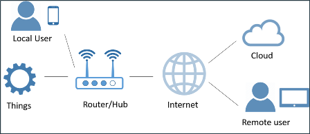

[<- До підрозділу](README.md)

# Інтернет речей (Internet of Things) та технології ідентифікації

**Інтернет речей (IoT)** — це розширення можливостей фізичних пристроїв та речей підключатися до Інтернету. Завдяки вбудованій в пристроях електроніці для підключення до Інтернету та іншим формам апаратного забезпечення, наприклад, датчикам, що вбудовані в речі, вони здатні спілкуватися та взаємодіяти з іншими фізичними пристроями через Інтернет, а також можуть віддалено відстежуватися та керуватися.

IoT має багато різноманітних застосувань у різних секторах, таких як розумні будинки, медицина та охорона здоров’я, транспорт тощо. У виробничому секторі часто використовується термін "**Промисловий Інтернет речей**" (Industrial Internet of Things, **IIoT**), що вказує на промислову підмножину IoT, що має певні особливості. Використовуючи IIoT можна підключити будь-який елемент промислового підприємства (активи), передаючи та/або отримуючи інформацію про нього або керуючи ним. Таким чином можна забезпечити моніторинг і керування у реальному часі, а також подальший аналіз отриманих даних. До елементів, які можна підключити відносяться як "речі" всередині заводу, такі як машини, персонал, інструменти та сировина, так і зовнішні по відношенню до заводу "речі", такі як транспортні засоби, вироблена продукція та навіть клієнти.

У промисловому Інтернеті речей як правило використовують типові "будівельні блоки", які беруть участь у розробці застосувань. Серед них можна виділити (див. рис.1):

1. **Речі**(things) або підключені пристрої(devices): фізичні засоби або пристрої, якими ми хочемо керувати або контролювати. Їх потрібно підключити до маршрутизатора/концентратора фізично через засоби введення/виведення чи мережу, або використовуючи додаткові датчики/приводи. Може бути прямий спосіб підключення пристрою/датчику до Інтернету без використання шлюзу, але в сегменті промислового Інтернету речей цей спосіб рідше використовується.
2. **Шлюз** або маршрутизатор (gateway/router): це елемент, який підключає пристрій/річ до Інтернету. У промисловому Інтернеті речей шлюз часто використовується для проміжної обробки даних та може брати на себе функції швидкої аналітики та формування рішень. Замість проведення усіх обчислень в Інтернеті, частину з них делегують шлюзу, що зменшує затримку в реакції та зменшує залежність від стабільності доступу до Інтернет. Такий підхід прийнято називати обчисленнями на краю (Edge computing) а самі пристрої "Edge Gateway" або "IoT Gateway". У звичайному непромисловому IoT, пристрої та датчики здебільшого підключаються напряму до Інтернету, без використання шлюзу. 
3. **Інтернет**: інфраструктура, яка дозволяє об’єктам та іншим елементам, таким як комп’ютери, сервери та центри обробки даних, спілкуватися один з одним. По факту це поєднальна ланка всіх інших компонентів.
4. **Хмара** (Clud): набір серверів і центрів обробки даних, які містять спеціалізоване ПЗ як платформу, де зберігається та обробляється інформація (див. також [хмарні обчислення](cloud.md)). 
5. **Застосунок** або програмне забезпечення (App/software). Застосування IoT зазвичай мають застосунки, які дозволяють користувачам взаємодіяти з платформою та візуалізувати результати, керувати пристроями тощо. Користувачі можуть бути локальними користувачами (з прямим доступом до маршрутизатору/пристрою) та/або віддалених користувачів (з віддаленим доступом до пристрою).

Рис.1. Будівельні блоки промислового Інтернету речей.

З IoT тісно зв'язані різноманітні технології ідентифікації, такі як **RFID** (радіочастотна ідентифікація) та QR-кодування. Вони дають можливість унікально ідентифікувати будь яку річ,що спрощує її поєднання з цифровим представленням цієї речі. До ідентифікації та збору даних також можна віднести **машинний зір** (**machine vision**) - технологія, яка дозволяє ідентифікувати речі або їх властивості за відеоспостереженнями. Варто нагадати що ці технології у свою чергу працюють у взаємодії з іншими. 

Промисловий Інтернет речей надає можливість організувати автоматичний збір даних з будь яких речей, які мають відношення до виробництва. Сам принцип побудови зменшує залежність від інфраструктури існуючих систем керування та інформаційних систем, а також забезпечує можливість об'єднання будь яких даних для їх сумісного аналізу. Треба також відмітити, що нерідко в якості пристроїв використовуються вже існуючі засоби промислової автоматизації, наприклад ПЛК (PLC), SCADA/HMI, приводні механізми та інші. 

Варто зауважити, що у противагу класичними системами керування, IIoT дає можливість збирати і обробляти набагато більше даних про речі а також обумовлює збирати ті дані, які не задіяні в контролі та керуванні в класичних системах керування машинами чи процесами. Це дає можливість використовувати ці дані для реалізації інших технологій зі стеку Індустрії 4.0, та робить IIoT фундаментальною технологією в цифровій трансформації підприємства.      