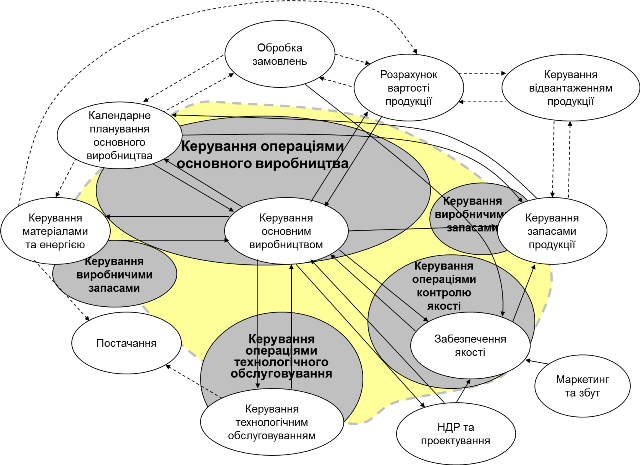
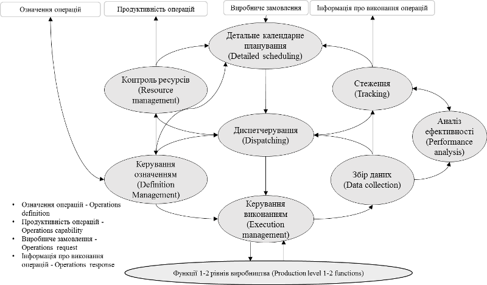

[<- До підрозділу](README.md)

# Системи керування виробничими операціями MES/MOM

Ефективна робота виробничого підприємства можлива тільки за умов узгодженої роботи усіх задіяних бізнес- та виробничих процесів. Сьогодні необхідність швидкої адаптації під мінливі умови ринку, попит та номенклатуру продукції, потреба у простежуваності та в зменшенні собівартості потребують не тільки повної автоматизації процесів на кожному з рівнів керування, а й їх узгодження. Системи MES/MOM, про які йтиметься далі не є новими технологіями, однак вони стоять в основі цифровізації на рівні функціонування виробничих функцій.  

На більшості українських підприємств ми маємо так звану "клаптикову автоматизацію", коли деякі функції автоматизовані, але вони виконуються незалежно і потребують ручного узгодження. Простим прикладом є отримання виробничими керівниками звітної інформації з системи керування технологічним процесом у паперовому або роздрукованому вигляді, для аналізу стану та коригування планів у спеціалізованому програмному забезпеченні. При такій координації між службами та персоналом за усними або письмовими розпорядженнями, де дані передаються у вигляді документів або навіть без них, цифрова трансформація звісно не має місце. У той же час, говорячи про автоматизацію керування виробничими операціями (**Manufactuting Operations Management** , **MOM**) як правило мають на увазі функції, які виконуються саме в контексті виробництва.  

Для кращого розуміння діяльностей на рівні MOM наведемо спрощену функціональну модель керування виробничим підприємством (зі стандарту IEC 62264 ), де частина функцій відноситься до рівня MOM та групуються принаймні в чотири категорії операцій (див.рис.1):

- операції по виготовленню продукції (Production), основне виробництво;
- операції керування запасами (Inventory);
- операції по контролю якості (Quality);
- операції по технічному обслуговуванню (Maintenance);
- інші операції

Рис. 1. Спрощена функціональна модель з об'єднаними функціями

На рис.1 функції за зовнішніми межами пунктиру, як правило реалізовані в системах організаційно-економічного рівня, які також відносять до класу ERP (Enterpise Resource Planning). Функції що вказані в середині пунктиру відносяться до керування виробництвом, і у свою чергу діляться на кілька категорій.  Таке розділення має кілька причин. По-перше, цими операціями як правило займаються різні служби на підприємстві, які мають свою внутрішню організацію, планування робіт, звітність і т.д. Тобто робота цих служб відбувається паралельно, але процеси звісно перетинаються.

По-друге, якщо процеси цих служб автоматизовані, то це нерідко відбувається через різні інформаційні системи, які традиційно зайняли певну нішу. Наприклад:

- основне виробництво (Production) - **MES** (Manufacturing Execution System), 
- операції керування запасами (Inventory) - WMS
- операції по контролю якості (Quality) - LIMS, QMS
- операції по технічному обслуговуванню (Maintenance) - EAM, ТОіР (технологічне обслуговування і ремонт)

По-третє, активності в межах цих категорій мають одну і ту саму природу. Це означає, що керування кожною з операцій зводиться до виконання наступних взаємопов’язаних діяльностей (Рис. 1):

- ​	керування означенням проведення операції;
- ​	контроль ресурсів;  
- ​	детальне календарне планування;
- ​	диспетчерування;
- ​	керування виконанням операції;
- ​	збір даних про операцію;
- ​	стеження за виконанням операції;  
- ​	аналіз ефективності операції.

Лінії зі стрілками на Рис. 2 вказують на інформаційні потоки між діяльностями.

Рис. 2. Загальна модель діяльностей керування виробничими операціями

Виконання послідовності супроводжується наступними діяльностями: 

- аналізом виконаної роботи з метою покращення або виправлення;
- керуванням ресурсами, що використовуються для виконання робіт;
- керуванням означеннями виконуваної роботи.

На конкретному виробничому підприємстві може бути по різному представлена реалізація кожної з категорій, наприклад:

- всі або кілька категорій операцій MOM реалізовані в одній інформаційній системі
- кожна окрема категорія MOM представлена своєю інформаційною системою (як зазначено вище) або кількома 
- частина функцій MOM реалізовані інформаційними системами рівня ERP, частина системами керування технологічними процесами (АСКТП)
- змішана система  

Навіть при повній автоматизації усіх функцій, підприємство не може працювати ефективно, якщо ці функції не координуються між собою. Тому необхідно провести вертикальну та горизонтальну інтеграцію, про яку можна почитати [за цим посиланням](integr.md)

