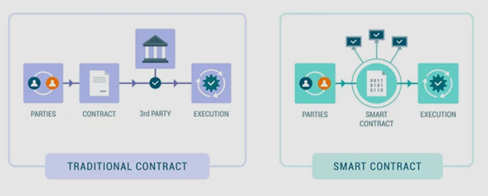

[<- До підрозділу](README.md)

# Смарт-контракти

**Смарт-контракти** (англ. smart contracts) — це програми або протоколи, що автоматично виконують, контролюють або документують події та дії відповідно до умов договору. Вони працюють на [блокчейн](blockchain.md)-платформах, таких як Ethereum, і забезпечують самостійне виконання контрактних умов без необхідності в посередниках. Вони базуються на наступних принципах роботи.

- **Автоматизація виконання**. Смарт-контракти містять код, який автоматично виконує певні дії, коли задовольняються означені умови. Наприклад, якщо дві сторони укладають угоду на постачання товару, смарт-контракт автоматично здійснить платіж при отриманні підтвердження доставки.
- **Децентралізація**. Смарт-контракти зберігаються і виконуються в розподіленій мережі блокчейну, це забезпечує надійність та стійкість до збоїв, оскільки немає єдиної точки відмови.
- **Незмінність та прозорість**. Після розгортання смарт-контракту на блокчейні його код і умови не можуть бути змінені. Всі транзакції, пов'язані з контрактом, записуються в блокчейн, забезпечуючи повну прозорість і аудит.
- **Безпека**. Використання криптографії для забезпечення цілісності даних та захисту від несанкціонованих змін. Смарт-контракти виконуються у захищеному середовищі блокчейну, що унеможливлює втручання.

Смарт контракти можуть використовуватися у наступних сферах. 

- Фінансові послуги для  автоматизації виплат дивідендів, процентних ставок або страхових виплат або платежі по кредитах можуть автоматично списуватися згідно з умовами договору.
- У ланцюгах постачання для відстеження руху товарів та автоматизації платежів при отриманні підтверджень про доставку та для контролю умов зберігання і транспортування товарів, наприклад, температурних режимів.
- Автоматичне виконання умов купівлі-продажу нерухомості або верифікація власності та автоматизація орендних платежів.
- Для систем електронного голосування, де смарт-контракти забезпечують анонімність і цілісність голосів та автоматичне підрахування голосів і публікація результатів.

- Управління ліцензіями та роялті, де смарт-контракти можуть автоматично розподіляти платежі авторам при кожному використанні їх творів.

Смарт-контракти дають можливість автоматизувати процеси та знизити потребу в ручній обробці та посередниках, що у свою чергу зменшує витрати на адміністративні та юридичні послуги. Всі транзакції відкриті для перевірки, що підвищує довіру між учасниками, а для захисту даних використовується криптографія.

При цьому є потреба в кваліфікованих розробниках для написання безпечних смарт-контрактів і наразі відсутні чіткі регуляторні рамки і визнання смарт-контрактів в деяких юрисдикціях. При виникненні помилок неможливо внести зміни у смарт-контракт після його розгортання.

