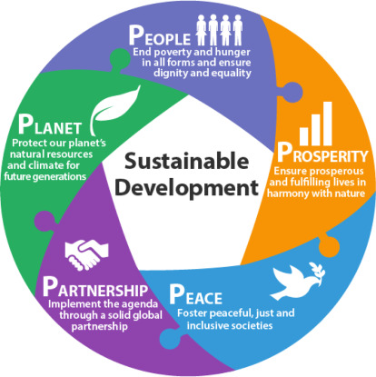
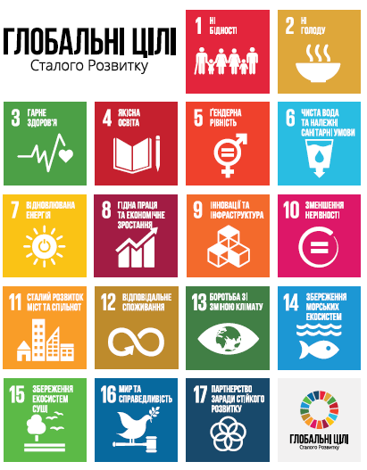

[<- До підрозділу](README.md)

# Стала індустрія та циркулярна економіка

На думку Європейської комісії законодавців по всьому світу цифрова трансформація нерозривна з зеленим переходом і тому при цифровій трансформації варто розібратися в аспектах сталого розвитку. 

## Сталий розвиток

**Сталий розвиток (Sustainable Development)** - це такий розвиток, який задовольняє потреби нинішніх поколінь без шкоди для здатності майбутніх поколінь задовольняти власні потреби. Це означення дали ще у 1987-му році, але досить часто його плутають і по-різному трактують. Насправді - це про свідоме споживання ресурсів людством таким чином, щоб не ставити під загрозу ресурси для майбутніх поколінь. Станом на зараз розвиток не є сталим. Зокрема існують мегатренди в світі, на які варто звернути увагу:

- розрив між багатими і бідними людьми
- демографічна проблема, у світі зараз офіційно 8 млрд людей на планеті 
- технологічна промислова революція поставить під питання багато професій на ринку праці 
- зміни клімату
- екологічний слід світового виробництва та споживання, тобто наскільки підприємства ефективно споживають ресурси, матеріали та задають негативного впливу на навколишнє середовище 
- і шоки невизначеності які з'являються в світі такі як пандемія, як вторгнення росії в Україну, як війна Палестини і Ізраїлю і т.п. 

Ці всі речі впливають на нас всіх, тобто на Все це потрібно зважати з точки зору майбутніх десятиліть. 

Саме тому багато років велась робота над **цілями сталого розвитку** - консенсусного документу, який зрештою об'єднав 193 країни ООН. Він вийшов 25 вересня 2015 року та прийнятий ООН одноголосно під назвою "Перетворення нашого світу: Порядок денний у сфері сталого розвитку до 2030 року" [[1](https://www.undp.org/uk/ukraine/publications/%D0%BF%D0%B5%D1%80%D0%B5%D1%82%D0%B2%D0%BE%D1%80%D0%B5%D0%BD%D0%BD%D1%8F-%D0%BD%D0%B0%D1%88%D0%BE%D0%B3%D0%BE-%D1%81%D0%B2%D1%96%D1%82%D1%83-%D0%BF%D0%BE%D1%80%D1%8F%D0%B4%D0%BE%D0%BA-%D0%B4%D0%B5%D0%BD%D0%BD%D0%B8%D0%B9-%D1%83-%D1%81%D1%84%D0%B5%D1%80%D1%96-%D1%81%D1%82%D0%B0%D0%BB%D0%BE%D0%B3%D0%BE-%D1%80%D0%BE%D0%B7%D0%B2%D0%B8%D1%82%D0%BA%D1%83-%D0%B4%D0%BE-2030-%D1%80%D0%BE%D0%BA%D1%83)]. Було досягнуто в принципі взаєморозуміння щодо цілей:

- перелік
- універсальний характер 
- інтегрованість в законодавчі ініціативи
- вплив на трансформацію суспільств
- орієнтація на кожну окрему націю
- фокусовання на людях і на глобальному партнерстві

Ці цілі мають бути доступними для всіх людей на планеті, щоб вони могли розвиватися далі і захищати Землю, біорізноманіття і все життя на ній. 

Цей документ розділений на декілька блоків:

- візія - бачення, 
- які структурні моменти (цілі), 
- як стратегію реалізовувати 
- як її переглядати і контролювати 

У документі були зазначено 17 цілей сталого розвитку (**ЦСР**), які структуровані навколо п’яти категорів: люди (people), планета (planet), процвітання (prosperity), мир (peace) і партнерство (partnership). Ці категорії (п'ять P) підкреслюють, що ЦСР є взаємопов’язаною системою, а не групою окремих цілей. Прогрес на одному з них повинен балансувати та підтримувати прогрес на іншому.

рис.5.1. П'ять "P" сталого розвитку. 

**Люди**. До цієї категорії відносяться ЦСР, які стосуються подолання бідності, голоду, забезпечення здоров’я та благополуччя, надання якісної освіти, доступу до чистої води та санітарії, прагнення до гендерної рівності. 

**Планета**. Зміна клімату є перешкодою на шляху до досягнення ЦСР і має непропорційний вплив на бідних. Без узгоджених дій це може призвести до бідності ще 100 мільйонів людей до 2030 року. Цілі розвитку ставлять перед собою мету захистити планету, щоб вона могла задовольняти потреби нинішнього та майбутніх поколінь. 

**Процвітання**. Нерівність є однією з визначальних проблем цього покоління і вимагає відповідної уваги, якої досі бракує. Забезпечення процвітання та повноцінного життя в гармонії з природою втілює процвітання, до якого світ повинен прагнути в найближчі десять років. 

**Мир**. Справедливість лежить в основі успіху ЦСР: від подолання бідності та нерівності до забезпечення того, щоб ніхто не залишився осторонь. Світ ще дуже далекий від того, щоб стати мирним, але лише свідомо працюючи над досягненням цієї мети, ми можемо досягти будь-якого прогресу в запобіганні насильству та покращенні безпеки громад від верху до низу. 

**Партнерські відносини**. Інтеграція, прискорення та політична підтримка (MAPS) для ЦСР конче потребують інформування всіх державних і приватних зацікавлених сторін щодо володіння, впровадження та прискорення ЦСР у їхніх відповідних можливостях. 

У наших сьогоднішніх реаліях ми бачимо, що як мінімум терористичні країни агресори, які ставлять під загрозу порядок у світі не дозволяють своїми діями сталому розвитку. Наразі можна сказати, що світ наразі умовно поділений на терористів з їх пособниками і цивілізований світ, який намагається побудувати процвітаюче суспільство. Саме тому зараз для сталого розвитку існують великі ризики. 

17-ть цілей сталого розвитку ([2]) фокусують фактично увагу на різних компонентах. 

рис.5.2. Цілі сталого розвитку

Тобто це ті цілі, на які орієнтуються всі уряди всіх демократичних країн в світі. Ці всі цілі пов'язані від само високорівневих документів і опускаються все нижче до практичних речей які потім лягають в основу саме бізнесу і багатьох рішень. Варто черговий раз зауважити про взаємозвязність цих цілей.  Ці глобальні цілі сталого розвитку також зафіксовані указами президента України в різних нормативних документах і вони є основою для розуміння фактично стратегій різного роду законів. 

## Циркулярна економіка 

Зараз світ фактично живе в парадигмі так званої лінійної економіки, коли ресурси, матеріали, надра видобуваються з них виробляються якісь товари, вони споживаються, використовуються користувачами і потім вони потрапляють на смітник як відходи, що часто призводить до погіршення стану навколишнього середовища та виснаження ресурсів (рис.5.4). 

рис.5.4. Лінійна економіка

Цю економічну модель намагаються зараз змінити на ту, яка є більш циркулярною. Циркулярна економіка пропонує альтернативний підхід, спрямований на те, щоб відокремити економічне зростання від споживання ресурсів, одночасно сприяючи сталим практикам, які відновлюють і повторно використовують матеріали. 

Існує декілька означень **циркулярної економіки** (**circular economy**) або економіка **замкненого циклу** (**closed-loop economy**), тому що термін "циркулярна економіка" все ще має різні тлумачення. Зокрема:

- "Циркулярна структура надає основу для того, щоб кинути виклик і направляти нас, коли ми
  переосмислюємо та перепроектуємо наше майбутнє." Towards the Circular Economy, 2014
- «Економіка , яка є відновлюючою та регенеруючою за дизайном і спрямована на те, щоб продукти, компоненти та матеріали завжди мали найвищу корисність та цінність , розрізняючи технічний та біологічний цикли ». Ellen MacArthur Foundation (2015). Це визначення сфокусоване на систему, тобто як трансформувати економічну модель як систему.

- «Цю концепцію, в принципі, можна застосувати до всіх видів природних ресурсів, включаючи біотичні та абіотичні матеріали, воду та землю. Еко дизайн , ремонт , повторне використання , реконструкція , переробка , обмін продуктами, запобігання утворенню відходів і переробка відходів це важливі частини економіки кругового циклу». European Environment Agency (2016). Сфокусована на специфічну дію або процес: ремонт, рециклінг і т.п.

- «У циркулярній економіці цінність продуктів, матеріалів і ресурсів зберігається в економіці якомога довше , а утворення відходів зводиться до мінімуму». European Commission (2015). Сфокусована на специфічну дію або процес. Найбільш лаконічне визначення, запобіганню відходів і цінність, щоб матеріали максимально довго залишалися в обігу. Це визначення ЄС використовує у всіх документах.

- «Циркулярна економіка це загальний термін, що охоплює всі види діяльності , які зменшують , повторно використовують і переробляють матеріали в процесах виробництва , розподілу та споживання ».  Blomsa & Brennan (2017). Якщо ми переосмислюємо і змінюємося то вже в циркулярній економіці.

Останнє з перерахованих є найбільш широким і узагальненим терміном, в якому передбачається що ми маємо концептуально орієнтуватися щоб всі наші матеріали були максимально ефективно використані, щоб продукти наші були в економіці якомога довше і вони були максимально цінні. 

Основоположними ідеями циркулярної економіки є: відновлення ресурсів, вторинна переробка матеріалів та перехід до використання відновлюваних джерел енергії, таких як сонячна, вітрова та гідроенергія. 

Принципи, які лежать в основі циркулярної економіки, ґрунтуються на  радикальному переосмисленні управління ресурсами, виробничих процесів і  моделей споживання. Ці принципи разом роблять внесок у систему, яка  надає пріоритет стійкості, ефективності та довгостроковій  життєздатності. Впроваджуючи ці принципи в різні аспекти економічної  діяльності, суспільства можуть відійти від традиційної лінійної моделі  та перейти до регенеративного та реставраційного підходу. Є різні варіанти цих принципів в залежності від авторів. У загальному вони зосереджуютьс на:

- регенеруванні природних систем, тобто виробництво має бути побудовано таким чином, щоб природа змогла сама себе відновлювати
- проектуванні систем без відходів на забруднення, тобто товари потрібно проектувати таким чином щоб в них за дизайном була мінімальна кількість відходів на етапі постспоживання 
- необхідності використання мінімуму матеріалів наскільки це можливо і утриманні їх максимально довго в обігу 

У 2010-х роках було розроблено кілька моделей циркулярної економіки, які використовували набір кроків або рівнів циркулярності, як правило, з використанням англійських дієслів або іменників, що починаються з літери «R». Першою такою моделлю, відомою як «принцип трьох R», була «Reduce, Reuse, Recycle», яку можна простежити ще в 1970-х роках. Однією з найповіших моделей є «принцип 10R», розроблений професором  сталого підприємництва та колишнім міністром навколишнього середовища  Нідерландів Жаклін Крамер.

рис.5.5. Ключові принципи циркулярної економіки

Це наступні 10 принципів: Refuse (Відмова), Reduce (Зменшення), Renew/Redesign (Оновлення/зміна дизайну), Reuse (Повторне використання), Repair (Ремонт), Refurbish (Ремонт, Відновлення), Remanufacture (Відновлення/Переобробка), Repurpose (Перепрофілювання/Переорієнтація), Recycle (Переробка), Recover (Відновлення). Ці приниципи стоять в основі стратегій циркулярного дизайну, які  розглянемо пізніше в цій лекції. 

Існує декілька особливостей циркулярної економіки, про які варто зазначити.

- Системне мислення в основі - циркулярна економіка системна в своєму дизайні, вона комплексна. На противагу до складних речей (наприклад автомобіль, протилежність проста), комплексні (противага незалежні) - все зв'язано. Приклад екосистеми лісів Амазонки, коли вплив на якийсь вид може змінити всю екосистему. У циркулярній - треба змінювати всю систему. В Україні на практиці дуже часто відсутня взаємодія між центральними органами виконавчої влади і бізнесом. Вони можуть об'єднатися наприклад для вирішення викликів, пов'язаних з переробкою матеріалів і обслуговування певних кластерів, створення інфраструктури саме в економічному плані. Тобто ці речі потребують системного мислення тих людей, які їх проектують.   
- Не використання токсичних речовин
- Ідея петлі зворотного зв’язку - щоб матеріали були довго в петлі між виробником і споживачем 
- Стійкість через різноманітність - залучення різних аспектів та елементів для досягнення цінностей
- Збереження цінності - має бути максимальною
- Використання відновлюваної енергії - циркулярна економіка і сталий розвиток нерозривні від відновлювальних джерел енергії
- Перехід від споживача до користувача - ми маємо більше бути користувачами а не власниками
- Замкнуті цикли та «Відходи як їжа»

За матеріалами [Андрія Гнапа](https://www.facebook.com/andrey.gnap). 
