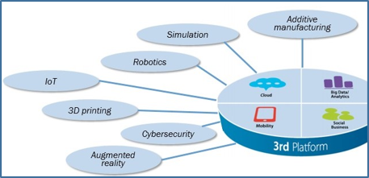
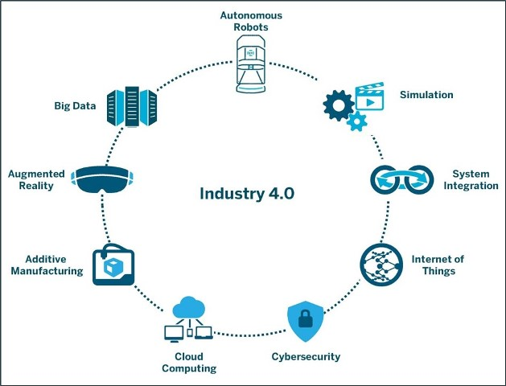

[<- До підрозділу](README.md)

# 2. Стимулюючі технології I4.0                                         

Як вже зазначалося Індустрія 4.0 базується на кількох технологіях, які дозволяють забезпечити функціонування системи кіберфізичних систем. У 2012 році Gartner представив так зване «поєднання сил» SMAC (Social, Mobile, Analytics and Cloud) як нову технологію, що сприяє цифровій трансформації бізнесу. Поточним головним драйвером є інформація: спосіб отримання, керування та використання. Конвергенція мобільних, соціальних, хмарних технологій та інформації/аналітики є головною рушійною силою гнучкості бізнесу. Після визначення сил SMAC у 2012 році стали широко доступними технології, які доповнюють означення SMAC, зокрема: Інтернет речей (IoT), штучний інтелект (AI), віртуальна та доповнена реальність (V/AR), 3D-друк та інші. Ці технології постійно приєднуються до сил трансформації і називаються «прискорювачами інновацій».

Рис.1.2. Безперервна трансформація промисловості 

Тим не менше, єдиного угодженого списку стимулюючих технологій, пов’язаних з Індустрією 4.0, немає. Останніми роками багато консультантів та інших організацій опублікували схеми, що представляють основні технології, кожна схема випливає з дещо різних точок зору. Нижче наведений список, запропонований Boston Consulting Group у [2015 році](https://www.bcg.com/publications/2015/engineered_products_project_business_industry_4_future_productivity_growth_manufacturing_industries) (див. рис. 1.3), який забезпечує гарне уявлення про доступні технології, до їх складу входить:

1. Автономні роботи (Autonomous robots)
2. Імітаційне моделювання (Simulation)
3. Системна інтеграція (System integration)
4. Інтернет речей (Internet of Things)
5. Кібербезпека (Cybersecurity)
6. Хмарні обчислення (Cloud computing)
7. Адитивне виробництво (Additive manufacturing)
8. Доповнена реальність (Augmented reality)
9. Великі дані (Big data)

Рис.1.3. Стимулюючі технології Індустрії 4.0

Так чи інакше ці технології базуються на данних, тому дані можна вважати технологічним "паливом" для Індустрії 4.0. 

Нижче коротко розглянемо ці технології з точки зору їх можливостей, а самі технології розкриваються в інших дисциплінах. Варто зауважити, що ці технології не слід розглядати як набір незалежних технологій, які слід використовувати ізольовано, а скоріше це розумне поєднання між ними, яке може принести великі зміни та переваги. Крім того, деякі дослідники до цього переліку також добавляють:

- Digital Twin - цифрові двійники
- Edge Computing - обчислення на краю
- Blockchain
- Machine vision - машинний зір
- AI - штучний інтелект 
- інші

Детальніше про використання технологій:

- [Інтернет речей (Internet of Things) та технології ідентифікації](iot.md)
- [Великі дані та аналітика](bigdata.md) 
- [Хмарні обчислення](cloud.md)
- [Кібербезпека](cybersec.md)
- [Горизонтальна та вертикальна інтеграція систем](integr.md)
- [Автономні роботи](robots.md)
- [Доповнена та віртуальна реальність](arvr.md)
- [Імітаційне моделювання та цифрові двійники](dt_simul.md)
- [Адитивне виробництво (3D друк)](3dprint.md) 
