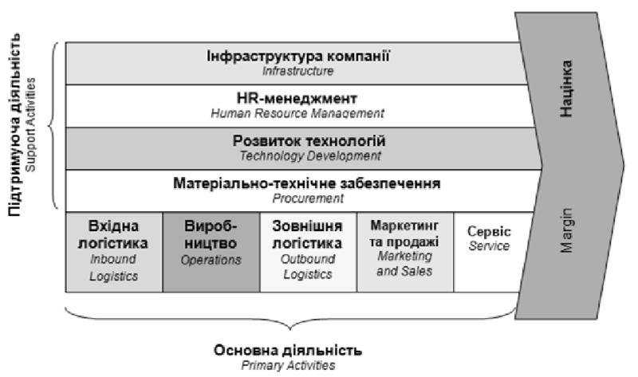

# Ланцюг створення вартості (Value Chain)

Ланцюг створення вартості (Value Chain) – це серія послідовних кроків, які йдуть у створення готового продукту, від його початкового дизайну до його прибуття до дверей клієнта. Ланцюг означує кожен крок у процесі, на якому додається вартість, включаючи етапи постачання, виробництва та маркетингу його виробництва.

Вперше цю ідею представив Майкл Портер у своїй книзі "Конкурентна перевага". Ланцюг складається з двох основних типів діяльності:

1. Основні (primary activities):
   - Логістика постачання: отримання та управління ресурсами.
   - Операції: виробничі процеси чи обробка.
   - Логістика збуту: зберігання та доставка кінцевого продукту.
   - Маркетинг і продажі: залучення клієнтів та просування продукту.
   - Обслуговування: підтримка клієнтів після покупки.
2. Допоміжні (support activities):
   - Інфраструктура: фінанси, управління, юридична підтримка.
   - Управління персоналом: найм, навчання та розвиток кадрів.
   - Розробка технологій: інновації, IT-рішення.
   - Закупівлі: придбання матеріалів та послуг.

Мета ланцюга створення вартості — ідентифікувати ті елементи, які приносять найбільшу вигоду або які можна вдосконалити для підвищення конкурентоспроможності компанії.

Компанія проводить аналіз ланцюга створення вартості, оцінюючи детальні процедури, задіяні на кожному етапі її бізнесу. Метою аналізу ланцюжка створення вартості є підвищення ефективності виробництва, щоб компанія могла забезпечити максимальну цінність за найменші можливі витрати.

