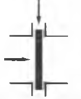
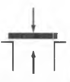
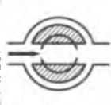
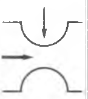

[<- До підрозділу](README.md)

# Загальні відомості про трубопровідну арматуру

## Загальні поняття

Арматура промислова трубопровідна - пристрої, що встановлюються на трубопроводах і ємностях і призначені для управління (відключення, розподілу, регулювання, впуску або випуску, змішування, фазорозділу або скидання) потоками робочих середовищ шляхом зміни площі прохідного перерізу.

Перелічені процеси зводяться загалом до двопозиційного, багатопозиційного чи безперервного регулювання витрати середовища, якщо прийняти періодичне відкриття та закриття запірної арматури як елемент двопозиційного регулювання. Шляхом зміни витрати транспортованого середовища за допомогою трубопровідної арматури здійснюється регулювання параметрів технологічних процесів: тиску, температури, концентрації різних компонентів або кількості речовини, що переміщується. Переважна більшість арматури встановлюється на трубопроводах і значно менша частина монтується безпосередньо на котлах, апаратах, установках і агрегатах.

## Типи арматури

Найбільш поширені п'ять основних типів арматури, які різняться залежно від переміщення замикаючого або регулюючого елемента щодо напрямку руху потоку середовища (таб. 1).

1) Засувки - арматура, в якій замикаючий елемент переміщається по прямій лінії перпендикулярно напрямку руху робочого середовища потоку.
2) Запірні, регулюючі, запобіжні та інші клапани - арматура, в якій замикаючі або регулюючі елементи переміщуються по прямій лінії паралельно напрямку осі потоку, що проходить через прохідний переріз.
3) Коркові, включаючи кульові, крани - арматура, в якій замикаючий або регулюючий елемент, що має форму тіла обертання або його частини, повертається навколо власної осі, що довільно розташована по відношенню до напрямку потоку робочого середовища. Повороту замикаючого або регулюючого елемента може передувати його зворотно-поступальний рух.
4) Затвори дискові поворотні — арматура, в якій елемент, що замикає або регулює (диск), повертається навколо осі, розташованої під прямим утлом до напрямку потоку робочого середовища, що проходить через прохідний переріз.
5) Мембранна (діафрагмова) арматура, - арматура, в якій замикаючий або регулюючий елемент виконаний у вигляді гнучкої мембрани або еластичного патрубка (в останньому випадку - в шлангових засувках), які забезпечують при деформації гнучкої мембрани або патрубка герметизацію щодо зовнішнього середовища і затворі.

Таб.1. Базові конструкції арматури

| Характеристика                   |                                                      |                                         |                                         |                                         |                                                      |
| -------------------------------- | ---------------------------------------------------- | --------------------------------------- | --------------------------------------- | --------------------------------------- | ---------------------------------------------------- |
| Напрямок руху запірного елементу | Прямолінійний                                        | Прямолінійний                           | Поворотний                              | Поворотний                              | Деформація пружної  мембрани  або патрубку |
| Напрямок руху потоку             | Під прямим кутом до напрямку руху запірного елементу | За напрямком руху запірного елементу    | Через запірний елемент                  | Навколо запірного елементу              | У залежності від конструкції                         |
| Конструктивна схема              |               |  |  |  |               |
| Базові види                      | Засувки                                              | Клапани запірні                         | Крани                                   | Затвори дискові                         | Клапани мембранні і засувки шлангові                 |
|                                  |                                                      |                                         |                                         |                                         |                                                      |

За областю застосування трубопровідну арматуру можна розділити на такі категорії: арматура загальнопромислового та спеціального призначення (наприклад, суднова фонтанна, вакуумна, кріогенна, для транспортних засобів тощо). 

Арматуру загальнопромислового призначення (промислова арматура) використовують у різних галузях народного господарства. Вона виготовляється серійно у великих кількостях і призначається для середовищ із часто застосовуваними тисками та температурою. Цією арматурою оснащуються водопроводи, паропроводи, міські газопроводи, системи опалення тощо.

Арматура спеціального призначення (спеціальна арматура) розробляється та виготовляється на підставі особливих технічних вимог. Часто така арматура застосовується, наприклад, для експериментальних чи унікальних промислових установок, енергетики, у тому числі для атомних електростанцій та потреб оборони.

За матеріалом корпусних деталей виділяють арматуру сталеву (з вуглецевої, легованої або корозійно-стійкої сталі), титанову, чавунну (з сірого, ковкого, високоміцного чавуну), кольорових металів, пластмас, кераміки (у тому числі з порцеляни) і скла. Особливе місце займає чавунна арматура із захисним неметалевим корозійностійким покриттям (гума, пластмаса, емаль).

За характером впливу на арматуру розрізняють: робоче середовище (робочий тиск, робоча температура), що транспортується трубопроводом, що обслуговується арматурою, командне середовище, що використовується для передачі командних сигналів, необхідних для управління приводами, керуюче середовище, що використовується як джерело енергії в пневмо-і гідроприводи арматури, випробувальне та навколишнє середовище (зовнішній тиск, температура, вологість).

Управління потоком робочого середовища в арматурі здійснюється за допомогою затвора, що складається з замикаючого або регулюючого елемента та сідла. Замикаючий або регулюючий елемент являє собою деталь або конструктивно об'єднану групу деталей, що переміщається за допомогою шпинделя, штока або валу щодо сідла. Таким чином, замикаючий або регулюючий елемент є рухомою частиною затвора, а сідло нерухомим. Зміною положення замикаючого або регулюючого елемента щодо сідла досягається зміна прохідного перерізу і відповідно пропускної здатності арматури.

## Керування арматурою

За методом управління арматура може бути керованою та автоматично діючою (прямої або непрямої дії). **Керованою** називається арматура, робочий цикл якої виконується за відповідними командами ззовні в моменти часу, що визначаються робочими умовами або обстановкою. Команду подають оператор або прилади, що автоматично діють, встановлені в системах управління технологічними процесами. До керованої арматури відносяться всі типи запірної арматури, що регулюють клапани. **Автоматично діючою** називається арматура, робочий цикл якої відбувається під дією робочого середовища, без будь-яких сторонніх джерел енергії.  До автоматично діючої арматури відносяться - регулятори тиску, регулятори рівня, конденсатовідвідники, зворотні та запобіжні клапани.

Керована арматура може мати ручний чи механічний привід, місцевий чи дистанційно розташований. Арматура з приводом забезпечується маховиком, маховиком та редуктором і, крім того, може мати шарнірну муфту для керування дистанційно розташованим ручним або механічним приводом. Як механічний привод можуть застосовуватися електромеханічний, електромагнітний, мембранний, поршневий і сильфонний. За конструктивним виконанням привід арматури може бути насадним (блочним), вбудованим та дистанційним,

Застосовуються такі методи керування арматурою: ручне з ручним приводом, ручне (кнопкове) з механічним приводом, автоматичне з механічним приводом. При регулюванні технологічних процесів із застосуванням арматури розрізняють: автоматичне та ручне, дистанційне та місцеве, безперервне та періодичне, безступінчасте та позиційне (двопозиційне та більше) регулювання, Найбільш досконалим є дистанційне автоматичне безперервне безступінчасте регулювання, що здійснюється з використанням регулюючих клапанів мембранні пневматичні або електричні виконавчі механізми, як правило, з позиціонерами. Найменш досконалим є місцеве ручне періодичне регулювання, що здійснюється з використанням регулюючих клапанів з ручним приводом. Для двопозиційного автоматичного регулювання може бути використана швидкодіюча запірна (захисна) арматура відповідної конструкції.

Арматура може оснащуватися електроприводами в нормальному або вибухозахищеному виконанні, останні застосовуються за умов, коли довкілля містить пожежо- або вибухонебезпечні речовини (пари та/або гази).

Важливою вимогою для арматури є забезпечення герметичності затвора у закритому положенні та сальникового ущільнення. Герметизація здійснюється кільцями ущільнювачів з металу деталей без наплавлення або наплавленими, що закріплюються кільцями ущільнювачів з корозійно-стійкої сталі або з наплавленням сплавом підвищеної стійкості, з латуні, бронзи, гуми, фторопласту, терморозширеного графіту.

## Функціональне призначення 

За функціональним призначенням арматура поділяється на види, основними з яких є такі.

**Запірна арматура** призначена для повного перекриття потоку середовища у трубопроводі з певною герметичністю та використовується у відкритому або закритому положенні. За кількістю застосовуваних одиниць вона становить близько 80% від загальної кількості арматури, що виготовляється. До запірної відносять і пробно-спускну або контрольно-спускну арматуру з малими значеннями діаметрів, що використовується для перевірки рівня рідкого середовища в ємностях, відбору проб, випуску повітря з верхніх порожнин, дренажу. Пробно-спускна арматура випускається у великих кількостях.

**Регулююча арматура** призначена для регулювання витрати робочого середовища за допомогою зміни витрати з метою впливу на відповідні параметри технологічного процесу (температуру, тиск, склад матеріалів. Вона використовується у всіх позиціях між повністю відкритим та повністю закритим положеннями. До регулюючої арматури відносяться регулятори, керовані автоматично впливом робочої середовища на регулюючий або чутливий елемент. Існують регулятори тиску «до себе» та «після себе», а також регулятори рівня та температури.

**Розподільно-змішувальна арматура**, що використовується для розподілу потоку середовища за певними напрямками або для змішування потоків. До неї відносяться розподільні клапани (розподільники) та розподільні крани.

**Запобіжна арматура** служить для автоматичного захисту обладнання та трубопроводів від неприпустимого перевищення тиску шляхом випуску надлишкової кількості робочого середовища. До запобіжної арматури відносяться запобіжні клапани, запобіжні імпульсні пристрої, мембранні розривні пристрої, перепускні клапани.

**Захисна арматура** призначена для автоматичного захисту обладнання та трубопроводів від неприпустимих або не передбачених технологічним процесом змін параметрів або напряму потоку робочого середовища, а також відключення потоку. На відміну від запобіжної захисна арматура при виникненні аварійних ситуацій закривається і відключає ділянку, що обслуговується, чим оберігає її від недопустимих впливів. До захисної арматури відносяться захисні (відсічні) клапани, зворотні та відключаючі клапани. Як захисну арматуру часто застосовують різні швидкодіючі типи запірної арматури (клапани, засувки, дискові затвори, крани).

**Фазоподільна** та **масорозділювальна** арматура призначена для автоматичного поділу робочих середовищ, що знаходяться в різних фазових станах. До неї відносяться конденсатовідвідники, повітровідвідники та масловідділювачі.

**Багатофункціональна арматура** використовується для виконання кількох функцій. Як правило, вона проектується у блочному виконанні.

В основному вигляді можна виділити конструкції, що виконують обмежені функції, у зв'язку з чим утворюються різновиди, наприклад, дросельно-регулююча арматура, призначена для роботи при великих перепадах тиску. Кожен вид включає різні типи арматури, причому кожен тип арматури може мати різноманітні конструктивні виконання.

## Конструктивне виконання

Арматура, що використовується в промисловості, може бути розділена на арматуру з лінійним переміщенням замикаючого або регулюючого елемента, як правило, багатооборотний і з обертальним (на чверть обороту) переміщенням.

Головна особливість арматури **з лінійним переміщенням** - можливість досягнення високої герметичності в затворі в межах міцності матеріалів і конструкцій, що застосовуються, шляхом докладання достатнього зусилля на шпинделі. До арматури з лінійним переміщенням відносяться: 

- засувки, включаючи шлангові, 
- клапани мембранні, 
- клапани запірні, 
- регулюючі та інші. 

Арматура **з обертальним переміщенням**, з іншого боку, зазвичай є простою, легкою, що дозволяє включати їх у автоматизовані системи і виконувати багатоходовому виконанні. Арматура, в якій замикаючий або регулюючий елемент обертається щодо осі на чверть обороту, швидко переводиться з положення «відкрито» в положення «закрито» і навпаки, а розташування ручки показує ступінь перекриття проходу. До арматури з обертальним переміщенням відносяться:

- крани конічні, циліндричні або кульові, 
- затвори дискові з валами або цапфами, співвісними з дисками або ексцентрично розташованими, затвори зворотні. 

Є також багато унікальних конструкцій, призначених для специфічних застосувань або виконаних у блочному виконанні, що використовує особливості різних видів та типів арматури для покращення експлуатаційних характеристик.

### Засувки

Засувки за типом затвора поділяються на клинові, паралельні, шлангові та шиберні. Клинова засувка має клиновий затвор, в якому поверхні ущільнювачів розташовані під кутом один до одного. Вони можуть бути з цілісним клином (жорстким або пружним) та дводисковим. Паралельна засувка може бути шиберною (з масивним або листовим шибером) та дводисковою з клиновим розпором. За характером руху шпинделя засувки поділяються на засувки з висувним і не висувним шпинделем. У засувках з висувним шпинделем при відкритті та закритті затвора шпиндель здійснює поступальний рух, у засувках з не висувним шпинделем — обертальний.

### Клапани

Клапани мають велику кількість конструктивних різновидів. Залежно від призначення клапани поділяються на:

- запірні, 
- регулюючі, 
- запобіжні, 
- перепускні, 
- зворотні, 
- відключаючі, 
- відсічні, 
- кільцеві, 
- електромагнітні. 

Клапани можуть бути односідельними і двохсідельними, останні застосовуються зазвичай тільки як розподільні та регулюючі. **Регулюючий** клапан має регулюючий елемент (плунжер), форма якого забезпечує задану зміну витрати в залежності від ходу, в запірному клапані елемент, що замикає, зазвичай має тарілчасту форму. **Запірно-регулюючі клапани** поєднують функції запірної та регулюючої арматури.

Залежно від напрямку потоку клапани поділяються на **прохідні**, **прямоточні** та **кутові**. У прохідних клапанах середовище на виході з корпусу має той самий напрямок, що і на вході, прямоточні клапани - зі спрямленою лінією руху потоку. Вони мають менший гідравлічний опір у порівнянні з прохідними. У кутових клапанах напрямок потоку середовища на виході перпендикулярно напрямку потоку на вході. Маховик або привід прохідного клапана розташований у площині, паралельній осі трубопроводу, прямоточних - під кутом менше 90° (Зазвичай під утлом в 45°), у кутових - в площині, перпендикулярній до осі сідла трубопроводу, що підводить. Прохідні та прямоточні клапани встановлюються на прямолінійних ділянках трубопроводу, кутові – у місцях повороту трубопроводу на кут, що дорівнює 90°.

У деяких клапанах конструкція передбачає пружину або вантаж для відкриття або закриття автоматично, коли дія перестановочного зусилля припиняється. За видом дії ці клапани поділяються на **нормально відкриті** (НВ), якщо пружина (вантаж) утримує замикаючий або регулюючий елемент у відкритому положенні, і на **нормально закриті** (НЗ), якщо пружина (вантаж) утримує замикаючий або регулюючий елемент у закритому положенні. Перестановним називається зусилля, необхідне переміщення цих елементів у робочих умовах.

**Запобіжні клапани** служать для випуску надлишкової кількості середовища при надмірному підвищенні тиску в об'єкті, що обслуговується (ділянці). За пропускною здатністю запобіжні клапани поділяються на мало-, середньо- та повно підйомні. Малопідйомний запобіжний клапан забезпечує перебіг тарілки в 1/40 - 1/20 частину діаметра отвору в сідлі, середньопідйомний - від 1/20 до 1/4 діаметра, повнопідйомні - понад 1/4 діаметра. Запобіжний клапан може мати одне або два паралельно працюючі сідла в корпусі, у зв'язку з чим за цією ознакою вони поділяються на одинарні та подвійні. За способом навантаження тарілки запобіжні клапани поділяються на важільно-вантажні та пружинні.

**Імпульсним запобіжним пристроєм** (ІЗП) називається пристрій, що складається з головного запобіжного клапана з поршневим приводом і запобіжного імпульсного клапана, що служить для управління головним запобіжним клапаном. Увімкнення (відкриття) головного запобіжного клапана відбувається при підвищенні тиску та відкритті імпульсного запобіжного клапана, який направляє робоче середовище в головний привід, в результаті чого головний запобіжний клапан відкривається. Коли встановиться нормальний робочий тиск у системі, закриється імпульсний клапан, та був і головний.

**Перепускні клапани** служать для обмеження тиску середовища до встановленої норми шляхом перепуску її через відгалуження трубопроводу в ємності, тиск в яких може бути вищим за атмосферний,

**Зворотні клапани** та **зворотні затвори** призначаються для запобігання зворотному потоку середовища у трубопроводі. Замикаючий елемент у зворотних клапанах і затворах відкривається прямим потоком середовища, а закривається зворотним. Вкрай важливо, щоб зворотні клапани і затвори закривалися відразу після припинення руху прямого потоку до зворотного. Це дозволяє уникати ударних навантажень у деталях затвора. Застосовуються підйомні та кільцеві зворотні клапани. Ці клапани мають замикаючі елементи зі зворотно-поступальним рухом. Зворотний клапан, що має на вході сітку та призначений для монтажу на всмоктувальному трубопроводі насосної установки, називається приймальним клапаном. Кільцевий зворотний клапан являє собою клапан із замикаючим елементом у вигляді циліндра, що переміщається вздовж осі потоку (осі трубопроводу), а корпус - з кільцевою проточною частиною. Зворотні затвори мають елементи, що замикають, у вигляді поворотних дисків. Як правило, застосовуються однодискові зворотні затвори, але існують конструкції та багатодискові. У зворотних затворах вісь розташовується поза або (для великих діаметрів) - у проточній частині арматури.

### Крани 

Крани поділяються на **запірні** (прохідні), що регулюють, розподільно-змішувальні, пробно-спускні; останні мають один приєднувальний патрубок та прямий або вигнутий випускний патрубок. За конструкцією крани можна розділити на **конусні**, **циліндричні** та **кульові**. Крани бувають двоходовими, триходовими та багатоходовими - за кількістю робочих положень пробки. Конусні крани можуть бути сальниковими або натяжними, залежно від способу ущільнення затвора або штока - натяжною гайкою в нижній частині пробки або сальником у верхній частині корпусу.

### Регулятори тиску

Регуляторами тиску називаються конструкції арматури, призначені для автоматичної та автономної підтримки тиску робочого середовища на заданому рівні без застосування сторонніх джерел енергії. Залежно від ділянки, на якій забезпечується сталість тиску, бувають регулятори «до себе» та «після себе», рахуючи за напрямом руху потоку в трубопроводі.

### Конденсатовідвідники, газовідвідники, масловідділювачі  

Конденсатовідвідниками називають конструкції арматури, що використовуються для відведення конденсату, що утворюється в системах або установках. За принципом дії конденсатовідвідники діляться на **поплавкові**, **соплові**, **термостатичні** та **термодинамічні**. Робота поплавкових конденсатовідвідників заснована на використанні відмінності густин пари і конденсату, як чутливий елемент в них використовується поплавець. Термостатичним називають конденсатовідвідник, з термостатом або біметалевим елементом, робота якого заснована на використанні розширення легко випаровується рідини або розширення біметалічного елемента при нагріванні. Тут використовується різниця температур між парою та конденсатом. Термодинамічні конденсатовідвідники забезпечені вільно лежачою на сідлі пластиною, яка керується автоматично на основі дії газо-і термодинамічних властивостей пари та конденсату.

Газовідвідники призначені для автоматичного випуску газу, що накопичився в рідині (або пари), щоб уникнути утворення газових (або парових) пробок у трубопроводі. Масловідділювачі служать для відділення масла від води з метою зменшення забруднень у стічних водах та використання
олії після його переробки.

## Типова конструкція

У різних конструкціях арматури часто містяться деталі та вузли, що мають загальне призначення та однакові назви (рис.1):

- корпус (1) - основна частина, в якій розташовані або до якої приєднані всі інші деталі арматури. Корпус разом з кришкою утворює герметично ізольовану від зовнішнього середовища порожнину, усередині якої переміщається замикаючий або регулюючий елемент;
- замикаючий елемент (2) – рухома частина затвора – деталь або конструктивно об'єднана група деталей, призначена для герметичного роз'єднання двох ділянок трубопроводу шляхом перекриття прохідного отвору у проточній частині корпусу. Для цієї мети в корпусі передбачено сідло, забезпечене кільцем ущільнювача. Воно може бути утворене металом корпусу, наплавленням корозійностійкої сталі або латуні або встановленням кільця ущільнювача з корозійностійкої сталі, латуні, нікелевого сплаву, пластмаси шляхом запресування, на різьбленні, зачеканкою та іншими способами кріплення. Замикаючий елемент у засувках - клин або диск, або два диски одночасно, в кранах - пробка у вигляді конуса, циліндра або кулі, в запірних клапанах - тарілка або золотник, що регулює елемент регулюючої арматури - плунжер, що служить для плавної зміни площі прохідного перерізу;
- кришка (3) – деталь, яка використовується для герметичного перекриття отворів в корпусі, через яку встановлюється замикаючий або регулюючий елемент. У керованій арматурі кришка має отвір під шпиндель чи шток; '
- сальникове ущільнення (4) — пристрій, призначений для герметизації рухомого пари кришки зі шпинделем або штоком щодо навколишнього середовища. Свою назву сальник отримав у зв'язку з тим, що набивання для води та пари зазвичай просочується жировими складами. Сальник складається з декількох елементів: корпусу (ліхтарної стійки), набивки, кришки, шайби піднабивання (втулки) або грундбукси, натискних шпильок або болтів з гайками. Корпус сальника кріпиться до кришки, у ньому передбачена порожнина для набивання. Часто корпус сальника відсутня, а порожнина під набивання (камера) утворюється у кришці арматури. Набивання сальника виготовляється з м'яких і пружних матеріалів, стійких при параметрах робочого середовища. Кришка сальника - деталь, призначена для стиснення набивання, вона буває цільною та складовою. В останньому випадку кришка сальника складається з натискної втулки та фланця. Піднабивна втулка (шайба, кільце) є опорою для набивання. Шпильки, анкерні або відкидні болти з гайками служать для ущільнення набивання сальника через натискну втулку. У клапанах, призначених для небезпечних чи шкідливих середовищ, замість сальника застосовується сильфонний вузол, що забезпечує абсолютну герметичність рухомого з'єднання шпинделя з кришкою;
- шпиндель — деталь, що є стрижнем, з зазвичай трапецеїдальним різьбленням, за допомогою якого відбувається передача зусилля або переміщення замикаючого або регулюючого елемента. Шток відрізняється від шпинделя тим, що робить тільки зворотно-поступальний рух;
- ходова гайка має також трапецеїдальне різьблення і утворює зі шпинделем різьбову пару для переміщення замикаючого або регулюючого елемента та встановлення його в необхідне крайнє або проміжне положення (різьблення самогальмується);
- маховик – деталь (зазвичай вилита), що має вигляд обода зі маточкою та спицями. Служить при ручному керуванні арматурою для передачі моменту, що крутить, створюваного руками, на шпиндель або ходову гайку арматури. Маховики малих розмірів можуть бути виготовлені у вигляді дисків.

Основні деталі арматури: 1 - корпус; 2 - замикаючий елемент (золотник); 3 - кришка; 4 - сальникове набивання; 5 - шпиндель; 6 - ходова гайка; 7 - маховик; 8 - фланець сальника; 9 - натискна втулка; 10 - сідло затвора; 11 - патрубок під приварювання до трубопроводу

Теоретичне заняття розробив [Прізвище або нік розробника Імя](https://github.com). 
