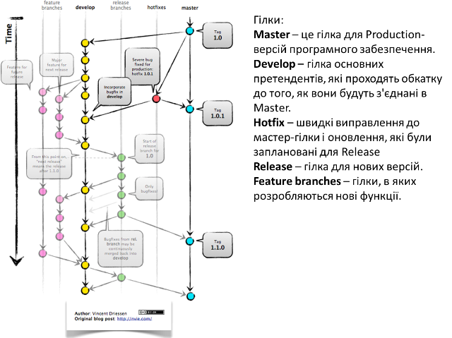
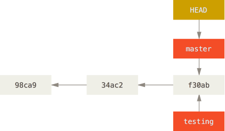
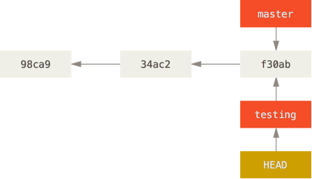
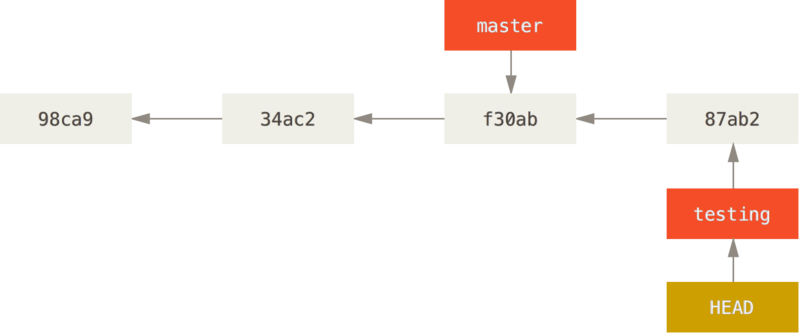
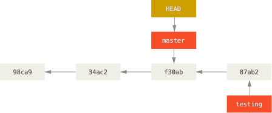
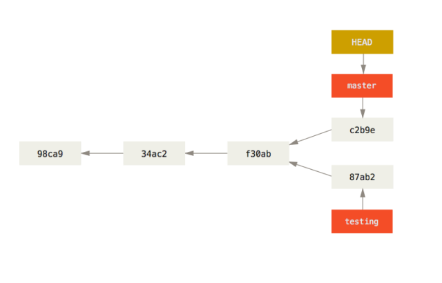
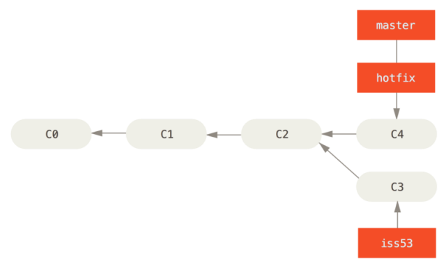
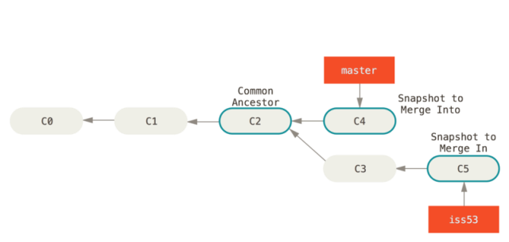
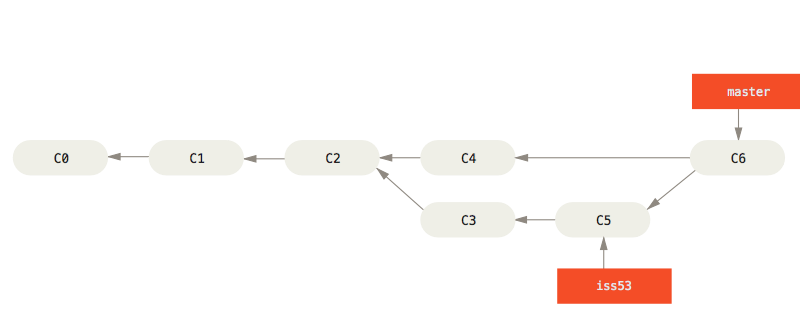

## 4. Основи роботи з галуженнями

Гілка в Git це просто легкий вказівник, що може пересуватись, на одну з цих фіксацій шляхом поступового переходу між ними. Загальноприйнятим ім'ям першої гілки в Git колись була ***master***, а з 2020 року ***main*** . При ініціалізації (створенні) репозиторія, за замовчуванням, Git створює тільки цю гілку. Коли ви почнете робити фіксації, вам надається гілка master(main), що вказує на останню зроблену фіксацію. Таким чином, щоразу, коли відбувається фіксація, вказівник «переміщується» вперед на останню фіксацію автоматично.

Галуження (***branches***) --- це відмежування від основної лінії розробки для продовження своєї частини роботи та уникнення конфліктів з основною лінією. Git дозволяє створити декілька гілок і перемикатися між ними. Це корисно, оскільки дозволяє працювати декільком розробникам над своїм функціоналом не заважаючи іншим і не псуючи основну гілку. Гілки у Git дуже просто використовувати. Приклад використання галужень в проєкті показаний на рис.9.



рис.9.Використання галужень в проєкті

З певного моменту код розгалужується, над кожною гілкою можна працювати окремо, наприклад кільком розробникам, а тоді гілки об'єднуються назад у головну гілку, де всі можуть бачити і використовувати зроблені зміни.

Гілка в Git просто є вказівником на одну із фіксацій. При кожній новій фіксації гілка в Git рухається автоматично (тобто перемикається на конкретну фіксацію). Гілка є простим файлом, який містить 40 символів контрольної суми SHA-1 фіксації. Тобто коли створюється нова гілка, створюється новий файл-вказівник, який вказує на конкретну фіксацію.

Cтворення нової гілки робиться за допомогою команди `git branch`:

```bash
git branch testing
```

У результаті цього створюється новий вказівник на фіксацію, в якій ви зараз знаходитесь.



рис.10. Дві гілки вказують на одну послідовність фіксацій

У певний момент часу Git знаходиться на одній із гілок. Для цього він зберігає особливий вказівник під назвою ***HEAD*** - це просто вказівник на активну локальну гілку. Команда git branch тільки створює нову гілку --- вона не переключає на неї, а залишається на активній.

Щоб переключитися на існуючу гілку, треба виконати команду `git checkout`. Наприклад для переключення на нову гілку testing:

```bash
git checkout testing
```

Це пересуває HEAD, щоб він вказував на гілку testing.



рис.11. HEAD вказує на поточну гілку

Після чергової фіксації, гілка testing пересунулась уперед, а гілка master досі вказує на фіксацію, що був у момент виконання `git checkout` для переключення гілок.



рис.12. Гілка testing пересувається уперед при фіксації

Після переключення назад до гілки master:

```bash
git checkout master
```

вказівник HEAD пересувається назад на гілку master, та повертаються файли у робочій папці до стану знімку, на який вказує master. Це також означає, що якщо зараз робляться нові зміни, вони будуть походити від ранішої версії проєкту (рис.13).



рис.13. HEAD пересувається, коли ви отримуєте (checkout)

Важливо зауважити, що коли переключаються гілки в Git, файли у робочій директорії змінюються. Якщо переключитися до старшої гілки, робоча папка буде повернута до того стану, який був на момент останнього фіксування у тій гілці. Якщо Git не може зробити це без проблем, він не дасть переключитися взагалі.

Якщо зробити декілька змін та зафіксувати:

```bash
git commit -a -m 'Зробив інші зміни'
```

то історія проєкту розійшлася (diverged) по двом різним гілкам. Ви створили гілку, дещо в ній зробили, переключились на головну гілку та зробили там щось інше. Обидві зміни ізольовані в окремих гілках. Ви можете переключатись між цими гілками та злити їх разом, коли вони будуть готові. І все це робиться за допомогою простих команд `branch`, `checkout` та `commit`.



рис.14. Розходження історій

Зливання (об'єднання, ***merge***, мердж) гілок покажемо на прикладі. Припустимо є три гілки mster, iss53 і hotfix (рис.15).


рис.15. Приклад з 3-ма гілками

Для злиття (merge) гілки hotfix до master використовується команда `git merge`. Перед цим за допомогою checkout йде переключення на гілку master

```bash
git checkout master
git merge hotfix
Updating f42c576..3a0874c
Fast-forward
 index.html | 2 ++
 1 file changed, 2 insertions(+)
```

Зверніть увагу на фразу "fast-forward" у цьому злитті. Через те, що коміт C4, який зливався, належав гілці hotfix, що була безпосередньо попереду поточного коміту C2, Git просто переміщує вказівник вперед. Іншими словами, коли ви зливаєте один коміт з іншим, і це можна досягнути слідуючи історії першого коміту, Git просто переставляє вказівник, оскільки немає змін-відмінностей, які потрібно зливати разом - це називається "перемоткою" ("fast-forward"). Тепер це має вигляд як на рис.16



рис.16. master перекинутий на hotfix

Для видалення гілки hotfix використовується команда `git branch` з опцією -d:

```bash
git branch -d hotfix
Deleted branch hotfix (3a0874c).
```

Зауважте, що тепер зміни з гілки hotfix відсутні в гілці iss53. Якщо вам потрібні ці зміни підчас роботи над iss53, ви можете злити master з iss53 командою git merge master, або просто почекати до того моменту коли ви будете інтегровувати iss53 в master.

Припустимо, що необхідно злити iss53 з гілкою master. Все що потрібно це перемкнутися на робочу гілку і виконати команду git merge:

```bash
git checkout master
Switched to branch 'master'
git merge iss53
Merge made by the 'recursive' strategy.
index.html |    1 +
1 file changed, 1 insertion(+)
```

Виглядає трошки інакше, ніж те, що було з гілкою hotfix. У цьому випадку історія змін двох гілок почала відрізнятися в якийсь момент. Оскільки коміт поточної гілки не є прямим нащадком гілки, в яку зливаються зміни, Git мусить робити триточкове злиття, користуючись двома знімками, що вказують на гілки та третім знімком - їх спільним нащадком.



рис.17. Три відбитки типового злиття

Замість того, щоб просто пересунути вказівник гілки вперед, Git створює новий знімок, що є результатом 3-точкового злиття, і автоматично створює новий коміт, що вказує на нього. Його називають комітом злиття (merge commit) та його особливістю є те, що він має більше одного батьківського коміту.



рис.18. Коміт злиття

Варто зауважити, що Git сам визначає найбільш підходящого спільного нащадка, якого брати за основу зливання.

Перегляд усіх гілок доступний через команду

```bash
git branch
  iss53
* master
  testing
```

Зверніть увагу на символ \* перед master: це вказівник на вашу поточно вибрану гілку (тобто ту, на котру вказує HEAD). Це означає, що якщо ви зараз захочете зробити коміт, master оновиться вашими новими змінами. Щоб побачити ваші останні коміти - запустіть git branch -v:

```bash
git branch -v
  iss53   93b412c fix javascript issue
* master  7a98805 Merge branch 'iss53'
  testing 782fd34 add scott to the author list in the readmes
```

Опції `--merged` та `--no-merged` корисні для фільтрування списку гілок залежно від того чи вони були злиті з поточною гілкою.

## 5. Вирішення конфліктів злиття

Трапляється, що процес злиття не проходить гладко. Якщо ви маєте зміни в одному й тому самому місці в двох різних гілках, Git не зможе їх просто злити. Якщо підчас роботи над `iss53` ви поміняли ту саму частину файлу, що й у гілці `hotfix`, ви отримаєте конфлікт, що виглядає приблизно так:

```bash
git merge iss53
Auto-merging index.html
CONFLICT (content): Merge conflict in index.html
Automatic merge failed; fix conflicts and then commit the result.
```

У цьому випадку Git не створив автоматичний коміт зливання. Він призупинив процес допоки ви не вирішите конфлікт. Для того, щоб переглянути знову які саме файли спричинили конфлікт, спочатку треба переглянути `git status`:

```bash
git status
On branch master
You have unmerged paths.
  (fix conflicts and run "git commit")

Unmerged paths:
  (use "git add <file>..." to mark resolution)

    both modified:      index.html

no changes added to commit (use "git add" and/or "git commit -a")
```

Все, що має конфлікти, які не були вирішені є в списку ***незлитих*** (***unmerged***) файлів. У кожен такий файл Git додає стандартні позначки-вирішенння для конфліктів, отже ви можете відкрити ці файли і вирішити конфлікти самостійно. Якщо ви хочете використовувати графічний інструмент для розв'язання конфліктів, виконайте команду `git mergetool`, яка запустить графічний редактор та проведе вас по всьому процесу.

У вашому файлі з конфліктом появиться блок, схожий на таке:

```html
<<<<<<< HEAD:index.html
<div id="footer">contact : email.support@github.com</div>
=======
<div id="footer">
 please contact us at support@github.com
</div>
>>>>>>> iss53:index.html
```

Розглянемо, як це розуміти. Версія файлу в `HEAD` (з вашої `master` гілки, оскільки ви запустили зливання, будучи на ній) у верхній частині блоку (все вище `=======`), а версія з `iss53` - все, що нижче. Щоб розв’язати цю несумісність, вам потрібно вибрати одну із версій, або самостійно (вручну) поредагувати вміст файлу. Наприклад, ви можете вирішити цей конфілікт, замінивши блок повністю:

```html
<div id="footer">
please contact us at email.support@github.com
</div>
```

В цьому випадку ми взяли потрохи з кожної секції, а стрічки `<<<<<<<`, `=======` та `>>>>>>>` видалили повністю. Після того, як ви розв’язали подібні несумісності в кожному блоці конфліктних файлів, виконайте для них `git add`, щоб індексувати та позначити, як ті, що розв’язані. Індексуючи файл, ви позначаєте його для Git таким, що більше не має конфлікту. Якщо ви хочете використовувати графічний інструмент для розв’язання конфліктів, виконайте команду `git mergetool`, яка запустить графічний редактор та проведе вас по всьому процесу:

```bash
git mergetool

This message is displayed because 'merge.tool' is not configured.
See 'git mergetool --tool-help' or 'git help config' for more details.
'git mergetool' will now attempt to use one of the following tools:
opendiff kdiff3 tkdiff xxdiff meld tortoisemerge gvimdiff diffuse diffmerge ecmerge p4merge araxis bc3 codecompare vimdiff emerge
Merging:
index.html

Normal merge conflict for 'index.html':
  {local}: modified file
  {remote}: modified file
Hit return to start merge resolution tool (opendiff):
```

Для того, щоб використовувати інструмент-програму іншу, ніж по-замовчуванню (Git обрав `opendiff`, оскільки команду було запущено з Mac), подивіться на список сумісних зверху одразу після “one of the following tools.” Просто введіть ім’я потрібного інструменту.

Після того, як ви вийшли з програми для зливання, Git спитає вас чи було зливання успішним. Якщо ви відповісте, що так, Git проіндексує файл для того, щоб позначити файл як безконфліктний. Можете виконати `git status` знову, щоб перевірити чи всі конфлікти розв’язані:

```bash
$ git status
On branch master
All conflicts fixed but you are still merging.
  (use "git commit" to conclude merge)

Changes to be committed:

    modified:   index.html
```

Якщо ви задоволені результатом та перевірили, що всі файли, котрі містили несумісності, проіндексовані, можете виконувати `git commit` і, таким чином, завершувати злиття. Повідомлення після коміту виглядає приблизно так:

```bash
Merge branch 'iss53'

Conflicts:
    index.html
#
# It looks like you may be committing a merge.
# If this is not correct, please remove the file
#	.git/MERGE_HEAD
# and try again.


# Please enter the commit message for your changes. Lines starting
# with '#' will be ignored, and an empty message aborts the commit.
# On branch master
# All conflicts fixed but you are still merging.
#
# Changes to be committed:
#	modified:   index.html
#
```

Якщо ви вважаєте, що це допоможе іншим зрозуміти коміт злиття у  майбутньому, можете змінити його повідомлення — докладно розказати, як  ви розвʼязали конфлікт, чому ви зробили саме такі зміни, якщо це й без  того не є очевидним.

Детальніше про роботу з Git читайте в українському варіанті онлайн книги [Pro Git](https://git-scm.com/book/uk/v2)