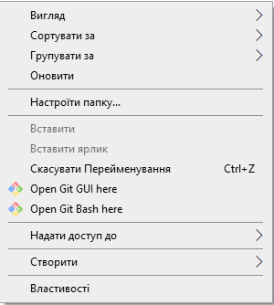

[<- До підрозділу](README.md)

# Вступ до git: практична частина

**Тривалість**: 1 акад. година (0.5 пари).

**Мета:** Познайомитися з Git. Почати використовувати для роботи з проектами Node-RED.

**Лабораторна установка**

- Апаратне забезпечення: ПК. 
- Програмне забезпечення: Node-RED, Git, сервіси GitHub

## Порядок виконання роботи 

Перед виконанням лабораторної роботи варто ознайомитися з лекцією по Git та GitHub, яка доступна [за посиланням](https://drive.google.com/open?id=1WgLFaHt1Z9de_k_JkmdmFXZXW-UNPl3s).

### 1. Встановлення Notepad++

- [ ] Завантажте <https://notepad-plus-plus.org/downloads/> та встановіть редактор Notepad++, якщо він ще не встановлений у вас в системі.

Редактор Nodepad++ є безкоштовним та має багато можливостей

### 2. Встановлення Git

- [ ] Завантажте та інсталюйте Git <https://git-scm.com/downloads>. При інсталяції залишайте усі опції за замовченням, окрім редактору, виберіть Notepad++ (рис.1).


рис.1. Встановлення Git

### 3. Реєстрація користувача в Git

При роботі з репозиторієм необхідно вказувати користувача, від імені якого проводяться операції. 

- [ ] У одній із директорій створіть папку `Project`. 
- [ ] Перейдіть до папки і через контекстне меню виберіть `Git Bash Here`



рис.2. Запуск Git Bash

- [ ] В консолі введіть команду перегляду конфігурації

```bash
git config --list
```


рис.3. Git команда перегляду конфігурації 

- [ ] У переліку конфігурацій немає зареєстрованого користувача. 
- [ ] Натисніть `q` щоб вийти з режиму перегляду
- [ ] Використовуючи команди добавте свого користувача та пошту, тобто в нижній команді замість `"John Doe"` вкажіть своє ім'я, а замість `johndoe@example.com`.  

```bash
git config --global user.name "John Doe"
git config --global user.email johndoe@example.com
```

де:

- `config` - підкоманда для роботи з налаштуваннями Git, читає, записує або змінює параметри конфігурації.

- `--global` - рівень конфігурації:

  - `--system` – для всієї системи

  - `--global` – для поточного користувача ОС,  налаштування збережеться у файлі `~/.gitconfig` (Linux/macOS) або `C:\Users\<user>\.gitconfig` (Windows)

  - (без ключа) – тільки для поточного репозиторію

- `user.name` і `user.email` - ключі конфігурації:

  - `user` – секція
  - `name` – параметр який вказує на ім'я
  - `email` - параметр який вказує на пошту 

  Після цього перевірте, що вони добавлені через команду `git config ---list`

### 4. Ініціалізація локального репозиторію

- [ ] Використовуючи команду `git init` ініціалізуйте репозиторій. 
- [ ] Зробіть налаштування провідника, щоб відображалися приховані файли та директорії.
- [ ] Перевірте, що в робочій папці створилася папка з назвою `.git`

При ініціалізації репозиторію за допомогою команди `git init` Git створює у вибраному каталозі службову директорію `.git`. Саме в ній зберігається вся внутрішня інформація репозиторію: історія змін, об’єкти комітів, посилання на гілки, теги та локальні налаштування. Без цієї директорії каталог не вважається Git-репозиторієм, навіть якщо в ньому є файли проєкту. Після створення `.git` формується порожня структура репозиторію. На цьому етапі в історії ще немає жодного коміту, а всі файли в робочому каталозі залишаються невідстежуваними. Також створюється початкова гілка, яка за замовчуванням має назву `master` або `main`, залежно від версії Git та його конфігурації.

Під час ініціалізації Git одразу застосовує наявні налаштування конфігурації. Він читає їх у визначеному порядку: системні, глобальні, а потім локальні. Тому параметри на кшталт `user.name` та `user.email`, задані глобально, вже доступні для цього репозиторію і будуть використані під час створення перших комітів. Важливо, що команда `git init` не змінює вміст робочого каталогу. Вона не додає файли до індексу і не створює жодних комітів. Репозиторій лише готується до роботи, а подальші дії, такі як додавання файлів і фіксація змін, виконуються окремими командами.

### 5. Створення файлу в робочій папці

- [ ] Використовуючи Notepad++ у папці створіть текстовий документ `file1` з трьома рядками і збережіть. 


рис.4. Створення файлу та його коміт через консольну утиліту

- [ ] Використовуючи команду `git status` виведіть стан репозиторію.
- [ ] Зробіть копію екрану для звіту і визначте призначення кожного статусного рядку. 

- [ ] Використовуючи команду `Git Gui Here` контекстного меню в папці проекту викличте графічний інтерфейс `Git Gui`. 
- [ ] Проконтролюйте щоб в налаштуваннях проекту стояв шрифт `utf-8`


рис.5. Налаштування роботи з кодуванням шрифтів в Git

- [ ] Проаналізуйте зміст. Зробіть копію екрану.


рис.6. Перегляд змін у файлі

### 6. Індексування (Staging)

- [ ] Запустіть команду для добавлення файлу на індексування.

```
git add file1.txt  
```

- [ ] Використовуючи команду `git status` виведіть стан репозиторію.
- [ ] Зробіть копію екрану для звіту і визначте призначення кожного статусного рядку. 
- [ ] Якщо `Git Gui` відриктий зробіть `Rescan`. Зробіть висновки щодо відображення стану в `Git Gui` 


рис.7. Добавлення файлів у індекс

### 7. Збереження відтиску (commit)

- [ ] Запустіть команду коміту з повідомленням (опція -m) «Перша версія проекту», повторіть пункт 5.

```bash
git commit -m 'Перша версія проекту' 
```

- [ ] Подивіться `Git status` в `Git bash` та `Git gui` Порівняйте збережені копії екранів, зробіть висновок, щодо їх змісту.

### 8. Історія проекту через Git Bash

- [ ] Створіть новий файл в робочій директорії з назвою `file2.txt`. 
- [ ] Запишіть туди три довільні рядки. 
- [ ] У файлі `file1.txt` видаліть другий рядок, та добавте в кінець рядок з написом `четвертий рядок`. 
- [ ] Добавте обидва файли до індексу та зробіть коміт.

```bash
git add *.txt
git commit -m 'Друга версія проекту' 
```

- [ ] Виконайте команду для перегляду історії проекту. 

```bash
git log
```

- [ ] Зробіть копію екрану.

### 9. Історія проекту через Git Gui

- [ ] Відкрийте графічний інтерфейс, викличте меню «Repository-\>Visualize master's History», передивіться історію комітів. 


рис.8. Перегляд історії комітів

- [ ] Зробіть копію екрану.

### 10. Базові операції через Git Gui

- [ ] Створіть ще один файл `README.md`
- [ ] Добавте туди наступний текст, змінюючи прізвище на свою:

```markdown
# Мій перший репозиторій в Git
**Автор**: Олександр Пупена 
```

- [ ] Скористайтесь наступними кнопками `Git gui`:
- `Rescan` - для оновлення перегляду стану репозиторію
- `Stage cahnged` - для індексування усіх змінених файлів
- Введіть повідомлення в поле `Commit message` наступного змісту `Добавлення файлу README` та натисніть `Commit` 


Практичне заняття розробив   [Олександр Пупена](https://github.com/pupenasan)


Якщо Ви хочете залишити коментар у Вас є наступні варіанти:

- [Обговорення у WhatsApp](https://chat.whatsapp.com/BRbPAQrE1s7BwCLtNtMoqN)
- [Обговорення в Телеграм](https://t.me/+GA2smCKs5QU1MWMy)
- [Група у Фейсбуці](https://www.facebook.com/groups/asu.in.ua)

Про проект і можливість допомогти проекту написано [тут](https://asu-in-ua.github.io/atpv/)
