[<- До підрозділу](README.md)		[Коментувати](#feedback)

#  Вступ до систем керування версіями та Git: теоретична частина

## 1. Системи керування версіями

Система керування версіями (***СКВ,*** source code management - SCM, Version Control System - VCS) - це система, що записує зміни у файл або наборі файлів протягом деякого часу таким чином, що можна повернутися до певної версії пізніше. Це може бути як програмний код, так і будь-які інші файли. 

Системи керування версіями зазвичай використовуються при розробці програмного забезпечення для відстеження, документування та контролю над поступовими змінами в електронних документах: у вихідному коді застосунків, кресленнях, електронних моделях та інших документах, над змінами яких одночасно працюють декілька людей. Хоча СКВ з'явилися у світі програмування, зараз це можуть бути будь-які документи, які зовсім не пов'язані з програмуванням. Наразі ми не будемо наголошувати на тому, що це за зміст файлів, називаючи все це просто документами. 

Кожна версія позначається має унікальний ідентифікатор (наприклад літери+код, хеші, тощо), а зміни в документі занотовуються. Зазвичай також зберігаються дані про автора зробленої зміни та її час. Інструменти для керування версіями входять до складу багатьох інтегрованих середовищ розроблення. До функцій СКВ входять можливості повернути вибрані файли до попереднього стану, повернути весь проєкт до попереднього стану, побачити зміни, побачити, хто останній змінював щось і спровокував проблему, хто вказав на проблему і коли, та багато іншого.

### Локальні, централізовані та розподілені СКВ

Для розуміння призначення та функцій зробимо певну класифікацію. Залежно від особливостей сумісної роботи над єдиним сховищем документів можна виділити три основні типи систем керування версіями: 

- локальні, 
- з централізованим сховищем 
- розподілені (децентралізованим).

Почнемо з найпростіших, на яких можна пояснити призначення СКВ. Деякі люди в якості одного з підходів керування версіями документів без використання спеціалізованих СКВ роблять звичайне копіювання файлів в окрему директорію з позначкою версії, наприклад назвою директорії з вказівкою часу. Даний підхід є дуже поширеним завдяки його простоті. На рис.1 показаний приклад назв таких папок з власного досвіду автора даної лекції (дисертація) як видно вже на останніх стадіях її доробки :-) 

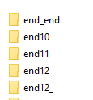

рис.1. Копія екрану  

Такий підхід контрольований, зрозумілий, проте він, схильний до появи помилок. Зокрема можна легко забути в якій директорії ви знаходитеся і випадково змінити не той файл, або скопіювати не ті файли, які ви хотіли. Важко відслідкувати що саме і коли було змінено, повернути назад ті зміни, які випадково було зроблено. Щоб справитися з цією проблемою, програмісти розробили так звані локальні СКВ, що мають просту базу даних, яка зберігає всі зміни в файлах під керуванням версіями (рис.2). Сховище (база даних) з набором файлів та змін, які відбувалися над ними, що керуються СКВ називається ***репозиторієм***. По суті, репозиторій як правило є одним проєктом, над яким проводяться операції як з єдиним набором файлів.

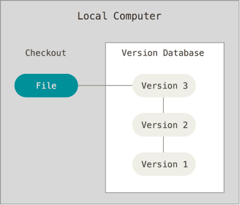

Рис.2. Принципи роботи локальних систем керування версіями.

Така локальна СКВ дає можливість:

-   зберігати зміст (код, текст, інші види файлів);

-   запам'ятовувати історію змін документів, та дозволяти у будь-який момент побачити хто саме зробив зміни, коли зробив зміни;

-   відкотитися до будь-якої версії документу у будь-який момент;

-   об'єднувати зміни різних версій, станів та розробників;

Локальні СКВ обмежені роботою одного користувача. У більшості випадків є потреба працювати над єдиним набором документів кільком розробникам. У цьому випадку можна використовувати централізовані системи керування версіями (**CVCS**). Такі системи передбачають наявність єдиного серверу, який містить всю базу даних (усі версії файлів), та певну кількість клієнтів, які отримують файли з цього серверу.

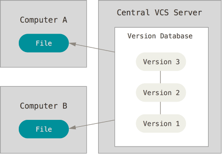

Рис. 3. Централізовані системи керування версіями.

Такий підхід має багато переваг, особливо над локальними СКВ. Наприклад, кожному учаснику проєкту відомо, певною мірою, чим займаються інші. Адміністратори мають повний контроль над тим, хто і що може робити. Набагато легше адмініструвати ЦСКВ, ніж мати справу з локальними базами даних для кожного клієнта. Але цей підхід також має деякі серйозні недоліки. Найбільш очевидним є єдина точка відмови, яким є централізований сервер. Якщо сервер виходить з ладу протягом години, то протягом цієї години ніхто не може співпрацювати або зберігати зміни над якими вони працюють. Якщо жорсткий диск центральної бази даних на сервері пошкоджено, і своєчасні резервні копії не були зроблені, то втрачається абсолютно все - вся історія проєкту, крім одиночних знімків проєкту, що збереглися на локальних машинах людей. Локальні СКВ страждають тією ж проблемою - щоразу, коли вся історія проєкту зберігається в одному місці, ви ризикуєте втратити все.

Альтернативою є розподілені системи керування версіями (**DVCS**, Distributed Version Control System), в яких клієнти мають повну копію сховища разом з усією його історією. Тобто може бути сервер, через який співпрацюють розробники, копіюючи сховище в локальну базу даних. Коли сервер ламається, будь-який з клієнтських репозиторіїв може бути скопійований назад до нової копії серверу, щоб відновити його. Крім того, багато з цих систем дуже добре взаємодіють з декількома віддаленими репозиторіями (серверами), так що можна співпрацювати з різними групами людей, застосовуючи різні підходи в межах одного проєкту одночасно. Це дозволяє налаштувати декілька типів робочих процесів, таких як ієрархічні моделі, які неможливі в централізованих системах.

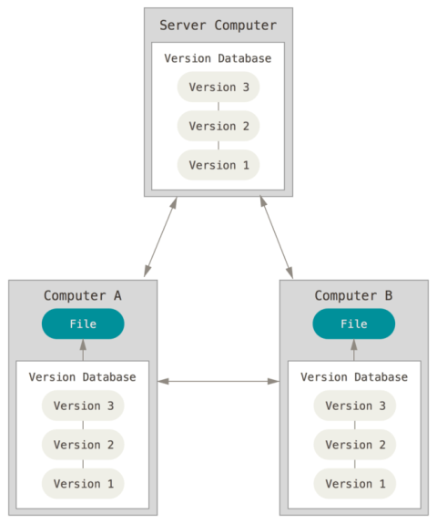

Рис 4. Розподілені системи керування версіями.

### Класифікація за типом об’єктів, зміни яких відстежуються

Системи керування версіями можна класифікувати за типом об’єктів, зміни яких вони відстежують. Частина систем орієнтована насамперед на роботу з текстовими файлами, такими як програмний код або структуровані документи. У таких системах добре підтримуються порівняння версій і злиття змін на рівні рядків. Саме такою є Git, яка наводиться нижче, тому на них не будемо тут зосереджуватися. 

Інші системи є універсальними і дозволяють зберігати будь-які типи файлів, зокрема двійкові. Вони мають перевагу в тому, що не накладають обмежень на типи даних, з якими працює проєкт. Це робить їх придатними для проєктів, у яких поряд із текстовими документами використовуються складні немодифіковані формати. Кожна версія фіксує узгоджений набір файлів незалежно від їхнього внутрішнього формату, що спрощує відтворення попередніх станів, аудит змін і передачу проєкту між командами або етапами життєвого циклу. У цьому випадку система керування версіями виконує роль контрольованого архіву, а не інструмента аналізу внутрішнього змісту файлів.  

Універсальні СКВ широко застосовуються в інженерних і виробничих проєктах, де ключовими є не дрібні текстові правки, а узгоджені версії комплектів документів, а в цьому випадку частіше двійкових файлів. Типовими прикладами є керування конструкторською документацією, електронними моделями виробів, результатами моделювання, технічною та експлуатаційною документацією, а також навчальними й проєктними архівами, що містять різнорідні файли. 

Основним недоліком універсальних систем керування версіями є обмежені можливості аналізу змін у двійкових файлах. На відміну від текстових документів, система зазвичай не може показати, що саме змінилося всередині файлу, а лише фіксує факт його заміни. Ще одним недоліком є складність паралельної роботи. Для двійкових файлів часто неможливе автоматичне злиття змін, тому конфлікти вирішуються шляхом блокування або ручного вибору однієї з версій, що уповільнює роботу команди. Крім того, зберігання великих двійкових файлів призводить до швидкого зростання обсягу сховища та підвищених вимог до мережі й резервного копіювання. У результаті такі системи гірше масштабуються для проєктів з частими змінами великих файлів.

У контексті універсальних СКВ окремо варто згадати Apache Subversion ([SVN](https://subversion.apache.org)), яка тривалий час була і залишається однією з найбільш уживаних систем у сфері промислової автоматизації. Її централізована модель, простий і зрозумілий підхід до керування версіями та добра робота з двійковими файлами зробили SVN популярною для супроводу PLC-проєктів, SCADA/HMI-конфігурацій, графічних екранів, бібліотек функціональних блоків і пов’язаних інженерних даних. У багатьох промислових інструментах і організаціях SVN використовувалася як базове сховище «єдиної істини» для проєкту, де важливішими є контроль доступу, відтворюваність станів і стабільність процесів, ніж складні механізми гілкування. Саме тому SVN досі широко зустрічається в промислових середовищах, навіть попри активне поширення Git у суміжних ІТ-напрямах. 

### Інші класифікації СКВ

Наведені вище класифікації особливо важливі для розуміння автоматниками. Тут зведемо інші класифікації в одному підпункті.  

За способом збереження історії змін системи керування версіями поділяються на ті, що зберігають повні знімки стану файлів, і ті, що зберігають лише відмінності між версіями. У першому випадку кожна зафіксована версія відображає повний стан проєкту на певний момент часу. У другому випадку історія формується як послідовність змін, що дозволяє ефективніше використовувати сховище, але ускладнює відновлення окремих станів без обробки ланцюжка змін.

Іншим критерієм є модель роботи з паралельними змінами, тобто коли однакові файли змінюються в різних пов'язаних репозиторіях, що характерно для централізованих та розподілених СКВ. У деяких системах застосовується підхід блокування файлів, коли документ може редагувати лише один користувач у певний момент часу. Альтернативний підхід полягає у дозволі паралельної роботи над одними й тими самими файлами з подальшим об’єднанням змін (розв’язання конфліктів). Така модель є більш гнучкою, але потребує механізмів розв’язання конфліктів.

Важливою ознакою є рівень підтримки гілкування - створення галуження версій робочих папок. У частині систем створення та об’єднання гілок є складною операцією, яка використовується обмежено. В інших системах гілки є легкими й швидкими, що дозволяє активно застосовувати їх для експериментів, паралельної розробки та керування різними напрямами розвитку проєкту.

Системи керування версіями також можна класифікувати за сферою застосування. Одні з них орієнтовані переважно на програмну розробку і тісно пов’язані з процесами тестування та випуску версій. Інші застосовуються для керування інженерною та проєктною документацією, зокрема кресленнями та моделями. Існують також системи загального призначення, які не прив’язані до конкретної предметної області.

За рівнем інтеграції з іншими інструментами розрізняють автономні системи та системи, що є частиною ширших інженерних або розробницьких середовищ. У другому випадку система керування версіями взаємодіє із засобами керування задачами, тестуванням, збіркою та розгортанням програмних продуктів.

Окремим критерієм є рівень автоматизації процесів. Прості системи вимагають від користувача явного виконання більшості операцій і рішень. Більш розвинені системи підтримують автоматичні перевірки, політики доступу, а також виконання допоміжних процесів, що спрощує колективну роботу і знижує кількість помилок.

Наведені вище класифікації дозволяють зрозуміти, що системи керування версіями можуть суттєво відрізнятися за архітектурою, типами даних і способом організації спільної роботи. Проте на практиці важливо не лише знати, до якого класу належить та чи інша система, а й розуміти її внутрішню модель роботи з даними та змінами.

Далі розглядається Git не просто як ще одна система керування версіями, а як цілісна модель організації змін у проєкті. У Git ключовими є не окремі файли чи команди, а поняття знімка стану проєкту, незмінних версій та зв’язків між ними. Саме ця модель визначає логіку локальної роботи, галуження, злиття та подальшої колективної взаємодії.

Тому подальший матеріал зосереджується на принципах внутрішньої організації Git, які лежать в основі всіх його інструментів і робочих процесів.

## 2. Система керування версіями GIT

### Про Git

**Git** — розподілена система керування версіями файлів і спільної роботи. Проєкт Git створив Linus Torvalds для керування розробкою ядра Linux, нині розвиток і супровід проєкту координує Junio C. Hamano. Git є однією з найефективніших, надійних і високопродуктивних систем керування версіями та надає гнучкі засоби нелінійної розробки, що базуються на механізмах гілкування та злиття. Програма є вільною і поширюється за ліцензією GNU GPL версії 2.

Система спроєктована як набір окремих програм, орієнтованих на використання у скриптах. Такий підхід дозволяє будувати спеціалізовані рішення керування версіями на базі Git, а також різноманітні користувацькі інтерфейси. Разом із Git постачаються базові графічні інструменти, зокрема gitk та git-gui.

Віддалений доступ до репозиторіїв Git може здійснюватися кількома способами: через вбудовану службу `git daemon`, за допомогою SSH або через HTTP(S). Це забезпечує гнучку інтеграцію Git у різні інженерні та ІТ-інфраструктури.

Важливою особливістю Git є його внутрішня модель зберігання даних. Розуміння цих особливостей є ключовим для подальшого вивчення принципів роботи Git. На відміну від класичних систем, Git зберігає не послідовність змін окремих файлів, а знімки стану всього проєкту. Кожна зафіксована версія однозначно ідентифікується криптографічним хешем, що забезпечує цілісність історії та дозволяє виявляти будь-які пошкодження або неузгодженості даних. 

Більшість операцій у Git виконується локально, без звернення до мережі, а віддалені репозиторії використовуються переважно для синхронізації між учасниками. Характерною рисою Git є також наявність проміжної області підготовки змін, яка дозволяє точно контролювати склад кожної версії. Сукупність цих принципів зробила Git основою для сучасних робочих процесів колективної розробки та супроводу проєктів.

### Концептуальна модель Git

Для розуміння Git важливо відокремити команди від моделі, на якій вони базуються. Git насамперед є локальною системою зберігання та організації станів сукупності файлів (надалі будемо називати **проєктом**), а всі команди лише керують цією внутрішньою структурою.

Базовими складовими моделі Git є робоча директорія, репозиторій, коміт та індекс (область підготовки змін). **Робоча директорія (Working Directory)** містить поточні редаговані файли. **Репозиторій** є базою даних, яка зберігає всі зафіксовані знімки та службову інформацію про історію проєкту (розмір, час створення, останньої зміни тощо). Ця база даних фізично знаходиться в робочій папці як прихована папка `.git` (рис.5).  

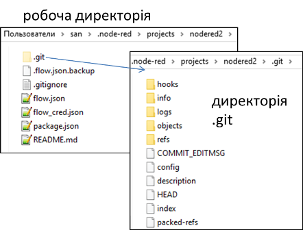

Рис. 5. Приклад робочої директорії

За необхідності фіксації стану файлів робочої директорії їхній вміст зберігається в репозиторії у вигляді знімка разом зі службовою інформацією (рис.6), при необхідності редагування конкретної версії - відтворюються в робочій директорії з репозиторію (**Checkout**). Ці фіксовані знімки називаються **комітами** (**commit**).  Для включення змін до наступного коміту використовується команда додавання їх до індексу (на рис.6 показана як `Stage fixes`). Таким чином історія проєкту формується не шляхом редагування попередніх версій, а шляхом додавання нових знімків, пов’язаних між собою.   

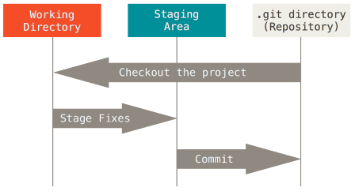

Рис. 6. Області збереження в Git.

У Git зафіксовані версії є незмінними, тобто після створення коміт не змінюється, а подальша зміна репозиторію завжди приводить до створення нових комітів. Git ідентифікує всі збережені об’єкти за їхніми хешами. Якщо простими словами то **хеш** - це число, яке формується на основі змісту файлу з використанням спеціальних алгоритмів, що формують різність результату за різними змістами файлів. Перед кожним збереженням файлів Git, використовуючи спеціальний алгоритм криптографічного хешування за змістом файлу обчислює хеш, який стає унікальним індексом файлу в репозиторії Git. Використовуючи хеш Git легко відслідковує зміни в файлах, так як зміна файлу приводить до нового значення хешу.

### Робочі процеси в Git

Давайте тепер розглянемо як працює Git через призму робочих процесів. Як ми уже зазначили усі файли проєкту знаходяться в робочій директорії. При їх редагуванні версія, що раніше зафіксована в репозиторії (якщо така фіксація була) не відповідає такій в робочій директорії. Коли змінювані (***modified***) файли є сенс зафіксувати в репозиторії, розробник має спочатку дати команду на індексацію (stage). Під час індексації, у файл індекса, який також називають областю додавання (***staging area***), розміщується інформація про те, що саме буде зафіксовано у наступному знімку тобто коміті (див.рис.6). Після індексації усіх необхідних файлів, фіксація проводиться командою ***commit***, а файли вважаються зафіксованими або «збереженими в коміті» (***committed***). 

Вище описано процес для ***відстежуваних***(***tracked***) файлів, тобто за якими Git стежить. Відстежувані файли - це ті, що були в останньому знімку. Саме ці файли Git визначає як незмінені (unmodified), змінені (modified) або індексовані (staged). Усі інші файли є невідстежувані (untracked), бо Git не слідкує за ними. У розповіді до цього ми упустили початковий момент: для того щоб робоча папка мала репозиторій Git треба зробити ініціалізацію Git (команда `git init`), в результаті якої створиться репозиторій. Саме з цього моменту працюватиме цей робочий процес. Таким чином весь процес роботи з файлами в робочій директорії що має репозиторій Git матиме вигляд як на рис.7. Нові файли є спочатку невідстежувані, як тільки їх добавляють в індекс а потім в коміт, Git починає за ними стежити. Відстежувані відносно останнього коміту файли при їх зміні в робочій директорії мають статус змінені і після індексування і коміта попадають в новий знімок в репозиторій.     

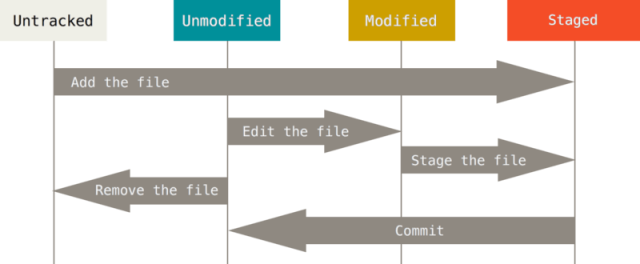

Рис.7. Стан файлів Git в робочій директорії

### Версії знімків

Отже Git зберігає дані набором знімків файлів (проєкту), які формуються після чергового коміту. Кожен збережений вміст файлу має ідентифікатор у вигляді хешу, і кожна нова версія (кожен коміт) має свій унікальний ідентифікатор в межах репозиторію. Кожного разу при фіксації поточної версії проєкту Git зберігає знімок того, як виглядають всі файли проєкту. Однак при цьому, замість того щоб реально записувати усі файли в цей знімок, туди заносяться тільки змінені файли, а на не змінені просто дається посилання на раніше збережений файл репозиторію. Наприклад на рис.8 є п'ять знімків які позначаються як різні версії. Хеші файлів спрощено показані як `A`, `B`, `C` з номерами, які вказують кількість зафіксованих змін в файлі. Як бачимо у `Version 3` реально записаний тільки файл `C2` тоді як на інші файли йде поислання: `A1` (перша зміна, другий коміт, зафіксована в другій `Version 2`) та `B` (при першому коміті).      

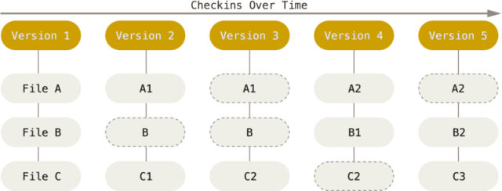

Рис. 8. Дані як знімки стану проєкту в часі

Тепер розглянемо це трохи детальніше. Отже, Git зберігає дані не як послідовність змін, а як послідовність знімків. Коли фіксуються зміни командою `commit` (рис.9), Git зберігає:

- об'єкти фіксації, що містять вказівники на зміст файлів, 
- ім'я та поштову адресу автора, який зробив коміт
- набране при коміті повідомлення - команда `commit` супрводжується текстовим повідомленням, яке фіксується в репозиторії 
- вказівники на попередні фіксації (parent). 

Розглянемо це на прикладі, який показано на рис.9, там показано три коміти, кожен з яких:

- має власний ідентифікатор (наприклад `98ca9`, `34ac2`, `f30ab`);
- відображає розмір службового об’єкта коміту в репозиторії Git `commit size` 
- вказує на об’єкт Git `Tree`, який описує структуру проєкту в конкретному коміті, зберігаючи імена файлів і каталогів та посилання на відповідні об’єкти з вмістом файлів
- містить посилання на попередній коміт (`parent`);
- вказує на знімок стану проєкту (`Snapshot A`, `B`, `C`)
- вказує автора (хто зробив зміни) і того хто зробив коміт

Коміт містить службову інформацію і посилання на знімок стану проєкту, а `snapshot` представляє сам зафіксований стан файлів, означений через tree- та blob-об’єкти.

Під час першого коміту формується ідентифікатор знімка (наприклад, `98ca9`).  Оскільки це початкова фіксація, посилання на попередній коміт відсутнє (`parent` має нульове значення). Цей коміт відповідає знімку `Snapshot A`.  Кожен наступний коміт містить посилання на попередній коміт. На схемі це показано стрілками, які відображають саме зв’язок між комітами (`parent`), а не часову або логічну послідовність змін у файлах. Таким чином коміти утворюють ланцюжок, що формує одну гілку з повною історією фіксацій.

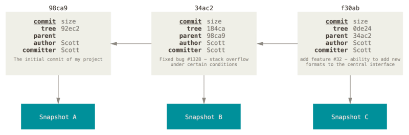

Рис.9. Фіксації та їх батьки.

## 3. Основи роботи з Git для локального репозиторію

У цьому розділі посібника розглядається робота з Git на локальному комп’ютері без взаємодії з віддаленими репозиторіями. Усі операції виконуються з локальним репозиторієм, що дозволяє працювати з історією, створювати коміти та аналізувати зміни без підключення до мережі. Віддалені репозиторії та операції синхронізації розглядатимуться окремо в наступних розділах.

### Початкова конфігурація Git

Для роботи з Git можна використовувати різні клієнти, зокрема офіційний дистрибутив Git, доступний на сайті <https://git-scm.com>. Окрім клієнтів командного рядка, існує велика кількість графічних клієнтів з різними можливостями. Командний рядок є єдиним інтерфейсом, який надає доступ до повної функціональності Git, оскільки більшість графічних інтерфейсів реалізує лише обмежену підмножину його можливостей. Для інсталяції Git під Windows достатньо перейти за посиланням <https://git-scm.com/download/win>, після чого завантаження розпочнеться автоматично.

Після інсталяції Git необхідно провести початкові налаштування. До Git входить утиліта що має назву `git config`, яка дозволяє отримати чи встановити параметри, що контролюють усіма аспектами того, як Git виглядає чи працює. Ці параметри можуть бути збережені в різних місцях. У системах Windows, Git шукає файл `.gitconfig` в каталозі `$HOME` (`C:\Users\$USER` для більшості користувачів). Він також все одно шукає файл `/etc/gitconfig`, хоча відносно кореня MSys, котрий знаходиться там, де ви вирішили встановити Git у вашій Windows системі, коли ви запускали інсталяцію. Є також системний конфігураційний файл `C:\\ProgramData\\Git\\config`. Цей файл може бути зміненим лише за допомогою `git config -f <файл>` адміністратором.

Перше, що необхідно зробити після інсталяції Git - встановити ім'я користувача та адресу електронної пошти. Це важливо, тому що кожен коміт в Git використовує цю інформацію, і вона незмінно включена у комміти, які ви робите:

```bash
git config --global user.name "John Doe"
git config --global user.email johndoe@example.com
```

Якщо ви передаєте опцію `--global`, ці налаштування потрібно зробити тільки один раз, тоді Git завжди буде використовувати цю інформацію для всього, що ви робите у цій системі. Якщо ви хочете, перевизначити ім'я або адресу електронної пошти для конкретних проєктів, ви можете виконати цю ж команду без опції `--global` в каталозі необхідного проєкту. Багато з графічних інструментів допомагають зробити це при першому запуску.

Якщо ви хочете подивитися на свої налаштування, можете скористатися командою

```bash
git config –-list
```

, щоб переглянути всі налаштування, які Git може знайти.

Для отримання допомоги по конкретній команді, можна викликати:

```bash
git help <command>
```

або

```bash
git <command> -h
```

Крім консольної версії, яка в середовищі Windows встановлюється у вигляді Git Bash, автоматично встановлюються також базові графічні інструменти для роботи з Git, зокрема Git GUI та GitK, які дозволяють виконувати основні операції та переглядати історію репозиторію у візуальній формі. Виклик Git Bash та Git GUI доступне через контекстне меню. 

### Створення репозиторію в робочій директорії Git

Для роботи з проєктом, який наразі не перебуває під контролем Git, спочатку необхідно перейти до каталогу цього проєкту за допомогою командного рядка. Наприклад, у Windows для цього можна використати команду `cd`:

```bash
cd C:\Users\my_user\my_project
```

Після цього виконується ініціалізація репозиторію командою:

```bash
git init
```

У результаті буде створено підкаталог `.git`, який містить усі необхідні службові файли репозиторію — так званий «скелет» Git-репозиторію. На момент ініціалізації жоден файл проєкту ще не перебуває під контролем версій.

Процес ініціалізації можна також зробити через Git Gui. Якщо викликати цю команду в директорії яка не проініціалізована Git, застосунок Git Gui запропонує створити новий репозиторій, або зробити інші дії (рис.10). Після виборі `Create New Repository` необхідно вказати назву робочої директорії, в якій буде створено цей репозиторій.

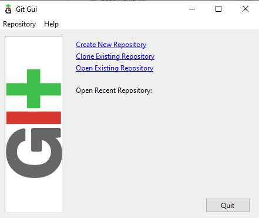

рис.10. Зовнішній вигляд Git Gui

Якщо потрібно додати наявні файли проєкту до керування версіями (на відміну від порожнього каталогу), слід проіндексувати ці файли та виконати перший коміт. Це виконується у два кроки:

- за допомогою команди `git add`, яка додає вибрані файли до індексу;
- після чого виконується команда `git commit`, що фіксує поточний стан проєкту.

```bash
git add *.md
git add LICENSE.txt
git commit -m "Перша версія проєкту"
```

У наведеному прикладі було проіндексовано всі файли з розширенням `*.md` та файл `LICENSE.txt`, після чого їхній стан було зафіксовано в коміті. Після виконання цих команд локальний Git-репозиторій міститиме зафіксований стан зазначених файлів проєкту.

За кожної зміни файлів у робочій директорії не обов’язково одразу фіксувати їх у репозиторії. Зазвичай коміти виконуються тоді, коли необхідно зафіксувати певний логічно завершений стан проєкту з можливістю повернення до нього в майбутньому.

### Перевірка стану

Перевірку стану файлів в робочій директорії можна зробити через консольну команду `git status` , або через `git status -s` для короткої версії статусу.

На рис.11 показаний приклад виклику повної та короткої команд, розглянемо результат. 

- Репозиторій перебуває на гілці `main`. Помилок немає, Git коректно ініціалізований і працює з локальним репозиторієм.

- `Changes to be committed` (проіндексовані зміни) - у цьому розділі показані файли, які вже додані до індексу (staging area) і будуть включені до наступного коміту, якщо його виконати.

  ```
  new file: README.md
  ```

  означає що файл `README.md` відстежується Git, його поточний стан проіндексований, Git готовий зафіксувати його в коміті.

- `Untracked files` (невідстежувані файли) - у цьому розділі показані файли та каталоги, які присутні в робочій директорії, але ще не перебувають під контролем Git.

  ```
  introd.md
  media/
  ```

  означає що Git бачить вказані об’єкти, вони не додані до індексу, вони не потраплять до коміту, поки не буде виконано `git add`.


рис.11. Приклад `git status` в Git Bash

Вивід скороченого вигляду (`git status -s`) підтверджує той самий стан:

```
A  README.md
?? introd.md
?? media/
```

де `A` — файл доданий до індексу (staged), `??` — файл або каталог невідстежуваний (untracked).

Загальний висновок - стан репозиторію показує, що файл `README.md` проіндексований і готовий до фіксації, тоді як файли `introd.md` та каталог `media` ще не перебувають під контролем версій і не будуть включені до коміту без явного додавання до індексу.

У Git Gui стан автоматично показується при запуску, поміщаючи файл у відповідний список `Unstaged` та `Signed Changes` а також відображаючи відповідними піктограмами,  і в даному випадку виглядатиме як на рис.12. Для оновлення інформації про стан треба викликати команду натиснувши кнопку `Rescan` 

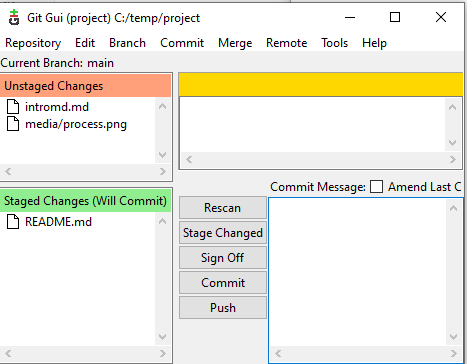

рис.12. Приклад `git status` в Git Gui

### Робота з робочою директорією Git

#### Індексація

Додавання нових або змінених файлів до індексу виконується за допомогою команди Git Bash:

```bash
git add <файли>
```

Команда `git add` приймає шлях до файлу або директорії. Якщо вказано директорію, команда додає до індексу всі файли в цій директорії, включно з піддиректоріями.

Команда `git add` є багатоцільовою. Вона використовується для початку відстеження нових файлів, для додавання змінених файлів до індексу, а також для інших дій, зокрема для позначення конфліктних файлів як розв’язаних після злиття.

У Git GUI (див.рис.12) користувач може вибрати нові або змінені файли зі списку `Unstaged Changes` та додати їх до області підготовки змін (`Staged Changes`) за допомогою кліку по цьому файлу. Якщо необхідно проіндексувати усі змінені або невідстежувані файли, можна скористатися кнопкою  `Stage Changed`.

#### Перегляд змін у файлах

Команда `git diff` показує, які саме зміни були внесені до файлів відносно останнього зафіксованого стану репозиторію. За замовчуванням вона відображає різницю між поточним станом файлів у робочій директорії та їхнім станом в індексі або в останньому коміті, залежно від того, чи були ці файли проіндексовані. Вивід `git diff` подається у вигляді текстового порівняння рядків, де видалені рядки позначаються знаком `-`, а додані — знаком `+`. Це дозволяє точно побачити, які фрагменти файлу були змінені перед фіксацією.

Для перегляду змін, які вже додані до індексу і будуть включені до наступного коміту, використовується команда:

```
git diff --staged
```

Таким чином, `git diff` є основним інструментом для аналізу змін перед комітом і дозволяє перевірити коректність змін як у робочій директорії, так і в індексі, до їх остаточної фіксації в історії репозиторію.

На рис.13 показаний приклад виклику команди в Git Bash та Git Gui 

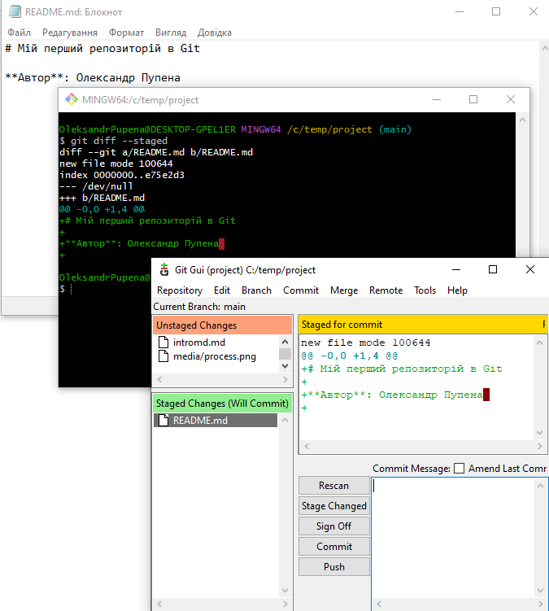

рис.13. Перегляд змін у файлах

#### Коміти

Для фіксації змін, які були додані до індексу, використовується команда:

```bash
git commit
```

Під час виконання цієї команди Git створює новий коміт, який містить знімок стану проєкту на основі проіндексованих файлів, а також службову інформацію: автора, час фіксації та повідомлення коміту. Саме коміти формують історію змін у репозиторії. Зазвичай до коміту додається повідомлення, яке коротко описує зміст змін. Його можна вказати безпосередньо в команді за допомогою опції `-m`:

```bash
git commit -m "Опис змін"
```

Додавання опції `-a` до команди `git commit` змушує Git автоматично додати до коміту всі відстежувані файли, у яких були зафіксовані зміни. Це дозволяє пропустити окремий виклик `git add` для вже контрольованих файлів:

```bash
git commit -a -m "Опис змін"
```

Важливо зазначити, що опція `-a`  не додає нові (невідстежувані) файли. Такі файли необхідно попередньо явно додати до індексу за допомогою команди `git add`.

На рис.14 показано як робити коміт в  Git Gui. Для цього, як вже було зазначено, спочатку робиться індексація, а потім вноситься повідомлення в поле Commit Message і натискається кнопка `Commit` 

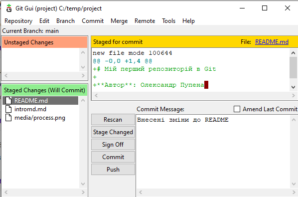

рис.14.  Коміт в Git Gui 

#### Видалення файлів з репозиторію

Щоб видалити файл з Git, необхідно прибрати його з відстежуваних файлів, тобто видалити його з індексу, і після цього створити коміт. Для цього використовується команда:

```
git rm <файл>
```

Команда `git rm` одночасно:

- видаляє файл з робочої директорії;
- індексує його видалення, готуючи цю зміну до включення в наступний коміт.

Після виконання `git rm` файл вважається проіндексованим на видалення і буде остаточно вилучений з репозиторію після виконання команди `git commit`.

Якщо ж файл просто видалити з робочої директорії без використання `git rm`, Git виявить цю зміну. У виводі команди `git status` такий файл з’явиться в розділі `Changes not staged for commit`, тобто як змінений, але ще не проіндексований. У цьому випадку необхідно виконати `git rm`, щоб проіндексувати видалення файлу перед комітом.

Видалення файлу за допомогою `git rm` не впливає на попередні коміти: файл зберігається в історії репозиторію і доступний при переході до старіших версій проєкту.

#### Перегляд історії комітів

Для перегляду історії комітів використовується команда `git log`, яка має багато опцій для налаштування способу відображення інформації. За замовчуванням `git log` виводить список комітів у зворотному хронологічному порядку, починаючи з найновішого. Для кожного коміту відображається його ідентифікатор (хеш), автор, дата створення та повідомлення коміту.


рис.15. Git log 

Команда `git log` дозволяє аналізувати розвиток проєкту, відстежувати, які зміни і коли були внесені, а також визначати відповідального автора змін. Це особливо корисно під час налагодження, аналізу помилок або повернення до попередніх станів проєкту.

Для більш стислого перегляду історії часто використовують скорочені формати виводу, які дозволяють зосередитися лише на ключовій інформації. Також `git log` можна застосовувати до окремих файлів або діапазонів комітів, що дає змогу аналізувати історію змін конкретних частин проєкту.

У Git GUI для перегляду історії комітів використовується окремий інструмент візуалізації — gitk, який запускається з меню Git Gui. Він відображає граф комітів, їхні зв’язки та детальні відмінності між версіями. Ту саму інформацію можна отримати в командному рядку Git Bash за допомогою команд `git log` і `git show`, але у текстовому вигляді. На рис.16 показаний приклад перегляду історії за допомогою Gitk, який можна викликати через пункт меню Git Gui  `Reposiory -> Visualise Main History`

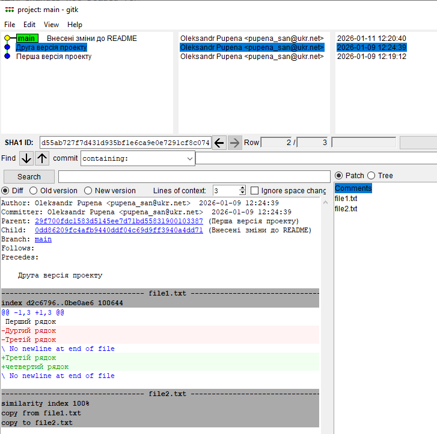

рис.16. Перегляд історії за допомогою Gitk

#### Ігнорування невідстежуваних файлів

Для того щоб Git не звертав уваги на певні файли або каталоги в робочій директорії, можна створити файл `.gitignore`, у якому задаються шаблони ігнорування файлів.  Правила, означені у файлі `.gitignore`, застосовуються лише до файлів, які ще не перебувають під контролем версій. Вони вказують Git, які нові або ще не відстежувані файли слід ігнорувати під час виконання команд індексації, зокрема `git add`.

Налаштування в `.gitignore` не впливають на файли, які вже відстежуються Git. Якщо файл уже був доданий до репозиторію (tracked), він і надалі залишатиметься під контролем версій, навіть якщо його шлях або ім’я з’явиться у `.gitignore`. Для припинення відстеження таких файлів необхідно окремо видалити їх з індексу.

Правила формування `.gitignore` описані в [документації](https://git-scm.com/docs/gitignore). Нижче напишемо перелік найбільш вживаний записів на прикладі одного файлу `.gitignore`.

```
source/      # ігнорувати каталог source та весь його вміст
*.pptx       # ігнорувати всі файли з розширенням .pptx
```

У цьому прикладі Git ігноруватиме каталог `source` незалежно від його вмісту, а також усі файли з розширенням `.pptx` у будь-якій частині робочої директорії. Такі правила зазвичай використовуються для виключення з репозиторію службових, тимчасових або допоміжних файлів, які не мають зберігатися в історії проєкту.

## 4. Подальші дії

Ця лекція має на меті ознайомити з базовими принципами роботи Git і сформувати розуміння його внутрішньої моделі. У ній свідомо не розглянуто багато можливостей і сценаріїв використання Git, зокрема роботу з віддаленими репозиторіями, гілками, злиттями, розв’язанням конфліктів та переписуванням історії (зміною вже створених комітів).

Подальші розділи будуть присвячені розширеним можливостям Git, таким як організація спільної роботи, використання віддалених репозиторіїв, керування гілками, аналіз історії змін, а також типові робочі процеси, що застосовуються у практичних проєктах.

Окрему увагу буде приділено практичним прикладам і лабораторним роботам, у межах яких буде закріплено навички роботи з Git у реальних інженерних і програмних проєктах. Наразі варто вже закріпити матеріал виконавши [Вступ до git: практична частина](lab.md).

  

## Запитання для самоперевірки

1. Поясніть призначення систем керування версіями.
2. Які принципи функціонування централізованих та розподілених системи керування версіями?
3. Як можна класифікувати системи керування версіями? 
4. Які принципи функціонування Git? 
5. Що таке stage, commit?
6. Що таке tracked файли в Git? Як можна задати які файли будуть tracked?
7. Що робить команда checkout в Git?


## Джерела

1. [git Book](https://git-scm.com/book/uk/v2)


## Автори


Теоретичне заняття розробив [Олександр Пупена](https://github.com/pupenasan) .

## Feedback

Якщо Ви хочете залишити коментар у Вас є наступні варіанти:

- [Обговорення у WhatsApp](https://chat.whatsapp.com/BRbPAQrE1s7BwCLtNtMoqN)
- [Обговорення в Телеграм](https://t.me/+GA2smCKs5QU1MWMy)
- [Група у Фейсбуці](https://www.facebook.com/groups/asu.in.ua)

Про проект і можливість допомогти проекту написано [тут](https://asu-in-ua.github.io/atpv/)