[<- До підрозділу](README.md)		[Коментувати](#feedback)

# Від локального Git до GitHub: практична частина

**Тривалість**: 1 академічна година (0.5 пари)

**Мета:**  формування практичних навиків роботи з локальним Git-репозиторієм у взаємодії з віддаленим репозиторієм GitHub, а також розуміння базових сценаріїв синхронізації змін.

## Лабораторна установка для проведення лабораторної роботи у віртуальному середовищі.

Лабораторна робота виконується у середовищі з встановленими інструментами Git та доступом до інтернету. Робота може виконуватися як на основній операційній системі користувача, так і у віртуальному середовищі.

Програмне забезпечення:

- операційна система: Windows (можуть бути інші, але описи всі під Windows);
- Git (з підтримкою Git GUI);
- веб-браузер для роботи з GitHub.

Необхідні облікові записи і доступ:

- обліковий запис GitHub;
- власний репозиторій GitHub з правами на запис.

Перевірка готовності перед початком роботи:

- Git GUI запускається без помилок;
- Git Bash доступний з Git GUI;
- виконується вхід у GitHub через браузер;
- забезпечено доступ до github.com.

## Загальна постановка задачі

У межах лабораторної роботи необхідно виконати такі завдання:

- ознайомитися з процесом клонування репозиторіїв з GitHub;
- проаналізувати налаштування віддаленого репозиторію та роль `origin`;
- виконати синхронізацію локального і віддаленого репозиторіїв без змін;
- внести локальні зміни та опублікувати їх у GitHub;
- отримати зміни, зроблені через веб-інтерфейс GitHub;
- змоделювати конфлікт між локальними та віддаленими змінами;
- виконати базове розв’язання конфлікту злиття.

У лабораторній роботі розглядається один базовий сценарій конфлікту змін, достатній для розуміння принципу роботи механізму злиття. Поглиблені стратегії роботи з конфліктами розглядаються у наступних мікромодулях.

## Пререквізити

- базові навики роботи з Git в межах компетенцій мікромодуля [Вступ до git: практична частина](../git/lab.md) , встановлений Git, зареєстрований користувач в Git;
- базові навики роботи з GitHub в межах компетенцій мікромодуля [Вступ до GitHub: практична частина](../github/lab.md), обліковий запис в GitHub;

## Послідовність виконання роботи

- [ ] Ознайомтеся з матеріалами лекції [Від локального Git до GitHub: теоретична частина](teor.md)

### 1. Клонування існуючого репозиторію з GitHub

У даному пункті необхідно склонувати існуючий репозиторій GitHub у локальний репозиторій.

- [ ] Перейдіть на репозиторій [Git4All](https://github.com/pupenasan/Git4All) 
- [ ] Ознайомтеся з його структурою та змістом 
- [ ] Через кнопку `<> Code` відкрийте вікно з посиланням `HTTPS` на репозиторій і скопіюйте його в буфер обміну (рис.1) 

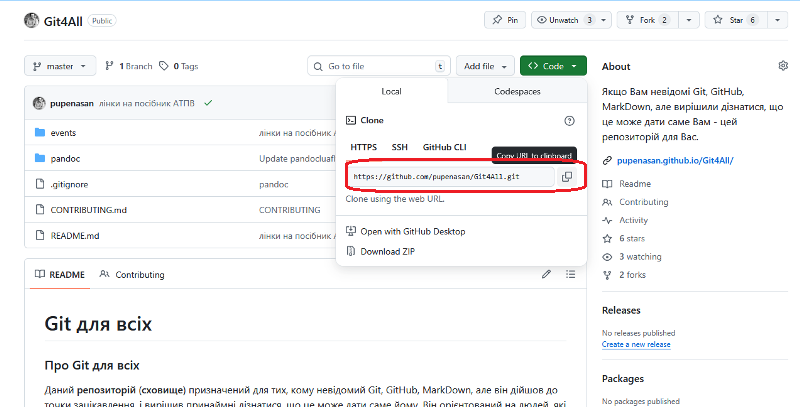

рис.1. Копіювання посилання на репозиторій GitHub

- [ ] Виберіть на власному ПК каталог, у який буде виконано клонування репозиторію.
- [ ]  Виконайте клонування репозиторію (рис.2):
  - відкрийте Git GUI через контекстне меню;
  - виберіть пункт `Clone Existing Repository`;
  - у полі `Source Location` вставте скопійоване посилання (зверніть увагу, що для клавіатури повинна бути вибрана англійська розкладка, інакше комбінація клавіш `Ctrl+V` може не працювати);
  - у полі `Target Directory` вкажіть робочу директорію для локального репозиторію;
  - натисніть кнопку `Clone`.

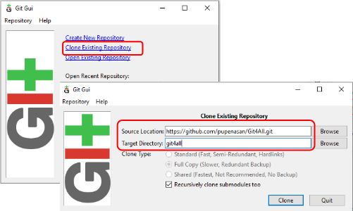

рис.2. Клонування репозиторію

Після завершення операції повинна створитися робоча директорія з файлами репозиторію та автоматично відкритися інтерфейс Git GUI для керування локальним репозиторієм.

- [ ] Через файловий провідник відкрийте робочу директорію репозиторію.
- [ ] Проаналізуйте її вміст: наявність каталогів, файлів, а також зміст файлу `README.md`.

### 2. Аналіз клонованого репозиторію

У даному пункті необхідно проаналізувати стан та базові налаштування клонованого репозиторію, а також з’ясувати роль віддаленого репозиторію.

- [ ] Відкрийте Git Gui в робочій директорії, якщо він ще не відкритий
- [ ] Зверніть увагу, що 
  - немає змінених файлів;
  - немає файлів в індексі;
  - репозиторій синхронізований.

- [ ] Відкрийте пункт меню `Remote` та зверніть увагу, що у списку присутній віддалений репозиторій з назвою `origin` (рис.3).
  

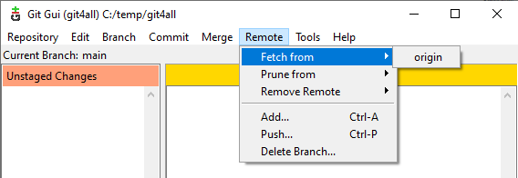

рис.3. Відображення віддаленого репозиторію `origin` у Git GUI

Це значить що після клонування репозиторію зв’язок з віддаленим репозиторієм вже налаштований автоматично, і цей репозиторій називається `origin`. Тобто `origin` є умовною назвою віддаленого репозиторію, з якого було виконано клонування. Git не працює безпосередньо з платформою GitHub, а взаємодіє з віддаленим репозиторієм за вказаною адресою.

Зверніть увагу, що Git GUI дозволяє побачити факт існування віддаленого репозиторію, але не відображає всі його параметри, зокрема адресу. Для перегляду повної інформації про віддалені репозиторії необхідно скористатися консольною версією - Git Bash.

- [ ] Відкрийте Git Bash через меню `Repository → Git Bash` або контекстне меню файлового провідника в межах репозиторію.

- [ ] У вікні Git Bash виконайте команду:


```bash
git remote -v
```

показує перелік віддалених репозиторіїв, з якими пов’язаний поточний локальний Git-репозиторій, і адреси, за якими Git з ними взаємодіє; ключ `-v` означає “показати детально”. 

У результаті команда має вивести

```bash
origin  https://github.com/pupenasan/Git4All.git (fetch)
origin  https://github.com/pupenasan/Git4All.git (push)
```

де: 

- `origin` — це умовна назва віддаленого репозиторію, тобто це не спеціальне слово Git і не сервер GitHub”, а просто ім’я, яке Git автоматично надає репозиторію, з якого було виконано клонування. За потреби віддалених репозиторіїв може бути кілька, з іншими іменами
- адреса `https://...` - це точна адреса, за якою Git отримує дані (fetch), передає дані (push), GitHub тут виступає лише як хостинг, Git працює з URL. У простих випадках адреси для отримання і передачі даних однакові, тому бачимо два рядки з однаковим URL

- [ ] Переконайтеся, що у виведеній інформації присутній віддалений репозиторій `origin`, та перевірте адресу, на яку він вказує.

- [ ] Відкрийте репозиторій Git4All у веб-браузері.

- співставте структуру файлів і каталогів з локальною копією;
- переконайтеся, що локальний стан повністю відповідає стану репозиторію на GitHub.

### 3. Перевірка синхронізації без змін

У даному пункті необхідно перевірити, як відбувається синхронізація локального репозиторію з GitHub у випадку, коли локальні та віддалені стани збігаються і відсутні будь-які зміни.

- [ ] Переконайтеся, що у локальному репозиторії відсутні змінені файли.
  - перевірте список змін у Git GUI;
  - зафіксуйте, що робоча копія репозиторію знаходиться у чистому стані.

- [ ] У меню Git GUI виконайте команду отримання змін з віддаленого репозиторію:
  - відкрийте меню `Remote`;
  - виберіть `Fetch from → origin`.

- [ ] Проаналізуйте результат виконання команди.
  - зверніть увагу, що жодних змін у локальному репозиторії не відбулося;
  - зафіксуйте відсутність повідомлень про оновлення файлів або конфлікти.

У даному пункті не передбачається поява повідомлень про помилки або конфлікти. Така «тиха» синхронізація є нормальним сценарієм роботи з віддаленими репозиторіями.

### 4. Створення клона власного репозиторію на GitHub

У цьому пункті необхідно склонувати власний репозиторій GitHub у локальний репозиторій. На відміну від попереднього прикладу з репозиторієм Git4All, у цьому випадку локальний репозиторій буде пов’язаний з репозиторієм, до якого користувач має права внесення змін. Це дозволить не лише зчитувати, а й змінювати файли локально та синхронізувати ці зміни з GitHub.

- [ ] Відкрийте власний існуючий репозиторій на GitHub або створіть новий репозиторій з назвою `myfirstrepo`, як це описано у практичному занятті [Вступ до GitHub: практична частина](../github/lab.md).
- [ ] Ознайомтеся зі структурою та вмістом власного репозиторію через веб-інтерфейс GitHub.
- [ ] Зробіть клонування репозиторію, аналогічно як це було зроблено у попередніх пунктах з використанням HTTPS.
- [ ] Після завершення клонування переконайтеся, що:
  - створено окрему робочу директорію для власного репозиторію;
  - у Git GUI відкрито локальний репозиторій;
  - у меню `Remote` доступний віддалений репозиторій з назвою `origin`.

### 5. Публікація локальних змін у власний GitHub

- [ ] У клонованому власному репозиторії внесіть зміни в один із файлів, наприклад `README.md`, та збережіть файл.
- [ ] У Git GUI натисніть кнопку `Rescan`. У розділі `Unstaged Changes` має з’явитися файл `README.md` зі змінами.
- [ ] Натисніть кнопку `Stage Changed`, щоб проіндексувати зміни.
- [ ] У полі повідомлення коміту введіть короткий коментар та натисніть `Commit`.

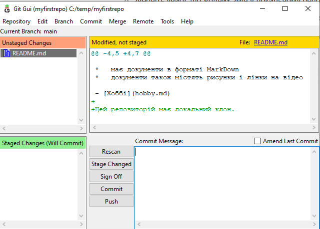

рис.4. Фіксація локальних змін у репозиторії

Команда `Commit` фіксує зміни лише у локальному репозиторії. Для того щоб передати ці зміни у віддалений репозиторій GitHub, необхідно виконати операцію `push`.

- [ ] Натисніть кнопку `Push` для передавання змін з локального репозиторію у віддалений.

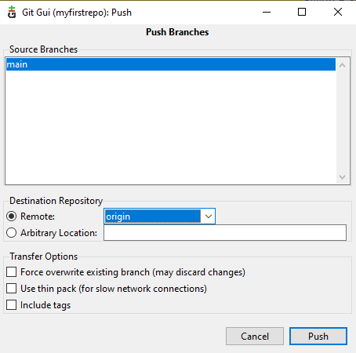

рис.5. Вибір гілки для публікації змін

- [ ] У вікні вибору гілки переконайтеся, що вибрана гілка `main`.

- [ ] У вікні автентифікації виберіть варіант `Sign in with your browser`.


рис.6. Автентифікація Git у GitHub

- [ ] У браузері підтвердіть вхід до облікового запису GitHub та надання доступу для Git.

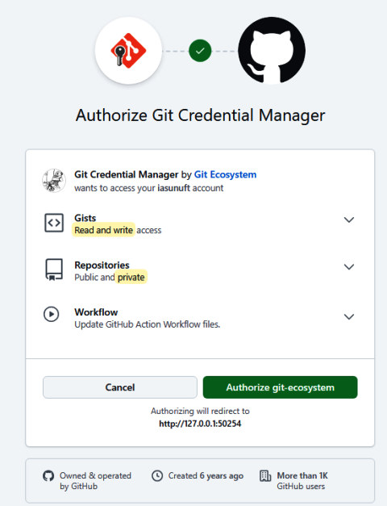

рис.7. Вікно відображення доступу, який отримає Git у системі GitHub

- [ ] Після успішної автентифікації поверніться до Git GUI та дочекайтеся завершення операції `push`.

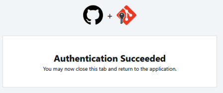

рис.8. Успішне завершення операції `push`

- [ ] Відкрийте власний репозиторій на GitHub у веб-браузері та переконайтеся, що внесені зміни відображаються у файлах репозиторію.

### 6. Зміни через веб-інтерфейс GitHub та синхронізація з локальним репозиторієм

- [ ] Перейдіть в репозиторій GitHub, відредагуйте файл `README.md` використовуючи веб-інтерфейс: видаліть один рядок і добавте один рядок;
- [ ] Натисніть `Commit Change`
- [ ] У Git Gui для локального репозиторію завантажте зміни з віддаленого репозиторію, використовуючи `Fetch from` (рис.9)

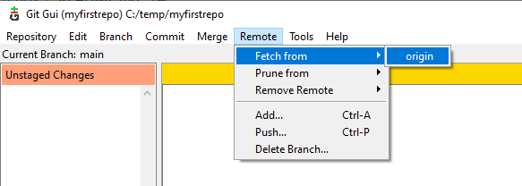

рис.9. Отримання змін в локальному репозиторію

- [ ] У вікні результату Ви побачите щось на кшталт того, що показано на рис.10.

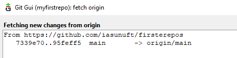

рис.10. Результат отримання змін через fetch

Запис можна прокоментувати наступним чином. Git перевіряє наявність нових змін у віддаленому репозиторії `origin` з адресою `https://github.com/iasunuft/firstrepos`. Діапазон комітів: від старого стану `7339e70` до нового `95feff5` означає, що у віддаленому репозиторії з’явилися нові коміти. Запис `main -> origin/main` вказує що оновлено лише віддалену гілку `origin/main`. Локальна гілка `main` не змінювалась.

Після виконання `fetch` локальний стан репозиторію не змінюється, оновлюється лише інформація про віддалені гілки. Для початку необхідно зробити злиття віддаленої гілки та локальної гілки комітів, щоб усі зміни з віддаленого репозиторію всутпили в дію в локальному репозиторії. Злиття також автоматично оновлює робочу директорію.

- [ ] Зайдіть в `Merge -> Local Merge` з'явиться вікно вибору гілки з якої відбуватиметься злиття (рис.11) 

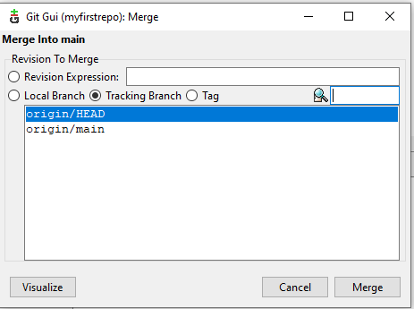

рис.11. Вікно вибору варіантів злиття

У вікні на рис.11 пропонується операція злиття змін з іншої гілки у поточну локальну гілку. У заголовку вікна вказано `Merge into main`, що означає: усі вибрані зміни будуть застосовані до локальної гілки `main`. Поле `Revision To Merge` використовується для вибору джерела змін:

- `Revision Expression` дозволяє вручну вказати ідентифікатор коміту; у цій лабораторній роботі не використовується.
- `Local Branch` містить перелік локальних гілок з якими треба робити злиття; у цьому пункті не використовується.
- `Tracking Branch` містить віддалені гілки, отримані після виконання команди `fetch`.
- `Tag` використовується для злиття за тегом; у лабораторній не застосовується.

У списку `Tracking Branch` відображаються:

- `origin/main` – локальна копія стану віддаленої гілки `main`, отримана після синхронізації з GitHub;
- `origin/HEAD` – вказівник на гілку за замовчуванням у віддаленому репозиторії.

- [ ] Для отримання змін з GitHub у локальний репозиторій виберіть `origin/main` та натиснути кнопку `Merge`. 

Після виконання злиття коміти з віддаленого репозиторію будуть застосовані до локальної гілки `main`, а файли в робочій директорії оновляться відповідно до нового стану репозиторію.

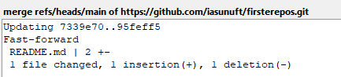

рис.12. Результат злиття віддаленої та локальної гілки

- [ ] Подивіться що зміни в `README.md` дійсно відобразилися в робочій папці 

- [ ] Використовуючи пункт меню Git Gui `Repository -> Visualise Main History` передивіться історію змін.

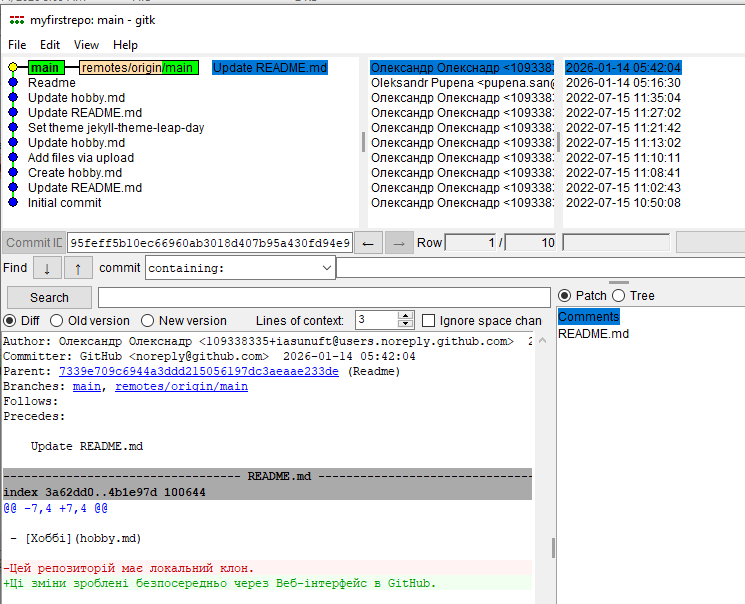

рис.13. Історія комітів.

У верхній частині вікна Gitk відображено поточний стан гілок репозиторію. Позначка `main` вказує на локальну гілку, у якій зараз знаходиться користувач. Позначка `remotes/origin/main` вказує на стан віддаленої гілки `main`, отриманий після синхронізації з GitHub. Розташування міток `main` і `remotes/origin/main` на одному коміті свідчить про синхронізацію локальної та віддаленої гілок. Стан робочої директорії перевіряється окремо, наприклад через `Rescan`.

### 7. Модельований конфлікт і його розв’язання (базовий сценарій)

У цьому пункті необхідно змоделювати конфлікт змін між локальним та віддаленим репозиторіями та виконати його базове розв’язання. У реальних проєктах конфлікти є нормою, а не помилкою користувача.

#### 7.1. Створення конфлікту

- [ ] У локальному репозиторії внесіть зміни в файл `README.md` та виконайте `Commit` з коментарем `Зміни в локальному репозиторії`, не виконуючи `push`.
- [ ] Через веб-інтерфейс GitHub внесіть інші зміни в цей самий файл `README.md` та зафіксуйте їх комітом з коментарем `Зміни на GitHub`.
- [ ] Використовуючи Git GUI локального репозиторію, отримайте зміни з GitHub (`fetch`) та спробуйте застосувати їх (`merge` з `origin/main`).

У результаті Git повідомить про конфлікт та зупинить операцію злиття (рис.14).

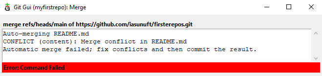


рис.14. Неможливість автоматичного злиття через конфлікт одночасних змін у файлі `README.md`.

#### 7.2. Аналіз конфлікту

Окрім самого повідомлення про помилку, буде також відображена детальна інформація про конфлікт (рис.15).

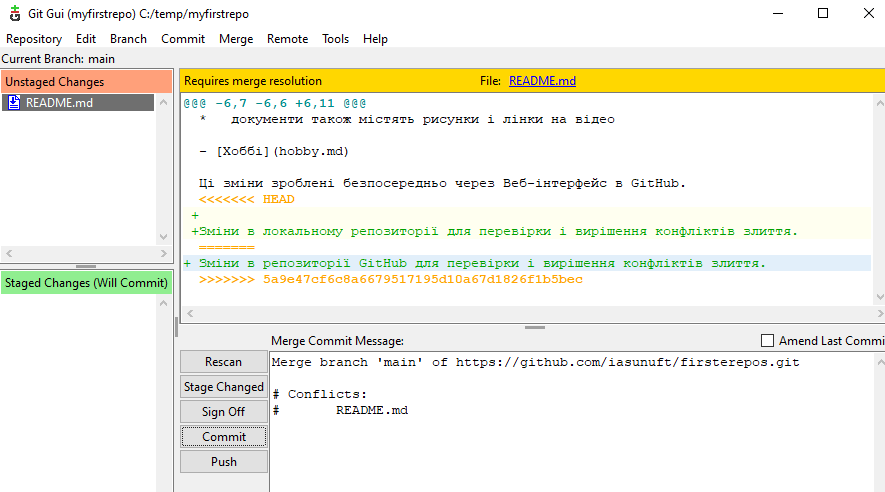

рис.15. Інформація про конфлікт злиття

- [ ] Проаналізуйте отриману інформацію, користуючись наведеними нижче поясненнями.

У верхній частині вікна відображається повідомлення `Requires merge resolution`, що означає: злиття не може бути завершене автоматично і потребує ручного втручання користувача. У списку файлів у розділі `Unstaged Changes` відображається файл `README.md`, у якому виник конфлікт. У центральній частині вікна показано вміст файлу `README.md` з маркерами конфлікту:

- `<<<<<<< HEAD` – початок локальної версії фрагмента файлу (зміни, зроблені у локальному репозиторії);
- `=======` – розділювач між конфліктуючими версіями;
- `>>>>>>> <hash>` – кінець версії фрагмента з іншої сторони злиття; хеш ідентифікує коміт, з якого походять ці зміни. Оскільки злиття виконувалося з гілкою `origin/main`, цей коміт відповідає віддаленому репозиторію.

Ці маркери додаються Git автоматично і вказують на фрагмент, який Git не зміг об’єднати самостійно. У нижній частині вікна в полі повідомлення коміту зазначено, що злиття не завершене та присутній конфлікт у файлі `README.md`.

На цьому етапі Git очікує, що користувач:

- вручну відредагує файл, обравши коректний варіант змін;
- видалить маркери конфлікту;
- завершить операцію злиття окремим комітом.
- [ ] Відкрийте файл `README.md` у режимі редагування джерельного коду. Ви побачите той самий вміст з маркерами конфлікту, що і на рис.15.

#### 7.3. Базове розв’язання конфлікту

- [ ] Відредагуйте файл `README.md` у локальному репозиторії, сформувавши коректний варіант вмісту після злиття. При цьому видаліть маркери конфлікту `<<<<<<<`, `=======` та `>>>>>>>`.
- [ ] У Git GUI натисніть `Rescan`, після чого проіндексуйте файл, вибравши його у списку `Unstaged Changes`.
- [ ] Виконайте `Commit`, який завершує операцію злиття, не змінюючи автоматично сформоване повідомлення коміту.
- [ ] Опублікуйте результат у віддалений репозиторій (`push`).
- [ ] Переконайтеся через веб-інтерфейс GitHub, що файл `README.md` містить виправлену версію.

Після виявлення конфлікту Git зупиняє автоматичне злиття та переводить репозиторій у стан незавершеного merge. У цьому стані зміни з обох гілок тимчасово відображаються у файлах з маркерами конфлікту. Користувач вручну визначає фінальний варіант файлу та завершує злиття окремим комітом. Результат злиття завжди фіксується у поточній гілці, з якої було ініційовано merge; інша гілка при цьому не змінюється.

### 8. Очищення облікових даних (для спільних комп’ютерів)

У разі виконання лабораторної роботи на комп’ютері в навчальній лабораторії або на чужому комп’ютері, де під одним обліковим записом операційної системи можуть працювати різні користувачі, необхідно виконати очищення збережених облікових даних GitHub.

- [ ] Відкрийте `Credential Manager` операційної системи Windows через меню `Пуск`. Перейдіть до розділу `Windows Credentials` (рис.16).
- [ ] Знайдіть записи, пов’язані з `github.com` або `git:https://github.com`.
- [ ] Видаліть усі знайдені записи для GitHub за допомогою кнопки `Remove`.
- [ ] Закрийте Credential Manager.

Після виконання цих дій наступна операція `push` або `pull` вимагатиме повторної автентифікації, що унеможливлює використання облікових даних попереднього користувача.

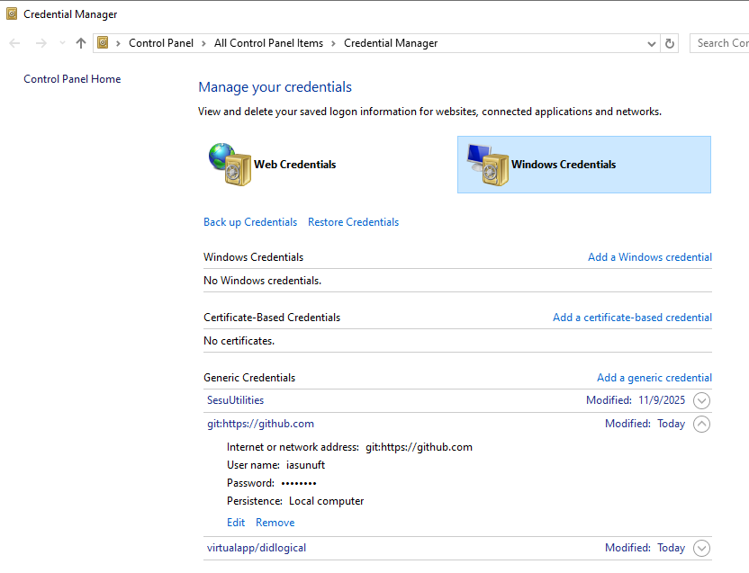

рис.16. Видалення облікових даних GitHub на локальному комп'ютері `Credential Manager`

### 9. Робота через SSH

У цьому пункті використовується вже існуючий локальний репозиторій, який було раніше клоновано через HTTPS. Повторне клонування не виконується. Натомість до репозиторію додається додатковий віддалений репозиторій (remote), що використовує доступ через SSH. Важливо, що існуючий `remote`, підключений через HTTPS, не видаляється. У результаті локальний репозиторій матиме два віддалені підключення, які відрізняються лише способом автентифікації.

У цьому пункті SSH розглядається не як заміна HTTPS, а як альтернативний спосіб підключення, який використовується паралельно.

- [ ] Створіть пару ключів як це описано в лекції [Від локального Git до GitHub: теоретична частина](teor.md) з використанням паролю.
- [ ] У налаштуваннях репозиторію GitHub добавте ключ SSH
- [ ] У вікні Git GUI репозиторію відкрийте меню `Remote → Add….`
- [ ] У діалозі додавання remote задайте наступні поля (рис.17) після чого натисніть `Add`:
  - ім’я нового remote, наприклад `origin-ssh`, 
  - адресу репозиторію у форматі SSH, який скопіюйте з відповідного вікна репозиторію
  - виставте опцію `Do Nothing Else Now` (нічого зараз більше не робити - ні зчитувати ні записувати в рпеозиторій) 

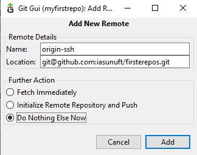

рис.17. Налаштування `Remote` 

Після підтвердження новий remote з’явиться у списку віддалених репозиторіїв, але жодних змін у локальному репозиторії ще не відбудеться. Зверніть увагу що це один і той самий віддалений репозиторій на GitHub, однак з різними шляхами.

- [ ] Внесіть зміни в файл `README.md`
- [ ] Зробіть індекс та `commit`
- [ ] Натисніть `Push`
- [ ] У вікні вибору remote виберіть `origin-ssh` (рис.18) і натисніть `Push`

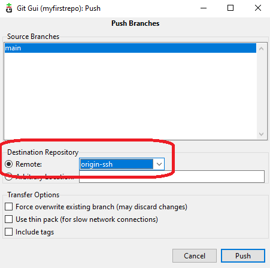

рис.18. Вибір шляху для Push

Якщо все налаштовано правильно, то повинно з'явитися вікно введення парольної фрази приватного ключа

- [ ] Введіть пароль і підтвердіть. 
- [ ] Перевірте що зміни вступили в силу на віддаленому репозиторії.

### 10. Робота з SSH-ключами на чужому або спільному ПК

У цьому пункті розглядається ситуація, коли доступ до GitHub через SSH було налаштовано не на власному комп’ютері, а на чужій або спільній машині (аудиторія, лабораторія, тимчасовий ПК). SSH-ключі ідентифікують користувача без додаткових запитів логіна чи пароля. Якщо приватний ключ залишиться на чужій машині, будь-хто, хто працює під тим самим обліковим записом операційної системи, зможе виконувати Git-операції від імені власника ключа. Тому після завершення роботи ключі не повинні залишатися на такій машині.

У стандартному випадку SSH-ключі зберігаються в каталозі `~/.ssh` і складаються з двох файлів:

- приватний ключ, наприклад `id_ed25519`;
- публічний ключ, наприклад `id_ed25519.pub`.

Саме приватний ключ є критичним елементом безпеки. Публічний ключ не є секретом, але без приватного він не має практичної цінності. Файл `known_hosts` не містить ключів користувача і може залишатися без змін. 

Приватний ключ можна зберегти для подальшого використання на власному комп’ютері. Для цього перед видаленням ключів з чужої машини їх необхідно скопіювати у безпечне місце, наприклад на власний захищений носій або в особисте зашифроване сховище.

Після завершення лабораторної роботи на чужому комп’ютері зробіть наступні дії:

- [ ] Скопіюйте приватний ключ  з каталогу `~/.ssh` у безпечне місце. Копіювання приватного ключа допустиме лише для особистого використання і не повинно виконуватися через публічні сервіси, месенджери або спільні сховища.
- [ ] Видаліть приватний і публічний ключі з каталогу `~/.ssh`;
- [ ] Переконатися, що файли `id_ed25519` і `id_ed25519.pub` більше не присутні.

У такому випадку важливо пам’ятати, що приватний ключ не повинен передаватися через публічні канали або зберігатися у відкритому вигляді.

Для повторного використання існуючого SSH-ключа на власному комп’ютері достатньо:

- помістити приватний і публічний ключі в каталог `~/.ssh`;
- переконатися, що імена файлів збережені без змін;
- після цього SSH зможе використовувати цей ключ без повторної генерації.

Додавати ключ повторно в GitHub не потрібно, якщо публічний ключ не було видалено з налаштувань облікового запису.

Якщо приватний ключ було втрачено і не збережено, відновити його неможливо. У такому випадку необхідно:

- згенерувати нову пару SSH-ключів;
- додати новий публічний ключ до облікового запису GitHub;
- за потреби видалити старий ключ зі списку дозволених.

## Контрольні питання

1. У чому різниця між локальним Git-репозиторієм і віддаленим репозиторієм GitHub?
2. Що відбувається під час клонування репозиторію з GitHub?
3. Для чого використовується віддалений репозиторій з назвою `origin`?
4. Чим відрізняється `fetch` від `merge`?
5. Чому після виконання `fetch` файли у робочій директорії можуть не змінюватися?
6. Що означає операція `merge` у контексті синхронізації з GitHub?
7. У яких випадках виникає конфлікт змін?
8. Чому Git не може автоматично розв’язати деякі конфлікти?
9. У якій гілці з’являється результат злиття після розв’язання конфлікту?
10. Які дії необхідно виконати для завершення злиття після конфлікту?


## Джерела

1. 


## Автори


Практичне заняття розробив  [Олександр Пупена](https://github.com/pupenasan). 

## Feedback

Якщо Ви хочете залишити коментар у Вас є наступні варіанти:

- [Обговорення у WhatsApp](https://chat.whatsapp.com/BRbPAQrE1s7BwCLtNtMoqN)
- [Обговорення в Телеграм](https://t.me/+GA2smCKs5QU1MWMy)
- [Група у Фейсбуці](https://www.facebook.com/groups/asu.in.ua)

Про проект і можливість допомогти проекту написано [тут](https://asu-in-ua.github.io/atpv/)
