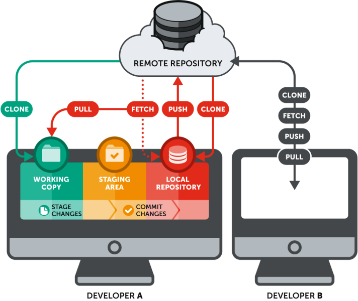
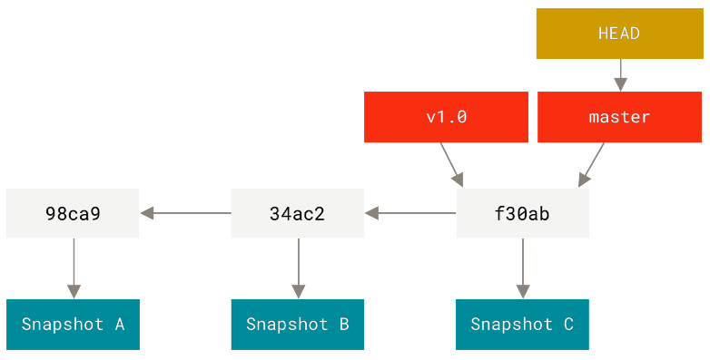
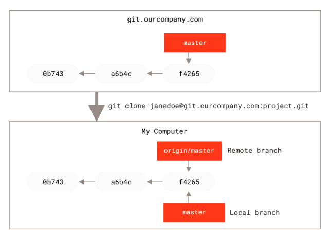
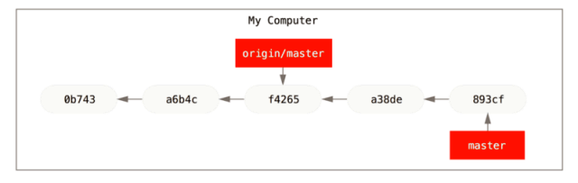
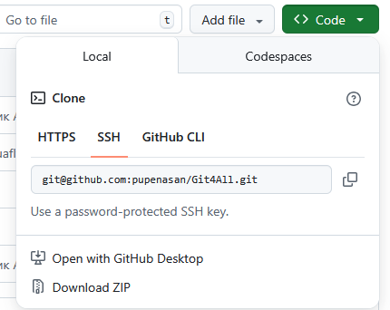
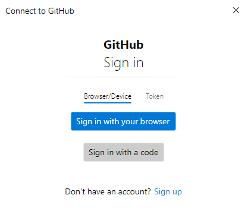
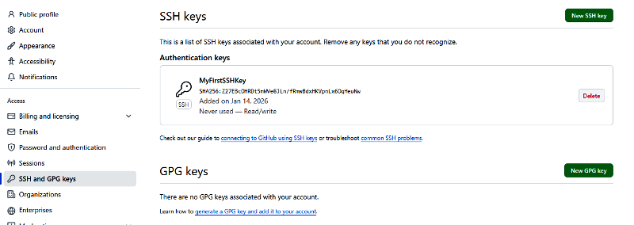
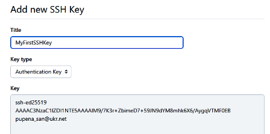

[<- До підрозділу](README.md)		[Коментувати](#feedback)

# Від локального Git до GitHub: теоретична частина

## 1. Розподілена система керування версіями на базі Git та GitHub

Git і GitHub часто сприймаються як єдине ціле, але це різні за призначенням інструменти. У попередньому мікромодулі [Вступу до систем керування версіями та Git: теоретична частина](../git/teor.md) розглядалось, що Git — це локальна система керування версіями. Вона працює повністю на комп’ютері користувача і відповідає за історію змін, коміти, гілки та злиття. Усі операції типу `add`, `commit`, `log`, `branch` виконуються без будь-якого мережевого з’єднання. 

Як зазначалося у [Вступ до GitHub: теоретична частина](../github/teor.md) GitHub — це віддалений сервіс, який зберігає Git-репозиторії і забезпечує спільну роботу. Він надає віддалене сховище для Git-репозиторіїв і сервісні можливості для спільної роботи: контроль доступу, вебперегляд історії, обговорення змін і керування проєктом.

Тим не менше Git і GitHub типово використовуються сумісно (замість GitHub може використовуватися інший сервіс, наприклад GitLab). У типовій схемі сумісної роботи існують два рівні:

- локальний репозиторій — каталог `.git` на локальному ПК в робочій директорії;
- віддалений репозиторій —  це репозиторій на сервері (наприклад, на GitHub), з яким локальний обмінюється комітами.

У цій взаємодії локальний репозиторій синхронізуєтсья з віддаленим через взамєодію, в якій локальний Git (як система) виступає в якості клієнта, а віддалений Git (наприклад GitHub) - в якості сервера. Фактично це значить, що локальний Git буде щось просити у сервера Git, а той буде реагувати на ці запити.  

Розглянемо це на прикладі з рис. 1. На ПК одного розробника, позначеного як `Developer A`, є локальна робоча директорія, яка умовно показана зеленим кольором. Помаранчевим кольором позначено індексовану область `Staging Area`, а червоним — локальний репозиторій (`Local Repository`). Як уже було описано в попередній лекції, для того щоб зафіксувати в репозиторії файли з робочої директорії після їх змін, необхідно спочатку проіндексувати ці зміни (на рис. 1 позначено як `Stage changes`), а потім виконати коміт (`Commit changes`). Усі ці операції виконуються в межах локального ПК. Якщо ж використовується розподілена система, до локального репозиторію можна підключити віддалений репозиторій (`Remote repository`), наприклад на GitHub або GitLab, який за ініціативою користувача синхронізується з локальним.




рис.1. Взаємозв'язок між репозиторіями (Джерело www.git-tower.com)

Під словом синхронізація в контексті Git розуміють обмін комітами між локальним і віддаленим репозиторіями. Такий обмін не є автоматичним і завжди ініціюється користувачем за допомогою відповідних команд.

Основними операціями синхронізації є:

- `clone` — створення локальної копії віддаленого репозиторію разом з усією його історією;
- `fetch` — отримання змін з віддаленого репозиторію без внесення їх у робочу директорію;
- `pull` — отримання змін з віддаленого репозиторію з подальшим злиттям їх у поточну локальну гілку;
- `push` — передавання локальних комітів до віддаленого репозиторію.

Принципово важливо розрізняти `fetch` і `pull`. Команда `fetch` лише оновлює інформацію про стан віддаленого репозиторію і не змінює робочі файли розробника. Команда `pull`, навпаки, поєднує отримання змін і їх інтеграцію в поточну гілку, що безпосередньо впливає на локальний стан проєкту. Таким чином, `fetch` не змінює локальну історію комітів, тоді як `pull` може призвести до її зміни.

На рис. 1 також показано, що кожен розробник має власний локальний репозиторій. Розробники не обмінюються комітами напряму між своїми комп’ютерами, а взаємодіють опосередковано через віддалений репозиторій. Саме він виступає спільною точкою синхронізації та узгодження змін. Тобто Git забезпечує повну автономність локальної роботи, а GitHub або інший віддалений сервіс використовується для обміну результатами цієї роботи між учасниками проєкту.

Після підключення віддаленого репозиторію Git не працює з ним “напряму”. Замість цього використовується абстракція з назвою `remote`. `Remote` — це іменований запис, який містить адресу віддаленого репозиторію і використовується Git для синхронізації. `Remote` не зберігає стану репозиторію, а лише описує спосіб доступу до нього та параметри синхронізації.

За замовченням віддалений репозиторій має ім’я `origin`. З точки зору Git це не ключове слово, а стандартна умовна назва, яка автоматично задається під час клонування репозиторію. Тобто `origin` — це умовна назва основного віддаленого репозиторію, з яким пов’язаний локальний репозиторій. У конфігурації Git вона зберігається разом з URL репозиторію і використовується як скорочене посилання. Наприклад, замість вказування повної адреси віддаленого репозиторію кожного разу, Git використовує ім’я `origin` як логічну точку доступу.

Важливо розуміти, що у репозиторії може бути більше ніж один віддалений репозиторій, кожен з яких буде мати свою умовну назву.

## 2. Синхронізація на основі гілок 

### Гілки в Git та GitHub

У [Вступі до систем керування версіями та Git: теоретична частина](../git/teor.md) описано, що у Git усі коміти об'єднуються в ланцюжок, який може формувати одну або кілька гілок. Кожен коміт належить до гілки, і саме через гілки Git організовує розвиток проєкту. Наприклад на рис.2 є тільки одна гілка - `master`.  



рис.2. Ланцюжок комітів  (Джерело www.git-tower.com)

Локальний репозиторій Git завжди має принаймні одну гілку, яка є поточною робочою гілкою. GitHub не має власної моделі гілок і технічно використовує ту саму структуру репозиторію, що і Git. Усі гілки, які існують у репозиторії на GitHub, є звичайними гілками Git і з точки зору інструментів Git нічим не відрізняються від локальних. Взаємодія з GitHub зводиться до обміну станами цих гілок між локальним і віддаленим репозиторіями. Після підключення віддаленого репозиторію Git зберігає локальні копії стану віддалених гілок у вигляді `origin/*`. Ці гілки не є окремим типом гілок, а лише відображають зафіксований стан відповідних гілок у віддаленому репозиторії на момент останньої синхронізації.

### Приклад клонування

Розглянемо синхронізацію локального та віддаленого репозиторіїв як роботу з історією комітів, використовуючи модель віддалених гілок Git. На початку існує лише віддалений репозиторій, наприклад на `git.ourcomany.com` (тут так само може бути GitHub). Він містить певну історію комітів, що відображає поточний стан проєкту. Ця історія є єдиною і незалежною від будь-яких локальних копій. Один з механізмів створити локальний репозиторій що буде у зв'язці з віддаленим - зробити клонування.  Під час клонування (`git clone`) локальний Git отримує повну копію історії комітів віддаленого репозиторію. У результаті в локальному репозиторії (`My Computer`) з’являються (рис.3.):

- робоча гілка, наприклад `master`, яка вказує на останній коміт;
- віддалена гілка `origin/master`, яка є локальною копією стану гілки `main` у віддаленому репозиторії.

На цьому етапі обидві гілки вказують на один і той самий коміт. Історії локального та віддаленого репозиторіїв повністю збігаються.



рис.3. Серверний та локальний репозиторії після клонування  (Джерело https://git-scm.com)

### Приклад локальних змін

Коли користувач вносить зміни локально і створює нові коміти, ці коміти додаються лише до локальної гілки `main`. Віддалена гілка `origin/main` при цьому не змінюється, оскільки жодного обміну з віддаленим репозиторієм не відбувалося. У результаті локальна гілка випереджає віддалену, але лише в межах локального репозиторію.



рис.4. Локальна та віддалена робота розсинхронізовані (Джерело https://git-scm.com)

Під час виконання `push` локальні коміти передаються у віддалений репозиторій. Після цього історія віддаленого репозиторію доповнюється новими комітами, а гілки `main` і `origin/main` знову вказують на один і той самий коміт. Таким чином, `push` узгоджує історію віддаленого репозиторію з локальною.

### Приклад віддалених змін

Якщо після цього зміни вносяться безпосередньо у віддалений репозиторій, наприклад через веб-інтерфейс GitHub, у ньому з’являються нові коміти, яких локальний репозиторій ще не знає. На цьому етапі історії локального та віддаленого репозиторіїв знову розходяться. Виконання `fetch` дозволяє локальному Git отримати інформацію про нові коміти з віддаленого репозиторію. При цьому:

- оновлюється віддалена гілка `origin/main`;
- локальна робоча гілка `main` не змінюється;
- файли у робочій директорії залишаються без змін.

Фактично `fetch` оновлює знання локального репозиторію про стан віддаленого, але не змінює локальну історію. Для того щоб нові коміти стали частиною локальної історії та вплинули на робочу директорію, необхідно виконати злиття (`merge`). Під час злиття Git намагається поєднати історію локальної гілки з історією, зафіксованою у `origin/main`. Якщо зміни не конфліктують, злиття відбувається автоматично. Якщо ж ті самі фрагменти файлів були змінені по-різному, Git зупиняє процес і повідомляє про конфлікт, очікуючи рішення користувача.

Операція `pull` поєднує ці два кроки в одну дію. Під час виконання `pull` Git спочатку отримує нові коміти з віддаленого репозиторію (еквівалент `fetch`), а потім одразу намагається застосувати їх до поточної локальної гілки шляхом злиття (еквівалент `merge`). Таким чином, `pull` автоматизує повний цикл синхронізації змін з віддаленого репозиторію. З точки зору історії комітів, `pull` не виконує жодних додаткових операцій у порівнянні з послідовним виконанням `fetch` і `merge`. Різниця полягає лише в тому, що ці дії виконуються як одна команда. Якщо під час злиття виникає конфлікт, `pull` так само зупиняється на етапі merge і потребує ручного розв’язання, як і при окремому виконанні цих операцій.

Таким чином, `fetch` і `merge` дозволяють керувати процесом синхронізації поетапно, тоді як `pull` використовується як скорочений варіант, коли очікується автоматичне злиття без конфліктів.

### Дзеркальність операцій `push` і `pull`

Операції `push` і `pull` виконують обмін комітами між локальним та віддаленим репозиторіями у протилежних напрямках. У цьому сенсі їх можна вважати дзеркальними: `push` передає зміни з локального репозиторію у віддалений, тоді як `pull` отримує зміни з віддаленого репозиторію у локальний.

Водночас ці операції не є повністю симетричними за своєю внутрішньою логікою. Операція `push` працює лише з уже існуючими локальними комітами і не змінює локальну історію. Вона або успішно оновлює віддалену гілку, або завершується помилкою, якщо стан віддаленого репозиторію не дозволяє виконати оновлення.

Операція `pull`, навпаки, не обмежується передаванням комітів. Вона поєднує два кроки: отримання нових комітів з віддаленого репозиторію та їх застосування до поточної локальної гілки. У результаті `pull` може змінювати локальну історію, створювати новий merge-коміт або зупинятися у стані конфлікту, очікуючи ручного втручання користувача.

Таким чином, `push` і `pull` є дзеркальними лише за напрямком обміну комітами, але відрізняються за впливом на локальну історію та робочу директорію. `push` публікує вже сформовану історію, тоді як `pull` інтегрує зовнішні зміни у локальний репозиторій.

### Синхронізація з точки зору віддаленого репозиторію

З точки зору віддаленого репозиторію (серверної сторони Git, наприклад у сервісі GitHub) синхронізація з локальними репозиторіями також відбувається виключно через історію комітів. Віддалений репозиторій не має інформації про робочі директорії клієнтів і не виконує жодних операцій над файлами безпосередньо. Він зберігає лише гілки та коміти, що до них належать.

Коли локальний репозиторій виконує `clone`, сервер передає повну історію комітів обраного репозиторію. Для сервера це пасивна операція: він лише надає наявні дані і не змінює власний стан. Під час виконання `push` сервер отримує нові коміти від клієнта і перевіряє, чи можуть вони бути додані до відповідної гілки. Якщо історія віддаленої гілки є прямим попередником локальної історії, сервер оновлює гілку і зберігає нові коміти. Якщо ж історія віддаленої гілки змінилася і не є сумісною з локальною, сервер відхиляє `push`, не виконуючи жодних змін. Таким чином, сервер під час `push` лише перевіряє коректність історії і не виконує жодних операцій злиття.

Коли локальний репозиторій виконує `fetch`, сервер передає інформацію про нові коміти і поточний стан гілок. Для сервера це знову пасивна операція: він не змінює власну історію, а лише надає клієнту актуальні дані. З точки зору сервера `pull` не відрізняється від звичайного запиту на отримання комітів. Сервер обробляє лише частину, пов’язану з отриманням комітів, тобто еквівалент `fetch`. Усі подальші дії з інтеграції отриманих змін у локальну історію виконуються виключно на стороні клієнта.

Отже, з точки зору сервера Git є сховищем історій, яке:

- приймає нові коміти лише за умови коректної історії;
- надає клієнтам доступ до збережених комітів і гілок;
- не виконує злиття і не втручається у вирішення конфліктів.

Таке обмеження є принциповим. Сервер не може самостійно вирішувати, як саме поєднати різні зміни, оскільки це завжди потребує рішення на рівні проєкту або команди. Саме тому у базовій моделі Git злиття виконується або локально клієнтом, або за явною командою користувача. 

Разом з тим, у сценаріях спільної роботи виникає потреба не просто заборонити або дозволити `push`, а організувати контрольоване злиття змін, виконане за визначеними правилами. Для цього Git як інструмент надає лише базовий механізм merge, але не регламентує, хто, коли і за яких умов має його виконувати. Саме для розв’язання цієї задачі сервіси на кшталт GitHub, GitLab або Bitbucket вводять додатковий механізм, який працює поверх стандартної моделі Git.  Pull request є серверним механізмом для ініціювання контрольованого злиття гілок. Він дозволяє запропонувати злиття без негайної зміни історії репозиторію.

На етапі створення pull request сервер не виконує жодного злиття. Він лише фіксує, які гілки порівнюються, і надає інструменти для аналізу відмінностей між їх історіями. Під час існування pull request сервер може виконувати перевірки, аналізувати можливість автоматичного злиття та застосовувати правила доступу. Проте фактична зміна історії репозиторію відбувається лише в момент прийняття pull request, коли сервер виконує звичайну операцію merge, технічно еквівалентну стандартній операції merge у Git.. Детальніше про роботу з pull request читайте в іншій лекції.

## 3. Мережна взаємодія між Git та GitHub

Взаємодію між Git і GitHub доцільно розглядати як обмін даними між двома застосунками: локальним Git-клієнтом і віддаленим сервісом GitHub. При цьому Git виступає ініціатором з’єднання, а GitHub — стороною, що приймає або відхиляє запит на обмін змінами.

Розглянемо, як це відбувається, коли необхідно передати зміни до віддаленого репозиторію. Під час виконання команди `push` Git намагається передати у віддалений репозиторій нові об’єкти та оновлення посилань. Для того щоб GitHub прийняв ці зміни, мають виконуватися дві базові умови.

1. Користувач має право доступу до відповідного репозиторію.
2. GitHub може однозначно ідентифікувати, від імені якого акаунта надходить запит.

Перша умова стосується політики доступу: власник репозиторію або доданий учасник може публікувати зміни, інші — ні. Друга умова стосується ідентифікації сторін взаємодії.

Ідентифікація може виконуватися одним із двох способів:

- через HTTPS — за допомогою токена доступу, який передається разом із запитом;
- через SSH — за допомогою криптографічного ключа, що підтверджує особу клієнта.

З точки зору GitHub, ці механізми є способом встановити відповідність між технічним запитом і конкретним акаунтом. При цьому налаштування Git, такі як `user.name` або `user.email`, не беруть участі в процесі автентифікації і не впливають на те, від чийого імені відбувається публікація змін.

Спосіб ідентифікації означується не налаштуваннями Git і не діями користувача під час виконання команди, а типом адреси віддаленого репозиторію, яка задана для відповідного `remote`. Якщо адреса має вигляд HTTPS, Git використовує автентифікацію за допомогою токена доступу. Якщо ж адреса має вигляд SSH, Git застосовує автентифікацію на основі криптографічного ключа. Якщо локальний репозиторій було створено шляхом клонування, то тип адреси віддаленого репозиторію встановлюється автоматично відповідно до способу клонування і надалі використовується Git за замовчуванням під час виконання операцій синхронізації (рис.5). Водночас цей спосіб не є фіксованим і може бути змінений шляхом оновлення адреси віддаленого репозиторію без повторного клонування. 



рис.5. Приклад двох варіантів посилань для клонування: HTTPS і SSH

### HTTPS 

HTTPS у цьому контексті означає, що Git підключається до GitHub як до звичайного веб-сервісу за адресою репозиторію. З’єднання є захищеним, але для виконання операцій запису GitHub повинен ідентифікувати, від імені якого облікового запису надходить запит. Для цього використовуються не облікові дані користувача Git, а токен доступу (token), який визначає права на роботу з конкретним репозиторієм.

До моменту реєстрації в GitHub сервіс доступний лише в режимі читання: Git може клонувати відкриті репозиторії та отримувати з них оновлення, але не може публікувати зміни. Після створення облікового запису з’являється можливість володіти репозиторіями та брати участь у спільній роботі, однак сам факт реєстрації не встановлює жодного зв’язку між локальним Git і GitHub.

Під час першої спроби виконати `push` або іншу операцію запису через HTTPS Git звертається до GitHub, а той вимагає автентифікації. У сучасних клієнтах Git це зазвичай відбувається через браузер: користувач входить у свій обліковий запис GitHub і підтверджує доступ для Git-клієнта. У результаті GitHub автоматично створює токен доступу і передає його Git. 



рис.5. Запит при першому підключенні по HTTPS до GitHub.

Отриманий токен зберігається локально засобами операційної системи (наприклад, у Windows Credential Manager) і надалі використовується автоматично. Саме тому наступні операції `push` і `pull` не потребують повторного введення облікових даних. Водночас це може призводити до ситуацій, коли публікація змін виконується не з того облікового запису, якщо в системі вже збережений інший токен.

Отже, у разі використання HTTPS ідентифікація користувача відбувається не на рівні налаштувань Git і не через `user.name` або `user.email`, а виключно через токен доступу. Саме цей токен визначає, з яким GitHub-акаунтом пов’язані операції `push` і `pull`.

У разі використання HTTPS Git не має окремої команди виходу з облікового запису GitHub. Ідентифікація користувача виконується через токен доступу, який зберігається локально засобами операційної системи. Для явного відключення необхідно видалити збережені облікові дані, пов’язані з `github.com`, у менеджері облікових даних операційної системи. Після цього наступна операція `push` або `pull` знову вимагатиме автентифікації. Це особливо важливо враховувати у навчальних та багатокористувацьких середовищах.

Підхід з HTTPS і токенами має низький поріг входу і добре підходить для навчальних сценаріїв та першого знайомства з GitHub. Водночас прив’язка доступу до автоматично збережених токенів ускладнює роботу з кількома акаунтами і зменшує прозорість моделі доступу. Альтернативою є використання SSH-доступу з криптографічними ключами.

### SSH

У цьому випадку взаємодія між Git і GitHub будується не на передачі токена під час кожного запиту, а на попередньо налаштованій парі ключів (асиметричне шифрування на базі приватного і публічного ключів). Приватний ключ зберігається локально на комп’ютері користувача, а відповідний публічний ключ додається до налаштувань GitHub-акаунта. Під час спроби синхронізації Git використовує приватний ключ для підтвердження своєї ідентичності, а GitHub перевіряє цей запит за допомогою публічного ключа.

Такий підхід змінює модель доступу. Ідентифікація більше не залежить від збережених облікових даних або токенів, а жорстко прив’язується до конкретного ключа. Це робить взаємодію більш прозорою: який ключ використовується, з тим акаунтом і виконується публікація змін. У практиці це зменшує ймовірність плутанини, особливо під час роботи з кількома обліковими записами або в середовищах, де один комп’ютер використовується для різних проєктів.

Пара SSH-ключів формується локально на комп’ютері користувача за допомогою стандартного інструмента SSH-клієнта. Цей процес є одноразовою операцією, результатом якої стають два файли, що логічно пов’язані між собою. Процес починається з ініціації генерації ключів. Система створює достатньо випадкових даних і на їх основі обчислює асиметричну пару: приватний і публічний ключ. Обидва ключі генеруються одночасно, як частини одного механізму, і не мають сенсу окремо один від одного. 

Приватний ключ призначений для використання лише на локальній машині. Він зберігається у файловій системі користувача і ніколи не передається на віддалені сервіси. Саме він використовується Git для підтвердження ідентичності під час підключення. Публічний ключ формується з тієї ж самої пари і може бути вільно поширений. Його додають до налаштувань облікового запису GitHub або іншого сервісу. Публічний ключ не містить секретної інформації і не дає доступу сам по собі, а використовується лише для перевірки запитів, підписаних відповідним приватним ключем. Під час генерації ключів користувач може задати парольну фразу. У цьому випадку приватний ключ зберігається у зашифрованому вигляді і для його використання потрібно додаткове підтвердження. Це не змінює принцип роботи SSH, але підвищує захищеність у разі доступу до файлів ключів.

Після завершення генерації пара ключів існує як стійка прив’язка між локальною машиною і обліковим записом на GitHub. У подальшій роботі Git використовує приватний ключ автоматично, а GitHub ідентифікує користувача через відповідний публічний ключ.

Розглянемо це на прикладі. Для формування пари SSH-ключів можна скористатися Git Bash, у якому вже вбудований SSH-клієнт. Спочатку перевіяється наявність ключів:

```bash
ls -la ~/.ssh
```

Якщо у виводі присутні файли на кшталт `id_ed25519` і `id_ed25519.pub` (або `id_rsa` і `id_rsa.pub`), це означає, що на цій машині вже сформована пара SSH-ключів і вона може бути використана для автентифікації. Якщо у каталозі є лише файли `known_hosts` і `known_hosts.old`, а файлів виду `id_*.pub` немає, це означає, що SSH-ключі ще не створювалися і їх необхідно згенерувати. Наявність файлу `known_hosts` сама по собі не означає наявність ключів; цей файл лише зберігає інформацію про відомі SSH-сервери.

Пара SSH-ключів створюється командою `ssh-keygen`, яка формує приватний і публічний ключі. У процесі створення користувач може залишити типовий шлях збереження ключів і за бажанням задати парольну фразу для додаткового захисту приватного ключа.

Наприклад, команда `ssh-keygen -t rsa -b 4096 -C pupena_san@ukr.net` означає, що буде згенеровано пару SSH-ключів типу RSA з довжиною ключа 4096 біт, а в публічний ключ буде додано коментар у вигляді електронної адреси для зручної ідентифікації власника ключа. Інший приклад команди -  `ssh-keygen -t ed25519 -C pupena_san@ukr.net` означає, що буде згенеровано пару SSH-ключів типу Ed25519, а в публічний ключ буде додано текстовий коментар, який використовується для ідентифікації ключа та не впливає на процес автентифікації. Алгоритм Ed25519 є сучасним варіантом формування SSH-ключів і зазвичай рекомендується як типовий вибір.

На запит про шлях збереження можна натиснути Enter для типового розміщення ключа. Під час виконання команди `ssh-keygen` користувачеві пропонується задати парольну фразу для захисту приватного ключа. Цей крок є необов’язковим: парольну фразу можна задати для підвищення безпеки або пропустити, залишивши ключ без додаткового захисту, якщо це допустимо для відповідного середовища. У разі відсутності парольної фрази ключ використовується без додаткових запитів під час підключення.

Назви файлів SSH-ключів за замовчуванням відповідають алгоритму, яким вони були згенеровані. Наприклад, для алгоритму Ed25519 приватний ключ має назву `id_ed25519`, а публічний — `id_ed25519.pub`, для RSA відповідно `id_rsa` і `id_rsa.pub`. Така назва використовується для зручності і дозволяє швидко зрозуміти, який саме алгоритм застосовано. Важливо, що це не жорстка вимога SSH. Файли ключів можуть мати будь-які імена, а алгоритм визначається їхнім вмістом, а не назвою. Проте стандартні імена використовуються за замовчуванням, оскільки SSH автоматично шукає ключі саме з такими назвами, якщо інше не налаштовано явно.

Пара ключів (приватний і публічний `.pub`) за замовченням розміщуються в папці `.ssh` домашньої директорії користувача. Їх можна переглянути за допомогою блокнота Notepad++. 

За необхідності використання їх для підключення до GitHub необхідно добавити публічний ключ до аккаунту. Для цього в налаштуваннях корситувача `Settings → SSH and GPG keys` вибирається команда `New SSH Key` і у вікні введення вказується назва та копіюється вміст публічного ключа `.pub`  (рис.6).  





рис.6. Добавлення відкритого ключа до аккаунту SSH

Для перевірки SSH-доступу до GitHub використовується  команда `ssh -T git@github.com`. У разі успішної автентифікації GitHub підтверджує обліковий запис, з яким пов’язаний ключ, і повідомляє, що SSH-доступ обмежений лише Git-операціями.

Після цього можна робити клонування репозиторію через SSH. Якщо приватний SSH-ключ захищений парольної фразою і не використовується SSH-agent, Git під час клонування може кілька разів запитувати парольну фразу, оскільки кожна SSH-операція потребує окремого доступу до ключа. Це є штатною поведінкою. Також буде запрошена секретна фраза після кожного `push` чи `fetch`. 

## Джерела

1. https://git-scm.com


## Автори


Теоретичне заняття розробив [Олександр Пупена](https://github.com/pupenasan). 

## Feedback

Якщо Ви хочете залишити коментар у Вас є наступні варіанти:

- [Обговорення у WhatsApp](https://chat.whatsapp.com/BRbPAQrE1s7BwCLtNtMoqN)
- [Обговорення в Телеграм](https://t.me/+GA2smCKs5QU1MWMy)
- [Група у Фейсбуці](https://www.facebook.com/groups/asu.in.ua)

Про проект і можливість допомогти проекту написано [тут](https://asu-in-ua.github.io/atpv/)
